# [📈 Live Status](https://chris9091.github.io/Fleksa-Monitor): <!--live status--> **🟧 Partial outage**

This repository contains the open-source uptime monitor and status page for [chris9091](https://chris9091.github.io/Fleksa-Monitor), powered by [Upptime](https://github.com/upptime/upptime).

With [Upptime](https://upptime.js.org), you can get your own unlimited and free uptime monitor and status page, powered entirely by a GitHub repository. We use [Issues](https://github.com/chris9091/Fleksa-Monitor/issues) as incident reports, [Actions](https://github.com/chris9091/Fleksa-Monitor/actions) as uptime monitors, and [Pages](https://chris9091.github.io/Fleksa-Monitor) for the status page.

<!--start: status pages-->
<!-- This summary is generated by Upptime (https://github.com/upptime/upptime) -->
<!-- Do not edit this manually, your changes will be overwritten -->
<!-- prettier-ignore -->
| URL | Status | History | Response Time | Uptime |
| --- | ------ | ------- | ------------- | ------ |
|  [Indian Curry House Ostend](https://indiancurryhouseostend.de) | 🟩 Up | [indian-curry-house-ostend.yml](https://github.com/chris9091/Fleksa-Monitor/commits/HEAD/history/indian-curry-house-ostend.yml) | 

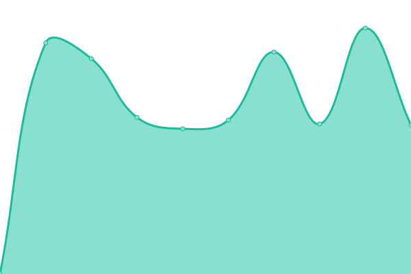 1083ms
     
 | 

<a href="https://chris9091.github.io/Fleksa-Monitor/history/indian-curry-house-ostend">99.00%</a>
    

|  [Taste of India Frankfurt](https://tasteofindia-ffm.de) | 🟩 Up | [taste-of-india-frankfurt.yml](https://github.com/chris9091/Fleksa-Monitor/commits/HEAD/history/taste-of-india-frankfurt.yml) | 

 1053ms
     
 | 

<a href="https://chris9091.github.io/Fleksa-Monitor/history/taste-of-india-frankfurt">99.01%</a>
    

|  [Desi Adda](https://desiadda.de) | 🟩 Up | [desi-adda.yml](https://github.com/chris9091/Fleksa-Monitor/commits/HEAD/history/desi-adda.yml) | 

 1026ms
     
 | 

<a href="https://chris9091.github.io/Fleksa-Monitor/history/desi-adda">99.01%</a>
    

|  [Smart Pizza Offenbach](https://smartpizzas.de) | 🟩 Up | [smart-pizza-offenbach.yml](https://github.com/chris9091/Fleksa-Monitor/commits/HEAD/history/smart-pizza-offenbach.yml) | 

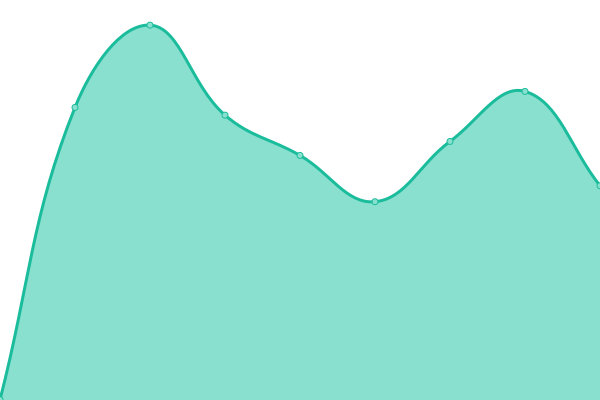 1077ms
     
 | 

<a href="https://chris9091.github.io/Fleksa-Monitor/history/smart-pizza-offenbach">5.47%</a>
    

|  [Pizzeria O Sole Mio](https://bochum-osolemio.de) | 🟩 Up | [pizzeria-o-sole-mio.yml](https://github.com/chris9091/Fleksa-Monitor/commits/HEAD/history/pizzeria-o-sole-mio.yml) | 

 1064ms
     
 | 

<a href="https://chris9091.github.io/Fleksa-Monitor/history/pizzeria-o-sole-mio">99.01%</a>
    

|  [Alt Bockenheim - Crazy Pizza](https://restaurantcrazypizza.de) | 🟩 Up | [alt-bockenheim-crazy-pizza.yml](https://github.com/chris9091/Fleksa-Monitor/commits/HEAD/history/alt-bockenheim-crazy-pizza.yml) | 

 1048ms
     
 | 

<a href="https://chris9091.github.io/Fleksa-Monitor/history/alt-bockenheim-crazy-pizza">5.44%</a>
    

|  [Alt Bockenheim - Indian Restaurant](https://restaurantaltbockenheim.de) | 🟩 Up | [alt-bockenheim-indian-restaurant.yml](https://github.com/chris9091/Fleksa-Monitor/commits/HEAD/history/alt-bockenheim-indian-restaurant.yml) | 

 1051ms
     
 | 

<a href="https://chris9091.github.io/Fleksa-Monitor/history/alt-bockenheim-indian-restaurant">99.01%</a>
    

|  [Food World](https://offenbach-foodworld.de) | 🟩 Up | [food-world.yml](https://github.com/chris9091/Fleksa-Monitor/commits/HEAD/history/food-world.yml) | 

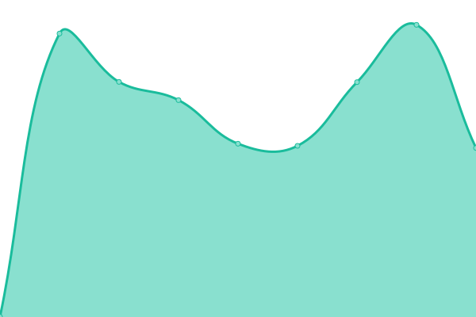 1063ms
     
 | 

<a href="https://chris9091.github.io/Fleksa-Monitor/history/food-world">99.01%</a>
    

|  [Indian Curry House Niederrad](https://indiancurryhouseniederrad.de) | 🟩 Up | [indian-curry-house-niederrad.yml](https://github.com/chris9091/Fleksa-Monitor/commits/HEAD/history/indian-curry-house-niederrad.yml) | 

 1057ms
     
 | 

<a href="https://chris9091.github.io/Fleksa-Monitor/history/indian-curry-house-niederrad">99.01%</a>
    

|  [Restaurant Mai Vien](https://maivien.fleksa.de) | 🟩 Up | [restaurant-mai-vien.yml](https://github.com/chris9091/Fleksa-Monitor/commits/HEAD/history/restaurant-mai-vien.yml) | 

 1217ms
     
 | 

<a href="https://chris9091.github.io/Fleksa-Monitor/history/restaurant-mai-vien">99.01%</a>
    

|  [Restaurant Taj Mahal](https://frechentajmahal.de) | 🟩 Up | [restaurant-taj-mahal.yml](https://github.com/chris9091/Fleksa-Monitor/commits/HEAD/history/restaurant-taj-mahal.yml) | 

 1065ms
     
 | 

<a href="https://chris9091.github.io/Fleksa-Monitor/history/restaurant-taj-mahal">99.01%</a>
    

|  [Indian food Company](https://indianfood-company.de) | 🟩 Up | [indian-food-company.yml](https://github.com/chris9091/Fleksa-Monitor/commits/HEAD/history/indian-food-company.yml) | 

 1055ms
     
 | 

<a href="https://chris9091.github.io/Fleksa-Monitor/history/indian-food-company">99.02%</a>
    

|  [Restaurant Isha](https://isha-restaurant.de) | 🟩 Up | [restaurant-isha.yml](https://github.com/chris9091/Fleksa-Monitor/commits/HEAD/history/restaurant-isha.yml) | 

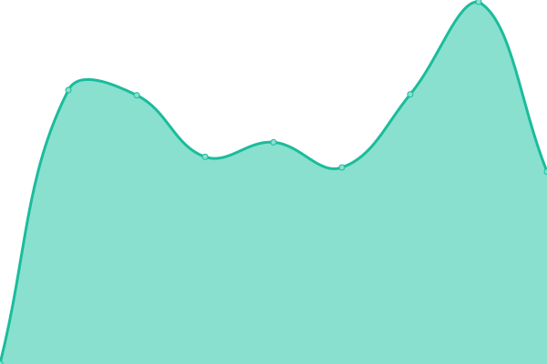 1121ms
     
 | 

<a href="https://chris9091.github.io/Fleksa-Monitor/history/restaurant-isha">99.02%</a>
    

|  [Ganesha Tandoori](https://ganeshafrankfurt.de) | 🟩 Up | [ganesha-tandoori.yml](https://github.com/chris9091/Fleksa-Monitor/commits/HEAD/history/ganesha-tandoori.yml) | 

 1086ms
     
 | 

<a href="https://chris9091.github.io/Fleksa-Monitor/history/ganesha-tandoori">99.02%</a>
    

|  [Punjab Garden Tandoori](https://punjabgardenfrankfurt.de) | 🟩 Up | [punjab-garden-tandoori.yml](https://github.com/chris9091/Fleksa-Monitor/commits/HEAD/history/punjab-garden-tandoori.yml) | 

 1045ms
     
 | 

<a href="https://chris9091.github.io/Fleksa-Monitor/history/punjab-garden-tandoori">99.02%</a>
    

|  [Sushi Sensei Frankfurt](https://sushisenseifrankfurt.de) | 🟩 Up | [sushi-sensei-frankfurt.yml](https://github.com/chris9091/Fleksa-Monitor/commits/HEAD/history/sushi-sensei-frankfurt.yml) | 

 1065ms
     
 | 

<a href="https://chris9091.github.io/Fleksa-Monitor/history/sushi-sensei-frankfurt">99.02%</a>
    

|  [Pizzeria Bella Italia](https://pizzabellaitaliafrankfurt.de) | 🟩 Up | [pizzeria-bella-italia.yml](https://github.com/chris9091/Fleksa-Monitor/commits/HEAD/history/pizzeria-bella-italia.yml) | 

 1032ms
     
 | 

<a href="https://chris9091.github.io/Fleksa-Monitor/history/pizzeria-bella-italia">99.02%</a>
    

|  [Pizza Kaiser](https://pizzakaiser-frankfurt.de) | 🟩 Up | [pizza-kaiser.yml](https://github.com/chris9091/Fleksa-Monitor/commits/HEAD/history/pizza-kaiser.yml) | 

 1068ms
     
 | 

<a href="https://chris9091.github.io/Fleksa-Monitor/history/pizza-kaiser">99.02%</a>
    

|  [Delhi Tandoori](https://delhitandoori.de) | 🟩 Up | [delhi-tandoori.yml](https://github.com/chris9091/Fleksa-Monitor/commits/HEAD/history/delhi-tandoori.yml) | 

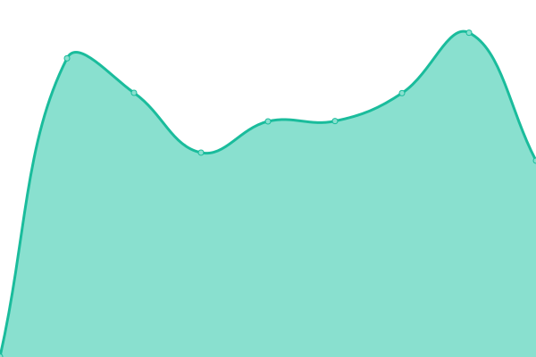 1099ms
     
 | 

<a href="https://chris9091.github.io/Fleksa-Monitor/history/delhi-tandoori">99.02%</a>
    

|  [Pizza Eck Frankfurt](https://pizza-eck-frankfurt.de) | 🟩 Up | [pizza-eck-frankfurt.yml](https://github.com/chris9091/Fleksa-Monitor/commits/HEAD/history/pizza-eck-frankfurt.yml) | 

 1096ms
     
 | 

<a href="https://chris9091.github.io/Fleksa-Monitor/history/pizza-eck-frankfurt">99.03%</a>
    

|  [Pizzeria Mülheim 2](https://xn--pizzeriamlheim2-7vb.de) | 🟩 Up | [pizzeria-muelheim-2.yml](https://github.com/chris9091/Fleksa-Monitor/commits/HEAD/history/pizzeria-muelheim-2.yml) | 

 1013ms
     
 | 

<a href="https://chris9091.github.io/Fleksa-Monitor/history/pizzeria-muelheim-2">99.03%</a>
    

|  [Restaurant Nidda](https://restaurant-nidda.de) | 🟩 Up | [restaurant-nidda.yml](https://github.com/chris9091/Fleksa-Monitor/commits/HEAD/history/restaurant-nidda.yml) | 

 648ms
     
 | 

<a href="https://chris9091.github.io/Fleksa-Monitor/history/restaurant-nidda">99.03%</a>
    

|  [Bali's Restaurant](https://balisrestaurant-ob.de) | 🟩 Up | [bali-s-restaurant.yml](https://github.com/chris9091/Fleksa-Monitor/commits/HEAD/history/bali-s-restaurant.yml) | 

 1071ms
     
 | 

<a href="https://chris9091.github.io/Fleksa-Monitor/history/bali-s-restaurant">99.03%</a>
    

|  [Pizza Hamburger Inn](https://pizzahamburgerinn-griesheim.de) | 🟩 Up | [pizza-hamburger-inn.yml](https://github.com/chris9091/Fleksa-Monitor/commits/HEAD/history/pizza-hamburger-inn.yml) | 

 1019ms
     
 | 

<a href="https://chris9091.github.io/Fleksa-Monitor/history/pizza-hamburger-inn">99.03%</a>
    

|  [Uno's Pizza](https://pizzeriaunoffm.de) | 🟩 Up | [uno-s-pizza.yml](https://github.com/chris9091/Fleksa-Monitor/commits/HEAD/history/uno-s-pizza.yml) | 

 1092ms
     
 | 

<a href="https://chris9091.github.io/Fleksa-Monitor/history/uno-s-pizza">99.03%</a>
    

|  [Restaurant Ashoka Frankfurt](https://ashokafrankfurt.de) | 🟩 Up | [restaurant-ashoka-frankfurt.yml](https://github.com/chris9091/Fleksa-Monitor/commits/HEAD/history/restaurant-ashoka-frankfurt.yml) | 

 1640ms
     
 | 

<a href="https://chris9091.github.io/Fleksa-Monitor/history/restaurant-ashoka-frankfurt">99.03%</a>
    

|  [Good Taste](https://goodtaste.fleksa.de) | 🟩 Up | [good-taste.yml](https://github.com/chris9091/Fleksa-Monitor/commits/HEAD/history/good-taste.yml) | 

 1020ms
     
 | 

<a href="https://chris9091.github.io/Fleksa-Monitor/history/good-taste">99.03%</a>
    

|  [Restaurant Hanoi Quan](https://hanoiquanfrankfurt.de) | 🟩 Up | [restaurant-hanoi-quan.yml](https://github.com/chris9091/Fleksa-Monitor/commits/HEAD/history/restaurant-hanoi-quan.yml) | 

 1036ms
     
 | 

<a href="https://chris9091.github.io/Fleksa-Monitor/history/restaurant-hanoi-quan">99.04%</a>
    

|  [Tandoori Masala Imbiss](https://tandoorimasalaimbiss.de) | 🟩 Up | [tandoori-masala-imbiss.yml](https://github.com/chris9091/Fleksa-Monitor/commits/HEAD/history/tandoori-masala-imbiss.yml) | 

 1153ms
     
 | 

<a href="https://chris9091.github.io/Fleksa-Monitor/history/tandoori-masala-imbiss">99.04%</a>
    

|  [Restaurant Kashmir India](https://restaurantkashmirindia.de) | 🟩 Up | [restaurant-kashmir-india.yml](https://github.com/chris9091/Fleksa-Monitor/commits/HEAD/history/restaurant-kashmir-india.yml) | 

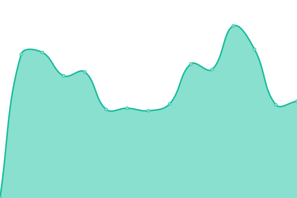 1104ms
     
 | 

<a href="https://chris9091.github.io/Fleksa-Monitor/history/restaurant-kashmir-india">99.04%</a>
    

|  [Bali's Restaurant](https://balisrestaurant-wesel.de) | 🟩 Up | [bali-s-restaurant.yml](https://github.com/chris9091/Fleksa-Monitor/commits/HEAD/history/bali-s-restaurant.yml) | 

 1071ms
     
 | 

<a href="https://chris9091.github.io/Fleksa-Monitor/history/bali-s-restaurant">99.03%</a>
    

|  [Go eat food service](https://goeatfrankfurt.de) | 🟩 Up | [go-eat-food-service.yml](https://github.com/chris9091/Fleksa-Monitor/commits/HEAD/history/go-eat-food-service.yml) | 

 1144ms
     
 | 

<a href="https://chris9091.github.io/Fleksa-Monitor/history/go-eat-food-service">99.04%</a>
    

|  [Star Pizza Deggendorf](https://star-pizza-deggendorf.de) | 🟩 Up | [star-pizza-deggendorf.yml](https://github.com/chris9091/Fleksa-Monitor/commits/HEAD/history/star-pizza-deggendorf.yml) | 

 1144ms
     
 | 

<a href="https://chris9091.github.io/Fleksa-Monitor/history/star-pizza-deggendorf">99.04%</a>
    

|  [Main Curry House](https://main-curry-house.de) | 🟩 Up | [main-curry-house.yml](https://github.com/chris9091/Fleksa-Monitor/commits/HEAD/history/main-curry-house.yml) | 

 1057ms
     
 | 

<a href="https://chris9091.github.io/Fleksa-Monitor/history/main-curry-house">99.04%</a>
    

|  [Pizza Haus](https://pizzahauslandau.de) | 🟩 Up | [pizza-haus.yml](https://github.com/chris9091/Fleksa-Monitor/commits/HEAD/history/pizza-haus.yml) | 

 1099ms
     
 | 

<a href="https://chris9091.github.io/Fleksa-Monitor/history/pizza-haus">99.04%</a>
    

|  [Restaurant Little India](https://littleindiaalteglofsheim.de) | 🟩 Up | [restaurant-little-india.yml](https://github.com/chris9091/Fleksa-Monitor/commits/HEAD/history/restaurant-little-india.yml) | 

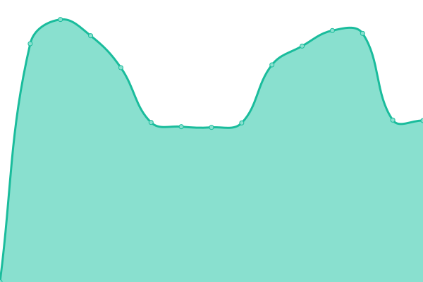 1139ms
     
 | 

<a href="https://chris9091.github.io/Fleksa-Monitor/history/restaurant-little-india">99.04%</a>
    

|  [Pizza Plattlinger](https://pizzaplattlinger.de) | 🟩 Up | [pizza-plattlinger.yml](https://github.com/chris9091/Fleksa-Monitor/commits/HEAD/history/pizza-plattlinger.yml) | 

 1098ms
     
 | 

<a href="https://chris9091.github.io/Fleksa-Monitor/history/pizza-plattlinger">99.05%</a>
    

|  [Pizza Roma Dingolfing](https://pizzaromadingolfing.de) | 🟩 Up | [pizza-roma-dingolfing.yml](https://github.com/chris9091/Fleksa-Monitor/commits/HEAD/history/pizza-roma-dingolfing.yml) | 

 1098ms
     
 | 

<a href="https://chris9091.github.io/Fleksa-Monitor/history/pizza-roma-dingolfing">99.05%</a>
    

|  [Pizza Roma Wallersdorf](https://pizzaromawallersdorf.de) | 🟩 Up | [pizza-roma-wallersdorf.yml](https://github.com/chris9091/Fleksa-Monitor/commits/HEAD/history/pizza-roma-wallersdorf.yml) | 

 1034ms
     
 | 

<a href="https://chris9091.github.io/Fleksa-Monitor/history/pizza-roma-wallersdorf">99.05%</a>
    

|  [Pizza La Fontana](https://altdorflafontana.de) | 🟩 Up | [pizza-la-fontana.yml](https://github.com/chris9091/Fleksa-Monitor/commits/HEAD/history/pizza-la-fontana.yml) | 

 978ms
     
 | 

<a href="https://chris9091.github.io/Fleksa-Monitor/history/pizza-la-fontana">99.05%</a>
    

|  [Restaurant Taj Mahal](https://altdorftajmahal.de) | 🟩 Up | [restaurant-taj-mahal.yml](https://github.com/chris9091/Fleksa-Monitor/commits/HEAD/history/restaurant-taj-mahal.yml) | 

 1065ms
     
 | 

<a href="https://chris9091.github.io/Fleksa-Monitor/history/restaurant-taj-mahal">99.01%</a>
    

|  [Restaurant Little India](https://littleindiafreudenstadt.de) | 🟩 Up | [restaurant-little-india.yml](https://github.com/chris9091/Fleksa-Monitor/commits/HEAD/history/restaurant-little-india.yml) | 

 1139ms
     
 | 

<a href="https://chris9091.github.io/Fleksa-Monitor/history/restaurant-little-india">99.04%</a>
    

|  [Restaurant Namaste](https://namasteplattling.de) | 🟩 Up | [restaurant-namaste.yml](https://github.com/chris9091/Fleksa-Monitor/commits/HEAD/history/restaurant-namaste.yml) | 

 1021ms
     
 | 

<a href="https://chris9091.github.io/Fleksa-Monitor/history/restaurant-namaste">99.00%</a>
    

|  [Star Pizzaservice](https://teisnachstarpizza.de) | 🟩 Up | [star-pizzaservice.yml](https://github.com/chris9091/Fleksa-Monitor/commits/HEAD/history/star-pizzaservice.yml) | 

 1076ms
     
 | 

<a href="https://chris9091.github.io/Fleksa-Monitor/history/star-pizzaservice">99.05%</a>
    

|  [Roma Pizza Schierling](https://pizzaromaschierling.de) | 🟩 Up | [roma-pizza-schierling.yml](https://github.com/chris9091/Fleksa-Monitor/commits/HEAD/history/roma-pizza-schierling.yml) | 

 1052ms
     
 | 

<a href="https://chris9091.github.io/Fleksa-Monitor/history/roma-pizza-schierling">99.05%</a>
    

|  [Restaurant Mayuri](https://mayuri-duisburg.de) | 🟩 Up | [restaurant-mayuri.yml](https://github.com/chris9091/Fleksa-Monitor/commits/HEAD/history/restaurant-mayuri.yml) | 

 1041ms
     
 | 

<a href="https://chris9091.github.io/Fleksa-Monitor/history/restaurant-mayuri">99.05%</a>
    

|  [India Haus Restaurant](https://indiahaus-md.de) | 🟩 Up | [india-haus-restaurant.yml](https://github.com/chris9091/Fleksa-Monitor/commits/HEAD/history/india-haus-restaurant.yml) | 

 1107ms
     
 | 

<a href="https://chris9091.github.io/Fleksa-Monitor/history/india-haus-restaurant">99.06%</a>
    

|  [Spice of India](https://spiceofindia-hattersheim.de) | 🟩 Up | [spice-of-india.yml](https://github.com/chris9091/Fleksa-Monitor/commits/HEAD/history/spice-of-india.yml) | 

 1050ms
     
 | 

<a href="https://chris9091.github.io/Fleksa-Monitor/history/spice-of-india">99.06%</a>
    

|  [Restaurant Mai Pho](https://maiphokronberg.de) | 🟩 Up | [restaurant-mai-pho.yml](https://github.com/chris9091/Fleksa-Monitor/commits/HEAD/history/restaurant-mai-pho.yml) | 

 1061ms
     
 | 

<a href="https://chris9091.github.io/Fleksa-Monitor/history/restaurant-mai-pho">99.06%</a>
    

|  [Pizzeria Marco Polo](https://marcopolo-aussernzell.de) | 🟩 Up | [pizzeria-marco-polo.yml](https://github.com/chris9091/Fleksa-Monitor/commits/HEAD/history/pizzeria-marco-polo.yml) | 

 893ms
     
 | 

<a href="https://chris9091.github.io/Fleksa-Monitor/history/pizzeria-marco-polo">99.04%</a>
    

|  [Restaurant Sahaj](https://restaurant-sahaj.de) | 🟩 Up | [restaurant-sahaj.yml](https://github.com/chris9091/Fleksa-Monitor/commits/HEAD/history/restaurant-sahaj.yml) | 

 932ms
     
 | 

<a href="https://chris9091.github.io/Fleksa-Monitor/history/restaurant-sahaj">99.05%</a>
    

|  [Pizza Mattu Osterhofen](https://mattupizzaosterhofen.de) | 🟩 Up | [pizza-mattu-osterhofen.yml](https://github.com/chris9091/Fleksa-Monitor/commits/HEAD/history/pizza-mattu-osterhofen.yml) | 

 887ms
     
 | 

<a href="https://chris9091.github.io/Fleksa-Monitor/history/pizza-mattu-osterhofen">99.05%</a>
    

|  [Badal's Küche](https://xn--badalskche-geb.de) | 🟩 Up | [badal-s-kueche.yml](https://github.com/chris9091/Fleksa-Monitor/commits/HEAD/history/badal-s-kueche.yml) | 

 909ms
     
 | 

<a href="https://chris9091.github.io/Fleksa-Monitor/history/badal-s-kueche">99.05%</a>
    

|  [Restaurant India Gate](https://indiagateeggenfelden.de) | 🟩 Up | [restaurant-india-gate.yml](https://github.com/chris9091/Fleksa-Monitor/commits/HEAD/history/restaurant-india-gate.yml) | 

 979ms
     
 | 

<a href="https://chris9091.github.io/Fleksa-Monitor/history/restaurant-india-gate">99.05%</a>
    

|  [Rana's Pizza und Döner Service](https://rubipizzaservice.de) | 🟩 Up | [rana-s-pizza-und-doener-service.yml](https://github.com/chris9091/Fleksa-Monitor/commits/HEAD/history/rana-s-pizza-und-doener-service.yml) | 

 1054ms
     
 | 

<a href="https://chris9091.github.io/Fleksa-Monitor/history/rana-s-pizza-und-doener-service">99.05%</a>
    

|  [Taj Mahal Restaurant](https://tajmahaldeggendorf.de) | 🟩 Up | [taj-mahal-restaurant.yml](https://github.com/chris9091/Fleksa-Monitor/commits/HEAD/history/taj-mahal-restaurant.yml) | 

 958ms
     
 | 

<a href="https://chris9091.github.io/Fleksa-Monitor/history/taj-mahal-restaurant">99.05%</a>
    

|  [Pizza Heimservice Taufkirchen](https://pizzataufkirchen.de) | 🟩 Up | [pizza-heimservice-taufkirchen.yml](https://github.com/chris9091/Fleksa-Monitor/commits/HEAD/history/pizza-heimservice-taufkirchen.yml) | 

 877ms
     
 | 

<a href="https://chris9091.github.io/Fleksa-Monitor/history/pizza-heimservice-taufkirchen">99.05%</a>
    

|  [Restaurant Namaskar](https://namaskarrestaurant.de) | 🟩 Up | [restaurant-namaskar.yml](https://github.com/chris9091/Fleksa-Monitor/commits/HEAD/history/restaurant-namaskar.yml) | 

 1040ms
     
 | 

<a href="https://chris9091.github.io/Fleksa-Monitor/history/restaurant-namaskar">99.05%</a>
    

|  [Restaurant Jannat](https://restaurant-jannat.de) | 🟩 Up | [restaurant-jannat.yml](https://github.com/chris9091/Fleksa-Monitor/commits/HEAD/history/restaurant-jannat.yml) | 

 752ms
     
 | 

<a href="https://chris9091.github.io/Fleksa-Monitor/history/restaurant-jannat">99.05%</a>
    

|  [Nano Pizza Heimservice](https://nanopizza.de) | 🟩 Up | [nano-pizza-heimservice.yml](https://github.com/chris9091/Fleksa-Monitor/commits/HEAD/history/nano-pizza-heimservice.yml) | 

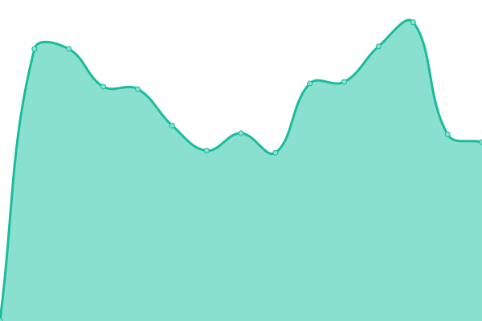 890ms
     
 | 

<a href="https://chris9091.github.io/Fleksa-Monitor/history/nano-pizza-heimservice">99.06%</a>
    

|  [Tar Pizzaservice](https://tarpizzaservice.de) | 🟩 Up | [tar-pizzaservice.yml](https://github.com/chris9091/Fleksa-Monitor/commits/HEAD/history/tar-pizzaservice.yml) | 

 898ms
     
 | 

<a href="https://chris9091.github.io/Fleksa-Monitor/history/tar-pizzaservice">99.06%</a>
    

|  [Pizzaservice Pizzano](https://pizzaservicepizzano.de) | 🟩 Up | [pizzaservice-pizzano.yml](https://github.com/chris9091/Fleksa-Monitor/commits/HEAD/history/pizzaservice-pizzano.yml) | 

 893ms
     
 | 

<a href="https://chris9091.github.io/Fleksa-Monitor/history/pizzaservice-pizzano">99.06%</a>
    

|  [BLITZ CITY (Pizzaservice u. Lieferservice)](https://pizzablitzcity.com) | 🟩 Up | [blitz-city-pizzaservice-u-lieferservice.yml](https://github.com/chris9091/Fleksa-Monitor/commits/HEAD/history/blitz-city-pizzaservice-u-lieferservice.yml) | 

 903ms
     
 | 

<a href="https://chris9091.github.io/Fleksa-Monitor/history/blitz-city-pizzaservice-u-lieferservice">99.06%</a>
    

|  [Indian Zaika - Indisches restaurant](https://zaikarestaurant.de) | 🟩 Up | [indian-zaika-indisches-restaurant.yml](https://github.com/chris9091/Fleksa-Monitor/commits/HEAD/history/indian-zaika-indisches-restaurant.yml) | 

 882ms
     
 | 

<a href="https://chris9091.github.io/Fleksa-Monitor/history/indian-zaika-indisches-restaurant">99.06%</a>
    

|  [Indian Tandoori Restaurant](https://indiantandoorirestaurant.de) | 🟩 Up | [indian-tandoori-restaurant.yml](https://github.com/chris9091/Fleksa-Monitor/commits/HEAD/history/indian-tandoori-restaurant.yml) | 

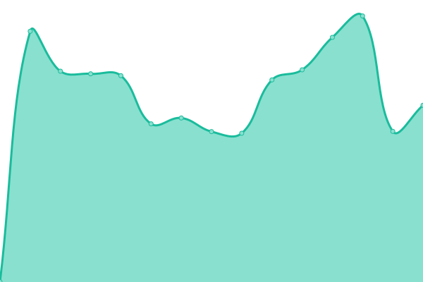 895ms
     
 | 

<a href="https://chris9091.github.io/Fleksa-Monitor/history/indian-tandoori-restaurant">99.06%</a>
    

|  [Pizza Harmonie](https://pizzaharmonie.de) | 🟩 Up | [pizza-harmonie.yml](https://github.com/chris9091/Fleksa-Monitor/commits/HEAD/history/pizza-harmonie.yml) | 

 1037ms
     
 | 

<a href="https://chris9091.github.io/Fleksa-Monitor/history/pizza-harmonie">99.06%</a>
    

|  [Pizza Service Schwandorf](https://pizzaschwandorf.de) | 🟩 Up | [pizza-service-schwandorf.yml](https://github.com/chris9091/Fleksa-Monitor/commits/HEAD/history/pizza-service-schwandorf.yml) | 

 1222ms
     
 | 

<a href="https://chris9091.github.io/Fleksa-Monitor/history/pizza-service-schwandorf">74.92%</a>
    

|  [Harman Pizza](https://harmanpizzapliening.de) | 🟩 Up | [harman-pizza.yml](https://github.com/chris9091/Fleksa-Monitor/commits/HEAD/history/harman-pizza.yml) | 

 885ms
     
 | 

<a href="https://chris9091.github.io/Fleksa-Monitor/history/harman-pizza">75.19%</a>
    

|  [Frankfurter Schnitzelexpress](https://schnitzelheimservice.de) | 🟩 Up | [frankfurter-schnitzelexpress.yml](https://github.com/chris9091/Fleksa-Monitor/commits/HEAD/history/frankfurter-schnitzelexpress.yml) | 

 925ms
     
 | 

<a href="https://chris9091.github.io/Fleksa-Monitor/history/frankfurter-schnitzelexpress">75.28%</a>
    

|  [India Gate Sossenheim](https://indiagatefrankfurt.de) | 🟩 Up | [india-gate-sossenheim.yml](https://github.com/chris9091/Fleksa-Monitor/commits/HEAD/history/india-gate-sossenheim.yml) | 

 880ms
     
 | 

<a href="https://chris9091.github.io/Fleksa-Monitor/history/india-gate-sossenheim">75.17%</a>
    

|  [Restaurant India Gate](https://indiagatestraubing.de) | 🟩 Up | [restaurant-india-gate.yml](https://github.com/chris9091/Fleksa-Monitor/commits/HEAD/history/restaurant-india-gate.yml) | 

 979ms
     
 | 

<a href="https://chris9091.github.io/Fleksa-Monitor/history/restaurant-india-gate">99.05%</a>
    

|  [The Taj Neubiberg](https://tajamcampeon.de) | 🟩 Up | [the-taj-neubiberg.yml](https://github.com/chris9091/Fleksa-Monitor/commits/HEAD/history/the-taj-neubiberg.yml) | 

 919ms
     
 | 

<a href="https://chris9091.github.io/Fleksa-Monitor/history/the-taj-neubiberg">75.32%</a>
    

|  [Indian Tandoori Restaurant](https://restaurantindiantandoori.de) | 🟩 Up | [indian-tandoori-restaurant.yml](https://github.com/chris9091/Fleksa-Monitor/commits/HEAD/history/indian-tandoori-restaurant.yml) | 

 895ms
     
 | 

<a href="https://chris9091.github.io/Fleksa-Monitor/history/indian-tandoori-restaurant">99.06%</a>
    

|  [Cafe Restaurant Maritimes](https://maritimesroding.de) | 🟩 Up | [cafe-restaurant-maritimes.yml](https://github.com/chris9091/Fleksa-Monitor/commits/HEAD/history/cafe-restaurant-maritimes.yml) | 

 852ms
     
 | 

<a href="https://chris9091.github.io/Fleksa-Monitor/history/cafe-restaurant-maritimes">75.58%</a>
    

|  [Pizza Roma Köz](https://xn--pizzabadktzting-htb.de) | 🟩 Up | [pizza-roma-koez.yml](https://github.com/chris9091/Fleksa-Monitor/commits/HEAD/history/pizza-roma-koez.yml) | 

 914ms
     
 | 

<a href="https://chris9091.github.io/Fleksa-Monitor/history/pizza-roma-koez">92.21%</a>
    

|  [Indian Tandoori Kitchen](https://indiantandoorikitchen.de) | 🟩 Up | [indian-tandoori-kitchen.yml](https://github.com/chris9091/Fleksa-Monitor/commits/HEAD/history/indian-tandoori-kitchen.yml) | 

 937ms
     
 | 

<a href="https://chris9091.github.io/Fleksa-Monitor/history/indian-tandoori-kitchen">92.30%</a>
    

|  [Deli Tadka](https://delitadka.de) | 🟩 Up | [deli-tadka.yml](https://github.com/chris9091/Fleksa-Monitor/commits/HEAD/history/deli-tadka.yml) | 

 975ms
     
 | 

<a href="https://chris9091.github.io/Fleksa-Monitor/history/deli-tadka">92.29%</a>
    

|  [Natraj Indisches Restaurant](https://xn--natrajmnchen-jlb.de) | 🟩 Up | [natraj-indisches-restaurant.yml](https://github.com/chris9091/Fleksa-Monitor/commits/HEAD/history/natraj-indisches-restaurant.yml) | 

 937ms
     
 | 

<a href="https://chris9091.github.io/Fleksa-Monitor/history/natraj-indisches-restaurant">92.49%</a>
    

|  [Restaurant Sangam](https://xn--sangammnchen-jlb.de) | 🟩 Up | [restaurant-sangam.yml](https://github.com/chris9091/Fleksa-Monitor/commits/HEAD/history/restaurant-sangam.yml) | 

 954ms
     
 | 

<a href="https://chris9091.github.io/Fleksa-Monitor/history/restaurant-sangam">92.49%</a>
    

|  [Restaurant Suhag](https://restaurantsuhag.de) | 🟩 Up | [restaurant-suhag.yml](https://github.com/chris9091/Fleksa-Monitor/commits/HEAD/history/restaurant-suhag.yml) | 

 1249ms
     
 | 

<a href="https://chris9091.github.io/Fleksa-Monitor/history/restaurant-suhag">92.69%</a>
    

|  [DHABA Schwabing West](https://xn--dhabamnchen-yhb.de) | 🟩 Up | [dhaba-schwabing-west.yml](https://github.com/chris9091/Fleksa-Monitor/commits/HEAD/history/dhaba-schwabing-west.yml) | 

 952ms
     
 | 

<a href="https://chris9091.github.io/Fleksa-Monitor/history/dhaba-schwabing-west">92.89%</a>
    

|  [Restaurant Masala](https://xn--masalamnchen-jlb.de) | 🟩 Up | [restaurant-masala.yml](https://github.com/chris9091/Fleksa-Monitor/commits/HEAD/history/restaurant-masala.yml) | 

 936ms
     
 | 

<a href="https://chris9091.github.io/Fleksa-Monitor/history/restaurant-masala">93.10%</a>
    

|  [Ristorante Pizzeria Mediterraneo](https://mediterraneokelsterbach.de) | 🟩 Up | [ristorante-pizzeria-mediterraneo.yml](https://github.com/chris9091/Fleksa-Monitor/commits/HEAD/history/ristorante-pizzeria-mediterraneo.yml) | 

 886ms
     
 | 

<a href="https://chris9091.github.io/Fleksa-Monitor/history/ristorante-pizzeria-mediterraneo">93.30%</a>
    

|  [Mini Punjab](https://minipunjab.de) | 🟩 Up | [mini-punjab.yml](https://github.com/chris9091/Fleksa-Monitor/commits/HEAD/history/mini-punjab.yml) | 

 820ms
     
 | 

<a href="https://chris9091.github.io/Fleksa-Monitor/history/mini-punjab">93.51%</a>
    

|  [Indian Restaurant Rajdarbaar Tandoori](https://xn--rajdarbaar-dsseldorf-0ec.de) | 🟩 Up | [indian-restaurant-rajdarbaar-tandoori.yml](https://github.com/chris9091/Fleksa-Monitor/commits/HEAD/history/indian-restaurant-rajdarbaar-tandoori.yml) | 

 850ms
     
 | 

<a href="https://chris9091.github.io/Fleksa-Monitor/history/indian-restaurant-rajdarbaar-tandoori">93.60%</a>
    

|  [Pizza Town Dieburg](https://pizzatown-dieburg.de) | 🟩 Up | [pizza-town-dieburg.yml](https://github.com/chris9091/Fleksa-Monitor/commits/HEAD/history/pizza-town-dieburg.yml) | 

 1065ms
     
 | 

<a href="https://chris9091.github.io/Fleksa-Monitor/history/pizza-town-dieburg">93.81%</a>
    

|  [Express Pizza](https://xn--pizzaexpresshchstadt-gbc.de) | 🟩 Up | [express-pizza.yml](https://github.com/chris9091/Fleksa-Monitor/commits/HEAD/history/express-pizza.yml) | 

 977ms
     
 | 

<a href="https://chris9091.github.io/Fleksa-Monitor/history/express-pizza">93.91%</a>
    

|  [Der Pizzaservice Straubing](https://straubingpizzaservice.de) | 🟩 Up | [der-pizzaservice-straubing.yml](https://github.com/chris9091/Fleksa-Monitor/commits/HEAD/history/der-pizzaservice-straubing.yml) | 

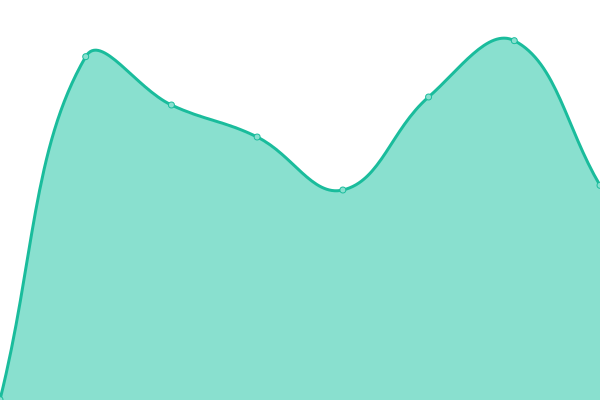 932ms
     
 | 

<a href="https://chris9091.github.io/Fleksa-Monitor/history/der-pizzaservice-straubing">94.01%</a>
    

|  [Restaurant Tonino](https://tonino-karlsfeld.de) | 🟩 Up | [restaurant-tonino.yml](https://github.com/chris9091/Fleksa-Monitor/commits/HEAD/history/restaurant-tonino.yml) | 

 921ms
     
 | 

<a href="https://chris9091.github.io/Fleksa-Monitor/history/restaurant-tonino">94.22%</a>
    

|  [Tadsch Mahal (Taj Mahal)](https://xn--tajmahalnrnberg-7vb.de) | 🟩 Up | [tadsch-mahal-taj-mahal.yml](https://github.com/chris9091/Fleksa-Monitor/commits/HEAD/history/tadsch-mahal-taj-mahal.yml) | 

 890ms
     
 | 

<a href="https://chris9091.github.io/Fleksa-Monitor/history/tadsch-mahal-taj-mahal">94.32%</a>
    

|  [Pizza Peperoni](https://peperonihessdorf.de) | 🟩 Up | [pizza-peperoni.yml](https://github.com/chris9091/Fleksa-Monitor/commits/HEAD/history/pizza-peperoni.yml) | 

 908ms
     
 | 

<a href="https://chris9091.github.io/Fleksa-Monitor/history/pizza-peperoni">94.52%</a>
    

|  [Döner Pizza am Ronhof](https://xn--dnerpizzaronhof-8sb.de) | 🟩 Up | [doener-pizza-am-ronhof.yml](https://github.com/chris9091/Fleksa-Monitor/commits/HEAD/history/doener-pizza-am-ronhof.yml) | 

 989ms
     
 | 

<a href="https://chris9091.github.io/Fleksa-Monitor/history/doener-pizza-am-ronhof">100.00%</a>
    

|  [Restaurant Roter Adler (Dallizza)](https://restaurantroteradler.de) | 🟩 Up | [restaurant-roter-adler-dallizza.yml](https://github.com/chris9091/Fleksa-Monitor/commits/HEAD/history/restaurant-roter-adler-dallizza.yml) | 

 922ms
     
 | 

<a href="https://chris9091.github.io/Fleksa-Monitor/history/restaurant-roter-adler-dallizza">100.00%</a>
    

|  [Deli Tadka](https://pasing.delitadka.de) | 🟩 Up | [deli-tadka.yml](https://github.com/chris9091/Fleksa-Monitor/commits/HEAD/history/deli-tadka.yml) | 

 975ms
     
 | 

<a href="https://chris9091.github.io/Fleksa-Monitor/history/deli-tadka">92.35%</a>
    

|  [Deli Tadka](https://riem.delitadka.de) | 🟩 Up | [deli-tadka.yml](https://github.com/chris9091/Fleksa-Monitor/commits/HEAD/history/deli-tadka.yml) | 

 975ms
     
 | 

<a href="https://chris9091.github.io/Fleksa-Monitor/history/deli-tadka">92.36%</a>
    

|  [Deli Tadka](https://pep.delitadka.de) | 🟩 Up | [deli-tadka.yml](https://github.com/chris9091/Fleksa-Monitor/commits/HEAD/history/deli-tadka.yml) | 

 975ms
     
 | 

<a href="https://chris9091.github.io/Fleksa-Monitor/history/deli-tadka">92.36%</a>
    

|  [Food world - Indian Kitchen](https://indiankitchenoffenbach.de) | 🟩 Up | [food-world-indian-kitchen.yml](https://github.com/chris9091/Fleksa-Monitor/commits/HEAD/history/food-world-indian-kitchen.yml) | 

 890ms
     
 | 

<a href="https://chris9091.github.io/Fleksa-Monitor/history/food-world-indian-kitchen">100.00%</a>
    

|  [Pizza Roma Passau](https://pizzaromapassau.de) | 🟩 Up | [pizza-roma-passau.yml](https://github.com/chris9091/Fleksa-Monitor/commits/HEAD/history/pizza-roma-passau.yml) | 

 931ms
     
 | 

<a href="https://chris9091.github.io/Fleksa-Monitor/history/pizza-roma-passau">100.00%</a>
    

|  [Der Pizzaservice Passau](https://pizzaservicepassau.de) | 🟩 Up | [der-pizzaservice-passau.yml](https://github.com/chris9091/Fleksa-Monitor/commits/HEAD/history/der-pizzaservice-passau.yml) | 

 964ms
     
 | 

<a href="https://chris9091.github.io/Fleksa-Monitor/history/der-pizzaservice-passau">100.00%</a>
    

|  [Restaurant Ganesha](https://xn--ganeshamnchen-3ob.de) | 🟩 Up | [restaurant-ganesha.yml](https://github.com/chris9091/Fleksa-Monitor/commits/HEAD/history/restaurant-ganesha.yml) | 

 912ms
     
 | 

<a href="https://chris9091.github.io/Fleksa-Monitor/history/restaurant-ganesha">100.00%</a>
    

|  [Pizza Bert Passau](https://pizza-bert.de) | 🟩 Up | [pizza-bert-passau.yml](https://github.com/chris9091/Fleksa-Monitor/commits/HEAD/history/pizza-bert-passau.yml) | 

 921ms
     
 | 

<a href="https://chris9091.github.io/Fleksa-Monitor/history/pizza-bert-passau">100.00%</a>
    

|  [Pizza Romana](https://romanaaidenbach.de) | 🟩 Up | [pizza-romana.yml](https://github.com/chris9091/Fleksa-Monitor/commits/HEAD/history/pizza-romana.yml) | 

 901ms
     
 | 

<a href="https://chris9091.github.io/Fleksa-Monitor/history/pizza-romana">100.00%</a>
    

|  [Nano Pizza Heimservice](https://nanopizza-ergoldsbach.de) | 🟩 Up | [nano-pizza-heimservice.yml](https://github.com/chris9091/Fleksa-Monitor/commits/HEAD/history/nano-pizza-heimservice.yml) | 

 890ms
     
 | 

<a href="https://chris9091.github.io/Fleksa-Monitor/history/nano-pizza-heimservice">99.05%</a>
    

|  [Restaurant Kohinoor](https://xn--kohinoornrnberg-7vb.de) | 🟩 Up | [restaurant-kohinoor.yml](https://github.com/chris9091/Fleksa-Monitor/commits/HEAD/history/restaurant-kohinoor.yml) | 

 892ms
     
 | 

<a href="https://chris9091.github.io/Fleksa-Monitor/history/restaurant-kohinoor">100.00%</a>
    

|  [Restaurant Shiva](https://xn--restaurantshivafrth-lbc.de) | 🟩 Up | [restaurant-shiva.yml](https://github.com/chris9091/Fleksa-Monitor/commits/HEAD/history/restaurant-shiva.yml) | 

 886ms
     
 | 

<a href="https://chris9091.github.io/Fleksa-Monitor/history/restaurant-shiva">100.00%</a>
    

|  [Maharaja Palace](https://xn--maharaja-palace-nrnberg-spc.de) | 🟩 Up | [maharaja-palace.yml](https://github.com/chris9091/Fleksa-Monitor/commits/HEAD/history/maharaja-palace.yml) | 

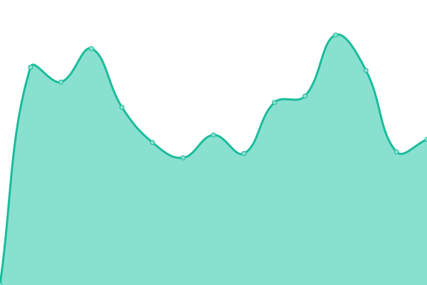 944ms
     
 | 

<a href="https://chris9091.github.io/Fleksa-Monitor/history/maharaja-palace">100.00%</a>
    

|  [Restaurant Maharaja](https://maharajaroth.de) | 🟩 Up | [restaurant-maharaja.yml](https://github.com/chris9091/Fleksa-Monitor/commits/HEAD/history/restaurant-maharaja.yml) | 

 983ms
     
 | 

<a href="https://chris9091.github.io/Fleksa-Monitor/history/restaurant-maharaja">100.00%</a>
    

|  [Robertino's Nürnberger Pizzaservice](https://xn--nrnberger-pizzaservice-slc.de) | 🟩 Up | [robertino-s-nuernberger-pizzaservice.yml](https://github.com/chris9091/Fleksa-Monitor/commits/HEAD/history/robertino-s-nuernberger-pizzaservice.yml) | 

 915ms
     
 | 

<a href="https://chris9091.github.io/Fleksa-Monitor/history/robertino-s-nuernberger-pizzaservice">100.00%</a>
    

|  [Restaurant Maharaja](https://ansbach-maharaja.de) | 🟩 Up | [restaurant-maharaja.yml](https://github.com/chris9091/Fleksa-Monitor/commits/HEAD/history/restaurant-maharaja.yml) | 

 983ms
     
 | 

<a href="https://chris9091.github.io/Fleksa-Monitor/history/restaurant-maharaja">100.00%</a>
    

|  [Restaurant Gandhi](https://gandhirestaurant.de) | 🟩 Up | [restaurant-gandhi.yml](https://github.com/chris9091/Fleksa-Monitor/commits/HEAD/history/restaurant-gandhi.yml) | 

 875ms
     
 | 

<a href="https://chris9091.github.io/Fleksa-Monitor/history/restaurant-gandhi">100.00%</a>
    

|  [Taste of India](https://tasteofindiaeppertshausen.de) | 🟩 Up | [taste-of-india.yml](https://github.com/chris9091/Fleksa-Monitor/commits/HEAD/history/taste-of-india.yml) | 

 902ms
     
 | 

<a href="https://chris9091.github.io/Fleksa-Monitor/history/taste-of-india">100.00%</a>
    

|  [Restaurant Shagun](https://xn--shagunmnchen-jlb.de) | 🟩 Up | [restaurant-shagun.yml](https://github.com/chris9091/Fleksa-Monitor/commits/HEAD/history/restaurant-shagun.yml) | 

 943ms
     
 | 

<a href="https://chris9091.github.io/Fleksa-Monitor/history/restaurant-shagun">100.00%</a>
    

|  [Curry House Erlangen](https://erlangener-curryhouse.de) | 🟩 Up | [curry-house-erlangen.yml](https://github.com/chris9091/Fleksa-Monitor/commits/HEAD/history/curry-house-erlangen.yml) | 

 799ms
     
 | 

<a href="https://chris9091.github.io/Fleksa-Monitor/history/curry-house-erlangen">100.00%</a>
    

|  [Bahia Pizzaservice](https://bahiapizza-herzogenaurach.de) | 🟩 Up | [bahia-pizzaservice.yml](https://github.com/chris9091/Fleksa-Monitor/commits/HEAD/history/bahia-pizzaservice.yml) | 

 881ms
     
 | 

<a href="https://chris9091.github.io/Fleksa-Monitor/history/bahia-pizzaservice">100.00%</a>
    

|  [Pizza 2 Night Babenhausen](https://pizza2night-babenhausen.de) | 🟩 Up | [pizza-2-night-babenhausen.yml](https://github.com/chris9091/Fleksa-Monitor/commits/HEAD/history/pizza-2-night-babenhausen.yml) | 

 794ms
     
 | 

<a href="https://chris9091.github.io/Fleksa-Monitor/history/pizza-2-night-babenhausen">100.00%</a>
    

|  [Bistro serVus München](https://xn--bistroservus-mnchen-jbc.de) | 🟩 Up | [bistro-ser-vus-muenchen.yml](https://github.com/chris9091/Fleksa-Monitor/commits/HEAD/history/bistro-ser-vus-muenchen.yml) | 

 878ms
     
 | 

<a href="https://chris9091.github.io/Fleksa-Monitor/history/bistro-ser-vus-muenchen">100.00%</a>
    

|  [Optimal Pizza](https://xn--optimalpizza-mnchen-jbc.de) | 🟩 Up | [optimal-pizza.yml](https://github.com/chris9091/Fleksa-Monitor/commits/HEAD/history/optimal-pizza.yml) | 

 794ms
     
 | 

<a href="https://chris9091.github.io/Fleksa-Monitor/history/optimal-pizza">100.00%</a>
    

|  [Punjabi Pizza Putzbrunn](https://punjabipizza-putzbrunn.de) | 🟩 Up | [punjabi-pizza-putzbrunn.yml](https://github.com/chris9091/Fleksa-Monitor/commits/HEAD/history/punjabi-pizza-putzbrunn.yml) | 

 923ms
     
 | 

<a href="https://chris9091.github.io/Fleksa-Monitor/history/punjabi-pizza-putzbrunn">100.00%</a>
    

|  [Pizza Center Mering](https://pizzacenter-mering.de) | 🟩 Up | [pizza-center-mering.yml](https://github.com/chris9091/Fleksa-Monitor/commits/HEAD/history/pizza-center-mering.yml) | 

 809ms
     
 | 

<a href="https://chris9091.github.io/Fleksa-Monitor/history/pizza-center-mering">100.00%</a>
    

|  [Salaam Namaste](https://salaamnamaste-teisnach.de) | 🟩 Up | [salaam-namaste.yml](https://github.com/chris9091/Fleksa-Monitor/commits/HEAD/history/salaam-namaste.yml) | 

 817ms
     
 | 

<a href="https://chris9091.github.io/Fleksa-Monitor/history/salaam-namaste">100.00%</a>
    

|  [Pizza Center Neus칛륳(https://xn--pizzacenter-neusss-0tb.de) | 🟩 Up | [pizza-center-neusaess.yml](https://github.com/chris9091/Fleksa-Monitor/commits/HEAD/history/pizza-center-neusaess.yml) | 

 986ms
     
 | 

<a href="https://chris9091.github.io/Fleksa-Monitor/history/pizza-center-neusaess">100.00%</a>
    

|  [Indisch Curry Masala](https://currymasala-grossaitingen.de) | 🟩 Up | [indisch-curry-masala.yml](https://github.com/chris9091/Fleksa-Monitor/commits/HEAD/history/indisch-curry-masala.yml) | 

 878ms
     
 | 

<a href="https://chris9091.github.io/Fleksa-Monitor/history/indisch-curry-masala">100.00%</a>
    

|  [City Burgerhaus u. Hot Dog](https://cityburgerhaus-langerringen.de) | 🟩 Up | [city-burgerhaus-u-hot-dog.yml](https://github.com/chris9091/Fleksa-Monitor/commits/HEAD/history/city-burgerhaus-u-hot-dog.yml) | 

 940ms
     
 | 

<a href="https://chris9091.github.io/Fleksa-Monitor/history/city-burgerhaus-u-hot-dog">100.00%</a>
    

|  [Pizza Service Hiltenfingen](https://hiltenfingen-pizzaservice.de) | 🟩 Up | [pizza-service-hiltenfingen.yml](https://github.com/chris9091/Fleksa-Monitor/commits/HEAD/history/pizza-service-hiltenfingen.yml) | 

 977ms
     
 | 

<a href="https://chris9091.github.io/Fleksa-Monitor/history/pizza-service-hiltenfingen">100.00%</a>
    

|  [Pizzaservice Laguna](https://xn--pizzalaguna-neusss-0tb.de) | 🟩 Up | [pizzaservice-laguna.yml](https://github.com/chris9091/Fleksa-Monitor/commits/HEAD/history/pizzaservice-laguna.yml) | 

 925ms
     
 | 

<a href="https://chris9091.github.io/Fleksa-Monitor/history/pizzaservice-laguna">100.00%</a>
    

|  [Royal India - Indisches Restaurant](https://xn--royalindia-badwrishofen-mlc.de) | 🟩 Up | [royal-india-indisches-restaurant.yml](https://github.com/chris9091/Fleksa-Monitor/commits/HEAD/history/royal-india-indisches-restaurant.yml) | 

 906ms
     
 | 

<a href="https://chris9091.github.io/Fleksa-Monitor/history/royal-india-indisches-restaurant">100.00%</a>
    

|  [Pizza Riem - Indischer Curry](https://pizzariem-indischercurry.de) | 🟩 Up | [pizza-riem-indischer-curry.yml](https://github.com/chris9091/Fleksa-Monitor/commits/HEAD/history/pizza-riem-indischer-curry.yml) | 

 801ms
     
 | 

<a href="https://chris9091.github.io/Fleksa-Monitor/history/pizza-riem-indischer-curry">100.00%</a>
    

|  [Pizza Taxi](https://garching-pizzataxi.de) | 🟩 Up | [pizza-taxi.yml](https://github.com/chris9091/Fleksa-Monitor/commits/HEAD/history/pizza-taxi.yml) | 

 1148ms
     
 | 

<a href="https://chris9091.github.io/Fleksa-Monitor/history/pizza-taxi">100.00%</a>
    

|  [Tanda Palace](https://tandaexpress.de) | 🟩 Up | [tanda-palace.yml](https://github.com/chris9091/Fleksa-Monitor/commits/HEAD/history/tanda-palace.yml) | 

 966ms
     
 | 

<a href="https://chris9091.github.io/Fleksa-Monitor/history/tanda-palace">100.00%</a>
    

|  [Amico Pizza & Burger](https://pizzaamico-oberschleissheim.de) | 🟩 Up | [amico-pizza-and-burger.yml](https://github.com/chris9091/Fleksa-Monitor/commits/HEAD/history/amico-pizza-and-burger.yml) | 

 1049ms
     
 | 

<a href="https://chris9091.github.io/Fleksa-Monitor/history/amico-pizza-and-burger">100.00%</a>
    

|  [Der Pizzaservice Hohenthann](https://derpizza-hohenthann.de) | 🟩 Up | [der-pizzaservice-hohenthann.yml](https://github.com/chris9091/Fleksa-Monitor/commits/HEAD/history/der-pizzaservice-hohenthann.yml) | 

 924ms
     
 | 

<a href="https://chris9091.github.io/Fleksa-Monitor/history/der-pizzaservice-hohenthann">100.00%</a>
    

|  [Der Pizzaservice Landshut](https://derpizza-landshut.de) | 🟩 Up | [der-pizzaservice-landshut.yml](https://github.com/chris9091/Fleksa-Monitor/commits/HEAD/history/der-pizzaservice-landshut.yml) | 

 999ms
     
 | 

<a href="https://chris9091.github.io/Fleksa-Monitor/history/der-pizzaservice-landshut">100.00%</a>
    

|  [Mini Punjab Dine-in](https://minipunjab.fleksa.de) | 🟩 Up | [mini-punjab-dine-in.yml](https://github.com/chris9091/Fleksa-Monitor/commits/HEAD/history/mini-punjab-dine-in.yml) | 

 818ms
     
 | 

<a href="https://chris9091.github.io/Fleksa-Monitor/history/mini-punjab-dine-in">100.00%</a>
    

|  [Restaurant Bollywood](https://bollywood-schongau.de) | 🟩 Up | [restaurant-bollywood.yml](https://github.com/chris9091/Fleksa-Monitor/commits/HEAD/history/restaurant-bollywood.yml) | 

 934ms
     
 | 

<a href="https://chris9091.github.io/Fleksa-Monitor/history/restaurant-bollywood">100.00%</a>
    

|  [Ekam Bollywood](https://restaurant-ekam.de) | 🟩 Up | [ekam-bollywood.yml](https://github.com/chris9091/Fleksa-Monitor/commits/HEAD/history/ekam-bollywood.yml) | 

 1141ms
     
 | 

<a href="https://chris9091.github.io/Fleksa-Monitor/history/ekam-bollywood">100.00%</a>
    

|  [Raj Mahal](https://rajmahal-regensburg.de) | 🟩 Up | [raj-mahal.yml](https://github.com/chris9091/Fleksa-Monitor/commits/HEAD/history/raj-mahal.yml) | 

 934ms
     
 | 

<a href="https://chris9091.github.io/Fleksa-Monitor/history/raj-mahal">100.00%</a>
    

|  [Falkenstein Namaste India](https://namaste-india-falkenstein.de) | 🟩 Up | [falkenstein-namaste-india.yml](https://github.com/chris9091/Fleksa-Monitor/commits/HEAD/history/falkenstein-namaste-india.yml) | 

 1000ms
     
 | 

<a href="https://chris9091.github.io/Fleksa-Monitor/history/falkenstein-namaste-india">100.00%</a>
    

|  [City Pizza Regensburg](https://regensburg-citypizza.de) | 🟩 Up | [city-pizza-regensburg.yml](https://github.com/chris9091/Fleksa-Monitor/commits/HEAD/history/city-pizza-regensburg.yml) | 

 997ms
     
 | 

<a href="https://chris9091.github.io/Fleksa-Monitor/history/city-pizza-regensburg">100.00%</a>
    

|  [Lovely Pizza Schwarzach](https://schwarzach-lovely-pizza.de) | 🟩 Up | [lovely-pizza-schwarzach.yml](https://github.com/chris9091/Fleksa-Monitor/commits/HEAD/history/lovely-pizza-schwarzach.yml) | 

 841ms
     
 | 

<a href="https://chris9091.github.io/Fleksa-Monitor/history/lovely-pizza-schwarzach">100.00%</a>
    

|  [Singh Palace Wald](https://singh-palace-wald.de) | 🟩 Up | [singh-palace-wald.yml](https://github.com/chris9091/Fleksa-Monitor/commits/HEAD/history/singh-palace-wald.yml) | 

 893ms
     
 | 

<a href="https://chris9091.github.io/Fleksa-Monitor/history/singh-palace-wald">100.00%</a>
    

|  [Ekam Baliwood](https://restaurant-ekam-taj.de) | 🟩 Up | [ekam-baliwood.yml](https://github.com/chris9091/Fleksa-Monitor/commits/HEAD/history/ekam-baliwood.yml) | 

 979ms
     
 | 

<a href="https://chris9091.github.io/Fleksa-Monitor/history/ekam-baliwood">100.00%</a>
    

|  [Taste of India](https://xn--tasteofindia-mnchen-jbc.de) | 🟩 Up | [taste-of-india.yml](https://github.com/chris9091/Fleksa-Monitor/commits/HEAD/history/taste-of-india.yml) | 

 902ms
     
 | 

<a href="https://chris9091.github.io/Fleksa-Monitor/history/taste-of-india">100.00%</a>
    

|  [Indian Lounge](https://indianlounge-frankfurt.de) | 🟩 Up | [indian-lounge.yml](https://github.com/chris9091/Fleksa-Monitor/commits/HEAD/history/indian-lounge.yml) | 

 830ms
     
 | 

<a href="https://chris9091.github.io/Fleksa-Monitor/history/indian-lounge">100.00%</a>
    

|  [Deli Tadka](https://werksviertel-mitte.delitadka.de) | 🟩 Up | [deli-tadka.yml](https://github.com/chris9091/Fleksa-Monitor/commits/HEAD/history/deli-tadka.yml) | 

 975ms
     
 | 

<a href="https://chris9091.github.io/Fleksa-Monitor/history/deli-tadka">92.51%</a>
    

|  [Pizza Mattu](https://winzer.mattupizzaosterhofen.de) | 🟩 Up | [pizza-mattu.yml](https://github.com/chris9091/Fleksa-Monitor/commits/HEAD/history/pizza-mattu.yml) | 

 1010ms
     
 | 

<a href="https://chris9091.github.io/Fleksa-Monitor/history/pizza-mattu">100.00%</a>
    

|  [Pizzeria and Grill Suraj](https://pizzeriasuraj.de) | 🟩 Up | [pizzeria-and-grill-suraj.yml](https://github.com/chris9091/Fleksa-Monitor/commits/HEAD/history/pizzeria-and-grill-suraj.yml) | 

 793ms
     
 | 

<a href="https://chris9091.github.io/Fleksa-Monitor/history/pizzeria-and-grill-suraj">100.00%</a>
    

|  [Pizza Roma Markt Schwaben](https://roma-marktschwaben.de) | 🟩 Up | [pizza-roma-markt-schwaben.yml](https://github.com/chris9091/Fleksa-Monitor/commits/HEAD/history/pizza-roma-markt-schwaben.yml) | 

 915ms
     
 | 

<a href="https://chris9091.github.io/Fleksa-Monitor/history/pizza-roma-markt-schwaben">100.00%</a>
    

|  [Texas Pizzaservice](https://texas-pizzaservice.de) | 🟩 Up | [texas-pizzaservice.yml](https://github.com/chris9091/Fleksa-Monitor/commits/HEAD/history/texas-pizzaservice.yml) | 

 996ms
     
 | 

<a href="https://chris9091.github.io/Fleksa-Monitor/history/texas-pizzaservice">100.00%</a>
    

|  [Spice of India](https://stuttgart-spiceofindia.de) | 🟩 Up | [spice-of-india.yml](https://github.com/chris9091/Fleksa-Monitor/commits/HEAD/history/spice-of-india.yml) | 

 1050ms
     
 | 

<a href="https://chris9091.github.io/Fleksa-Monitor/history/spice-of-india">99.04%</a>
    

|  [Punjabi Dhaba](https://punjabidhaba-bb.de) | 🟩 Up | [punjabi-dhaba.yml](https://github.com/chris9091/Fleksa-Monitor/commits/HEAD/history/punjabi-dhaba.yml) | 

 966ms
     
 | 

<a href="https://chris9091.github.io/Fleksa-Monitor/history/punjabi-dhaba">100.00%</a>
    

|  [Punjabi Dhaba](https://dhabapunjabi.de) | 🟩 Up | [punjabi-dhaba.yml](https://github.com/chris9091/Fleksa-Monitor/commits/HEAD/history/punjabi-dhaba.yml) | 

 966ms
     
 | 

<a href="https://chris9091.github.io/Fleksa-Monitor/history/punjabi-dhaba">100.00%</a>
    

|  [Pizza Service Laupheim](https://laupheim-pizza.de) | 🟩 Up | [pizza-service-laupheim.yml](https://github.com/chris9091/Fleksa-Monitor/commits/HEAD/history/pizza-service-laupheim.yml) | 

 909ms
     
 | 

<a href="https://chris9091.github.io/Fleksa-Monitor/history/pizza-service-laupheim">100.00%</a>
    

|  [Bella Pizzaservice](https://unterensingen-bellapizza.de) | 🟩 Up | [bella-pizzaservice.yml](https://github.com/chris9091/Fleksa-Monitor/commits/HEAD/history/bella-pizzaservice.yml) | 

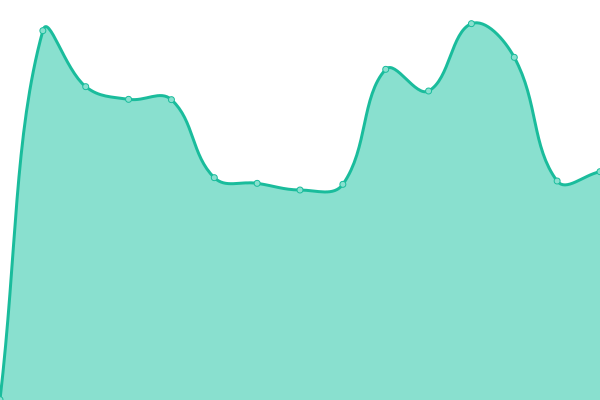 930ms
     
 | 

<a href="https://chris9091.github.io/Fleksa-Monitor/history/bella-pizzaservice">100.00%</a>
    

|  [Punjab Restaurant Laupheim](https://laupheim-punjab.de) | 🟩 Up | [punjab-restaurant-laupheim.yml](https://github.com/chris9091/Fleksa-Monitor/commits/HEAD/history/punjab-restaurant-laupheim.yml) | 

 1042ms
     
 | 

<a href="https://chris9091.github.io/Fleksa-Monitor/history/punjab-restaurant-laupheim">100.00%</a>
    

|  [Broadway Food Plaza](https://broadway-foodplaza.de) | 🟩 Up | [broadway-food-plaza.yml](https://github.com/chris9091/Fleksa-Monitor/commits/HEAD/history/broadway-food-plaza.yml) | 

 903ms
     
 | 

<a href="https://chris9091.github.io/Fleksa-Monitor/history/broadway-food-plaza">100.00%</a>
    

|  [Delhi Gate - The taste of India](https://akkisindisch-foodcorner.de) | 🟩 Up | [delhi-gate-the-taste-of-india.yml](https://github.com/chris9091/Fleksa-Monitor/commits/HEAD/history/delhi-gate-the-taste-of-india.yml) | 

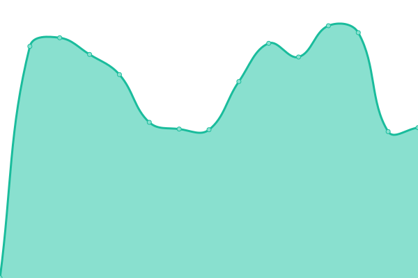 950ms
     
 | 

<a href="https://chris9091.github.io/Fleksa-Monitor/history/delhi-gate-the-taste-of-india">0.00%</a>
    

|  [Pizzeria Lissabon](https://pizzerialissabon.de) | 🟩 Up | [pizzeria-lissabon.yml](https://github.com/chris9091/Fleksa-Monitor/commits/HEAD/history/pizzeria-lissabon.yml) | 

 989ms
     
 | 

<a href="https://chris9091.github.io/Fleksa-Monitor/history/pizzeria-lissabon">100.00%</a>
    

|  [Sunny's Pizza Essen](https://sunnyspizza-essen.de) | 🟩 Up | [sunny-s-pizza-essen.yml](https://github.com/chris9091/Fleksa-Monitor/commits/HEAD/history/sunny-s-pizza-essen.yml) | 

 989ms
     
 | 

<a href="https://chris9091.github.io/Fleksa-Monitor/history/sunny-s-pizza-essen">100.00%</a>
    

|  [Restaurant Kashmir India](https://kashmir-india-mh.de) | 🟩 Up | [restaurant-kashmir-india.yml](https://github.com/chris9091/Fleksa-Monitor/commits/HEAD/history/restaurant-kashmir-india.yml) | 

 1104ms
     
 | 

<a href="https://chris9091.github.io/Fleksa-Monitor/history/restaurant-kashmir-india">99.02%</a>
    

|  [Dhaba Münchner Freiheit](https://xn--dhaba-mnchen-jlb.de) | 🟩 Up | [dhaba-muenchner-freiheit.yml](https://github.com/chris9091/Fleksa-Monitor/commits/HEAD/history/dhaba-muenchner-freiheit.yml) | 

 939ms
     
 | 

<a href="https://chris9091.github.io/Fleksa-Monitor/history/dhaba-muenchner-freiheit">100.00%</a>
    

|  [Dhaba Restaurant](https://dhaba-landshut.de) | 🟩 Up | [dhaba-restaurant.yml](https://github.com/chris9091/Fleksa-Monitor/commits/HEAD/history/dhaba-restaurant.yml) | 

 1169ms
     
 | 

<a href="https://chris9091.github.io/Fleksa-Monitor/history/dhaba-restaurant">100.00%</a>
    

|  [White Elefant Offenbach](https://offenbach-white-elefant.de) | 🟩 Up | [white-elefant-offenbach.yml](https://github.com/chris9091/Fleksa-Monitor/commits/HEAD/history/white-elefant-offenbach.yml) | 

 951ms
     
 | 

<a href="https://chris9091.github.io/Fleksa-Monitor/history/white-elefant-offenbach">100.00%</a>
    

|  [Pizzeria Pomodori](https://pizza-pomodori.de) | 🟩 Up | [pizzeria-pomodori.yml](https://github.com/chris9091/Fleksa-Monitor/commits/HEAD/history/pizzeria-pomodori.yml) | 

 901ms
     
 | 

<a href="https://chris9091.github.io/Fleksa-Monitor/history/pizzeria-pomodori">100.00%</a>
    

|  [Little Ente](https://offenbach-little-ente.de) | 🟩 Up | [little-ente.yml](https://github.com/chris9091/Fleksa-Monitor/commits/HEAD/history/little-ente.yml) | 

 958ms
     
 | 

<a href="https://chris9091.github.io/Fleksa-Monitor/history/little-ente">100.00%</a>
    

|  [Namaste India](https://namasteindia-indersdorf.de) | 🟩 Up | [namaste-india.yml](https://github.com/chris9091/Fleksa-Monitor/commits/HEAD/history/namaste-india.yml) | 

 934ms
     
 | 

<a href="https://chris9091.github.io/Fleksa-Monitor/history/namaste-india">100.00%</a>
    

|  [Restaurant Punjab Haus](https://xn--punjabhaus-neusss-4qb.de) | 🟩 Up | [restaurant-punjab-haus.yml](https://github.com/chris9091/Fleksa-Monitor/commits/HEAD/history/restaurant-punjab-haus.yml) | 

 984ms
     
 | 

<a href="https://chris9091.github.io/Fleksa-Monitor/history/restaurant-punjab-haus">100.00%</a>
    

|  [Tanda Palace](https://tandapalace-landshut.de) | 🟩 Up | [tanda-palace.yml](https://github.com/chris9091/Fleksa-Monitor/commits/HEAD/history/tanda-palace.yml) | 

 966ms
     
 | 

<a href="https://chris9091.github.io/Fleksa-Monitor/history/tanda-palace">100.00%</a>
    

|  [Restaurant Royal India](https://royalindia-biberach.de) | 🟩 Up | [restaurant-royal-india.yml](https://github.com/chris9091/Fleksa-Monitor/commits/HEAD/history/restaurant-royal-india.yml) | 

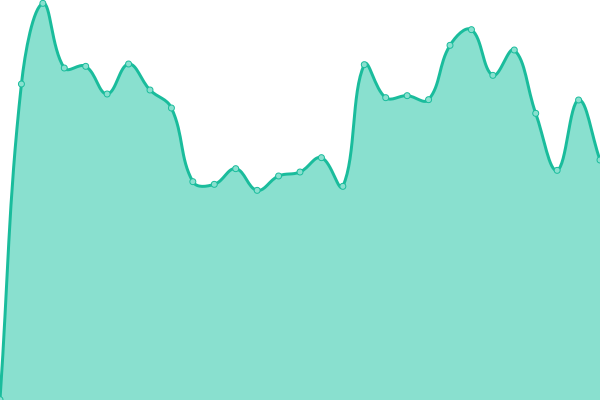 960ms
     
 | 

<a href="https://chris9091.github.io/Fleksa-Monitor/history/restaurant-royal-india">100.00%</a>
    

|  [Restaurant Royal India](https://royalindia-badwurzach.de) | 🟩 Up | [restaurant-royal-india.yml](https://github.com/chris9091/Fleksa-Monitor/commits/HEAD/history/restaurant-royal-india.yml) | 

 960ms
     
 | 

<a href="https://chris9091.github.io/Fleksa-Monitor/history/restaurant-royal-india">100.00%</a>
    

|  [BC Restaurant und Lieferservice](https://bcrestaurant-biberach.de) | 🟩 Up | [bc-restaurant-und-lieferservice.yml](https://github.com/chris9091/Fleksa-Monitor/commits/HEAD/history/bc-restaurant-und-lieferservice.yml) | 

 941ms
     
 | 

<a href="https://chris9091.github.io/Fleksa-Monitor/history/bc-restaurant-und-lieferservice">100.00%</a>
    

|  [Restaurant Royal India](https://royalindia-ehingen.de) | 🟩 Up | [restaurant-royal-india.yml](https://github.com/chris9091/Fleksa-Monitor/commits/HEAD/history/restaurant-royal-india.yml) | 

 960ms
     
 | 

<a href="https://chris9091.github.io/Fleksa-Monitor/history/restaurant-royal-india">100.00%</a>
    

|  [Pizza Express Picnic](https://pizzaexpress-picnic.de) | 🟩 Up | [pizza-express-picnic.yml](https://github.com/chris9091/Fleksa-Monitor/commits/HEAD/history/pizza-express-picnic.yml) | 

 877ms
     
 | 

<a href="https://chris9091.github.io/Fleksa-Monitor/history/pizza-express-picnic">100.00%</a>
    

|  [Namaste Immenstaad](https://namasteimmenstaad.de) | 🟩 Up | [namaste-immenstaad.yml](https://github.com/chris9091/Fleksa-Monitor/commits/HEAD/history/namaste-immenstaad.yml) | 

 896ms
     
 | 

<a href="https://chris9091.github.io/Fleksa-Monitor/history/namaste-immenstaad">100.00%</a>
    

|  [Schwäbische Pizza](https://xn--schwbischepizza-3kb.de) | 🟩 Up | [schwaebische-pizza.yml](https://github.com/chris9091/Fleksa-Monitor/commits/HEAD/history/schwaebische-pizza.yml) | 

 842ms
     
 | 

<a href="https://chris9091.github.io/Fleksa-Monitor/history/schwaebische-pizza">100.00%</a>
    

|  [The Taj München](https://xn--thetajmnchen-jlb.de) | 🟩 Up | [the-taj-muenchen.yml](https://github.com/chris9091/Fleksa-Monitor/commits/HEAD/history/the-taj-muenchen.yml) | 

 940ms
     
 | 

<a href="https://chris9091.github.io/Fleksa-Monitor/history/the-taj-muenchen">100.00%</a>
    

|  [Restaurant Royal India](https://royalindia-memmingen.de) | 🟩 Up | [restaurant-royal-india.yml](https://github.com/chris9091/Fleksa-Monitor/commits/HEAD/history/restaurant-royal-india.yml) | 

 960ms
     
 | 

<a href="https://chris9091.github.io/Fleksa-Monitor/history/restaurant-royal-india">100.00%</a>
    

|  [Restaurant Sagar Potsdam](https://sagarpotsdam.de) | 🟩 Up | [restaurant-sagar-potsdam.yml](https://github.com/chris9091/Fleksa-Monitor/commits/HEAD/history/restaurant-sagar-potsdam.yml) | 

 913ms
     
 | 

<a href="https://chris9091.github.io/Fleksa-Monitor/history/restaurant-sagar-potsdam">100.00%</a>
    

|  [Pei른nberger Pizza service](https://peissenberger-pizzaservice.de) | 🟩 Up | [peissenberger-pizza-service.yml](https://github.com/chris9091/Fleksa-Monitor/commits/HEAD/history/peissenberger-pizza-service.yml) | 

 889ms
     
 | 

<a href="https://chris9091.github.io/Fleksa-Monitor/history/peissenberger-pizza-service">100.00%</a>
    

|  [Goa Restaurant](https://goarestaurant-weilheim.de) | 🟩 Up | [goa-restaurant.yml](https://github.com/chris9091/Fleksa-Monitor/commits/HEAD/history/goa-restaurant.yml) | 

 899ms
     
 | 

<a href="https://chris9091.github.io/Fleksa-Monitor/history/goa-restaurant">100.00%</a>
    

|  [Pizza Corner Straubing](https://pizzacorner-straubing.de) | 🟩 Up | [pizza-corner-straubing.yml](https://github.com/chris9091/Fleksa-Monitor/commits/HEAD/history/pizza-corner-straubing.yml) | 

 1021ms
     
 | 

<a href="https://chris9091.github.io/Fleksa-Monitor/history/pizza-corner-straubing">100.00%</a>
    

|  [Pizza Express Schongau](https://pizzaexpress-schongau.de) | 🟩 Up | [pizza-express-schongau.yml](https://github.com/chris9091/Fleksa-Monitor/commits/HEAD/history/pizza-express-schongau.yml) | 

 893ms
     
 | 

<a href="https://chris9091.github.io/Fleksa-Monitor/history/pizza-express-schongau">100.00%</a>
    

|  [Bella Pizzaservice](https://bellapizza-westerheim.de) | 🟩 Up | [bella-pizzaservice.yml](https://github.com/chris9091/Fleksa-Monitor/commits/HEAD/history/bella-pizzaservice.yml) | 

 930ms
     
 | 

<a href="https://chris9091.github.io/Fleksa-Monitor/history/bella-pizzaservice">100.00%</a>
    

|  [Pizzeria Gondola](https://pizzeria-gondola.de) | 🟩 Up | [pizzeria-gondola.yml](https://github.com/chris9091/Fleksa-Monitor/commits/HEAD/history/pizzeria-gondola.yml) | 

 877ms
     
 | 

<a href="https://chris9091.github.io/Fleksa-Monitor/history/pizzeria-gondola">100.00%</a>
    

|  [Restaurant India House](https://stuttgart-indiahouse.de) | 🟩 Up | [restaurant-india-house.yml](https://github.com/chris9091/Fleksa-Monitor/commits/HEAD/history/restaurant-india-house.yml) | 

 980ms
     
 | 

<a href="https://chris9091.github.io/Fleksa-Monitor/history/restaurant-india-house">100.00%</a>
    

|  [Chilli Corner indisches Restaurant](https://chillicorner.de) | 🟩 Up | [chilli-corner-indisches-restaurant.yml](https://github.com/chris9091/Fleksa-Monitor/commits/HEAD/history/chilli-corner-indisches-restaurant.yml) | 

 907ms
     
 | 

<a href="https://chris9091.github.io/Fleksa-Monitor/history/chilli-corner-indisches-restaurant">100.00%</a>
    

|  [Giovanni Pizzeria - Lieferservice](https://pizzaservice-giovanni.de) | 🟩 Up | [giovanni-pizzeria-lieferservice.yml](https://github.com/chris9091/Fleksa-Monitor/commits/HEAD/history/giovanni-pizzeria-lieferservice.yml) | 

 902ms
     
 | 

<a href="https://chris9091.github.io/Fleksa-Monitor/history/giovanni-pizzeria-lieferservice">100.00%</a>
    

|  [Satchi Pizza Pascara](https://satchipizzapascara.de) | 🟩 Up | [satchi-pizza-pascara.yml](https://github.com/chris9091/Fleksa-Monitor/commits/HEAD/history/satchi-pizza-pascara.yml) | 

 810ms
     
 | 

<a href="https://chris9091.github.io/Fleksa-Monitor/history/satchi-pizza-pascara">100.00%</a>
    

|  [Pizza Pal](https://palpizzaservice.de) | 🟩 Up | [pizza-pal.yml](https://github.com/chris9091/Fleksa-Monitor/commits/HEAD/history/pizza-pal.yml) | 

 788ms
     
 | 

<a href="https://chris9091.github.io/Fleksa-Monitor/history/pizza-pal">100.00%</a>
    

|  [Satchi Versatchi](https://versatchi.satchipizzapascara.de) | 🟩 Up | [satchi-versatchi.yml](https://github.com/chris9091/Fleksa-Monitor/commits/HEAD/history/satchi-versatchi.yml) | 

 1089ms
     
 | 

<a href="https://chris9091.github.io/Fleksa-Monitor/history/satchi-versatchi">100.00%</a>
    

|  [Maharaja Palace](https://maharajapalast.de) | 🟩 Up | [maharaja-palace.yml](https://github.com/chris9091/Fleksa-Monitor/commits/HEAD/history/maharaja-palace.yml) | 

 944ms
     
 | 

<a href="https://chris9091.github.io/Fleksa-Monitor/history/maharaja-palace">100.00%</a>
    

|  [Indian Kitchen Munich](https://indiankitchenmunich.de) | 🟩 Up | [indian-kitchen-munich.yml](https://github.com/chris9091/Fleksa-Monitor/commits/HEAD/history/indian-kitchen-munich.yml) | 

 946ms
     
 | 

<a href="https://chris9091.github.io/Fleksa-Monitor/history/indian-kitchen-munich">100.00%</a>
    

|  [Weinheim Pizzaservice](https://weinheim-pizza.de) | 🟩 Up | [weinheim-pizzaservice.yml](https://github.com/chris9091/Fleksa-Monitor/commits/HEAD/history/weinheim-pizzaservice.yml) | 

 805ms
     
 | 

<a href="https://chris9091.github.io/Fleksa-Monitor/history/weinheim-pizzaservice">100.00%</a>
    

|  [Pizzeria Italia](https://pizzeriaitalia-weinheim.de) | 🟩 Up | [pizzeria-italia.yml](https://github.com/chris9091/Fleksa-Monitor/commits/HEAD/history/pizzeria-italia.yml) | 

 882ms
     
 | 

<a href="https://chris9091.github.io/Fleksa-Monitor/history/pizzeria-italia">100.00%</a>
    

|  [Pizzeria Mamma Mia](https://pizzamamma-mia.de) | 🟩 Up | [pizzeria-mamma-mia.yml](https://github.com/chris9091/Fleksa-Monitor/commits/HEAD/history/pizzeria-mamma-mia.yml) | 

 1018ms
     
 | 

<a href="https://chris9091.github.io/Fleksa-Monitor/history/pizzeria-mamma-mia">100.00%</a>
    

|  [Merry Pizza-Service](https://merywok-pizza.de) | 🟩 Up | [merry-pizza-service.yml](https://github.com/chris9091/Fleksa-Monitor/commits/HEAD/history/merry-pizza-service.yml) | 

 946ms
     
 | 

<a href="https://chris9091.github.io/Fleksa-Monitor/history/merry-pizza-service">100.00%</a>
    

|  [Da Laura Augsburg](https://dalaurapizza.de) | 🟩 Up | [da-laura-augsburg.yml](https://github.com/chris9091/Fleksa-Monitor/commits/HEAD/history/da-laura-augsburg.yml) | 

 1032ms
     
 | 

<a href="https://chris9091.github.io/Fleksa-Monitor/history/da-laura-augsburg">100.00%</a>
    

|  [Mama Mia Pizzeria](https://mamamiahutthurm.de) | 🟩 Up | [mama-mia-pizzeria.yml](https://github.com/chris9091/Fleksa-Monitor/commits/HEAD/history/mama-mia-pizzeria.yml) | 

 930ms
     
 | 

<a href="https://chris9091.github.io/Fleksa-Monitor/history/mama-mia-pizzeria">100.00%</a>
    

|  [Lucky's Bistro](https://luckysbistro.de) | 🟩 Up | [lucky-s-bistro.yml](https://github.com/chris9091/Fleksa-Monitor/commits/HEAD/history/lucky-s-bistro.yml) | 

 996ms
     
 | 

<a href="https://chris9091.github.io/Fleksa-Monitor/history/lucky-s-bistro">100.00%</a>
    

|  [Galaxyfood Lieferservice](https://galaxyfood-lieferservice.de) | 🟩 Up | [galaxyfood-lieferservice.yml](https://github.com/chris9091/Fleksa-Monitor/commits/HEAD/history/galaxyfood-lieferservice.yml) | 

 882ms
     
 | 

<a href="https://chris9091.github.io/Fleksa-Monitor/history/galaxyfood-lieferservice">100.00%</a>
    

|  [Seth and Fathe](https://sethfathe-berlin.de) | 🟩 Up | [seth-and-fathe.yml](https://github.com/chris9091/Fleksa-Monitor/commits/HEAD/history/seth-and-fathe.yml) | 

 990ms
     
 | 

<a href="https://chris9091.github.io/Fleksa-Monitor/history/seth-and-fathe">100.00%</a>
    

|  [Pizza u. Pasta Vilshofen](https://pizzapastavilshofen.de) | 🟩 Up | [pizza-u-pasta-vilshofen.yml](https://github.com/chris9091/Fleksa-Monitor/commits/HEAD/history/pizza-u-pasta-vilshofen.yml) | 

 1236ms
     
 | 

<a href="https://chris9091.github.io/Fleksa-Monitor/history/pizza-u-pasta-vilshofen">100.00%</a>
    

|  [Offenbacher Essensdienst](https://offenbachessen.de) | 🟩 Up | [offenbacher-essensdienst.yml](https://github.com/chris9091/Fleksa-Monitor/commits/HEAD/history/offenbacher-essensdienst.yml) | 

 927ms
     
 | 

<a href="https://chris9091.github.io/Fleksa-Monitor/history/offenbacher-essensdienst">100.00%</a>
    

|  [Ebinger Pizzaservice](https://ebingerpizzaservice.de) | 🟩 Up | [ebinger-pizzaservice.yml](https://github.com/chris9091/Fleksa-Monitor/commits/HEAD/history/ebinger-pizzaservice.yml) | 

 930ms
     
 | 

<a href="https://chris9091.github.io/Fleksa-Monitor/history/ebinger-pizzaservice">100.00%</a>
    

|  [Bitzer Pizzaservice](https://bitzerpizzaservice.de) | 🟩 Up | [bitzer-pizzaservice.yml](https://github.com/chris9091/Fleksa-Monitor/commits/HEAD/history/bitzer-pizzaservice.yml) | 

 885ms
     
 | 

<a href="https://chris9091.github.io/Fleksa-Monitor/history/bitzer-pizzaservice">100.00%</a>
    

|  [Ganesha Palace](https://albstadt-ganeshapalace.de) | 🟩 Up | [ganesha-palace.yml](https://github.com/chris9091/Fleksa-Monitor/commits/HEAD/history/ganesha-palace.yml) | 

 947ms
     
 | 

<a href="https://chris9091.github.io/Fleksa-Monitor/history/ganesha-palace">100.00%</a>
    

|  [Mr. Singh Balingen](https://mrsinghbalingen.de) | 🟩 Up | [mr-singh-balingen.yml](https://github.com/chris9091/Fleksa-Monitor/commits/HEAD/history/mr-singh-balingen.yml) | 

 896ms
     
 | 

<a href="https://chris9091.github.io/Fleksa-Monitor/history/mr-singh-balingen">100.00%</a>
    

|  [Krone Restaurant](https://kronebalingen.de) | 🟩 Up | [krone-restaurant.yml](https://github.com/chris9091/Fleksa-Monitor/commits/HEAD/history/krone-restaurant.yml) | 

 797ms
     
 | 

<a href="https://chris9091.github.io/Fleksa-Monitor/history/krone-restaurant">100.00%</a>
    

|  [Geislinger Pizzaservice](https://geislinger-pizzaservice.de) | 🟩 Up | [geislinger-pizzaservice.yml](https://github.com/chris9091/Fleksa-Monitor/commits/HEAD/history/geislinger-pizzaservice.yml) | 

 794ms
     
 | 

<a href="https://chris9091.github.io/Fleksa-Monitor/history/geislinger-pizzaservice">100.00%</a>
    

|  [Eutinger Pizzaservice](https://pizzaservice-eutinger.de) | 🟩 Up | [eutinger-pizzaservice.yml](https://github.com/chris9091/Fleksa-Monitor/commits/HEAD/history/eutinger-pizzaservice.yml) | 

 939ms
     
 | 

<a href="https://chris9091.github.io/Fleksa-Monitor/history/eutinger-pizzaservice">100.00%</a>
    

|  [Amigo Pizzaservice](https://villingen-amigo.de) | 🟩 Up | [amigo-pizzaservice.yml](https://github.com/chris9091/Fleksa-Monitor/commits/HEAD/history/amigo-pizzaservice.yml) | 

 828ms
     
 | 

<a href="https://chris9091.github.io/Fleksa-Monitor/history/amigo-pizzaservice">100.00%</a>
    

|  [Taste of Tandoori Hattersheim](https://tasteoftandoorihattersheim.de) | 🟩 Up | [taste-of-tandoori-hattersheim.yml](https://github.com/chris9091/Fleksa-Monitor/commits/HEAD/history/taste-of-tandoori-hattersheim.yml) | 

 990ms
     
 | 

<a href="https://chris9091.github.io/Fleksa-Monitor/history/taste-of-tandoori-hattersheim">100.00%</a>
    

|  [Pizza Express Lörrach](https://xn--pizzalrrach-wfb.de) | 🟩 Up | [pizza-express-loerrach.yml](https://github.com/chris9091/Fleksa-Monitor/commits/HEAD/history/pizza-express-loerrach.yml) | 

 896ms
     
 | 

<a href="https://chris9091.github.io/Fleksa-Monitor/history/pizza-express-loerrach">100.00%</a>
    

|  [Restaurant A Casa Mia](https://pizzeria-acasamia.de) | 🟩 Up | [restaurant-a-casa-mia.yml](https://github.com/chris9091/Fleksa-Monitor/commits/HEAD/history/restaurant-a-casa-mia.yml) | 

 817ms
     
 | 

<a href="https://chris9091.github.io/Fleksa-Monitor/history/restaurant-a-casa-mia">100.00%</a>
    

|  [Restaurant Haweli](https://rheinfelden-haweli.de) | 🟩 Up | [restaurant-haweli.yml](https://github.com/chris9091/Fleksa-Monitor/commits/HEAD/history/restaurant-haweli.yml) | 

 896ms
     
 | 

<a href="https://chris9091.github.io/Fleksa-Monitor/history/restaurant-haweli">100.00%</a>
    

|  [Pizza Lucky Express](https://pizza-luckyexpress.de) | 🟩 Up | [pizza-lucky-express.yml](https://github.com/chris9091/Fleksa-Monitor/commits/HEAD/history/pizza-lucky-express.yml) | 

 1244ms
     
 | 

<a href="https://chris9091.github.io/Fleksa-Monitor/history/pizza-lucky-express">100.00%</a>
    

|  [Pizza Fly Express Schallstadt](https://pizza-flyexpress.de) | 🟩 Up | [pizza-fly-express-schallstadt.yml](https://github.com/chris9091/Fleksa-Monitor/commits/HEAD/history/pizza-fly-express-schallstadt.yml) | 

 895ms
     
 | 

<a href="https://chris9091.github.io/Fleksa-Monitor/history/pizza-fly-express-schallstadt">100.00%</a>
    

|  [Food Palace Donaueschingen](https://donaueschingen-foodpalace.de) | 🟩 Up | [food-palace-donaueschingen.yml](https://github.com/chris9091/Fleksa-Monitor/commits/HEAD/history/food-palace-donaueschingen.yml) | 

 891ms
     
 | 

<a href="https://chris9091.github.io/Fleksa-Monitor/history/food-palace-donaueschingen">100.00%</a>
    

|  [Milano Pizza Express Weil](https://xn--milanopizzalrrach-b0b.de) | 🟩 Up | [milano-pizza-express-weil.yml](https://github.com/chris9091/Fleksa-Monitor/commits/HEAD/history/milano-pizza-express-weil.yml) | 

 901ms
     
 | 

<a href="https://chris9091.github.io/Fleksa-Monitor/history/milano-pizza-express-weil">100.00%</a>
    

|  [Milano Pizza Express](https://milanopizzaloerrach.de) | 🟩 Up | [milano-pizza-express.yml](https://github.com/chris9091/Fleksa-Monitor/commits/HEAD/history/milano-pizza-express.yml) | 

 848ms
     
 | 

<a href="https://chris9091.github.io/Fleksa-Monitor/history/milano-pizza-express">100.00%</a>
    

|  [Mini Punjabi Dhaba](https://mini-punjabidhaba.de) | 🟩 Up | [mini-punjabi-dhaba.yml](https://github.com/chris9091/Fleksa-Monitor/commits/HEAD/history/mini-punjabi-dhaba.yml) | 

 923ms
     
 | 

<a href="https://chris9091.github.io/Fleksa-Monitor/history/mini-punjabi-dhaba">100.00%</a>
    

|  [Gasthaus Rose](https://rosegasthaus.de) | 🟩 Up | [gasthaus-rose.yml](https://github.com/chris9091/Fleksa-Monitor/commits/HEAD/history/gasthaus-rose.yml) | 

 908ms
     
 | 

<a href="https://chris9091.github.io/Fleksa-Monitor/history/gasthaus-rose">100.00%</a>
    

|  [Pizzaservice Taj Mahal](https://tajpizzaservice.de) | 🟩 Up | [pizzaservice-taj-mahal.yml](https://github.com/chris9091/Fleksa-Monitor/commits/HEAD/history/pizzaservice-taj-mahal.yml) | 

 899ms
     
 | 

<a href="https://chris9091.github.io/Fleksa-Monitor/history/pizzaservice-taj-mahal">100.00%</a>
    

|  [Restaurant Taj Mahal](https://allensbach-tajmahal.de) | 🟩 Up | [restaurant-taj-mahal.yml](https://github.com/chris9091/Fleksa-Monitor/commits/HEAD/history/restaurant-taj-mahal.yml) | 

 1065ms
     
 | 

<a href="https://chris9091.github.io/Fleksa-Monitor/history/restaurant-taj-mahal">98.99%</a>
    

|  [Top One Burger u. Pizza](https://pizzaburgerkonstanz.de) | 🟩 Up | [top-one-burger-u-pizza.yml](https://github.com/chris9091/Fleksa-Monitor/commits/HEAD/history/top-one-burger-u-pizza.yml) | 

 937ms
     
 | 

<a href="https://chris9091.github.io/Fleksa-Monitor/history/top-one-burger-u-pizza">100.00%</a>
    

|  [Curry Junction](https://curryjunction.de) | 🟩 Up | [curry-junction.yml](https://github.com/chris9091/Fleksa-Monitor/commits/HEAD/history/curry-junction.yml) | 

 882ms
     
 | 

<a href="https://chris9091.github.io/Fleksa-Monitor/history/curry-junction">100.00%</a>
    

|  [Pizza Capri Singen](https://singen-pizzacapri.de) | 🟩 Up | [pizza-capri-singen.yml](https://github.com/chris9091/Fleksa-Monitor/commits/HEAD/history/pizza-capri-singen.yml) | 

 893ms
     
 | 

<a href="https://chris9091.github.io/Fleksa-Monitor/history/pizza-capri-singen">100.00%</a>
    

|  [Pizza Miami Express](https://pizza-miamiexpress.de) | 🟩 Up | [pizza-miami-express.yml](https://github.com/chris9091/Fleksa-Monitor/commits/HEAD/history/pizza-miami-express.yml) | 

 892ms
     
 | 

<a href="https://chris9091.github.io/Fleksa-Monitor/history/pizza-miami-express">100.00%</a>
    

|  [Pizza Markdorf](https://pizzamarkdorf.de) | 🟩 Up | [pizza-markdorf.yml](https://github.com/chris9091/Fleksa-Monitor/commits/HEAD/history/pizza-markdorf.yml) | 

 906ms
     
 | 

<a href="https://chris9091.github.io/Fleksa-Monitor/history/pizza-markdorf">100.00%</a>
    

|  [Ulmer Feuerstein](https://feuersteinpizzaulm.de) | 🟩 Up | [ulmer-feuerstein.yml](https://github.com/chris9091/Fleksa-Monitor/commits/HEAD/history/ulmer-feuerstein.yml) | 

 1091ms
     
 | 

<a href="https://chris9091.github.io/Fleksa-Monitor/history/ulmer-feuerstein">100.00%</a>
    

|  [Uno Pronto Pizza & Pasta](https://uno-pizza-ismaning.de) | 🟩 Up | [uno-pronto-pizza-and-pasta.yml](https://github.com/chris9091/Fleksa-Monitor/commits/HEAD/history/uno-pronto-pizza-and-pasta.yml) | 

 890ms
     
 | 

<a href="https://chris9091.github.io/Fleksa-Monitor/history/uno-pronto-pizza-and-pasta">100.00%</a>
    

|  [Imperial Indian Palace](https://imperialindianpalace.de) | 🟩 Up | [imperial-indian-palace.yml](https://github.com/chris9091/Fleksa-Monitor/commits/HEAD/history/imperial-indian-palace.yml) | 

 813ms
     
 | 

<a href="https://chris9091.github.io/Fleksa-Monitor/history/imperial-indian-palace">100.00%</a>
    

|  [Taste of India](https://balingen-tasteofindia.de) | 🟩 Up | [taste-of-india.yml](https://github.com/chris9091/Fleksa-Monitor/commits/HEAD/history/taste-of-india.yml) | 

 902ms
     
 | 

<a href="https://chris9091.github.io/Fleksa-Monitor/history/taste-of-india">100.00%</a>
    

|  [Bella Pizza Mössingen](https://bellapizza-moessingen.de) | 🟩 Up | [bella-pizza-moessingen.yml](https://github.com/chris9091/Fleksa-Monitor/commits/HEAD/history/bella-pizza-moessingen.yml) | 

 897ms
     
 | 

<a href="https://chris9091.github.io/Fleksa-Monitor/history/bella-pizza-moessingen">100.00%</a>
    

|  [Gasthof Engel Haigerloch](https://haigerloch-gasthofengel.de) | 🟩 Up | [gasthof-engel-haigerloch.yml](https://github.com/chris9091/Fleksa-Monitor/commits/HEAD/history/gasthof-engel-haigerloch.yml) | 

 850ms
     
 | 

<a href="https://chris9091.github.io/Fleksa-Monitor/history/gasthof-engel-haigerloch">100.00%</a>
    

|  [Pizza Schad Express](https://schadpizzaexpress.de) | 🟩 Up | [pizza-schad-express.yml](https://github.com/chris9091/Fleksa-Monitor/commits/HEAD/history/pizza-schad-express.yml) | 

 811ms
     
 | 

<a href="https://chris9091.github.io/Fleksa-Monitor/history/pizza-schad-express">100.00%</a>
    

|  [Pizza Milan Schwenningen](https://milanpizza-schwenningen.de) | 🟩 Up | [pizza-milan-schwenningen.yml](https://github.com/chris9091/Fleksa-Monitor/commits/HEAD/history/pizza-milan-schwenningen.yml) | 

 900ms
     
 | 

<a href="https://chris9091.github.io/Fleksa-Monitor/history/pizza-milan-schwenningen">100.00%</a>
    

|  [Baraka Fried Chicken](https://barakalandau.de) | 🟩 Up | [baraka-fried-chicken.yml](https://github.com/chris9091/Fleksa-Monitor/commits/HEAD/history/baraka-fried-chicken.yml) | 

 1133ms
     
 | 

<a href="https://chris9091.github.io/Fleksa-Monitor/history/baraka-fried-chicken">100.00%</a>
    

|  [Pizza Markdorf](https://markdorf-pizzabodensee.de) | 🟩 Up | [pizza-markdorf.yml](https://github.com/chris9091/Fleksa-Monitor/commits/HEAD/history/pizza-markdorf.yml) | 

 906ms
     
 | 

<a href="https://chris9091.github.io/Fleksa-Monitor/history/pizza-markdorf">100.00%</a>
    

|  [Löwen Pizza Radolfzell](https://xn--pizzalwen-57a.de) | 🟩 Up | [loewen-pizza-radolfzell.yml](https://github.com/chris9091/Fleksa-Monitor/commits/HEAD/history/loewen-pizza-radolfzell.yml) | 

 897ms
     
 | 

<a href="https://chris9091.github.io/Fleksa-Monitor/history/loewen-pizza-radolfzell">100.00%</a>
    

|  [Euro Pizza Burghausen](https://europizza-burghausen.de) | 🟩 Up | [euro-pizza-burghausen.yml](https://github.com/chris9091/Fleksa-Monitor/commits/HEAD/history/euro-pizza-burghausen.yml) | 

 819ms
     
 | 

<a href="https://chris9091.github.io/Fleksa-Monitor/history/euro-pizza-burghausen">100.00%</a>
    

|  [Gaststätte Eller](https://xn--gaststtte-eller-5kb.de) | 🟩 Up | [gaststaette-eller.yml](https://github.com/chris9091/Fleksa-Monitor/commits/HEAD/history/gaststaette-eller.yml) | 

 915ms
     
 | 

<a href="https://chris9091.github.io/Fleksa-Monitor/history/gaststaette-eller">100.00%</a>
    

|  [Pizza Haus Crown Food Service](https://crown-pizzahaus.de) | 🟩 Up | [pizza-haus-crown-food-service.yml](https://github.com/chris9091/Fleksa-Monitor/commits/HEAD/history/pizza-haus-crown-food-service.yml) | 

 1370ms
     
 | 

<a href="https://chris9091.github.io/Fleksa-Monitor/history/pizza-haus-crown-food-service">100.00%</a>
    

|  [Pizza u. Kebaphaus Kuhberg](https://kuhbergkebaphaus.de) | 🟩 Up | [pizza-u-kebaphaus-kuhberg.yml](https://github.com/chris9091/Fleksa-Monitor/commits/HEAD/history/pizza-u-kebaphaus-kuhberg.yml) | 

 883ms
     
 | 

<a href="https://chris9091.github.io/Fleksa-Monitor/history/pizza-u-kebaphaus-kuhberg">100.00%</a>
    

|  [Restaurant Rani](https://ranirestaurant.de) | 🟩 Up | [restaurant-rani.yml](https://github.com/chris9091/Fleksa-Monitor/commits/HEAD/history/restaurant-rani.yml) | 

 987ms
     
 | 

<a href="https://chris9091.github.io/Fleksa-Monitor/history/restaurant-rani">100.00%</a>
    

|  [Daily Pizza u. Kebab Ulm](https://dailypizzakebab.de) | 🟩 Up | [daily-pizza-u-kebab-ulm.yml](https://github.com/chris9091/Fleksa-Monitor/commits/HEAD/history/daily-pizza-u-kebab-ulm.yml) | 

 896ms
     
 | 

<a href="https://chris9091.github.io/Fleksa-Monitor/history/daily-pizza-u-kebab-ulm">100.00%</a>
    

|  [Restaurant Sagar werder](https://sagarwerder.de) | 🟩 Up | [restaurant-sagar-werder.yml](https://github.com/chris9091/Fleksa-Monitor/commits/HEAD/history/restaurant-sagar-werder.yml) | 

 916ms
     
 | 

<a href="https://chris9091.github.io/Fleksa-Monitor/history/restaurant-sagar-werder">100.00%</a>
    

|  [Bella Venezia](https://bellaveneziafalkensee.de) | 🟩 Up | [bella-venezia.yml](https://github.com/chris9091/Fleksa-Monitor/commits/HEAD/history/bella-venezia.yml) | 

 948ms
     
 | 

<a href="https://chris9091.github.io/Fleksa-Monitor/history/bella-venezia">100.00%</a>
    

|  [Restaurant Roti](https://rotirestaurant.de) | 🟩 Up | [restaurant-roti.yml](https://github.com/chris9091/Fleksa-Monitor/commits/HEAD/history/restaurant-roti.yml) | 

 954ms
     
 | 

<a href="https://chris9091.github.io/Fleksa-Monitor/history/restaurant-roti">100.00%</a>
    

|  [Restaurant Apne Mahlow](https://restaurantapne.de) | 🟩 Up | [restaurant-apne-mahlow.yml](https://github.com/chris9091/Fleksa-Monitor/commits/HEAD/history/restaurant-apne-mahlow.yml) | 

 967ms
     
 | 

<a href="https://chris9091.github.io/Fleksa-Monitor/history/restaurant-apne-mahlow">100.00%</a>
    

|  [Restaurant Apne Berlin](https://apnerestaurant.de) | 🟩 Up | [restaurant-apne-berlin.yml](https://github.com/chris9091/Fleksa-Monitor/commits/HEAD/history/restaurant-apne-berlin.yml) | 

 1102ms
     
 | 

<a href="https://chris9091.github.io/Fleksa-Monitor/history/restaurant-apne-berlin">100.00%</a>
    

|  [Restaurant Kashana](https://restaurantkashana.de) | 🟩 Up | [restaurant-kashana.yml](https://github.com/chris9091/Fleksa-Monitor/commits/HEAD/history/restaurant-kashana.yml) | 

 891ms
     
 | 

<a href="https://chris9091.github.io/Fleksa-Monitor/history/restaurant-kashana">0.00%</a>
    

|  [Zuckerperle Konditorei](https://zuckerperleberlin.de) | 🟩 Up | [zuckerperle-konditorei.yml](https://github.com/chris9091/Fleksa-Monitor/commits/HEAD/history/zuckerperle-konditorei.yml) | 

 885ms
     
 | 

<a href="https://chris9091.github.io/Fleksa-Monitor/history/zuckerperle-konditorei">0.00%</a>
    

|  [Restaurant Badshah](https://restaurantbadshah.de) | 🟩 Up | [restaurant-badshah.yml](https://github.com/chris9091/Fleksa-Monitor/commits/HEAD/history/restaurant-badshah.yml) | 

 931ms
     
 | 

<a href="https://chris9091.github.io/Fleksa-Monitor/history/restaurant-badshah">0.00%</a>
    

|  [Restaurant EL Buen Gusto](https://el-buengusto.de) | 🟩 Up | [restaurant-el-buen-gusto.yml](https://github.com/chris9091/Fleksa-Monitor/commits/HEAD/history/restaurant-el-buen-gusto.yml) | 

 806ms
     
 | 

<a href="https://chris9091.github.io/Fleksa-Monitor/history/restaurant-el-buen-gusto">0.00%</a>
    

|  [Taj Mahal Haus](https://tajmahal-haus.de) | 🟩 Up | [taj-mahal-haus.yml](https://github.com/chris9091/Fleksa-Monitor/commits/HEAD/history/taj-mahal-haus.yml) | 

 869ms
     
 | 

<a href="https://chris9091.github.io/Fleksa-Monitor/history/taj-mahal-haus">0.00%</a>
    

|  [Restaurant Darbar](https://restaurantdarbar.de) | 🟩 Up | [restaurant-darbar.yml](https://github.com/chris9091/Fleksa-Monitor/commits/HEAD/history/restaurant-darbar.yml) | 

 884ms
     
 | 

<a href="https://chris9091.github.io/Fleksa-Monitor/history/restaurant-darbar">0.00%</a>
    

|  [Restaurant Dildaar](https://restaurantdildaar.de) | 🟩 Up | [restaurant-dildaar.yml](https://github.com/chris9091/Fleksa-Monitor/commits/HEAD/history/restaurant-dildaar.yml) | 

 1204ms
     
 | 

<a href="https://chris9091.github.io/Fleksa-Monitor/history/restaurant-dildaar">0.00%</a>
    

|  [Restaurant Dawat](https://restaurantdawat.de) | 🟩 Up | [restaurant-dawat.yml](https://github.com/chris9091/Fleksa-Monitor/commits/HEAD/history/restaurant-dawat.yml) | 

 903ms
     
 | 

<a href="https://chris9091.github.io/Fleksa-Monitor/history/restaurant-dawat">100.00%</a>
    

|  [Restaurant Damaru](https://restaurantdamaru.de) | 🟩 Up | [restaurant-damaru.yml](https://github.com/chris9091/Fleksa-Monitor/commits/HEAD/history/restaurant-damaru.yml) | 

 905ms
     
 | 

<a href="https://chris9091.github.io/Fleksa-Monitor/history/restaurant-damaru">100.00%</a>
    

|  [Pizza Burger Haus](https://pizzaburgerhaus.de) | 🟩 Up | [pizza-burger-haus.yml](https://github.com/chris9091/Fleksa-Monitor/commits/HEAD/history/pizza-burger-haus.yml) | 

 909ms
     
 | 

<a href="https://chris9091.github.io/Fleksa-Monitor/history/pizza-burger-haus">100.00%</a>
    

|  [Restaurant Himalaya](https://berlinhimalaya.de) | 🟩 Up | [restaurant-himalaya.yml](https://github.com/chris9091/Fleksa-Monitor/commits/HEAD/history/restaurant-himalaya.yml) | 

 889ms
     
 | 

<a href="https://chris9091.github.io/Fleksa-Monitor/history/restaurant-himalaya">100.00%</a>
    

|  [Restaurant Dana Pani](https://restaurantdanapani.de) | 🟩 Up | [restaurant-dana-pani.yml](https://github.com/chris9091/Fleksa-Monitor/commits/HEAD/history/restaurant-dana-pani.yml) | 

 917ms
     
 | 

<a href="https://chris9091.github.io/Fleksa-Monitor/history/restaurant-dana-pani">100.00%</a>
    

|  [Restaurant Anappurna](https://anappurnarestaurant.de) | 🟩 Up | [restaurant-anappurna.yml](https://github.com/chris9091/Fleksa-Monitor/commits/HEAD/history/restaurant-anappurna.yml) | 

 932ms
     
 | 

<a href="https://chris9091.github.io/Fleksa-Monitor/history/restaurant-anappurna">100.00%</a>
    

|  [Die Indische Küche](https://indiankitchenberlin.de) | 🟩 Up | [die-indische-kueche.yml](https://github.com/chris9091/Fleksa-Monitor/commits/HEAD/history/die-indische-kueche.yml) | 

 946ms
     
 | 

<a href="https://chris9091.github.io/Fleksa-Monitor/history/die-indische-kueche">100.00%</a>
    

|  [Restaurant Yogi Haus](https://berlinyogihaus.de) | 🟩 Up | [restaurant-yogi-haus.yml](https://github.com/chris9091/Fleksa-Monitor/commits/HEAD/history/restaurant-yogi-haus.yml) | 

 883ms
     
 | 

<a href="https://chris9091.github.io/Fleksa-Monitor/history/restaurant-yogi-haus">100.00%</a>
    

|  [Taj Mahal Haus II](https://taj-mahalhaus.de) | 🟩 Up | [taj-mahal-haus-ii.yml](https://github.com/chris9091/Fleksa-Monitor/commits/HEAD/history/taj-mahal-haus-ii.yml) | 

 880ms
     
 | 

<a href="https://chris9091.github.io/Fleksa-Monitor/history/taj-mahal-haus-ii">100.00%</a>
    

|  [Pizzeria Roma Frankfurt](https://pizzeriaromaffm.de) | 🟩 Up | [pizzeria-roma-frankfurt.yml](https://github.com/chris9091/Fleksa-Monitor/commits/HEAD/history/pizzeria-roma-frankfurt.yml) | 

 940ms
     
 | 

<a href="https://chris9091.github.io/Fleksa-Monitor/history/pizzeria-roma-frankfurt">0.00%</a>
    

|  [Restaurant Rasam](https://restaurantrasam.de) | 🟩 Up | [restaurant-rasam.yml](https://github.com/chris9091/Fleksa-Monitor/commits/HEAD/history/restaurant-rasam.yml) | 

 949ms
     
 | 

<a href="https://chris9091.github.io/Fleksa-Monitor/history/restaurant-rasam">0.00%</a>
    

|  [Restaurant Radha](https://radharestaurant.de) | 🟩 Up | [restaurant-radha.yml](https://github.com/chris9091/Fleksa-Monitor/commits/HEAD/history/restaurant-radha.yml) | 

 923ms
     
 | 

<a href="https://chris9091.github.io/Fleksa-Monitor/history/restaurant-radha">0.00%</a>
    

|  [Indisches Restaurant Maharadscha](https://berlinmaharadscha.de) | 🟩 Up | [indisches-restaurant-maharadscha.yml](https://github.com/chris9091/Fleksa-Monitor/commits/HEAD/history/indisches-restaurant-maharadscha.yml) | 

 1008ms
     
 | 

<a href="https://chris9091.github.io/Fleksa-Monitor/history/indisches-restaurant-maharadscha">0.00%</a>
    

|  [Restaurant Everest](https://restauranteverest.de) | 🟩 Up | [restaurant-everest.yml](https://github.com/chris9091/Fleksa-Monitor/commits/HEAD/history/restaurant-everest.yml) | 

 880ms
     
 | 

<a href="https://chris9091.github.io/Fleksa-Monitor/history/restaurant-everest">0.00%</a>
    

|  [Restaurant Arjun](https://arjunberlin.de) | 🟩 Up | [restaurant-arjun.yml](https://github.com/chris9091/Fleksa-Monitor/commits/HEAD/history/restaurant-arjun.yml) | 

 884ms
     
 | 

<a href="https://chris9091.github.io/Fleksa-Monitor/history/restaurant-arjun">0.00%</a>
    

|  [Restaurant Asman](https://restaurantasman.de) | 🟩 Up | [restaurant-asman.yml](https://github.com/chris9091/Fleksa-Monitor/commits/HEAD/history/restaurant-asman.yml) | 

 915ms
     
 | 

<a href="https://chris9091.github.io/Fleksa-Monitor/history/restaurant-asman">0.00%</a>
    

|  [Restaurant Asman Tandoor](https://berlinasman.de) | 🟩 Up | [restaurant-asman-tandoor.yml](https://github.com/chris9091/Fleksa-Monitor/commits/HEAD/history/restaurant-asman-tandoor.yml) | 

 968ms
     
 | 

<a href="https://chris9091.github.io/Fleksa-Monitor/history/restaurant-asman-tandoor">0.00%</a>
    

|  [Restaurant Bombay](https://berlinbombay.de) | 🟩 Up | [restaurant-bombay.yml](https://github.com/chris9091/Fleksa-Monitor/commits/HEAD/history/restaurant-bombay.yml) | 

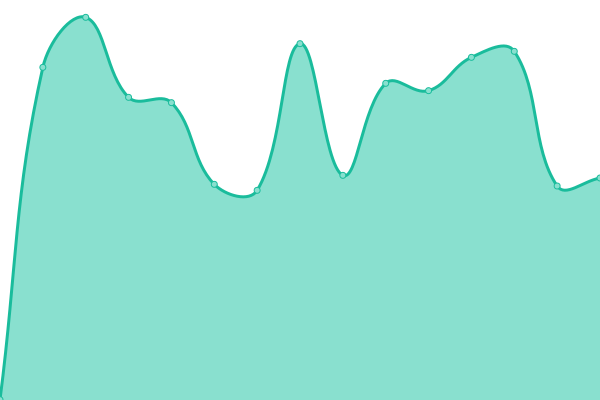 931ms
     
 | 

<a href="https://chris9091.github.io/Fleksa-Monitor/history/restaurant-bombay">0.00%</a>
    

|  [Restaurant Namaste](https://berlinnamaste.de) | 🟩 Up | [restaurant-namaste.yml](https://github.com/chris9091/Fleksa-Monitor/commits/HEAD/history/restaurant-namaste.yml) | 

 1021ms
     
 | 

<a href="https://chris9091.github.io/Fleksa-Monitor/history/restaurant-namaste">98.97%</a>
    

|  [Restaurant Buddha](https://buddhaberlin.de) | 🟩 Up | [restaurant-buddha.yml](https://github.com/chris9091/Fleksa-Monitor/commits/HEAD/history/restaurant-buddha.yml) | 

 944ms
     
 | 

<a href="https://chris9091.github.io/Fleksa-Monitor/history/restaurant-buddha">0.00%</a>
    

|  [Restaurant Maharani](https://xn--maharaninrnberg-7vb.de) | 🟩 Up | [restaurant-maharani.yml](https://github.com/chris9091/Fleksa-Monitor/commits/HEAD/history/restaurant-maharani.yml) | 

 899ms
     
 | 

<a href="https://chris9091.github.io/Fleksa-Monitor/history/restaurant-maharani">0.00%</a>
    

|  [Ristorante Pizzeria Verona](https://emmerichverona.de) | 🟩 Up | [ristorante-pizzeria-verona.yml](https://github.com/chris9091/Fleksa-Monitor/commits/HEAD/history/ristorante-pizzeria-verona.yml) | 

 983ms
     
 | 

<a href="https://chris9091.github.io/Fleksa-Monitor/history/ristorante-pizzeria-verona">0.00%</a>
    

|  [Restaurant Suriya Kanthi](https://suriyakanthi.de) | 🟩 Up | [restaurant-suriya-kanthi.yml](https://github.com/chris9091/Fleksa-Monitor/commits/HEAD/history/restaurant-suriya-kanthi.yml) | 

 789ms
     
 | 

<a href="https://chris9091.github.io/Fleksa-Monitor/history/restaurant-suriya-kanthi">0.00%</a>
    

|  [Delhi Gate - The taste of India](https://dhaba49.de) | 🟩 Up | [delhi-gate-the-taste-of-india.yml](https://github.com/chris9091/Fleksa-Monitor/commits/HEAD/history/delhi-gate-the-taste-of-india.yml) | 

 950ms
     
 | 

<a href="https://chris9091.github.io/Fleksa-Monitor/history/delhi-gate-the-taste-of-india">0.00%</a>
    

|  [Restaurant Babu](https://restaurantbabu.de) | 🟩 Up | [restaurant-babu.yml](https://github.com/chris9091/Fleksa-Monitor/commits/HEAD/history/restaurant-babu.yml) | 

 801ms
     
 | 

<a href="https://chris9091.github.io/Fleksa-Monitor/history/restaurant-babu">0.00%</a>
    

|  [Tandoori Palace](https://berlin-tandooripalace.de) | 🟩 Up | [tandoori-palace.yml](https://github.com/chris9091/Fleksa-Monitor/commits/HEAD/history/tandoori-palace.yml) | 

 929ms
     
 | 

<a href="https://chris9091.github.io/Fleksa-Monitor/history/tandoori-palace">0.00%</a>
    

|  [Yogi Ashram](https://yogiashram-berlin.de) | 🟩 Up | [yogi-ashram.yml](https://github.com/chris9091/Fleksa-Monitor/commits/HEAD/history/yogi-ashram.yml) | 

 927ms
     
 | 

<a href="https://chris9091.github.io/Fleksa-Monitor/history/yogi-ashram">0.00%</a>
    

|  [Haweli Indisches Restaurant](https://restaurant-haweli.de) | 🟩 Up | [haweli-indisches-restaurant.yml](https://github.com/chris9091/Fleksa-Monitor/commits/HEAD/history/haweli-indisches-restaurant.yml) | 

 896ms
     
 | 

<a href="https://chris9091.github.io/Fleksa-Monitor/history/haweli-indisches-restaurant">0.00%</a>
    

|  [Indisch Curry](https://indischcurry-hamburg.de) | 🟩 Up | [indisch-curry.yml](https://github.com/chris9091/Fleksa-Monitor/commits/HEAD/history/indisch-curry.yml) | 

 803ms
     
 | 

<a href="https://chris9091.github.io/Fleksa-Monitor/history/indisch-curry">100.00%</a>
    

|  [Indian Dream](https://berlin-indiandream.de) | 🟩 Up | [indian-dream.yml](https://github.com/chris9091/Fleksa-Monitor/commits/HEAD/history/indian-dream.yml) | 

 923ms
     
 | 

<a href="https://chris9091.github.io/Fleksa-Monitor/history/indian-dream">18.63%</a>
    

|  [Restaurant Lal Haweli](https://lalhaweli.de) | 🟩 Up | [restaurant-lal-haweli.yml](https://github.com/chris9091/Fleksa-Monitor/commits/HEAD/history/restaurant-lal-haweli.yml) | 

 895ms
     
 | 

<a href="https://chris9091.github.io/Fleksa-Monitor/history/restaurant-lal-haweli">18.56%</a>
    

|  [Restaurant Kashmir](https://restaurantkashmir-berlin.de) | 🟩 Up | [restaurant-kashmir.yml](https://github.com/chris9091/Fleksa-Monitor/commits/HEAD/history/restaurant-kashmir.yml) | 

 892ms
     
 | 

<a href="https://chris9091.github.io/Fleksa-Monitor/history/restaurant-kashmir">18.10%</a>
    

|  [Krishna Haus Neuburg](https://krishnahaus.de) | 🟩 Up | [krishna-haus-neuburg.yml](https://github.com/chris9091/Fleksa-Monitor/commits/HEAD/history/krishna-haus-neuburg.yml) | 

 898ms
     
 | 

<a href="https://chris9091.github.io/Fleksa-Monitor/history/krishna-haus-neuburg">100.00%</a>
    

|  [Restaurant Bombay](https://bombaylandau.de) | 🟩 Up | [restaurant-bombay.yml](https://github.com/chris9091/Fleksa-Monitor/commits/HEAD/history/restaurant-bombay.yml) | 

 931ms
     
 | 

<a href="https://chris9091.github.io/Fleksa-Monitor/history/restaurant-bombay">0.00%</a>
    

|  [Restaurant Muglia](https://berlinmuglia.de) | 🟩 Up | [restaurant-muglia.yml](https://github.com/chris9091/Fleksa-Monitor/commits/HEAD/history/restaurant-muglia.yml) | 

 905ms
     
 | 

<a href="https://chris9091.github.io/Fleksa-Monitor/history/restaurant-muglia">100.00%</a>
    

|  [Pizzeria Bei Mario Duisburg](https://pizzeriabei-mario.de) | 🟩 Up | [pizzeria-bei-mario-duisburg.yml](https://github.com/chris9091/Fleksa-Monitor/commits/HEAD/history/pizzeria-bei-mario-duisburg.yml) | 

 937ms
     
 | 

<a href="https://chris9091.github.io/Fleksa-Monitor/history/pizzeria-bei-mario-duisburg">100.00%</a>
    

|  [Spiros Grill Pizzeria](https://spirosgrill-pizzeria.de) | 🟩 Up | [spiros-grill-pizzeria.yml](https://github.com/chris9091/Fleksa-Monitor/commits/HEAD/history/spiros-grill-pizzeria.yml) | 

 879ms
     
 | 

<a href="https://chris9091.github.io/Fleksa-Monitor/history/spiros-grill-pizzeria">100.00%</a>
    

|  [Pizzeria L' Amore](https://pizzerialamore.de) | 🟩 Up | [pizzeria-l-amore.yml](https://github.com/chris9091/Fleksa-Monitor/commits/HEAD/history/pizzeria-l-amore.yml) | 

 888ms
     
 | 

<a href="https://chris9091.github.io/Fleksa-Monitor/history/pizzeria-l-amore">100.00%</a>
    

|  [Pizzeria San Marino](https://duisburg-sanmarino.de) | 🟩 Up | [pizzeria-san-marino.yml](https://github.com/chris9091/Fleksa-Monitor/commits/HEAD/history/pizzeria-san-marino.yml) | 

 917ms
     
 | 

<a href="https://chris9091.github.io/Fleksa-Monitor/history/pizzeria-san-marino">100.00%</a>
    

|  [Bella Italia 2000](https://essen-bellaitalia2000.de) | 🟩 Up | [bella-italia-2000.yml](https://github.com/chris9091/Fleksa-Monitor/commits/HEAD/history/bella-italia-2000.yml) | 

 873ms
     
 | 

<a href="https://chris9091.github.io/Fleksa-Monitor/history/bella-italia-2000">100.00%</a>
    

|  [Pizzeria Da Beata](https://essen-dabeata.de) | 🟩 Up | [pizzeria-da-beata.yml](https://github.com/chris9091/Fleksa-Monitor/commits/HEAD/history/pizzeria-da-beata.yml) | 

 963ms
     
 | 

<a href="https://chris9091.github.io/Fleksa-Monitor/history/pizzeria-da-beata">100.00%</a>
    

|  [Pizzeria Italia 2010](https://essen-italia2010.de) | 🟩 Up | [pizzeria-italia-2010.yml](https://github.com/chris9091/Fleksa-Monitor/commits/HEAD/history/pizzeria-italia-2010.yml) | 

 789ms
     
 | 

<a href="https://chris9091.github.io/Fleksa-Monitor/history/pizzeria-italia-2010">100.00%</a>
    

|  [Restaurant Shalimar](https://witten-shalimar.de) | 🟩 Up | [restaurant-shalimar.yml](https://github.com/chris9091/Fleksa-Monitor/commits/HEAD/history/restaurant-shalimar.yml) | 

 911ms
     
 | 

<a href="https://chris9091.github.io/Fleksa-Monitor/history/restaurant-shalimar">100.00%</a>
    

|  [Pizza Sky](https://pizzasky-dus.de) | 🟩 Up | [pizza-sky.yml](https://github.com/chris9091/Fleksa-Monitor/commits/HEAD/history/pizza-sky.yml) | 

 838ms
     
 | 

<a href="https://chris9091.github.io/Fleksa-Monitor/history/pizza-sky">100.00%</a>
    

|  [Pak Royal - Tandoori Art](https://pakroyal-dus.de) | 🟩 Up | [pak-royal-tandoori-art.yml](https://github.com/chris9091/Fleksa-Monitor/commits/HEAD/history/pak-royal-tandoori-art.yml) | 

 858ms
     
 | 

<a href="https://chris9091.github.io/Fleksa-Monitor/history/pak-royal-tandoori-art">100.00%</a>
    

|  [Pak Tandoori Grill und Pizza](https://paktandoori.de) | 🟩 Up | [pak-tandoori-grill-und-pizza.yml](https://github.com/chris9091/Fleksa-Monitor/commits/HEAD/history/pak-tandoori-grill-und-pizza.yml) | 

 801ms
     
 | 

<a href="https://chris9091.github.io/Fleksa-Monitor/history/pak-tandoori-grill-und-pizza">100.00%</a>
    

|  [Tandoori Palace Düsseldorf](https://tandooripalace-dus.de) | 🟩 Up | [tandoori-palace-duesseldorf.yml](https://github.com/chris9091/Fleksa-Monitor/commits/HEAD/history/tandoori-palace-duesseldorf.yml) | 

 889ms
     
 | 

<a href="https://chris9091.github.io/Fleksa-Monitor/history/tandoori-palace-duesseldorf">100.00%</a>
    

|  [Djordji und Boziani](https://djordji-boziani.de) | 🟩 Up | [djordji-und-boziani.yml](https://github.com/chris9091/Fleksa-Monitor/commits/HEAD/history/djordji-und-boziani.yml) | 

 896ms
     
 | 

<a href="https://chris9091.github.io/Fleksa-Monitor/history/djordji-und-boziani">100.00%</a>
    

|  [Sangha's Indien Cuisine](https://sanghas-restaurant.de) | 🟩 Up | [sangha-s-indien-cuisine.yml](https://github.com/chris9091/Fleksa-Monitor/commits/HEAD/history/sangha-s-indien-cuisine.yml) | 

 1156ms
     
 | 

<a href="https://chris9091.github.io/Fleksa-Monitor/history/sangha-s-indien-cuisine">100.00%</a>
    

|  [Uno Pizzeria Duisburg](https://uno-duisburg.de) | 🟩 Up | [uno-pizzeria-duisburg.yml](https://github.com/chris9091/Fleksa-Monitor/commits/HEAD/history/uno-pizzeria-duisburg.yml) | 

 892ms
     
 | 

<a href="https://chris9091.github.io/Fleksa-Monitor/history/uno-pizzeria-duisburg">100.00%</a>
    

|  [Pizzeria Amigo](https://toenisvorst-amigo.de) | 🟩 Up | [pizzeria-amigo.yml](https://github.com/chris9091/Fleksa-Monitor/commits/HEAD/history/pizzeria-amigo.yml) | 

 961ms
     
 | 

<a href="https://chris9091.github.io/Fleksa-Monitor/history/pizzeria-amigo">0.00%</a>
    

|  [Indische Küche](https://xn--indischekche-llb.de) | 🟩 Up | [indische-kueche.yml](https://github.com/chris9091/Fleksa-Monitor/commits/HEAD/history/indische-kueche.yml) | 

 935ms
     
 | 

<a href="https://chris9091.github.io/Fleksa-Monitor/history/indische-kueche">0.00%</a>
    

|  [Pizzeria Singh](https://singh-pizzeria.de) | 🟩 Up | [pizzeria-singh.yml](https://github.com/chris9091/Fleksa-Monitor/commits/HEAD/history/pizzeria-singh.yml) | 

 1036ms
     
 | 

<a href="https://chris9091.github.io/Fleksa-Monitor/history/pizzeria-singh">0.00%</a>
    

|  [Restaurant Nawaab](https://nawaabrestaurant.de) | 🟩 Up | [restaurant-nawaab.yml](https://github.com/chris9091/Fleksa-Monitor/commits/HEAD/history/restaurant-nawaab.yml) | 

 902ms
     
 | 

<a href="https://chris9091.github.io/Fleksa-Monitor/history/restaurant-nawaab">0.00%</a>
    

|  [Pizzeria Don Mario](https://pizzeriadonmario.de) | 🟩 Up | [pizzeria-don-mario.yml](https://github.com/chris9091/Fleksa-Monitor/commits/HEAD/history/pizzeria-don-mario.yml) | 

 905ms
     
 | 

<a href="https://chris9091.github.io/Fleksa-Monitor/history/pizzeria-don-mario">0.00%</a>
    

|  [Satchi pizza international](https://satchiinternationale.de) | 🟩 Up | [satchi-pizza-international.yml](https://github.com/chris9091/Fleksa-Monitor/commits/HEAD/history/satchi-pizza-international.yml) | 

 944ms
     
 | 

<a href="https://chris9091.github.io/Fleksa-Monitor/history/satchi-pizza-international">0.00%</a>
    

|  [Pizzeria La Romantica](https://pizzeria-laromantica.de) | 🟩 Up | [pizzeria-la-romantica.yml](https://github.com/chris9091/Fleksa-Monitor/commits/HEAD/history/pizzeria-la-romantica.yml) | 

 870ms
     
 | 

<a href="https://chris9091.github.io/Fleksa-Monitor/history/pizzeria-la-romantica">0.00%</a>
    

|  [Resturant Mira Mare](https://resturant-miramare.de) | 🟩 Up | [resturant-mira-mare.yml](https://github.com/chris9091/Fleksa-Monitor/commits/HEAD/history/resturant-mira-mare.yml) | 

 897ms
     
 | 

<a href="https://chris9091.github.io/Fleksa-Monitor/history/resturant-mira-mare">0.00%</a>
    

|  [Restaurant Namaste](https://xn--namaste-kln-zfb.de) | 🟩 Up | [restaurant-namaste.yml](https://github.com/chris9091/Fleksa-Monitor/commits/HEAD/history/restaurant-namaste.yml) | 

 1021ms
     
 | 

<a href="https://chris9091.github.io/Fleksa-Monitor/history/restaurant-namaste">98.96%</a>
    

|  [Punjab Corner](https://essen-punjabcorner.de) | 🟩 Up | [punjab-corner.yml](https://github.com/chris9091/Fleksa-Monitor/commits/HEAD/history/punjab-corner.yml) | 

 910ms
     
 | 

<a href="https://chris9091.github.io/Fleksa-Monitor/history/punjab-corner">100.00%</a>
    

|  [Classic India](https://essen-classicindia.de) | 🟩 Up | [classic-india.yml](https://github.com/chris9091/Fleksa-Monitor/commits/HEAD/history/classic-india.yml) | 

 887ms
     
 | 

<a href="https://chris9091.github.io/Fleksa-Monitor/history/classic-india">100.00%</a>
    

|  [Jass Noor Restaurant](https://jassnoor.de) | 🟩 Up | [jass-noor-restaurant.yml](https://github.com/chris9091/Fleksa-Monitor/commits/HEAD/history/jass-noor-restaurant.yml) | 

 886ms
     
 | 

<a href="https://chris9091.github.io/Fleksa-Monitor/history/jass-noor-restaurant">100.00%</a>
    

|  [Pizzeria Da Corner](https://da-pizza-corner.de) | 🟩 Up | [pizzeria-da-corner.yml](https://github.com/chris9091/Fleksa-Monitor/commits/HEAD/history/pizzeria-da-corner.yml) | 

 906ms
     
 | 

<a href="https://chris9091.github.io/Fleksa-Monitor/history/pizzeria-da-corner">100.00%</a>
    

|  [Robertino's Bezahlbar Pizza](https://bezahlbar.xn--nrnberger-pizzaservice-slc.de) | 🟩 Up | [robertino-s-bezahlbar-pizza.yml](https://github.com/chris9091/Fleksa-Monitor/commits/HEAD/history/robertino-s-bezahlbar-pizza.yml) | 

 1158ms
     
 | 

<a href="https://chris9091.github.io/Fleksa-Monitor/history/robertino-s-bezahlbar-pizza">0.00%</a>
    

|  [Pizzeria Calimero](https://calimeroduisburg.de) | 🟩 Up | [pizzeria-calimero.yml](https://github.com/chris9091/Fleksa-Monitor/commits/HEAD/history/pizzeria-calimero.yml) | 

 1031ms
     
 | 

<a href="https://chris9091.github.io/Fleksa-Monitor/history/pizzeria-calimero">100.00%</a>
    

|  [Robertino's Bella Italia](https://bellaitalia.xn--nrnberger-pizzaservice-slc.de) | 🟩 Up | [robertino-s-bella-italia.yml](https://github.com/chris9091/Fleksa-Monitor/commits/HEAD/history/robertino-s-bella-italia.yml) | 

 1001ms
     
 | 

<a href="https://chris9091.github.io/Fleksa-Monitor/history/robertino-s-bella-italia">100.00%</a>
    

|  [Pizza Pronto Düsseldorf](https://pizzapronto-dus.de) | 🟩 Up | [pizza-pronto-duesseldorf.yml](https://github.com/chris9091/Fleksa-Monitor/commits/HEAD/history/pizza-pronto-duesseldorf.yml) | 

 822ms
     
 | 

<a href="https://chris9091.github.io/Fleksa-Monitor/history/pizza-pronto-duesseldorf">100.00%</a>
    

|  [Pizzeria Brescia Duisburg](https://bresciapizzeria.de) | 🟩 Up | [pizzeria-brescia-duisburg.yml](https://github.com/chris9091/Fleksa-Monitor/commits/HEAD/history/pizzeria-brescia-duisburg.yml) | 

 914ms
     
 | 

<a href="https://chris9091.github.io/Fleksa-Monitor/history/pizzeria-brescia-duisburg">0.00%</a>
    

|  [Donau Lieferservice](https://donaulieferservice.de) | 🟩 Up | [donau-lieferservice.yml](https://github.com/chris9091/Fleksa-Monitor/commits/HEAD/history/donau-lieferservice.yml) | 

 1061ms
     
 | 

<a href="https://chris9091.github.io/Fleksa-Monitor/history/donau-lieferservice">100.00%</a>
    

|  [Gasthof Zum Bahnhof Lieferservice](https://gasthofgaum.de) | 🟩 Up | [gasthof-zum-bahnhof-lieferservice.yml](https://github.com/chris9091/Fleksa-Monitor/commits/HEAD/history/gasthof-zum-bahnhof-lieferservice.yml) | 

 1255ms
     
 | 

<a href="https://chris9091.github.io/Fleksa-Monitor/history/gasthof-zum-bahnhof-lieferservice">100.00%</a>
    

|  [Restaurant Maharaja](https://maharajasenden.de) | 🟩 Up | [restaurant-maharaja.yml](https://github.com/chris9091/Fleksa-Monitor/commits/HEAD/history/restaurant-maharaja.yml) | 

 983ms
     
 | 

<a href="https://chris9091.github.io/Fleksa-Monitor/history/restaurant-maharaja">100.00%</a>
    

|  [Pizza Caldo Ulm](https://pizzeriacaldo.de) | 🟩 Up | [pizza-caldo-ulm.yml](https://github.com/chris9091/Fleksa-Monitor/commits/HEAD/history/pizza-caldo-ulm.yml) | 

 942ms
     
 | 

<a href="https://chris9091.github.io/Fleksa-Monitor/history/pizza-caldo-ulm">100.00%</a>
    

|  [Holzkirchen Pizzaservice](https://pizzaholzkirchen.de) | 🟩 Up | [holzkirchen-pizzaservice.yml](https://github.com/chris9091/Fleksa-Monitor/commits/HEAD/history/holzkirchen-pizzaservice.yml) | 

 939ms
     
 | 

<a href="https://chris9091.github.io/Fleksa-Monitor/history/holzkirchen-pizzaservice">100.00%</a>
    

|  [Restaurant Dhaba](https://dhaba-holzkirchen.de) | 🟩 Up | [restaurant-dhaba.yml](https://github.com/chris9091/Fleksa-Monitor/commits/HEAD/history/restaurant-dhaba.yml) | 

 827ms
     
 | 

<a href="https://chris9091.github.io/Fleksa-Monitor/history/restaurant-dhaba">100.00%</a>
    

|  [Royal India Sonthofen](https://sonthofen-royalindia.de) | 🟩 Up | [royal-india-sonthofen.yml](https://github.com/chris9091/Fleksa-Monitor/commits/HEAD/history/royal-india-sonthofen.yml) | 

 834ms
     
 | 

<a href="https://chris9091.github.io/Fleksa-Monitor/history/royal-india-sonthofen">100.00%</a>
    

|  [Restaurant Piccolo](https://piccolo-express.de) | 🟩 Up | [restaurant-piccolo.yml](https://github.com/chris9091/Fleksa-Monitor/commits/HEAD/history/restaurant-piccolo.yml) | 

 1087ms
     
 | 

<a href="https://chris9091.github.io/Fleksa-Monitor/history/restaurant-piccolo">100.00%</a>
    

|  [Ristorante Bella India](https://haweli-ottobeuren.de) | 🟩 Up | [ristorante-bella-india.yml](https://github.com/chris9091/Fleksa-Monitor/commits/HEAD/history/ristorante-bella-india.yml) | 

 941ms
     
 | 

<a href="https://chris9091.github.io/Fleksa-Monitor/history/ristorante-bella-india">100.00%</a>
    

|  [Bombay Palace](https://bombaypalace-muc.de) | 🟩 Up | [bombay-palace.yml](https://github.com/chris9091/Fleksa-Monitor/commits/HEAD/history/bombay-palace.yml) | 

 906ms
     
 | 

<a href="https://chris9091.github.io/Fleksa-Monitor/history/bombay-palace">100.00%</a>
    

|  [Lovely Pizza](https://lovelypizza-muc.de) | 🟩 Up | [lovely-pizza.yml](https://github.com/chris9091/Fleksa-Monitor/commits/HEAD/history/lovely-pizza.yml) | 

 925ms
     
 | 

<a href="https://chris9091.github.io/Fleksa-Monitor/history/lovely-pizza">100.00%</a>
    

|  [Restaurant In-dish](https://xn--indishmnchen-jlb.de) | 🟩 Up | [restaurant-in-dish.yml](https://github.com/chris9091/Fleksa-Monitor/commits/HEAD/history/restaurant-in-dish.yml) | 

 876ms
     
 | 

<a href="https://chris9091.github.io/Fleksa-Monitor/history/restaurant-in-dish">100.00%</a>
    

|  [Pizza Tandoori](https://pizzatandoori-fs.de) | 🟩 Up | [pizza-tandoori.yml](https://github.com/chris9091/Fleksa-Monitor/commits/HEAD/history/pizza-tandoori.yml) | 

 970ms
     
 | 

<a href="https://chris9091.github.io/Fleksa-Monitor/history/pizza-tandoori">100.00%</a>
    

|  [Shiva's Garden](https://shiva-garten.de) | 🟩 Up | [shiva-s-garden.yml](https://github.com/chris9091/Fleksa-Monitor/commits/HEAD/history/shiva-s-garden.yml) | 

 909ms
     
 | 

<a href="https://chris9091.github.io/Fleksa-Monitor/history/shiva-s-garden">100.00%</a>
    

|  [Escobar Pizza & Pasta](https://xn--escobar-nrnberg-7vb.de) | 🟩 Up | [escobar-pizza-and-pasta.yml](https://github.com/chris9091/Fleksa-Monitor/commits/HEAD/history/escobar-pizza-and-pasta.yml) | 

 886ms
     
 | 

<a href="https://chris9091.github.io/Fleksa-Monitor/history/escobar-pizza-and-pasta">100.00%</a>
    

|  [Restaurant Latakia](https://xn--latakia-nrnberg-7vb.de) | 🟩 Up | [restaurant-latakia.yml](https://github.com/chris9091/Fleksa-Monitor/commits/HEAD/history/restaurant-latakia.yml) | 

 956ms
     
 | 

<a href="https://chris9091.github.io/Fleksa-Monitor/history/restaurant-latakia">100.00%</a>
    

|  [Prima Pizza Neufahrn](https://prima-neufahrn.de) | 🟩 Up | [prima-pizza-neufahrn.yml](https://github.com/chris9091/Fleksa-Monitor/commits/HEAD/history/prima-pizza-neufahrn.yml) | 

 902ms
     
 | 

<a href="https://chris9091.github.io/Fleksa-Monitor/history/prima-pizza-neufahrn">100.00%</a>
    

|  [Food Corner Moosburg](https://foodcorner-moosburg.de) | 🟩 Up | [food-corner-moosburg.yml](https://github.com/chris9091/Fleksa-Monitor/commits/HEAD/history/food-corner-moosburg.yml) | 

 1179ms
     
 | 

<a href="https://chris9091.github.io/Fleksa-Monitor/history/food-corner-moosburg">100.00%</a>
    

|  [Der Kleine Inder](https://der-kleineinder.de) | 🟩 Up | [der-kleine-inder.yml](https://github.com/chris9091/Fleksa-Monitor/commits/HEAD/history/der-kleine-inder.yml) | 

 967ms
     
 | 

<a href="https://chris9091.github.io/Fleksa-Monitor/history/der-kleine-inder">0.00%</a>
    

|  [Haveli Restaurant](https://haveliforchheim.de) | 🟩 Up | [haveli-restaurant.yml](https://github.com/chris9091/Fleksa-Monitor/commits/HEAD/history/haveli-restaurant.yml) | 

 1024ms
     
 | 

<a href="https://chris9091.github.io/Fleksa-Monitor/history/haveli-restaurant">100.00%</a>
    

|  [Royal King Restaurant u. Pizzaservice](https://zurpost-royalking.de) | 🟩 Up | [royal-king-restaurant-u-pizzaservice.yml](https://github.com/chris9091/Fleksa-Monitor/commits/HEAD/history/royal-king-restaurant-u-pizzaservice.yml) | 

 779ms
     
 | 

<a href="https://chris9091.github.io/Fleksa-Monitor/history/royal-king-restaurant-u-pizzaservice">0.00%</a>
    

|  [Mexico Imbiss und Pizzeria](https://xn--mexico-frth-0hb.de) | 🟩 Up | [mexico-imbiss-und-pizzeria.yml](https://github.com/chris9091/Fleksa-Monitor/commits/HEAD/history/mexico-imbiss-und-pizzeria.yml) | 

 927ms
     
 | 

<a href="https://chris9091.github.io/Fleksa-Monitor/history/mexico-imbiss-und-pizzeria">0.00%</a>
    

|  [Namaste India Höchst im Odenwald](https://xn--hasenkhli-namasteindia-xlc.de) | 🟩 Up | [namaste-india-hoechst-im-odenwald.yml](https://github.com/chris9091/Fleksa-Monitor/commits/HEAD/history/namaste-india-hoechst-im-odenwald.yml) | 

 877ms
     
 | 

<a href="https://chris9091.github.io/Fleksa-Monitor/history/namaste-india-hoechst-im-odenwald">100.00%</a>
    

|  [Pizza Service Thannhausen](https://pizzathannhausen.de) | 🟩 Up | [pizza-service-thannhausen.yml](https://github.com/chris9091/Fleksa-Monitor/commits/HEAD/history/pizza-service-thannhausen.yml) | 

 880ms
     
 | 

<a href="https://chris9091.github.io/Fleksa-Monitor/history/pizza-service-thannhausen">0.00%</a>
    

|  [Dolce Vita Neufahrn](https://dolcevita-fs.de) | 🟩 Up | [dolce-vita-neufahrn.yml](https://github.com/chris9091/Fleksa-Monitor/commits/HEAD/history/dolce-vita-neufahrn.yml) | 

 868ms
     
 | 

<a href="https://chris9091.github.io/Fleksa-Monitor/history/dolce-vita-neufahrn">100.00%</a>
    

|  [Schlemmer Pizzaservice](https://schlemmer-pizzataxi.de) | 🟩 Up | [schlemmer-pizzaservice.yml](https://github.com/chris9091/Fleksa-Monitor/commits/HEAD/history/schlemmer-pizzaservice.yml) | 

 886ms
     
 | 

<a href="https://chris9091.github.io/Fleksa-Monitor/history/schlemmer-pizzaservice">100.00%</a>
    

|  [Azan Lieferservice](https://lieferservice.azan-ab.de) | 🟩 Up | [azan-lieferservice.yml](https://github.com/chris9091/Fleksa-Monitor/commits/HEAD/history/azan-lieferservice.yml) | 

 1116ms
     
 | 

<a href="https://chris9091.github.io/Fleksa-Monitor/history/azan-lieferservice">100.00%</a>
    

|  [Restaurant Azan 2](https://azan-ab.de) | 🟩 Up | [restaurant-azan-2.yml](https://github.com/chris9091/Fleksa-Monitor/commits/HEAD/history/restaurant-azan-2.yml) | 

 775ms
     
 | 

<a href="https://chris9091.github.io/Fleksa-Monitor/history/restaurant-azan-2">100.00%</a>
    

|  [Super Tandoori](https://super-tandoori.de) | 🟩 Up | [super-tandoori.yml](https://github.com/chris9091/Fleksa-Monitor/commits/HEAD/history/super-tandoori.yml) | 

 814ms
     
 | 

<a href="https://chris9091.github.io/Fleksa-Monitor/history/super-tandoori">100.00%</a>
    

|  [Super lieferservice](https://lieferservice.super-tandoori.de) | 🟩 Up | [super-lieferservice.yml](https://github.com/chris9091/Fleksa-Monitor/commits/HEAD/history/super-lieferservice.yml) | 

 982ms
     
 | 

<a href="https://chris9091.github.io/Fleksa-Monitor/history/super-lieferservice">100.00%</a>
    

|  [Pizza King Frankfurt](https://pizzaking-ffm.de) | 🟩 Up | [pizza-king-frankfurt.yml](https://github.com/chris9091/Fleksa-Monitor/commits/HEAD/history/pizza-king-frankfurt.yml) | 

 925ms
     
 | 

<a href="https://chris9091.github.io/Fleksa-Monitor/history/pizza-king-frankfurt">100.00%</a>
    

|  [Pizza king Venezia](https://venezia.pizzaking-ffm.de) | 🟩 Up | [pizza-king-venezia.yml](https://github.com/chris9091/Fleksa-Monitor/commits/HEAD/history/pizza-king-venezia.yml) | 

 995ms
     
 | 

<a href="https://chris9091.github.io/Fleksa-Monitor/history/pizza-king-venezia">100.00%</a>
    

|  [Da Pizza Boys](https://dapizzaboys-bergheim.de) | 🟩 Up | [da-pizza-boys.yml](https://github.com/chris9091/Fleksa-Monitor/commits/HEAD/history/da-pizza-boys.yml) | 

 917ms
     
 | 

<a href="https://chris9091.github.io/Fleksa-Monitor/history/da-pizza-boys">100.00%</a>
    

|  [Namaste India](https://namasteindia-bergheim.de) | 🟩 Up | [namaste-india.yml](https://github.com/chris9091/Fleksa-Monitor/commits/HEAD/history/namaste-india.yml) | 

 934ms
     
 | 

<a href="https://chris9091.github.io/Fleksa-Monitor/history/namaste-india">100.00%</a>
    

|  [Tramonto Pizzeria](https://lieferservice.xn--tramonto-bdingen-szb.de) | 🟩 Up | [tramonto-pizzeria.yml](https://github.com/chris9091/Fleksa-Monitor/commits/HEAD/history/tramonto-pizzeria.yml) | 

 987ms
     
 | 

<a href="https://chris9091.github.io/Fleksa-Monitor/history/tramonto-pizzeria">100.00%</a>
    

|  [Tramonto Indisch Lieferservice](https://xn--tramonto-bdingen-szb.de) | 🟩 Up | [tramonto-indisch-lieferservice.yml](https://github.com/chris9091/Fleksa-Monitor/commits/HEAD/history/tramonto-indisch-lieferservice.yml) | 

 867ms
     
 | 

<a href="https://chris9091.github.io/Fleksa-Monitor/history/tramonto-indisch-lieferservice">100.00%</a>
    

|  [Traum Curryhaus Lieferservice](https://traumcurryhaus.de) | 🟩 Up | [traum-curryhaus-lieferservice.yml](https://github.com/chris9091/Fleksa-Monitor/commits/HEAD/history/traum-curryhaus-lieferservice.yml) | 

 918ms
     
 | 

<a href="https://chris9091.github.io/Fleksa-Monitor/history/traum-curryhaus-lieferservice">100.00%</a>
    

|  [Triebener Hof Restaurant](https://triebener-hof.de) | 🟩 Up | [triebener-hof-restaurant.yml](https://github.com/chris9091/Fleksa-Monitor/commits/HEAD/history/triebener-hof-restaurant.yml) | 

 974ms
     
 | 

<a href="https://chris9091.github.io/Fleksa-Monitor/history/triebener-hof-restaurant">100.00%</a>
    

|  [Pizzeria Holzofen](https://holzofen-heusenstamm.de) | 🟩 Up | [pizzeria-holzofen.yml](https://github.com/chris9091/Fleksa-Monitor/commits/HEAD/history/pizzeria-holzofen.yml) | 

 911ms
     
 | 

<a href="https://chris9091.github.io/Fleksa-Monitor/history/pizzeria-holzofen">100.00%</a>
    

|  [Taste of India](https://tasteofindia-idstein.de) | 🟩 Up | [taste-of-india.yml](https://github.com/chris9091/Fleksa-Monitor/commits/HEAD/history/taste-of-india.yml) | 

 902ms
     
 | 

<a href="https://chris9091.github.io/Fleksa-Monitor/history/taste-of-india">100.00%</a>
    

|  [Khushi's Indian Tandoori Kitchen](https://khushisrestaurant.de) | 🟩 Up | [khushi-s-indian-tandoori-kitchen.yml](https://github.com/chris9091/Fleksa-Monitor/commits/HEAD/history/khushi-s-indian-tandoori-kitchen.yml) | 

 1335ms
     
 | 

<a href="https://chris9091.github.io/Fleksa-Monitor/history/khushi-s-indian-tandoori-kitchen">100.00%</a>
    

|  [Pizzeria La Strada](https://lastradapizzeria.de) | 🟩 Up | [pizzeria-la-strada.yml](https://github.com/chris9091/Fleksa-Monitor/commits/HEAD/history/pizzeria-la-strada.yml) | 

 906ms
     
 | 

<a href="https://chris9091.github.io/Fleksa-Monitor/history/pizzeria-la-strada">100.00%</a>
    

|  [Swagatam | Indisches Restaurant](https://swagatamrestaurant.de) | 🟩 Up | [swagatam-indisches-restaurant.yml](https://github.com/chris9091/Fleksa-Monitor/commits/HEAD/history/swagatam-indisches-restaurant.yml) | 

 1280ms
     
 | 

<a href="https://chris9091.github.io/Fleksa-Monitor/history/swagatam-indisches-restaurant">100.00%</a>
    

|  [Winorder Testshop](https://india-markt.de) | 🟩 Up | [winorder-testshop.yml](https://github.com/chris9091/Fleksa-Monitor/commits/HEAD/history/winorder-testshop.yml) | 

 973ms
     
 | 

<a href="https://chris9091.github.io/Fleksa-Monitor/history/winorder-testshop">100.00%</a>
    

|  [Taj Curry Haus](https://tajcurryhaus.de) | 🟩 Up | [taj-curry-haus.yml](https://github.com/chris9091/Fleksa-Monitor/commits/HEAD/history/taj-curry-haus.yml) | 

 933ms
     
 | 

<a href="https://chris9091.github.io/Fleksa-Monitor/history/taj-curry-haus">100.00%</a>
    

|  [Pizzeria Da Milano](https://damilanopizzeria.de) | 🟩 Up | [pizzeria-da-milano.yml](https://github.com/chris9091/Fleksa-Monitor/commits/HEAD/history/pizzeria-da-milano.yml) | 

 924ms
     
 | 

<a href="https://chris9091.github.io/Fleksa-Monitor/history/pizzeria-da-milano">100.00%</a>
    

|  [Pizza Royal Bad Homburg](https://royalpizzabadhomburg.de) | 🟩 Up | [pizza-royal-bad-homburg.yml](https://github.com/chris9091/Fleksa-Monitor/commits/HEAD/history/pizza-royal-bad-homburg.yml) | 

 795ms
     
 | 

<a href="https://chris9091.github.io/Fleksa-Monitor/history/pizza-royal-bad-homburg">100.00%</a>
    

|  [Pizzeria Capri da Rani](https://capri-darani.de) | 🟩 Up | [pizzeria-capri-da-rani.yml](https://github.com/chris9091/Fleksa-Monitor/commits/HEAD/history/pizzeria-capri-da-rani.yml) | 

 891ms
     
 | 

<a href="https://chris9091.github.io/Fleksa-Monitor/history/pizzeria-capri-da-rani">100.00%</a>
    

|  [Pizza- und Curryhaus](https://pizza-curryhaus.de) | 🟩 Up | [pizza-und-curryhaus.yml](https://github.com/chris9091/Fleksa-Monitor/commits/HEAD/history/pizza-und-curryhaus.yml) | 

 999ms
     
 | 

<a href="https://chris9091.github.io/Fleksa-Monitor/history/pizza-und-curryhaus">100.00%</a>
    

|  [Daily Pizza Offenbach](https://dailypizza-of.de) | 🟩 Up | [daily-pizza-offenbach.yml](https://github.com/chris9091/Fleksa-Monitor/commits/HEAD/history/daily-pizza-offenbach.yml) | 

 905ms
     
 | 

<a href="https://chris9091.github.io/Fleksa-Monitor/history/daily-pizza-offenbach">100.00%</a>
    

|  [Delhi Burrito in Frankfurt](https://burrito.delhitandoori.de) | 🟩 Up | [delhi-burrito-in-frankfurt.yml](https://github.com/chris9091/Fleksa-Monitor/commits/HEAD/history/delhi-burrito-in-frankfurt.yml) | 

 0ms
     
 | 

<a href="https://chris9091.github.io/Fleksa-Monitor/history/delhi-burrito-in-frankfurt">100.00%</a>
    

|  [Restaurant Veggie House](https://veggiehouse.net) | 🟩 Up | [restaurant-veggie-house.yml](https://github.com/chris9091/Fleksa-Monitor/commits/HEAD/history/restaurant-veggie-house.yml) | 

 798ms
     
 | 

<a href="https://chris9091.github.io/Fleksa-Monitor/history/restaurant-veggie-house">100.00%</a>
    

|  [Pizzeria Amalfi](https://amalfi-pizzeria.de) | 🟩 Up | [pizzeria-amalfi.yml](https://github.com/chris9091/Fleksa-Monitor/commits/HEAD/history/pizzeria-amalfi.yml) | 

 905ms
     
 | 

<a href="https://chris9091.github.io/Fleksa-Monitor/history/pizzeria-amalfi">100.00%</a>
    

|  [Pizzeria San Marino](https://sanmarino-mitlosheim.de) | 🟩 Up | [pizzeria-san-marino.yml](https://github.com/chris9091/Fleksa-Monitor/commits/HEAD/history/pizzeria-san-marino.yml) | 

 917ms
     
 | 

<a href="https://chris9091.github.io/Fleksa-Monitor/history/pizzeria-san-marino">100.00%</a>
    

|  [Tony Pizzaservice Merzig](https://tony-pizzaservice.de) | 🟩 Up | [tony-pizzaservice-merzig.yml](https://github.com/chris9091/Fleksa-Monitor/commits/HEAD/history/tony-pizzaservice-merzig.yml) | 

 801ms
     
 | 

<a href="https://chris9091.github.io/Fleksa-Monitor/history/tony-pizzaservice-merzig">100.00%</a>
    

|  [Pizzeria Da Nino](https://danino-pizzeria.de) | 🟩 Up | [pizzeria-da-nino.yml](https://github.com/chris9091/Fleksa-Monitor/commits/HEAD/history/pizzeria-da-nino.yml) | 

 972ms
     
 | 

<a href="https://chris9091.github.io/Fleksa-Monitor/history/pizzeria-da-nino">100.00%</a>
    

|  [Pizzeria Calabria](https://calabria-merzig.de) | 🟩 Up | [pizzeria-calabria.yml](https://github.com/chris9091/Fleksa-Monitor/commits/HEAD/history/pizzeria-calabria.yml) | 

 877ms
     
 | 

<a href="https://chris9091.github.io/Fleksa-Monitor/history/pizzeria-calabria">100.00%</a>
    

|  [Wirtshaus zur Saar - Merzig](https://wirtshaus-zursaar.de) | 🟩 Up | [wirtshaus-zur-saar-merzig.yml](https://github.com/chris9091/Fleksa-Monitor/commits/HEAD/history/wirtshaus-zur-saar-merzig.yml) | 

 915ms
     
 | 

<a href="https://chris9091.github.io/Fleksa-Monitor/history/wirtshaus-zur-saar-merzig">100.00%</a>
    

|  [Heimservice DaVinci Dillingen](https://davinciheimservice.de) | 🟩 Up | [heimservice-da-vinci-dillingen.yml](https://github.com/chris9091/Fleksa-Monitor/commits/HEAD/history/heimservice-da-vinci-dillingen.yml) | 

 885ms
     
 | 

<a href="https://chris9091.github.io/Fleksa-Monitor/history/heimservice-da-vinci-dillingen">100.00%</a>
    

|  [Asia Sushi Bar Saarbrücken](https://asia-sushibar-saarbruecken.de) | 🟩 Up | [asia-sushi-bar-saarbruecken.yml](https://github.com/chris9091/Fleksa-Monitor/commits/HEAD/history/asia-sushi-bar-saarbruecken.yml) | 

 1070ms
     
 | 

<a href="https://chris9091.github.io/Fleksa-Monitor/history/asia-sushi-bar-saarbruecken">100.00%</a>
    

|  [Pizza Man (Seit 1990)](https://auersmacher-pizzaman.de) | 🟩 Up | [pizza-man-seit-1990.yml](https://github.com/chris9091/Fleksa-Monitor/commits/HEAD/history/pizza-man-seit-1990.yml) | 

 891ms
     
 | 

<a href="https://chris9091.github.io/Fleksa-Monitor/history/pizza-man-seit-1990">100.00%</a>
    

|  [Indian Tandoori House](https://indian-tandoorihouse.de) | 🟩 Up | [indian-tandoori-house.yml](https://github.com/chris9091/Fleksa-Monitor/commits/HEAD/history/indian-tandoori-house.yml) | 

 782ms
     
 | 

<a href="https://chris9091.github.io/Fleksa-Monitor/history/indian-tandoori-house">100.00%</a>
    

|  [Ready to go](https://readytogo-hom.de) | 🟩 Up | [ready-to-go.yml](https://github.com/chris9091/Fleksa-Monitor/commits/HEAD/history/ready-to-go.yml) | 

 914ms
     
 | 

<a href="https://chris9091.github.io/Fleksa-Monitor/history/ready-to-go">100.00%</a>
    

|  [Little India Ready to Go](https://little-india.readytogo-hom.de) | 🟩 Up | [little-india-ready-to-go.yml](https://github.com/chris9091/Fleksa-Monitor/commits/HEAD/history/little-india-ready-to-go.yml) | 

 1107ms
     
 | 

<a href="https://chris9091.github.io/Fleksa-Monitor/history/little-india-ready-to-go">100.00%</a>
    

|  [Restaurant Vaishnavi](https://vaishnavi.de) | 🟩 Up | [restaurant-vaishnavi.yml](https://github.com/chris9091/Fleksa-Monitor/commits/HEAD/history/restaurant-vaishnavi.yml) | 

 804ms
     
 | 

<a href="https://chris9091.github.io/Fleksa-Monitor/history/restaurant-vaishnavi">100.00%</a>
    

|  [Adria Lieferservice](https://homburg-adria.de) | 🟩 Up | [adria-lieferservice.yml](https://github.com/chris9091/Fleksa-Monitor/commits/HEAD/history/adria-lieferservice.yml) | 

 917ms
     
 | 

<a href="https://chris9091.github.io/Fleksa-Monitor/history/adria-lieferservice">100.00%</a>
    

|  [Bürgerhaus Heiligenwald Maharaja](https://xn--brgerhaus-maharaja-m6b.de) | 🟩 Up | [buergerhaus-heiligenwald-maharaja.yml](https://github.com/chris9091/Fleksa-Monitor/commits/HEAD/history/buergerhaus-heiligenwald-maharaja.yml) | 

 866ms
     
 | 

<a href="https://chris9091.github.io/Fleksa-Monitor/history/buergerhaus-heiligenwald-maharaja">100.00%</a>
    

|  [Restaurant Tony Merzig](https://restaurant.tony-pizzaservice.de) | 🟩 Up | [restaurant-tony-merzig.yml](https://github.com/chris9091/Fleksa-Monitor/commits/HEAD/history/restaurant-tony-merzig.yml) | 

 1016ms
     
 | 

<a href="https://chris9091.github.io/Fleksa-Monitor/history/restaurant-tony-merzig">100.00%</a>
    

|  [City Pizza Neunkirchen](https://neunkirchen-citypizza.de) | 🟩 Up | [city-pizza-neunkirchen.yml](https://github.com/chris9091/Fleksa-Monitor/commits/HEAD/history/city-pizza-neunkirchen.yml) | 

 992ms
     
 | 

<a href="https://chris9091.github.io/Fleksa-Monitor/history/city-pizza-neunkirchen">100.00%</a>
    

|  [Alta Roma Saarbrücken](https://xn--altaroma-saarbrcken-kbc.de) | 🟩 Up | [alta-roma-saarbruecken.yml](https://github.com/chris9091/Fleksa-Monitor/commits/HEAD/history/alta-roma-saarbruecken.yml) | 

 886ms
     
 | 

<a href="https://chris9091.github.io/Fleksa-Monitor/history/alta-roma-saarbruecken">100.00%</a>
    

|  [Restaurant Punjab](https://xn--punjab-saarbrcken-f3b.de) | 🟩 Up | [restaurant-punjab.yml](https://github.com/chris9091/Fleksa-Monitor/commits/HEAD/history/restaurant-punjab.yml) | 

 908ms
     
 | 

<a href="https://chris9091.github.io/Fleksa-Monitor/history/restaurant-punjab">100.00%</a>
    

|  [Roma Express Bous](https://bous-romaexpress.de) | 🟩 Up | [roma-express-bous.yml](https://github.com/chris9091/Fleksa-Monitor/commits/HEAD/history/roma-express-bous.yml) | 

 879ms
     
 | 

<a href="https://chris9091.github.io/Fleksa-Monitor/history/roma-express-bous">100.00%</a>
    

|  [Restaurant Roma Mettlach](https://roma-mettlach.de) | 🟩 Up | [restaurant-roma-mettlach.yml](https://github.com/chris9091/Fleksa-Monitor/commits/HEAD/history/restaurant-roma-mettlach.yml) | 

 967ms
     
 | 

<a href="https://chris9091.github.io/Fleksa-Monitor/history/restaurant-roma-mettlach">100.00%</a>
    

|  [Chilli Corner Dine-In](https://dinein.chillicorner.de) | 🟩 Up | [chilli-corner-dine-in.yml](https://github.com/chris9091/Fleksa-Monitor/commits/HEAD/history/chilli-corner-dine-in.yml) | 

 983ms
     
 | 

<a href="https://chris9091.github.io/Fleksa-Monitor/history/chilli-corner-dine-in">100.00%</a>
    

|  [Pizzaservice Nohfelden](https://anno19.de) | 🟩 Up | [pizzaservice-nohfelden.yml](https://github.com/chris9091/Fleksa-Monitor/commits/HEAD/history/pizzaservice-nohfelden.yml) | 

 904ms
     
 | 

<a href="https://chris9091.github.io/Fleksa-Monitor/history/pizzaservice-nohfelden">100.00%</a>
    

|  [Paak Pizza Heimservice](https://paak-pizzaservice.de) | 🟩 Up | [paak-pizza-heimservice.yml](https://github.com/chris9091/Fleksa-Monitor/commits/HEAD/history/paak-pizza-heimservice.yml) | 

 967ms
     
 | 

<a href="https://chris9091.github.io/Fleksa-Monitor/history/paak-pizza-heimservice">100.00%</a>
    

|  [Bistro Manchello Schmelz](https://manchello.de) | 🟩 Up | [bistro-manchello-schmelz.yml](https://github.com/chris9091/Fleksa-Monitor/commits/HEAD/history/bistro-manchello-schmelz.yml) | 

 878ms
     
 | 

<a href="https://chris9091.github.io/Fleksa-Monitor/history/bistro-manchello-schmelz">100.00%</a>
    

|  [Restaurant Zur Gie륾anne](https://zurgiesskanne.de) | 🟩 Up | [restaurant-zur-giesskanne.yml](https://github.com/chris9091/Fleksa-Monitor/commits/HEAD/history/restaurant-zur-giesskanne.yml) | 

 844ms
     
 | 

<a href="https://chris9091.github.io/Fleksa-Monitor/history/restaurant-zur-giesskanne">100.00%</a>
    

|  [Test Pizza Service](https://prodtest.fleksa.de) | 🟩 Up | [test-pizza-service.yml](https://github.com/chris9091/Fleksa-Monitor/commits/HEAD/history/test-pizza-service.yml) | 

 526ms
     
 | 

<a href="https://chris9091.github.io/Fleksa-Monitor/history/test-pizza-service">100.00%</a>
    

|  [Aroma Pizzaservice](https://aroma-pizzaservice.de) | 🟩 Up | [aroma-pizzaservice.yml](https://github.com/chris9091/Fleksa-Monitor/commits/HEAD/history/aroma-pizzaservice.yml) | 

 931ms
     
 | 

<a href="https://chris9091.github.io/Fleksa-Monitor/history/aroma-pizzaservice">100.00%</a>
    

|  [Damasquino](https://damasquino-food.de) | 🟩 Up | [damasquino.yml](https://github.com/chris9091/Fleksa-Monitor/commits/HEAD/history/damasquino.yml) | 

 1141ms
     
 | 

<a href="https://chris9091.github.io/Fleksa-Monitor/history/damasquino">100.00%</a>
    

|  [Pompeji Restaurant](https://pompeji-restaurant.de) | 🟩 Up | [pompeji-restaurant.yml](https://github.com/chris9091/Fleksa-Monitor/commits/HEAD/history/pompeji-restaurant.yml) | 

 872ms
     
 | 

<a href="https://chris9091.github.io/Fleksa-Monitor/history/pompeji-restaurant">100.00%</a>
    

|  [Babas Stüble Kornwestheim](https://xn--babas-stble-0hb.de) | 🟩 Up | [babas-stueble-kornwestheim.yml](https://github.com/chris9091/Fleksa-Monitor/commits/HEAD/history/babas-stueble-kornwestheim.yml) | 

 881ms
     
 | 

<a href="https://chris9091.github.io/Fleksa-Monitor/history/babas-stueble-kornwestheim">100.00%</a>
    

|  [Hot Pizzaservice](https://hotpizzas.de) | 🟩 Up | [hot-pizzaservice.yml](https://github.com/chris9091/Fleksa-Monitor/commits/HEAD/history/hot-pizzaservice.yml) | 

 876ms
     
 | 

<a href="https://chris9091.github.io/Fleksa-Monitor/history/hot-pizzaservice">100.00%</a>
    

|  [Domi's uno](https://domiuno.de) | 🟩 Up | [domi-s-uno.yml](https://github.com/chris9091/Fleksa-Monitor/commits/HEAD/history/domi-s-uno.yml) | 

 880ms
     
 | 

<a href="https://chris9091.github.io/Fleksa-Monitor/history/domi-s-uno">100.00%</a>
    

|  [Pizza Drive](https://pizza-drive-asperg.de) | 🟩 Up | [pizza-drive.yml](https://github.com/chris9091/Fleksa-Monitor/commits/HEAD/history/pizza-drive.yml) | 

 713ms
     
 | 

<a href="https://chris9091.github.io/Fleksa-Monitor/history/pizza-drive">100.00%</a>
    

|  [Pizzaservice Wertingen](https://wertingen-pizzaservice.de) | 🟩 Up | [pizzaservice-wertingen.yml](https://github.com/chris9091/Fleksa-Monitor/commits/HEAD/history/pizzaservice-wertingen.yml) | 

 885ms
     
 | 

<a href="https://chris9091.github.io/Fleksa-Monitor/history/pizzaservice-wertingen">100.00%</a>
    

|  [Galaxy Pizza Express](https://galaxy-pizzaexpress.de) | 🟩 Up | [galaxy-pizza-express.yml](https://github.com/chris9091/Fleksa-Monitor/commits/HEAD/history/galaxy-pizza-express.yml) | 

 960ms
     
 | 

<a href="https://chris9091.github.io/Fleksa-Monitor/history/galaxy-pizza-express">100.00%</a>
    

|  [Maharaja - The Taste of Punjab](https://maharaja-tasteofpunjab.de) | 🟩 Up | [maharaja-the-taste-of-punjab.yml](https://github.com/chris9091/Fleksa-Monitor/commits/HEAD/history/maharaja-the-taste-of-punjab.yml) | 

 919ms
     
 | 

<a href="https://chris9091.github.io/Fleksa-Monitor/history/maharaja-the-taste-of-punjab">100.00%</a>
    

|  [Pizzeria Mano](https://pizzeria-lahore.de) | 🟩 Up | [pizzeria-mano.yml](https://github.com/chris9091/Fleksa-Monitor/commits/HEAD/history/pizzeria-mano.yml) | 

 873ms
     
 | 

<a href="https://chris9091.github.io/Fleksa-Monitor/history/pizzeria-mano">100.00%</a>
    

|  [Anna Pizza Esslingen](https://annapizzaservice.de) | 🟩 Up | [anna-pizza-esslingen.yml](https://github.com/chris9091/Fleksa-Monitor/commits/HEAD/history/anna-pizza-esslingen.yml) | 

 877ms
     
 | 

<a href="https://chris9091.github.io/Fleksa-Monitor/history/anna-pizza-esslingen">100.00%</a>
    

|  [Ess Night Pizza Esslingen](https://ess-nightpizza.de) | 🟩 Up | [ess-night-pizza-esslingen.yml](https://github.com/chris9091/Fleksa-Monitor/commits/HEAD/history/ess-night-pizza-esslingen.yml) | 

 923ms
     
 | 

<a href="https://chris9091.github.io/Fleksa-Monitor/history/ess-night-pizza-esslingen">100.00%</a>
    

|  [Prima pizza Schwäbisch Gmünd](https://primapizza-gd.de) | 🟩 Up | [prima-pizza-schwaebisch-gmuend.yml](https://github.com/chris9091/Fleksa-Monitor/commits/HEAD/history/prima-pizza-schwaebisch-gmuend.yml) | 

 1044ms
     
 | 

<a href="https://chris9091.github.io/Fleksa-Monitor/history/prima-pizza-schwaebisch-gmuend">100.00%</a>
    

|  [Kandahar Pizzaservice](https://kandahar-heimservice.de) | 🟩 Up | [kandahar-pizzaservice.yml](https://github.com/chris9091/Fleksa-Monitor/commits/HEAD/history/kandahar-pizzaservice.yml) | 

 926ms
     
 | 

<a href="https://chris9091.github.io/Fleksa-Monitor/history/kandahar-pizzaservice">100.00%</a>
    

|  [Royal Pizzaservice](https://royalpizzagp.de) | 🟩 Up | [royal-pizzaservice.yml](https://github.com/chris9091/Fleksa-Monitor/commits/HEAD/history/royal-pizzaservice.yml) | 

 831ms
     
 | 

<a href="https://chris9091.github.io/Fleksa-Monitor/history/royal-pizzaservice">100.00%</a>
    

|  [Singh Pizza u. Indisch](https://singh-heidenheim.de) | 🟩 Up | [singh-pizza-u-indisch.yml](https://github.com/chris9091/Fleksa-Monitor/commits/HEAD/history/singh-pizza-u-indisch.yml) | 

 918ms
     
 | 

<a href="https://chris9091.github.io/Fleksa-Monitor/history/singh-pizza-u-indisch">100.00%</a>
    

|  [Pizza Caldo Crailsheim](https://calado-crailsheim.de) | 🟩 Up | [pizza-caldo-crailsheim.yml](https://github.com/chris9091/Fleksa-Monitor/commits/HEAD/history/pizza-caldo-crailsheim.yml) | 

 863ms
     
 | 

<a href="https://chris9091.github.io/Fleksa-Monitor/history/pizza-caldo-crailsheim">100.00%</a>
    

|  [Pizza Plus Dinkelsbühl](https://xn--pizzaplus-dinkelsbhl-6ec.de) | 🟩 Up | [pizza-plus-dinkelsbuehl.yml](https://github.com/chris9091/Fleksa-Monitor/commits/HEAD/history/pizza-plus-dinkelsbuehl.yml) | 

 910ms
     
 | 

<a href="https://chris9091.github.io/Fleksa-Monitor/history/pizza-plus-dinkelsbuehl">100.00%</a>
    

|  [Sizilien Pizzaservice](https://sizilienpizzaservice.de) | 🟩 Up | [sizilien-pizzaservice.yml](https://github.com/chris9091/Fleksa-Monitor/commits/HEAD/history/sizilien-pizzaservice.yml) | 

 897ms
     
 | 

<a href="https://chris9091.github.io/Fleksa-Monitor/history/sizilien-pizzaservice">100.00%</a>
    

|  [Erlingen Pizzaservice](https://erlingen-pizzaservice.de) | 🟩 Up | [erlingen-pizzaservice.yml](https://github.com/chris9091/Fleksa-Monitor/commits/HEAD/history/erlingen-pizzaservice.yml) | 

 875ms
     
 | 

<a href="https://chris9091.github.io/Fleksa-Monitor/history/erlingen-pizzaservice">100.00%</a>
    

|  [Bhojanaalay](https://bhojanaalay.de) | 🟩 Up | [bhojanaalay.yml](https://github.com/chris9091/Fleksa-Monitor/commits/HEAD/history/bhojanaalay.yml) | 

 901ms
     
 | 

<a href="https://chris9091.github.io/Fleksa-Monitor/history/bhojanaalay">100.00%</a>
    

|  [Ristorante Bella India](https://ristorantebellaindia.de) | 🟩 Up | [ristorante-bella-india.yml](https://github.com/chris9091/Fleksa-Monitor/commits/HEAD/history/ristorante-bella-india.yml) | 

 941ms
     
 | 

<a href="https://chris9091.github.io/Fleksa-Monitor/history/ristorante-bella-india">100.00%</a>
    

|  [Regano Pizza](https://reganopizza.de) | 🟩 Up | [regano-pizza.yml](https://github.com/chris9091/Fleksa-Monitor/commits/HEAD/history/regano-pizza.yml) | 

 806ms
     
 | 

<a href="https://chris9091.github.io/Fleksa-Monitor/history/regano-pizza">100.00%</a>
    

|  [Central Pizzaservice](https://centralpizzaservice.de) | 🟩 Up | [central-pizzaservice.yml](https://github.com/chris9091/Fleksa-Monitor/commits/HEAD/history/central-pizzaservice.yml) | 

 871ms
     
 | 

<a href="https://chris9091.github.io/Fleksa-Monitor/history/central-pizzaservice">100.00%</a>
    

|  [Bhojangrih Indian Curry Palace](https://bhojangrih.de) | 🟩 Up | [bhojangrih-indian-curry-palace.yml](https://github.com/chris9091/Fleksa-Monitor/commits/HEAD/history/bhojangrih-indian-curry-palace.yml) | 

 911ms
     
 | 

<a href="https://chris9091.github.io/Fleksa-Monitor/history/bhojangrih-indian-curry-palace">100.00%</a>
    

|  [Wilhelms Stube 160](https://wilhelmsstube160.de) | 🟩 Up | [wilhelms-stube-160.yml](https://github.com/chris9091/Fleksa-Monitor/commits/HEAD/history/wilhelms-stube-160.yml) | 

 909ms
     
 | 

<a href="https://chris9091.github.io/Fleksa-Monitor/history/wilhelms-stube-160">100.00%</a>
    

|  [India King](https://indiaking.de) | 🟩 Up | [india-king.yml](https://github.com/chris9091/Fleksa-Monitor/commits/HEAD/history/india-king.yml) | 

 890ms
     
 | 

<a href="https://chris9091.github.io/Fleksa-Monitor/history/india-king">100.00%</a>
    

|  [Restaurant Sarvan Havali](https://sarvanhavali.de) | 🟩 Up | [restaurant-sarvan-havali.yml](https://github.com/chris9091/Fleksa-Monitor/commits/HEAD/history/restaurant-sarvan-havali.yml) | 

 1581ms
     
 | 

<a href="https://chris9091.github.io/Fleksa-Monitor/history/restaurant-sarvan-havali">100.00%</a>
    

|  [Indische Dhaba](https://indischedhaba.de) | 🟩 Up | [indische-dhaba.yml](https://github.com/chris9091/Fleksa-Monitor/commits/HEAD/history/indische-dhaba.yml) | 

 968ms
     
 | 

<a href="https://chris9091.github.io/Fleksa-Monitor/history/indische-dhaba">100.00%</a>
    

|  [Pizza Elias](https://walldorf-pizzaelias.de) | 🟩 Up | [pizza-elias.yml](https://github.com/chris9091/Fleksa-Monitor/commits/HEAD/history/pizza-elias.yml) | 

 900ms
     
 | 

<a href="https://chris9091.github.io/Fleksa-Monitor/history/pizza-elias">100.00%</a>
    

|  [Restaurant Oggi](https://restaurantoggi.de) | 🟩 Up | [restaurant-oggi.yml](https://github.com/chris9091/Fleksa-Monitor/commits/HEAD/history/restaurant-oggi.yml) | 

 956ms
     
 | 

<a href="https://chris9091.github.io/Fleksa-Monitor/history/restaurant-oggi">100.00%</a>
    

|  [Pizza Piccola](https://piccola-wiesloch.de) | 🟩 Up | [pizza-piccola.yml](https://github.com/chris9091/Fleksa-Monitor/commits/HEAD/history/pizza-piccola.yml) | 

 871ms
     
 | 

<a href="https://chris9091.github.io/Fleksa-Monitor/history/pizza-piccola">100.00%</a>
    

|  [Pizza Piccola](https://xn--piccola-schnborn-wwb.de) | 🟩 Up | [pizza-piccola.yml](https://github.com/chris9091/Fleksa-Monitor/commits/HEAD/history/pizza-piccola.yml) | 

 871ms
     
 | 

<a href="https://chris9091.github.io/Fleksa-Monitor/history/pizza-piccola">100.00%</a>
    

|  [Miami Pizza](https://miamipizza-reilingen.de) | 🟩 Up | [miami-pizza.yml](https://github.com/chris9091/Fleksa-Monitor/commits/HEAD/history/miami-pizza.yml) | 

 915ms
     
 | 

<a href="https://chris9091.github.io/Fleksa-Monitor/history/miami-pizza">100.00%</a>
    

|  [Pizza Blitz](https://xn--pizzablitz-stringen-06b.de) | 🟩 Up | [pizza-blitz.yml](https://github.com/chris9091/Fleksa-Monitor/commits/HEAD/history/pizza-blitz.yml) | 

 1268ms
     
 | 

<a href="https://chris9091.github.io/Fleksa-Monitor/history/pizza-blitz">100.00%</a>
    

|  [Jet Pizzaservice](https://jet-pizza-denkendorf.de) | 🟩 Up | [jet-pizzaservice.yml](https://github.com/chris9091/Fleksa-Monitor/commits/HEAD/history/jet-pizzaservice.yml) | 

 965ms
     
 | 

<a href="https://chris9091.github.io/Fleksa-Monitor/history/jet-pizzaservice">100.00%</a>
    

|  [Restaurant Oggi](https://oggi-restaurant.de) | 🟩 Up | [restaurant-oggi.yml](https://github.com/chris9091/Fleksa-Monitor/commits/HEAD/history/restaurant-oggi.yml) | 

 956ms
     
 | 

<a href="https://chris9091.github.io/Fleksa-Monitor/history/restaurant-oggi">100.00%</a>
    

|  [Der Punjab Restaurant](https://der-punjab.de) | 🟩 Up | [der-punjab-restaurant.yml](https://github.com/chris9091/Fleksa-Monitor/commits/HEAD/history/der-punjab-restaurant.yml) | 

 956ms
     
 | 

<a href="https://chris9091.github.io/Fleksa-Monitor/history/der-punjab-restaurant">100.00%</a>
    

|  [Lieferservice Angelo](https://angelo-heilbronn.de) | 🟩 Up | [lieferservice-angelo.yml](https://github.com/chris9091/Fleksa-Monitor/commits/HEAD/history/lieferservice-angelo.yml) | 

 871ms
     
 | 

<a href="https://chris9091.github.io/Fleksa-Monitor/history/lieferservice-angelo">100.00%</a>
    

|  [City Pizza Untereisesheim](https://citypizza-untereisesheim.de) | 🟩 Up | [city-pizza-untereisesheim.yml](https://github.com/chris9091/Fleksa-Monitor/commits/HEAD/history/city-pizza-untereisesheim.yml) | 

 889ms
     
 | 

<a href="https://chris9091.github.io/Fleksa-Monitor/history/city-pizza-untereisesheim">100.00%</a>
    

|  [Enjoy Pizza u. Pasta](https://enjoypizzapasta.de) | 🟩 Up | [enjoy-pizza-u-pasta.yml](https://github.com/chris9091/Fleksa-Monitor/commits/HEAD/history/enjoy-pizza-u-pasta.yml) | 

 951ms
     
 | 

<a href="https://chris9091.github.io/Fleksa-Monitor/history/enjoy-pizza-u-pasta">100.00%</a>
    

|  [La Cibo Heilbronn](https://lacibo.de) | 🟩 Up | [la-cibo-heilbronn.yml](https://github.com/chris9091/Fleksa-Monitor/commits/HEAD/history/la-cibo-heilbronn.yml) | 

 872ms
     
 | 

<a href="https://chris9091.github.io/Fleksa-Monitor/history/la-cibo-heilbronn">100.00%</a>
    

|  [Indian Light Heilbronn](https://indianlight-hn.de) | 🟩 Up | [indian-light-heilbronn.yml](https://github.com/chris9091/Fleksa-Monitor/commits/HEAD/history/indian-light-heilbronn.yml) | 

 891ms
     
 | 

<a href="https://chris9091.github.io/Fleksa-Monitor/history/indian-light-heilbronn">100.00%</a>
    

|  [Super Pizza u. China Service](https://super-pizzachina.de) | 🟩 Up | [super-pizza-u-china-service.yml](https://github.com/chris9091/Fleksa-Monitor/commits/HEAD/history/super-pizza-u-china-service.yml) | 

 804ms
     
 | 

<a href="https://chris9091.github.io/Fleksa-Monitor/history/super-pizza-u-china-service">100.00%</a>
    

|  [Super Pizza Service](https://super-schwaigern.de) | 🟩 Up | [super-pizza-service.yml](https://github.com/chris9091/Fleksa-Monitor/commits/HEAD/history/super-pizza-service.yml) | 

 833ms
     
 | 

<a href="https://chris9091.github.io/Fleksa-Monitor/history/super-pizza-service">100.00%</a>
    

|  [Pizzeria La Bella](https://maulbronn-labella.de) | 🟩 Up | [pizzeria-la-bella.yml](https://github.com/chris9091/Fleksa-Monitor/commits/HEAD/history/pizzeria-la-bella.yml) | 

 907ms
     
 | 

<a href="https://chris9091.github.io/Fleksa-Monitor/history/pizzeria-la-bella">100.00%</a>
    

|  [Pizza Verona](https://maulbronn-pizzaverona.de) | 🟩 Up | [pizza-verona.yml](https://github.com/chris9091/Fleksa-Monitor/commits/HEAD/history/pizza-verona.yml) | 

 896ms
     
 | 

<a href="https://chris9091.github.io/Fleksa-Monitor/history/pizza-verona">100.00%</a>
    

|  [Star Pizzaservice](https://starpizza-service.de) | 🟩 Up | [star-pizzaservice.yml](https://github.com/chris9091/Fleksa-Monitor/commits/HEAD/history/star-pizzaservice.yml) | 

 1076ms
     
 | 

<a href="https://chris9091.github.io/Fleksa-Monitor/history/star-pizzaservice">99.00%</a>
    

|  [Day u. Night Pizza](https://day-nightpizza.de) | 🟩 Up | [day-u-night-pizza.yml](https://github.com/chris9091/Fleksa-Monitor/commits/HEAD/history/day-u-night-pizza.yml) | 

 781ms
     
 | 

<a href="https://chris9091.github.io/Fleksa-Monitor/history/day-u-night-pizza">100.00%</a>
    

|  [Pizzeria Napoli](https://baiersdorf-napolipizza.de) | 🟩 Up | [pizzeria-napoli.yml](https://github.com/chris9091/Fleksa-Monitor/commits/HEAD/history/pizzeria-napoli.yml) | 

 1154ms
     
 | 

<a href="https://chris9091.github.io/Fleksa-Monitor/history/pizzeria-napoli">100.00%</a>
    

|  [Pizzeria Victoria](https://pizzavictoria.de) | 🟩 Up | [pizzeria-victoria.yml](https://github.com/chris9091/Fleksa-Monitor/commits/HEAD/history/pizzeria-victoria.yml) | 

 918ms
     
 | 

<a href="https://chris9091.github.io/Fleksa-Monitor/history/pizzeria-victoria">100.00%</a>
    

|  [Restaurant Maharadscha](https://restaurantmaharadscha.de) | 🟩 Up | [restaurant-maharadscha.yml](https://github.com/chris9091/Fleksa-Monitor/commits/HEAD/history/restaurant-maharadscha.yml) | 

 956ms
     
 | 

<a href="https://chris9091.github.io/Fleksa-Monitor/history/restaurant-maharadscha">100.00%</a>
    

|  [Shahi Curry](https://shahicurry.de) | 🟩 Up | [shahi-curry.yml](https://github.com/chris9091/Fleksa-Monitor/commits/HEAD/history/shahi-curry.yml) | 

 888ms
     
 | 

<a href="https://chris9091.github.io/Fleksa-Monitor/history/shahi-curry">100.00%</a>
    

|  [Restaurant Sur Mandir](https://restaurantsurmandir.de) | 🟩 Up | [restaurant-sur-mandir.yml](https://github.com/chris9091/Fleksa-Monitor/commits/HEAD/history/restaurant-sur-mandir.yml) | 

 958ms
     
 | 

<a href="https://chris9091.github.io/Fleksa-Monitor/history/restaurant-sur-mandir">100.00%</a>
    

|  [Pizzaservice Pizzano](https://pizzaservice-pizzano.de) | 🟩 Up | [pizzaservice-pizzano.yml](https://github.com/chris9091/Fleksa-Monitor/commits/HEAD/history/pizzaservice-pizzano.yml) | 

 893ms
     
 | 

<a href="https://chris9091.github.io/Fleksa-Monitor/history/pizzaservice-pizzano">99.01%</a>
    

|  [Pizzeria Haus Bollywood](https://pizzeriahaus-bollywood.de) | 🟩 Up | [pizzeria-haus-bollywood.yml](https://github.com/chris9091/Fleksa-Monitor/commits/HEAD/history/pizzeria-haus-bollywood.yml) | 

 875ms
     
 | 

<a href="https://chris9091.github.io/Fleksa-Monitor/history/pizzeria-haus-bollywood">100.00%</a>
    

|  [Restaurant Ajad](https://ajadberlin.de) | 🟩 Up | [restaurant-ajad.yml](https://github.com/chris9091/Fleksa-Monitor/commits/HEAD/history/restaurant-ajad.yml) | 

 891ms
     
 | 

<a href="https://chris9091.github.io/Fleksa-Monitor/history/restaurant-ajad">100.00%</a>
    

|  [Nave Pizzaservice](https://nave-pizza.de) | 🟩 Up | [nave-pizzaservice.yml](https://github.com/chris9091/Fleksa-Monitor/commits/HEAD/history/nave-pizzaservice.yml) | 

 882ms
     
 | 

<a href="https://chris9091.github.io/Fleksa-Monitor/history/nave-pizzaservice">100.00%</a>
    

|  [Pizzaservice Nohfelden](https://pizza-nohfelden.de) | 🟩 Up | [pizzaservice-nohfelden.yml](https://github.com/chris9091/Fleksa-Monitor/commits/HEAD/history/pizzaservice-nohfelden.yml) | 

 904ms
     
 | 

<a href="https://chris9091.github.io/Fleksa-Monitor/history/pizzaservice-nohfelden">100.00%</a>
    

|  [Taste of India](https://tasteofindia-goldbach.de) | 🟩 Up | [taste-of-india.yml](https://github.com/chris9091/Fleksa-Monitor/commits/HEAD/history/taste-of-india.yml) | 

 902ms
     
 | 

<a href="https://chris9091.github.io/Fleksa-Monitor/history/taste-of-india">100.00%</a>
    

|  [Restaurant Badshah](https://badshah-altlandsberg.de) | 🟩 Up | [restaurant-badshah.yml](https://github.com/chris9091/Fleksa-Monitor/commits/HEAD/history/restaurant-badshah.yml) | 

 931ms
     
 | 

<a href="https://chris9091.github.io/Fleksa-Monitor/history/restaurant-badshah">3.49%</a>
    

|  [City Pizza Bochum](https://bochum-citypizza.de) | 🟩 Up | [city-pizza-bochum.yml](https://github.com/chris9091/Fleksa-Monitor/commits/HEAD/history/city-pizza-bochum.yml) | 

 848ms
     
 | 

<a href="https://chris9091.github.io/Fleksa-Monitor/history/city-pizza-bochum">100.00%</a>
    

|  [Jalapaan Grrih Indisches](https://jalapaangrrih.de) | 🟩 Up | [jalapaan-grrih-indisches.yml](https://github.com/chris9091/Fleksa-Monitor/commits/HEAD/history/jalapaan-grrih-indisches.yml) | 

 881ms
     
 | 

<a href="https://chris9091.github.io/Fleksa-Monitor/history/jalapaan-grrih-indisches">100.00%</a>
    

|  [Restaurant Nargesi](https://restaurant-nargesi.de) | 🟩 Up | [restaurant-nargesi.yml](https://github.com/chris9091/Fleksa-Monitor/commits/HEAD/history/restaurant-nargesi.yml) | 

 878ms
     
 | 

<a href="https://chris9091.github.io/Fleksa-Monitor/history/restaurant-nargesi">100.00%</a>
    

|  [Tastezilla Steinofen Pizzeria](https://pizza-tastezilla.de) | 🟥 Down | [tastezilla-steinofen-pizzeria.yml](https://github.com/chris9091/Fleksa-Monitor/commits/HEAD/history/tastezilla-steinofen-pizzeria.yml) | 

 0ms
     
 | 

<a href="https://chris9091.github.io/Fleksa-Monitor/history/tastezilla-steinofen-pizzeria">5.98%</a>
    

|  [Stadt Venedig](https://stadt-venedig.de) | 🟩 Up | [stadt-venedig.yml](https://github.com/chris9091/Fleksa-Monitor/commits/HEAD/history/stadt-venedig.yml) | 

 1098ms
     
 | 

<a href="https://chris9091.github.io/Fleksa-Monitor/history/stadt-venedig">100.00%</a>
    

|  [Old House Burger](https://oldhouseburger711.de) | 🟩 Up | [old-house-burger.yml](https://github.com/chris9091/Fleksa-Monitor/commits/HEAD/history/old-house-burger.yml) | 

 894ms
     
 | 

<a href="https://chris9091.github.io/Fleksa-Monitor/history/old-house-burger">100.00%</a>
    

|  [Pizzeria Late Night](https://pizzerialatenight.de) | 🟩 Up | [pizzeria-late-night.yml](https://github.com/chris9091/Fleksa-Monitor/commits/HEAD/history/pizzeria-late-night.yml) | 

 911ms
     
 | 

<a href="https://chris9091.github.io/Fleksa-Monitor/history/pizzeria-late-night">100.00%</a>
    

|  [Restaurant Jalapeno](https://jalapenopfeffer.de) | 🟩 Up | [restaurant-jalapeno.yml](https://github.com/chris9091/Fleksa-Monitor/commits/HEAD/history/restaurant-jalapeno.yml) | 

 959ms
     
 | 

<a href="https://chris9091.github.io/Fleksa-Monitor/history/restaurant-jalapeno">100.00%</a>
    

|  [Jalapeno Chicken Masala](https://restaurant-jalapeno.de) | 🟩 Up | [jalapeno-chicken-masala.yml](https://github.com/chris9091/Fleksa-Monitor/commits/HEAD/history/jalapeno-chicken-masala.yml) | 

 864ms
     
 | 

<a href="https://chris9091.github.io/Fleksa-Monitor/history/jalapeno-chicken-masala">100.00%</a>
    

|  [Jalapeno Chicken Masala](https://restaurantjalapeno.de) | 🟩 Up | [jalapeno-chicken-masala.yml](https://github.com/chris9091/Fleksa-Monitor/commits/HEAD/history/jalapeno-chicken-masala.yml) | 

 864ms
     
 | 

<a href="https://chris9091.github.io/Fleksa-Monitor/history/jalapeno-chicken-masala">100.00%</a>
    

|  [French pizza service](https://pizza-french.de) | 🟩 Up | [french-pizza-service.yml](https://github.com/chris9091/Fleksa-Monitor/commits/HEAD/history/french-pizza-service.yml) | 

 904ms
     
 | 

<a href="https://chris9091.github.io/Fleksa-Monitor/history/french-pizza-service">100.00%</a>
    

|  [Style Of India](https://styleofindia-ffm.de) | 🟩 Up | [style-of-india.yml](https://github.com/chris9091/Fleksa-Monitor/commits/HEAD/history/style-of-india.yml) | 

 877ms
     
 | 

<a href="https://chris9091.github.io/Fleksa-Monitor/history/style-of-india">100.00%</a>
    

|  [Pizzeria Candela](https://candela-pizzeria.de) | 🟩 Up | [pizzeria-candela.yml](https://github.com/chris9091/Fleksa-Monitor/commits/HEAD/history/pizzeria-candela.yml) | 

 912ms
     
 | 

<a href="https://chris9091.github.io/Fleksa-Monitor/history/pizzeria-candela">100.00%</a>
    

|  [Oono Sushi](https://sushi-oono.de) | 🟩 Up | [oono-sushi.yml](https://github.com/chris9091/Fleksa-Monitor/commits/HEAD/history/oono-sushi.yml) | 

 819ms
     
 | 

<a href="https://chris9091.github.io/Fleksa-Monitor/history/oono-sushi">100.00%</a>
    

|  [Restaurant Watan](https://restaurantwatan.de) | 🟩 Up | [restaurant-watan.yml](https://github.com/chris9091/Fleksa-Monitor/commits/HEAD/history/restaurant-watan.yml) | 

 936ms
     
 | 

<a href="https://chris9091.github.io/Fleksa-Monitor/history/restaurant-watan">100.00%</a>
    

|  [Maharani Imbiss](https://maharaniimbiss.de) | 🟩 Up | [maharani-imbiss.yml](https://github.com/chris9091/Fleksa-Monitor/commits/HEAD/history/maharani-imbiss.yml) | 

 889ms
     
 | 

<a href="https://chris9091.github.io/Fleksa-Monitor/history/maharani-imbiss">100.00%</a>
    

|  [Pizzeria Döner Haus](https://xn--pizzeria-dnerhaus-8zb.de) | 🟩 Up | [pizzeria-doener-haus.yml](https://github.com/chris9091/Fleksa-Monitor/commits/HEAD/history/pizzeria-doener-haus.yml) | 

 909ms
     
 | 

<a href="https://chris9091.github.io/Fleksa-Monitor/history/pizzeria-doener-haus">100.00%</a>
    

|  [Pizzeria Chicken Haus](https://pizzeria-chickenhaus.de) | 🟩 Up | [pizzeria-chicken-haus.yml](https://github.com/chris9091/Fleksa-Monitor/commits/HEAD/history/pizzeria-chicken-haus.yml) | 

 867ms
     
 | 

<a href="https://chris9091.github.io/Fleksa-Monitor/history/pizzeria-chicken-haus">100.00%</a>
    

|  [Taj Mahal Restaurant](https://oldenburg-tajmahal.de) | 🟩 Up | [taj-mahal-restaurant.yml](https://github.com/chris9091/Fleksa-Monitor/commits/HEAD/history/taj-mahal-restaurant.yml) | 

 958ms
     
 | 

<a href="https://chris9091.github.io/Fleksa-Monitor/history/taj-mahal-restaurant">99.00%</a>
    

|  [Pizzeria Maestro](https://pizzeriamaestro.de) | 🟩 Up | [pizzeria-maestro.yml](https://github.com/chris9091/Fleksa-Monitor/commits/HEAD/history/pizzeria-maestro.yml) | 

 910ms
     
 | 

<a href="https://chris9091.github.io/Fleksa-Monitor/history/pizzeria-maestro">100.00%</a>
    

|  [Pizza Roma](https://lauf-pizzaroma.de) | 🟩 Up | [pizza-roma.yml](https://github.com/chris9091/Fleksa-Monitor/commits/HEAD/history/pizza-roma.yml) | 

 1026ms
     
 | 

<a href="https://chris9091.github.io/Fleksa-Monitor/history/pizza-roma">100.00%</a>
    

|  [Pizzeria Mano](https://pizzerialahore.de) | 🟩 Up | [pizzeria-mano.yml](https://github.com/chris9091/Fleksa-Monitor/commits/HEAD/history/pizzeria-mano.yml) | 

 873ms
     
 | 

<a href="https://chris9091.github.io/Fleksa-Monitor/history/pizzeria-mano">100.00%</a>
    

|  [Pizzeria Picco-Bella](https://pizza-piccobella.de) | 🟩 Up | [pizzeria-picco-bella.yml](https://github.com/chris9091/Fleksa-Monitor/commits/HEAD/history/pizzeria-picco-bella.yml) | 

 785ms
     
 | 

<a href="https://chris9091.github.io/Fleksa-Monitor/history/pizzeria-picco-bella">100.00%</a>
    

|  [Village Pizza Burger Pasta](https://villagebremen.de) | 🟩 Up | [village-pizza-burger-pasta.yml](https://github.com/chris9091/Fleksa-Monitor/commits/HEAD/history/village-pizza-burger-pasta.yml) | 

 885ms
     
 | 

<a href="https://chris9091.github.io/Fleksa-Monitor/history/village-pizza-burger-pasta">100.00%</a>
    

|  [Lava Steakhouse und Restaurant](https://lavasteakhouse.de) | 🟩 Up | [lava-steakhouse-und-restaurant.yml](https://github.com/chris9091/Fleksa-Monitor/commits/HEAD/history/lava-steakhouse-und-restaurant.yml) | 

 896ms
     
 | 

<a href="https://chris9091.github.io/Fleksa-Monitor/history/lava-steakhouse-und-restaurant">100.00%</a>
    

|  [Pizza Out](https://bremen-pizzaout.de) | 🟩 Up | [pizza-out.yml](https://github.com/chris9091/Fleksa-Monitor/commits/HEAD/history/pizza-out.yml) | 

 795ms
     
 | 

<a href="https://chris9091.github.io/Fleksa-Monitor/history/pizza-out">100.00%</a>
    

|  [Curry Haus - zum Hirschen](https://curryhaus-sailauf.de) | 🟩 Up | [curry-haus-zum-hirschen.yml](https://github.com/chris9091/Fleksa-Monitor/commits/HEAD/history/curry-haus-zum-hirschen.yml) | 

 907ms
     
 | 

<a href="https://chris9091.github.io/Fleksa-Monitor/history/curry-haus-zum-hirschen">100.00%</a>
    

|  [Chicago Burger](https://chicagoburger.de) | 🟩 Up | [chicago-burger.yml](https://github.com/chris9091/Fleksa-Monitor/commits/HEAD/history/chicago-burger.yml) | 

 869ms
     
 | 

<a href="https://chris9091.github.io/Fleksa-Monitor/history/chicago-burger">100.00%</a>
    

|  [Pizzeria AMO](https://amopizzeria.de) | 🟩 Up | [pizzeria-amo.yml](https://github.com/chris9091/Fleksa-Monitor/commits/HEAD/history/pizzeria-amo.yml) | 

 847ms
     
 | 

<a href="https://chris9091.github.io/Fleksa-Monitor/history/pizzeria-amo">100.00%</a>
    

|  [Cheesy Burger](https://cheesyburger-walsrode.de) | 🟩 Up | [cheesy-burger.yml](https://github.com/chris9091/Fleksa-Monitor/commits/HEAD/history/cheesy-burger.yml) | 

 1294ms
     
 | 

<a href="https://chris9091.github.io/Fleksa-Monitor/history/cheesy-burger">100.00%</a>
    

|  [BaBaa's Pizza 2](https://babaas.de) | 🟩 Up | [ba-baa-s-pizza-2.yml](https://github.com/chris9091/Fleksa-Monitor/commits/HEAD/history/ba-baa-s-pizza-2.yml) | 

 795ms
     
 | 

<a href="https://chris9091.github.io/Fleksa-Monitor/history/ba-baa-s-pizza-2">100.00%</a>
    

|  [Pizzeria Piccolino](https://piccolino-bremen.de) | 🟩 Up | [pizzeria-piccolino.yml](https://github.com/chris9091/Fleksa-Monitor/commits/HEAD/history/pizzeria-piccolino.yml) | 

 882ms
     
 | 

<a href="https://chris9091.github.io/Fleksa-Monitor/history/pizzeria-piccolino">100.00%</a>
    

|  [King of India](https://kingofindiabremen.de) | 🟩 Up | [king-of-india.yml](https://github.com/chris9091/Fleksa-Monitor/commits/HEAD/history/king-of-india.yml) | 

 843ms
     
 | 

<a href="https://chris9091.github.io/Fleksa-Monitor/history/king-of-india">100.00%</a>
    

|  [Mr. Happy Döner & Pizza](https://mrhappy-schwanewede.de) | 🟩 Up | [mr-happy-doener-and-pizza.yml](https://github.com/chris9091/Fleksa-Monitor/commits/HEAD/history/mr-happy-doener-and-pizza.yml) | 

 1005ms
     
 | 

<a href="https://chris9091.github.io/Fleksa-Monitor/history/mr-happy-doener-and-pizza">100.00%</a>
    

|  [Little Mantra](https://littlemantra.de) | 🟩 Up | [little-mantra.yml](https://github.com/chris9091/Fleksa-Monitor/commits/HEAD/history/little-mantra.yml) | 

 936ms
     
 | 

<a href="https://chris9091.github.io/Fleksa-Monitor/history/little-mantra">100.00%</a>
    

|  [El Mariachi](https://delmenhorst-elmariachi.de) | 🟩 Up | [el-mariachi.yml](https://github.com/chris9091/Fleksa-Monitor/commits/HEAD/history/el-mariachi.yml) | 

 940ms
     
 | 

<a href="https://chris9091.github.io/Fleksa-Monitor/history/el-mariachi">100.00%</a>
    

|  [Bistro Mehdina](https://bistro-mehdina.de) | 🟩 Up | [bistro-mehdina.yml](https://github.com/chris9091/Fleksa-Monitor/commits/HEAD/history/bistro-mehdina.yml) | 

 791ms
     
 | 

<a href="https://chris9091.github.io/Fleksa-Monitor/history/bistro-mehdina">100.00%</a>
    

|  [Pizzeria Bella Italia](https://bellaitalia-oldenburg.de) | 🟩 Up | [pizzeria-bella-italia.yml](https://github.com/chris9091/Fleksa-Monitor/commits/HEAD/history/pizzeria-bella-italia.yml) | 

 1032ms
     
 | 

<a href="https://chris9091.github.io/Fleksa-Monitor/history/pizzeria-bella-italia">98.96%</a>
    

|  [Pizza Roma Ingolstadt](https://roma-ingolstadt.de) | 🟩 Up | [pizza-roma-ingolstadt.yml](https://github.com/chris9091/Fleksa-Monitor/commits/HEAD/history/pizza-roma-ingolstadt.yml) | 

 878ms
     
 | 

<a href="https://chris9091.github.io/Fleksa-Monitor/history/pizza-roma-ingolstadt">100.00%</a>
    

|  [Ary's Pizza](https://aryspizza.de) | 🟩 Up | [ary-s-pizza.yml](https://github.com/chris9091/Fleksa-Monitor/commits/HEAD/history/ary-s-pizza.yml) | 

 879ms
     
 | 

<a href="https://chris9091.github.io/Fleksa-Monitor/history/ary-s-pizza">100.00%</a>
    

|  [Jet Pizzaservice](https://achim-jetpizza.de) | 🟩 Up | [jet-pizzaservice.yml](https://github.com/chris9091/Fleksa-Monitor/commits/HEAD/history/jet-pizzaservice.yml) | 

 965ms
     
 | 

<a href="https://chris9091.github.io/Fleksa-Monitor/history/jet-pizzaservice">100.00%</a>
    

|  [Restaurant indigo](https://indigo-restaurant.de) | 🟩 Up | [restaurant-indigo.yml](https://github.com/chris9091/Fleksa-Monitor/commits/HEAD/history/restaurant-indigo.yml) | 

 911ms
     
 | 

<a href="https://chris9091.github.io/Fleksa-Monitor/history/restaurant-indigo">100.00%</a>
    

|  [City Kebab](https://citykebab-lohne.de) | 🟩 Up | [city-kebab.yml](https://github.com/chris9091/Fleksa-Monitor/commits/HEAD/history/city-kebab.yml) | 

 936ms
     
 | 

<a href="https://chris9091.github.io/Fleksa-Monitor/history/city-kebab">100.00%</a>
    

|  [Pizzeria Kebab Haus](https://kebabhaus-vechta.de) | 🟩 Up | [pizzeria-kebab-haus.yml](https://github.com/chris9091/Fleksa-Monitor/commits/HEAD/history/pizzeria-kebab-haus.yml) | 

 888ms
     
 | 

<a href="https://chris9091.github.io/Fleksa-Monitor/history/pizzeria-kebab-haus">100.00%</a>
    

|  [Gyros King](https://gyrosking-imbiss.de) | 🟩 Up | [gyros-king.yml](https://github.com/chris9091/Fleksa-Monitor/commits/HEAD/history/gyros-king.yml) | 

 782ms
     
 | 

<a href="https://chris9091.github.io/Fleksa-Monitor/history/gyros-king">100.00%</a>
    

|  [Masala Indian Restaurant](https://masala-wiesbaden.de) | 🟩 Up | [masala-indian-restaurant.yml](https://github.com/chris9091/Fleksa-Monitor/commits/HEAD/history/masala-indian-restaurant.yml) | 

 904ms
     
 | 

<a href="https://chris9091.github.io/Fleksa-Monitor/history/masala-indian-restaurant">100.00%</a>
    

|  [Indische Küche](https://schwalmtal.xn--indischekche-llb.de) | 🟩 Up | [indische-kueche.yml](https://github.com/chris9091/Fleksa-Monitor/commits/HEAD/history/indische-kueche.yml) | 

 935ms
     
 | 

<a href="https://chris9091.github.io/Fleksa-Monitor/history/indische-kueche">0.00%</a>
    

|  [Der Pizza Service](https://derpizzalandshut.de) | 🟩 Up | [der-pizza-service.yml](https://github.com/chris9091/Fleksa-Monitor/commits/HEAD/history/der-pizza-service.yml) | 

 868ms
     
 | 

<a href="https://chris9091.github.io/Fleksa-Monitor/history/der-pizza-service">100.00%</a>
    

|  [Namaste India Straubing](https://namasteindia-straubing.de) | 🟩 Up | [namaste-india-straubing.yml](https://github.com/chris9091/Fleksa-Monitor/commits/HEAD/history/namaste-india-straubing.yml) | 

 885ms
     
 | 

<a href="https://chris9091.github.io/Fleksa-Monitor/history/namaste-india-straubing">100.00%</a>
    

|  [Pizzeria Paradies](https://paradiespizzeria.de) | 🟩 Up | [pizzeria-paradies.yml](https://github.com/chris9091/Fleksa-Monitor/commits/HEAD/history/pizzeria-paradies.yml) | 

 856ms
     
 | 

<a href="https://chris9091.github.io/Fleksa-Monitor/history/pizzeria-paradies">100.00%</a>
    

|  [Öz Marmaris Oldenburg](https://xn--z-marmaris-dcb.de) | 🟩 Up | [oez-marmaris-oldenburg.yml](https://github.com/chris9091/Fleksa-Monitor/commits/HEAD/history/oez-marmaris-oldenburg.yml) | 

 938ms
     
 | 

<a href="https://chris9091.github.io/Fleksa-Monitor/history/oez-marmaris-oldenburg">100.00%</a>
    

|  [Öz Marmaris Oldenburg](https://oez-marmaris.de) | 🟩 Up | [oez-marmaris-oldenburg.yml](https://github.com/chris9091/Fleksa-Monitor/commits/HEAD/history/oez-marmaris-oldenburg.yml) | 

 938ms
     
 | 

<a href="https://chris9091.github.io/Fleksa-Monitor/history/oez-marmaris-oldenburg">100.00%</a>
    

|  [Restaurant Terrazza](https://terrazza-oldenburg.de) | 🟩 Up | [restaurant-terrazza.yml](https://github.com/chris9091/Fleksa-Monitor/commits/HEAD/history/restaurant-terrazza.yml) | 

 895ms
     
 | 

<a href="https://chris9091.github.io/Fleksa-Monitor/history/restaurant-terrazza">100.00%</a>
    

|  [Haryana Tandoori Restaurant](https://haryana-tandoori.de) | 🟩 Up | [haryana-tandoori-restaurant.yml](https://github.com/chris9091/Fleksa-Monitor/commits/HEAD/history/haryana-tandoori-restaurant.yml) | 

 887ms
     
 | 

<a href="https://chris9091.github.io/Fleksa-Monitor/history/haryana-tandoori-restaurant">100.00%</a>
    

|  [Casa Toscana](https://pizzeria-casatoscana.net) | 🟩 Up | [casa-toscana.yml](https://github.com/chris9091/Fleksa-Monitor/commits/HEAD/history/casa-toscana.yml) | 

 956ms
     
 | 

<a href="https://chris9091.github.io/Fleksa-Monitor/history/casa-toscana">100.00%</a>
    

|  [Royal Tandoori Garden](https://royaltandoorigarden.de) | 🟩 Up | [royal-tandoori-garden.yml](https://github.com/chris9091/Fleksa-Monitor/commits/HEAD/history/royal-tandoori-garden.yml) | 

 884ms
     
 | 

<a href="https://chris9091.github.io/Fleksa-Monitor/history/royal-tandoori-garden">100.00%</a>
    

|  [Pizza u. Burger Amoroso](https://oldenburg-amoroso.de) | 🟩 Up | [pizza-u-burger-amoroso.yml](https://github.com/chris9091/Fleksa-Monitor/commits/HEAD/history/pizza-u-burger-amoroso.yml) | 

 853ms
     
 | 

<a href="https://chris9091.github.io/Fleksa-Monitor/history/pizza-u-burger-amoroso">100.00%</a>
    

|  [Sandkruger Pizzeria](https://pizzeriasandkruger.de) | 🟩 Up | [sandkruger-pizzeria.yml](https://github.com/chris9091/Fleksa-Monitor/commits/HEAD/history/sandkruger-pizzeria.yml) | 

 918ms
     
 | 

<a href="https://chris9091.github.io/Fleksa-Monitor/history/sandkruger-pizzeria">100.00%</a>
    

|  [El Chico](https://restaurant-elchico.de) | 🟩 Up | [el-chico.yml](https://github.com/chris9091/Fleksa-Monitor/commits/HEAD/history/el-chico.yml) | 

 828ms
     
 | 

<a href="https://chris9091.github.io/Fleksa-Monitor/history/el-chico">100.00%</a>
    

|  [Spago Lieferservice](https://pizza-spago.de) | 🟩 Up | [spago-lieferservice.yml](https://github.com/chris9091/Fleksa-Monitor/commits/HEAD/history/spago-lieferservice.yml) | 

 995ms
     
 | 

<a href="https://chris9091.github.io/Fleksa-Monitor/history/spago-lieferservice">100.00%</a>
    

|  [Tasty India](https://berlin-tastyindia.de) | 🟩 Up | [tasty-india.yml](https://github.com/chris9091/Fleksa-Monitor/commits/HEAD/history/tasty-india.yml) | 

 1065ms
     
 | 

<a href="https://chris9091.github.io/Fleksa-Monitor/history/tasty-india">100.00%</a>
    

|  [Fresh Man's & Don Pizza](https://ol-freshmans.de) | 🟩 Up | [fresh-man-s-and-don-pizza.yml](https://github.com/chris9091/Fleksa-Monitor/commits/HEAD/history/fresh-man-s-and-don-pizza.yml) | 

 993ms
     
 | 

<a href="https://chris9091.github.io/Fleksa-Monitor/history/fresh-man-s-and-don-pizza">100.00%</a>
    

|  [Happy Burger](https://happyburger-ol.de) | 🟩 Up | [happy-burger.yml](https://github.com/chris9091/Fleksa-Monitor/commits/HEAD/history/happy-burger.yml) | 

 969ms
     
 | 

<a href="https://chris9091.github.io/Fleksa-Monitor/history/happy-burger">100.00%</a>
    

|  [Indisch Curry Palast](https://indischcurry-palast.de) | 🟩 Up | [indisch-curry-palast.yml](https://github.com/chris9091/Fleksa-Monitor/commits/HEAD/history/indisch-curry-palast.yml) | 

 948ms
     
 | 

<a href="https://chris9091.github.io/Fleksa-Monitor/history/indisch-curry-palast">100.00%</a>
    

|  [Indian Chilli Haus](https://indianchillihaus.de) | 🟩 Up | [indian-chilli-haus.yml](https://github.com/chris9091/Fleksa-Monitor/commits/HEAD/history/indian-chilli-haus.yml) | 

 1173ms
     
 | 

<a href="https://chris9091.github.io/Fleksa-Monitor/history/indian-chilli-haus">100.00%</a>
    

|  [La Veranda Lieferservice](https://pizza-laveranda.de) | 🟩 Up | [la-veranda-lieferservice.yml](https://github.com/chris9091/Fleksa-Monitor/commits/HEAD/history/la-veranda-lieferservice.yml) | 

 891ms
     
 | 

<a href="https://chris9091.github.io/Fleksa-Monitor/history/la-veranda-lieferservice">100.00%</a>
    

|  [Bahar Imbiss](https://baharimbiss.de) | 🟩 Up | [bahar-imbiss.yml](https://github.com/chris9091/Fleksa-Monitor/commits/HEAD/history/bahar-imbiss.yml) | 

 953ms
     
 | 

<a href="https://chris9091.github.io/Fleksa-Monitor/history/bahar-imbiss">100.00%</a>
    

|  [Blue Chilli Food](https://bluechilli-food.de) | 🟩 Up | [blue-chilli-food.yml](https://github.com/chris9091/Fleksa-Monitor/commits/HEAD/history/blue-chilli-food.yml) | 

 926ms
     
 | 

<a href="https://chris9091.github.io/Fleksa-Monitor/history/blue-chilli-food">100.00%</a>
    

|  [Pizza Italia Lieferservice](https://pizzaitalia-ffm.de) | 🟩 Up | [pizza-italia-lieferservice.yml](https://github.com/chris9091/Fleksa-Monitor/commits/HEAD/history/pizza-italia-lieferservice.yml) | 

 873ms
     
 | 

<a href="https://chris9091.github.io/Fleksa-Monitor/history/pizza-italia-lieferservice">100.00%</a>
    

|  [Vera BBQ Club](https://vera-bbqclub.de) | 🟩 Up | [vera-bbq-club.yml](https://github.com/chris9091/Fleksa-Monitor/commits/HEAD/history/vera-bbq-club.yml) | 

 916ms
     
 | 

<a href="https://chris9091.github.io/Fleksa-Monitor/history/vera-bbq-club">100.00%</a>
    

|  [Wrap King](https://wrapking-bremen.de) | 🟩 Up | [wrap-king.yml](https://github.com/chris9091/Fleksa-Monitor/commits/HEAD/history/wrap-king.yml) | 

 825ms
     
 | 

<a href="https://chris9091.github.io/Fleksa-Monitor/history/wrap-king">100.00%</a>
    

|  [Italia Express](https://bremen-italiaexpress.de) | 🟩 Up | [italia-express.yml](https://github.com/chris9091/Fleksa-Monitor/commits/HEAD/history/italia-express.yml) | 

 871ms
     
 | 

<a href="https://chris9091.github.io/Fleksa-Monitor/history/italia-express">100.00%</a>
    

|  [Namaste India](https://xn--namasteindia-mssingen-uec.de) | 🟩 Up | [namaste-india.yml](https://github.com/chris9091/Fleksa-Monitor/commits/HEAD/history/namaste-india.yml) | 

 934ms
     
 | 

<a href="https://chris9091.github.io/Fleksa-Monitor/history/namaste-india">100.00%</a>
    

|  [Al Manara](https://almanara-bremen.de) | 🟩 Up | [al-manara.yml](https://github.com/chris9091/Fleksa-Monitor/commits/HEAD/history/al-manara.yml) | 

 1186ms
     
 | 

<a href="https://chris9091.github.io/Fleksa-Monitor/history/al-manara">100.00%</a>
    

|  [Restaurant Rayan Grill & Pizza](https://restaurantrayan.de) | 🟩 Up | [restaurant-rayan-grill-and-pizza.yml](https://github.com/chris9091/Fleksa-Monitor/commits/HEAD/history/restaurant-rayan-grill-and-pizza.yml) | 

 1317ms
     
 | 

<a href="https://chris9091.github.io/Fleksa-Monitor/history/restaurant-rayan-grill-and-pizza">100.00%</a>
    

|  [Restaurant Himalaya](https://rathenow-himalaya.de) | 🟩 Up | [restaurant-himalaya.yml](https://github.com/chris9091/Fleksa-Monitor/commits/HEAD/history/restaurant-himalaya.yml) | 

 889ms
     
 | 

<a href="https://chris9091.github.io/Fleksa-Monitor/history/restaurant-himalaya">100.00%</a>
    

|  [City Pizza Service](https://hechingen-citypizza.de) | 🟩 Up | [city-pizza-service.yml](https://github.com/chris9091/Fleksa-Monitor/commits/HEAD/history/city-pizza-service.yml) | 

 894ms
     
 | 

<a href="https://chris9091.github.io/Fleksa-Monitor/history/city-pizza-service">100.00%</a>
    

|  [Museum Restaurant](https://hechingen-museum.de) | 🟩 Up | [museum-restaurant.yml](https://github.com/chris9091/Fleksa-Monitor/commits/HEAD/history/museum-restaurant.yml) | 

 960ms
     
 | 

<a href="https://chris9091.github.io/Fleksa-Monitor/history/museum-restaurant">100.00%</a>
    

|  [Tantuni Taste of the East](https://tantuni-bremen.de) | 🟩 Up | [tantuni-taste-of-the-east.yml](https://github.com/chris9091/Fleksa-Monitor/commits/HEAD/history/tantuni-taste-of-the-east.yml) | 

 903ms
     
 | 

<a href="https://chris9091.github.io/Fleksa-Monitor/history/tantuni-taste-of-the-east">100.00%</a>
    

|  [Burger und Pommes Factory](https://burger-pommes-bremen.de) | 🟩 Up | [burger-und-pommes-factory.yml](https://github.com/chris9091/Fleksa-Monitor/commits/HEAD/history/burger-und-pommes-factory.yml) | 

 884ms
     
 | 

<a href="https://chris9091.github.io/Fleksa-Monitor/history/burger-und-pommes-factory">100.00%</a>
    

|  [Yummy Pizza](https://bremen-yummypizza.de) | 🟩 Up | [yummy-pizza.yml](https://github.com/chris9091/Fleksa-Monitor/commits/HEAD/history/yummy-pizza.yml) | 

 872ms
     
 | 

<a href="https://chris9091.github.io/Fleksa-Monitor/history/yummy-pizza">100.00%</a>
    

|  [Pizza Time](https://oldenburg-pizzatime.de) | 🟩 Up | [pizza-time.yml](https://github.com/chris9091/Fleksa-Monitor/commits/HEAD/history/pizza-time.yml) | 

 906ms
     
 | 

<a href="https://chris9091.github.io/Fleksa-Monitor/history/pizza-time">100.00%</a>
    

|  [N-Joy City Express](https://n-joycityexpress.de) | 🟩 Up | [n-joy-city-express.yml](https://github.com/chris9091/Fleksa-Monitor/commits/HEAD/history/n-joy-city-express.yml) | 

 878ms
     
 | 

<a href="https://chris9091.github.io/Fleksa-Monitor/history/n-joy-city-express">100.00%</a>
    

|  [Neustadt Pizzaservice](https://neustadt-pizzeria.de) | 🟩 Up | [neustadt-pizzaservice.yml](https://github.com/chris9091/Fleksa-Monitor/commits/HEAD/history/neustadt-pizzaservice.yml) | 

 800ms
     
 | 

<a href="https://chris9091.github.io/Fleksa-Monitor/history/neustadt-pizzaservice">100.00%</a>
    

|  [Jazz Burger](https://jazzburger.de) | 🟩 Up | [jazz-burger.yml](https://github.com/chris9091/Fleksa-Monitor/commits/HEAD/history/jazz-burger.yml) | 

 857ms
     
 | 

<a href="https://chris9091.github.io/Fleksa-Monitor/history/jazz-burger">100.00%</a>
    

|  [Inci's Küche](https://inciskueche.de) | 🟩 Up | [inci-s-kueche.yml](https://github.com/chris9091/Fleksa-Monitor/commits/HEAD/history/inci-s-kueche.yml) | 

 908ms
     
 | 

<a href="https://chris9091.github.io/Fleksa-Monitor/history/inci-s-kueche">100.00%</a>
    

|  [Pizzeria Engel](https://engelfrankfurt.de) | 🟩 Up | [pizzeria-engel.yml](https://github.com/chris9091/Fleksa-Monitor/commits/HEAD/history/pizzeria-engel.yml) | 

 881ms
     
 | 

<a href="https://chris9091.github.io/Fleksa-Monitor/history/pizzeria-engel">100.00%</a>
    

|  [Pizzeria Engel Riedstadt](https://engel-pizzeria.de) | 🟩 Up | [pizzeria-engel-riedstadt.yml](https://github.com/chris9091/Fleksa-Monitor/commits/HEAD/history/pizzeria-engel-riedstadt.yml) | 

 868ms
     
 | 

<a href="https://chris9091.github.io/Fleksa-Monitor/history/pizzeria-engel-riedstadt">100.00%</a>
    

|  [Bains Pizzaservice](https://bainspizzeria.de) | 🟩 Up | [bains-pizzaservice.yml](https://github.com/chris9091/Fleksa-Monitor/commits/HEAD/history/bains-pizzaservice.yml) | 

 936ms
     
 | 

<a href="https://chris9091.github.io/Fleksa-Monitor/history/bains-pizzaservice">100.00%</a>
    

|  [Taj Mahal](https://cloppenburg-tajmahal.de) | 🟩 Up | [taj-mahal.yml](https://github.com/chris9091/Fleksa-Monitor/commits/HEAD/history/taj-mahal.yml) | 

 875ms
     
 | 

<a href="https://chris9091.github.io/Fleksa-Monitor/history/taj-mahal">100.00%</a>
    

|  [Herkullus Bremen](https://herkullus-bremen.de) | 🟩 Up | [herkullus-bremen.yml](https://github.com/chris9091/Fleksa-Monitor/commits/HEAD/history/herkullus-bremen.yml) | 

 789ms
     
 | 

<a href="https://chris9091.github.io/Fleksa-Monitor/history/herkullus-bremen">100.00%</a>
    

|  [Peperaci Pizza und Pasta](https://oyten-peperaci.de) | 🟩 Up | [peperaci-pizza-und-pasta.yml](https://github.com/chris9091/Fleksa-Monitor/commits/HEAD/history/peperaci-pizza-und-pasta.yml) | 

 793ms
     
 | 

<a href="https://chris9091.github.io/Fleksa-Monitor/history/peperaci-pizza-und-pasta">100.00%</a>
    

|  [Falafeliano](https://bremen-falafeliano.de) | 🟩 Up | [falafeliano.yml](https://github.com/chris9091/Fleksa-Monitor/commits/HEAD/history/falafeliano.yml) | 

 1093ms
     
 | 

<a href="https://chris9091.github.io/Fleksa-Monitor/history/falafeliano">100.00%</a>
    

|  [Restaurant Sitara](https://sitara-zirndorf.de) | 🟩 Up | [restaurant-sitara.yml](https://github.com/chris9091/Fleksa-Monitor/commits/HEAD/history/restaurant-sitara.yml) | 

 991ms
     
 | 

<a href="https://chris9091.github.io/Fleksa-Monitor/history/restaurant-sitara">100.00%</a>
    

|  [Pizzeria Mano](https://pizzeriamano.de) | 🟩 Up | [pizzeria-mano.yml](https://github.com/chris9091/Fleksa-Monitor/commits/HEAD/history/pizzeria-mano.yml) | 

 873ms
     
 | 

<a href="https://chris9091.github.io/Fleksa-Monitor/history/pizzeria-mano">100.00%</a>
    

|  [Neu Amigos Heimservice](https://neuamigo.de) | 🟩 Up | [neu-amigos-heimservice.yml](https://github.com/chris9091/Fleksa-Monitor/commits/HEAD/history/neu-amigos-heimservice.yml) | 

 912ms
     
 | 

<a href="https://chris9091.github.io/Fleksa-Monitor/history/neu-amigos-heimservice">100.00%</a>
    

|  [Holly's - Pizza of Fame](https://hollys-pizzaoffame.de) | 🟩 Up | [holly-s-pizza-of-fame.yml](https://github.com/chris9091/Fleksa-Monitor/commits/HEAD/history/holly-s-pizza-of-fame.yml) | 

 932ms
     
 | 

<a href="https://chris9091.github.io/Fleksa-Monitor/history/holly-s-pizza-of-fame">100.00%</a>
    

|  [Restaurant Elektra](https://restaurantelektra.de) | 🟩 Up | [restaurant-elektra.yml](https://github.com/chris9091/Fleksa-Monitor/commits/HEAD/history/restaurant-elektra.yml) | 

 840ms
     
 | 

<a href="https://chris9091.github.io/Fleksa-Monitor/history/restaurant-elektra">100.00%</a>
    

|  [Panda Pizza Burger](https://panda-langenhagen.de) | 🟩 Up | [panda-pizza-burger.yml](https://github.com/chris9091/Fleksa-Monitor/commits/HEAD/history/panda-pizza-burger.yml) | 

 896ms
     
 | 

<a href="https://chris9091.github.io/Fleksa-Monitor/history/panda-pizza-burger">100.00%</a>
    

|  [Pizza Bistro Sunflower](https://bistrosunflower.de) | 🟩 Up | [pizza-bistro-sunflower.yml](https://github.com/chris9091/Fleksa-Monitor/commits/HEAD/history/pizza-bistro-sunflower.yml) | 

 868ms
     
 | 

<a href="https://chris9091.github.io/Fleksa-Monitor/history/pizza-bistro-sunflower">100.00%</a>
    

|  [Pizza Napoli](https://garbsen-napoli.de) | 🟩 Up | [pizza-napoli.yml](https://github.com/chris9091/Fleksa-Monitor/commits/HEAD/history/pizza-napoli.yml) | 

 786ms
     
 | 

<a href="https://chris9091.github.io/Fleksa-Monitor/history/pizza-napoli">100.00%</a>
    

|  [Dallas Burger](https://burger-dallas.de) | 🟩 Up | [dallas-burger.yml](https://github.com/chris9091/Fleksa-Monitor/commits/HEAD/history/dallas-burger.yml) | 

 875ms
     
 | 

<a href="https://chris9091.github.io/Fleksa-Monitor/history/dallas-burger">100.00%</a>
    

|  [MD Pizza und Döner](https://md-pizza.de) | 🟩 Up | [md-pizza-und-doener.yml](https://github.com/chris9091/Fleksa-Monitor/commits/HEAD/history/md-pizza-und-doener.yml) | 

 902ms
     
 | 

<a href="https://chris9091.github.io/Fleksa-Monitor/history/md-pizza-und-doener">100.00%</a>
    

|  [Galaxy Pizza Lieferservice](https://galaxylieferservice.de) | 🟩 Up | [galaxy-pizza-lieferservice.yml](https://github.com/chris9091/Fleksa-Monitor/commits/HEAD/history/galaxy-pizza-lieferservice.yml) | 

 804ms
     
 | 

<a href="https://chris9091.github.io/Fleksa-Monitor/history/galaxy-pizza-lieferservice">100.00%</a>
    

|  [Mehl Fabrik](https://mehlfabrik-rotenburg.de) | 🟩 Up | [mehl-fabrik.yml](https://github.com/chris9091/Fleksa-Monitor/commits/HEAD/history/mehl-fabrik.yml) | 

 935ms
     
 | 

<a href="https://chris9091.github.io/Fleksa-Monitor/history/mehl-fabrik">100.00%</a>
    

|  [Restaurant Goa](https://restaurant-goa.com) | 🟩 Up | [restaurant-goa.yml](https://github.com/chris9091/Fleksa-Monitor/commits/HEAD/history/restaurant-goa.yml) | 

 790ms
     
 | 

<a href="https://chris9091.github.io/Fleksa-Monitor/history/restaurant-goa">100.00%</a>
    

|  [Juliana Syrische Spezialitäten](https://juliana-ganderkesee.de) | 🟩 Up | [juliana-syrische-spezialitaeten.yml](https://github.com/chris9091/Fleksa-Monitor/commits/HEAD/history/juliana-syrische-spezialitaeten.yml) | 

 935ms
     
 | 

<a href="https://chris9091.github.io/Fleksa-Monitor/history/juliana-syrische-spezialitaeten">100.00%</a>
    

|  [Pizzeria la Roma](https://laroma-pizzeria.de) | 🟩 Up | [pizzeria-la-roma.yml](https://github.com/chris9091/Fleksa-Monitor/commits/HEAD/history/pizzeria-la-roma.yml) | 

 800ms
     
 | 

<a href="https://chris9091.github.io/Fleksa-Monitor/history/pizzeria-la-roma">100.00%</a>
    

|  [Pizzeria Da Antonio](https://pizzeria-daantonio.de) | 🟩 Up | [pizzeria-da-antonio.yml](https://github.com/chris9091/Fleksa-Monitor/commits/HEAD/history/pizzeria-da-antonio.yml) | 

 884ms
     
 | 

<a href="https://chris9091.github.io/Fleksa-Monitor/history/pizzeria-da-antonio">100.00%</a>
    

|  [Restaurant Ajwa](https://restaurantajwa.de) | 🟩 Up | [restaurant-ajwa.yml](https://github.com/chris9091/Fleksa-Monitor/commits/HEAD/history/restaurant-ajwa.yml) | 

 1215ms
     
 | 

<a href="https://chris9091.github.io/Fleksa-Monitor/history/restaurant-ajwa">100.00%</a>
    

|  [Restaurant Dastoor](https://restaurantdastoor.de) | 🟩 Up | [restaurant-dastoor.yml](https://github.com/chris9091/Fleksa-Monitor/commits/HEAD/history/restaurant-dastoor.yml) | 

 878ms
     
 | 

<a href="https://chris9091.github.io/Fleksa-Monitor/history/restaurant-dastoor">100.00%</a>
    

|  [Restaurant Om](https://omrestaurant.de) | 🟩 Up | [restaurant-om.yml](https://github.com/chris9091/Fleksa-Monitor/commits/HEAD/history/restaurant-om.yml) | 

 791ms
     
 | 

<a href="https://chris9091.github.io/Fleksa-Monitor/history/restaurant-om">100.00%</a>
    

|  [Pizzeria Mistico](https://pizzeriamistico.de) | 🟩 Up | [pizzeria-mistico.yml](https://github.com/chris9091/Fleksa-Monitor/commits/HEAD/history/pizzeria-mistico.yml) | 

 1161ms
     
 | 

<a href="https://chris9091.github.io/Fleksa-Monitor/history/pizzeria-mistico">100.00%</a>
    

|  [Restaurant Bahar](https://baharrestaurant.de) | 🟩 Up | [restaurant-bahar.yml](https://github.com/chris9091/Fleksa-Monitor/commits/HEAD/history/restaurant-bahar.yml) | 

 1174ms
     
 | 

<a href="https://chris9091.github.io/Fleksa-Monitor/history/restaurant-bahar">100.00%</a>
    

|  [Restaurant Bhetghat](https://restaurant-bhetghat.de) | 🟩 Up | [restaurant-bhetghat.yml](https://github.com/chris9091/Fleksa-Monitor/commits/HEAD/history/restaurant-bhetghat.yml) | 

 866ms
     
 | 

<a href="https://chris9091.github.io/Fleksa-Monitor/history/restaurant-bhetghat">100.00%</a>
    

|  [Masala Rasoi](https://masalarasoi-potsdam.de) | 🟩 Up | [masala-rasoi.yml](https://github.com/chris9091/Fleksa-Monitor/commits/HEAD/history/masala-rasoi.yml) | 

 1072ms
     
 | 

<a href="https://chris9091.github.io/Fleksa-Monitor/history/masala-rasoi">100.00%</a>
    

|  [Pizza Land Gangkofen](https://pizzaland-Gangkofen.de) | 🟩 Up | [pizza-land-gangkofen.yml](https://github.com/chris9091/Fleksa-Monitor/commits/HEAD/history/pizza-land-gangkofen.yml) | 

 1075ms
     
 | 

<a href="https://chris9091.github.io/Fleksa-Monitor/history/pizza-land-gangkofen">100.00%</a>
    

|  [Restaurant Bhatura](https://restaurantbhatura.de) | 🟩 Up | [restaurant-bhatura.yml](https://github.com/chris9091/Fleksa-Monitor/commits/HEAD/history/restaurant-bhatura.yml) | 

 866ms
     
 | 

<a href="https://chris9091.github.io/Fleksa-Monitor/history/restaurant-bhatura">100.00%</a>
    

|  [La Cucina Pizza Taxi](https://LaCucina-PizzaTaxi.de) | 🟩 Up | [la-cucina-pizza-taxi.yml](https://github.com/chris9091/Fleksa-Monitor/commits/HEAD/history/la-cucina-pizza-taxi.yml) | 

 883ms
     
 | 

<a href="https://chris9091.github.io/Fleksa-Monitor/history/la-cucina-pizza-taxi">100.00%</a>
    

|  [Sushi Sumo](https://sushisumo.de) | 🟩 Up | [sushi-sumo.yml](https://github.com/chris9091/Fleksa-Monitor/commits/HEAD/history/sushi-sumo.yml) | 

 881ms
     
 | 

<a href="https://chris9091.github.io/Fleksa-Monitor/history/sushi-sumo">100.00%</a>
    

|  [The Kitchen](https://thekitchen-frechen.de) | 🟩 Up | [the-kitchen.yml](https://github.com/chris9091/Fleksa-Monitor/commits/HEAD/history/the-kitchen.yml) | 

 991ms
     
 | 

<a href="https://chris9091.github.io/Fleksa-Monitor/history/the-kitchen">100.00%</a>
    

|  [Olympia Grill Gyros Haus](https://olympiagrill-gyroshaus.de) | 🟩 Up | [olympia-grill-gyros-haus.yml](https://github.com/chris9091/Fleksa-Monitor/commits/HEAD/history/olympia-grill-gyros-haus.yml) | 

 867ms
     
 | 

<a href="https://chris9091.github.io/Fleksa-Monitor/history/olympia-grill-gyros-haus">100.00%</a>
    

|  [Gaststätte Charlottengarten](https://xn--gaststtte-charlottengarten-lhc.de) | 🟩 Up | [gaststaette-charlottengarten.yml](https://github.com/chris9091/Fleksa-Monitor/commits/HEAD/history/gaststaette-charlottengarten.yml) | 

 904ms
     
 | 

<a href="https://chris9091.github.io/Fleksa-Monitor/history/gaststaette-charlottengarten">100.00%</a>
    

|  [Kalonji Lieferservice](https://kalonji-berlin.de) | 🟩 Up | [kalonji-lieferservice.yml](https://github.com/chris9091/Fleksa-Monitor/commits/HEAD/history/kalonji-lieferservice.yml) | 

 855ms
     
 | 

<a href="https://chris9091.github.io/Fleksa-Monitor/history/kalonji-lieferservice">100.00%</a>
    

|  [Kuschari König](https://xn--kuschari-knig-rmb.de) | 🟩 Up | [kuschari-koenig.yml](https://github.com/chris9091/Fleksa-Monitor/commits/HEAD/history/kuschari-koenig.yml) | 

 870ms
     
 | 

<a href="https://chris9091.github.io/Fleksa-Monitor/history/kuschari-koenig">100.00%</a>
    

|  [Taj Indian Cuisine](https://taj-indiancuisine.de) | 🟩 Up | [taj-indian-cuisine.yml](https://github.com/chris9091/Fleksa-Monitor/commits/HEAD/history/taj-indian-cuisine.yml) | 

 789ms
     
 | 

<a href="https://chris9091.github.io/Fleksa-Monitor/history/taj-indian-cuisine">100.00%</a>
    

|  [Monkey Diner](https://monkeydiners.de) | 🟩 Up | [monkey-diner.yml](https://github.com/chris9091/Fleksa-Monitor/commits/HEAD/history/monkey-diner.yml) | 

 958ms
     
 | 

<a href="https://chris9091.github.io/Fleksa-Monitor/history/monkey-diner">100.00%</a>
    

|  [Damascus Grill](https://damascusgrill.de) | 🟩 Up | [damascus-grill.yml](https://github.com/chris9091/Fleksa-Monitor/commits/HEAD/history/damascus-grill.yml) | 

 914ms
     
 | 

<a href="https://chris9091.github.io/Fleksa-Monitor/history/damascus-grill">100.00%</a>
    

|  [Blitz Kiosk Brühl](https://blitz-kiosk.de) | 🟩 Up | [blitz-kiosk-bruehl.yml](https://github.com/chris9091/Fleksa-Monitor/commits/HEAD/history/blitz-kiosk-bruehl.yml) | 

 916ms
     
 | 

<a href="https://chris9091.github.io/Fleksa-Monitor/history/blitz-kiosk-bruehl">100.00%</a>
    

|  [DeliAns - Lebensmittel online kaufen](https://delians.de) | 🟩 Up | [deli-ans-lebensmittel-online-kaufen.yml](https://github.com/chris9091/Fleksa-Monitor/commits/HEAD/history/deli-ans-lebensmittel-online-kaufen.yml) | 

 779ms
     
 | 

<a href="https://chris9091.github.io/Fleksa-Monitor/history/deli-ans-lebensmittel-online-kaufen">100.00%</a>
    

|  [Pizzeria Euro Blitz](https://euroblitz-pizzeria.de) | 🟩 Up | [pizzeria-euro-blitz.yml](https://github.com/chris9091/Fleksa-Monitor/commits/HEAD/history/pizzeria-euro-blitz.yml) | 

 907ms
     
 | 

<a href="https://chris9091.github.io/Fleksa-Monitor/history/pizzeria-euro-blitz">100.00%</a>
    

|  [Falafel Popeye](https://popeyefalafel.de) | 🟩 Up | [falafel-popeye.yml](https://github.com/chris9091/Fleksa-Monitor/commits/HEAD/history/falafel-popeye.yml) | 

 898ms
     
 | 

<a href="https://chris9091.github.io/Fleksa-Monitor/history/falafel-popeye">100.00%</a>
    

|  [DeliAns - Online Supermarkt](https://delians.com) | 🟩 Up | [deli-ans-online-supermarkt.yml](https://github.com/chris9091/Fleksa-Monitor/commits/HEAD/history/deli-ans-online-supermarkt.yml) | 

 806ms
     
 | 

<a href="https://chris9091.github.io/Fleksa-Monitor/history/deli-ans-online-supermarkt">100.00%</a>
    

|  [Stern Pizzaria - Burger](https://pizzaria-stern.de) | 🟩 Up | [stern-pizzaria-burger.yml](https://github.com/chris9091/Fleksa-Monitor/commits/HEAD/history/stern-pizzaria-burger.yml) | 

 903ms
     
 | 

<a href="https://chris9091.github.io/Fleksa-Monitor/history/stern-pizzaria-burger">100.00%</a>
    

|  [Sumo Sushi EKZ](https://sumosushi-ekz.de) | 🟩 Up | [sumo-sushi-ekz.yml](https://github.com/chris9091/Fleksa-Monitor/commits/HEAD/history/sumo-sushi-ekz.yml) | 

 913ms
     
 | 

<a href="https://chris9091.github.io/Fleksa-Monitor/history/sumo-sushi-ekz">100.00%</a>
    

|  [Tasty Kitchen](https://tastykitchen-hb.de) | 🟩 Up | [tasty-kitchen.yml](https://github.com/chris9091/Fleksa-Monitor/commits/HEAD/history/tasty-kitchen.yml) | 

 886ms
     
 | 

<a href="https://chris9091.github.io/Fleksa-Monitor/history/tasty-kitchen">100.00%</a>
    

|  [Sky Pizza](https://skypizza-hb.de) | 🟩 Up | [sky-pizza.yml](https://github.com/chris9091/Fleksa-Monitor/commits/HEAD/history/sky-pizza.yml) | 

 1091ms
     
 | 

<a href="https://chris9091.github.io/Fleksa-Monitor/history/sky-pizza">100.00%</a>
    

|  [Pizza Food Time](https://pizzafoodtime.de) | 🟩 Up | [pizza-food-time.yml](https://github.com/chris9091/Fleksa-Monitor/commits/HEAD/history/pizza-food-time.yml) | 

 939ms
     
 | 

<a href="https://chris9091.github.io/Fleksa-Monitor/history/pizza-food-time">100.00%</a>
    

|  [My Island Brühl](https://xn--myisland-brhl-6ob.de) | 🟩 Up | [my-island-bruehl.yml](https://github.com/chris9091/Fleksa-Monitor/commits/HEAD/history/my-island-bruehl.yml) | 

 778ms
     
 | 

<a href="https://chris9091.github.io/Fleksa-Monitor/history/my-island-bruehl">100.00%</a>
    

|  [Tigris Pizzeria und Döner](https://pizzeria-tigris.de) | 🟩 Up | [tigris-pizzeria-und-doener.yml](https://github.com/chris9091/Fleksa-Monitor/commits/HEAD/history/tigris-pizzeria-und-doener.yml) | 

 858ms
     
 | 

<a href="https://chris9091.github.io/Fleksa-Monitor/history/tigris-pizzeria-und-doener">100.00%</a>
    

|  [Hamburger Farm](https://hamburger-farm.de) | 🟩 Up | [hamburger-farm.yml](https://github.com/chris9091/Fleksa-Monitor/commits/HEAD/history/hamburger-farm.yml) | 

 847ms
     
 | 

<a href="https://chris9091.github.io/Fleksa-Monitor/history/hamburger-farm">100.00%</a>
    

|  [Alpha Grill](https://xn--alphagrill-brhl-cwb.de) | 🟩 Up | [alpha-grill.yml](https://github.com/chris9091/Fleksa-Monitor/commits/HEAD/history/alpha-grill.yml) | 

 890ms
     
 | 

<a href="https://chris9091.github.io/Fleksa-Monitor/history/alpha-grill">100.00%</a>
    

|  [Pizza Kastanie](https://kastanie-pizza.de) | 🟩 Up | [pizza-kastanie.yml](https://github.com/chris9091/Fleksa-Monitor/commits/HEAD/history/pizza-kastanie.yml) | 

 880ms
     
 | 

<a href="https://chris9091.github.io/Fleksa-Monitor/history/pizza-kastanie">100.00%</a>
    

|  [Pizza-Taxi Seelze](https://pizza-taxiseelze.de) | 🟩 Up | [pizza-taxi-seelze.yml](https://github.com/chris9091/Fleksa-Monitor/commits/HEAD/history/pizza-taxi-seelze.yml) | 

 872ms
     
 | 

<a href="https://chris9091.github.io/Fleksa-Monitor/history/pizza-taxi-seelze">100.00%</a>
    

|  [Lily Asia Cuisine Köln](https://lily-asiacuisine.de) | 🟩 Up | [lily-asia-cuisine-koeln.yml](https://github.com/chris9091/Fleksa-Monitor/commits/HEAD/history/lily-asia-cuisine-koeln.yml) | 

 921ms
     
 | 

<a href="https://chris9091.github.io/Fleksa-Monitor/history/lily-asia-cuisine-koeln">100.00%</a>
    

|  [Pizza Bambino](https://bambino-pizza.de) | 🟩 Up | [pizza-bambino.yml](https://github.com/chris9091/Fleksa-Monitor/commits/HEAD/history/pizza-bambino.yml) | 

 883ms
     
 | 

<a href="https://chris9091.github.io/Fleksa-Monitor/history/pizza-bambino">100.00%</a>
    

|  [May Fan Lou - China Imbiss](https://imbiss-mayfanlou.de) | 🟩 Up | [may-fan-lou-china-imbiss.yml](https://github.com/chris9091/Fleksa-Monitor/commits/HEAD/history/may-fan-lou-china-imbiss.yml) | 

 907ms
     
 | 

<a href="https://chris9091.github.io/Fleksa-Monitor/history/may-fan-lou-china-imbiss">100.00%</a>
    

|  [City Pizza](https://citypizza-delmenhorst.de) | 🟩 Up | [city-pizza.yml](https://github.com/chris9091/Fleksa-Monitor/commits/HEAD/history/city-pizza.yml) | 

 855ms
     
 | 

<a href="https://chris9091.github.io/Fleksa-Monitor/history/city-pizza">100.00%</a>
    

|  [Delmo Pizza](https://pizza-delmo.de) | 🟩 Up | [delmo-pizza.yml](https://github.com/chris9091/Fleksa-Monitor/commits/HEAD/history/delmo-pizza.yml) | 

 856ms
     
 | 

<a href="https://chris9091.github.io/Fleksa-Monitor/history/delmo-pizza">100.00%</a>
    

|  [Öz Urfa Street Food](https://oe-zurfa.de) | 🟩 Up | [oez-urfa-street-food.yml](https://github.com/chris9091/Fleksa-Monitor/commits/HEAD/history/oez-urfa-street-food.yml) | 

 893ms
     
 | 

<a href="https://chris9091.github.io/Fleksa-Monitor/history/oez-urfa-street-food">100.00%</a>
    

|  [Delhi Gate - The taste of India](https://delhigate.de) | 🟩 Up | [delhi-gate-the-taste-of-india.yml](https://github.com/chris9091/Fleksa-Monitor/commits/HEAD/history/delhi-gate-the-taste-of-india.yml) | 

 950ms
     
 | 

<a href="https://chris9091.github.io/Fleksa-Monitor/history/delhi-gate-the-taste-of-india">0.00%</a>
    

|  [Namaste India](https://odenwald-namasteindia.de) | 🟩 Up | [namaste-india.yml](https://github.com/chris9091/Fleksa-Monitor/commits/HEAD/history/namaste-india.yml) | 

 934ms
     
 | 

<a href="https://chris9091.github.io/Fleksa-Monitor/history/namaste-india">100.00%</a>
    

|  [Sky Pizza](https://hb-skypizza.de) | 🟩 Up | [sky-pizza.yml](https://github.com/chris9091/Fleksa-Monitor/commits/HEAD/history/sky-pizza.yml) | 

 1091ms
     
 | 

<a href="https://chris9091.github.io/Fleksa-Monitor/history/sky-pizza">100.00%</a>
    

|  [Abou Jad](https://aboujad.de) | 🟩 Up | [abou-jad.yml](https://github.com/chris9091/Fleksa-Monitor/commits/HEAD/history/abou-jad.yml) | 

 996ms
     
 | 

<a href="https://chris9091.github.io/Fleksa-Monitor/history/abou-jad">100.00%</a>
    

|  [Mirna's Pizza](https://mirnaspizza.de) | 🟩 Up | [mirna-s-pizza.yml](https://github.com/chris9091/Fleksa-Monitor/commits/HEAD/history/mirna-s-pizza.yml) | 

 811ms
     
 | 

<a href="https://chris9091.github.io/Fleksa-Monitor/history/mirna-s-pizza">100.00%</a>
    

|  [Restaurant Bollywood](https://hannover-bollywood.de) | 🟩 Up | [restaurant-bollywood.yml](https://github.com/chris9091/Fleksa-Monitor/commits/HEAD/history/restaurant-bollywood.yml) | 

 934ms
     
 | 

<a href="https://chris9091.github.io/Fleksa-Monitor/history/restaurant-bollywood">100.00%</a>
    

|  [Gasthof Zum Bahnhof](https://zumbahnhof-gasthof.de) | 🟩 Up | [gasthof-zum-bahnhof.yml](https://github.com/chris9091/Fleksa-Monitor/commits/HEAD/history/gasthof-zum-bahnhof.yml) | 

 1019ms
     
 | 

<a href="https://chris9091.github.io/Fleksa-Monitor/history/gasthof-zum-bahnhof">100.00%</a>
    

|  [Pizzeria Mykonos Grill](https://mykonos-pizzeria.de) | 🟩 Up | [pizzeria-mykonos-grill.yml](https://github.com/chris9091/Fleksa-Monitor/commits/HEAD/history/pizzeria-mykonos-grill.yml) | 

 883ms
     
 | 

<a href="https://chris9091.github.io/Fleksa-Monitor/history/pizzeria-mykonos-grill">100.00%</a>
    

|  [Restaurant Bollywood](https://wilhelmshaven-bollywood.de) | 🟩 Up | [restaurant-bollywood.yml](https://github.com/chris9091/Fleksa-Monitor/commits/HEAD/history/restaurant-bollywood.yml) | 

 934ms
     
 | 

<a href="https://chris9091.github.io/Fleksa-Monitor/history/restaurant-bollywood">100.00%</a>
    

|  [Pizziano Pizzaservice](https://wilhelmshaven-pizziano.de) | 🟩 Up | [pizziano-pizzaservice.yml](https://github.com/chris9091/Fleksa-Monitor/commits/HEAD/history/pizziano-pizzaservice.yml) | 

 895ms
     
 | 

<a href="https://chris9091.github.io/Fleksa-Monitor/history/pizziano-pizzaservice">100.00%</a>
    

|  [Mendoza Steakhaus](https://mendoza-magdeburg.de) | 🟩 Up | [mendoza-steakhaus.yml](https://github.com/chris9091/Fleksa-Monitor/commits/HEAD/history/mendoza-steakhaus.yml) | 

 884ms
     
 | 

<a href="https://chris9091.github.io/Fleksa-Monitor/history/mendoza-steakhaus">100.00%</a>
    

|  [Pizzeria Da Saporito](https://pizzeria-dasaporito.de) | 🟩 Up | [pizzeria-da-saporito.yml](https://github.com/chris9091/Fleksa-Monitor/commits/HEAD/history/pizzeria-da-saporito.yml) | 

 917ms
     
 | 

<a href="https://chris9091.github.io/Fleksa-Monitor/history/pizzeria-da-saporito">100.00%</a>
    

|  [Pizza Sunflower](https://pizzasunflower-garbsen.de) | 🟩 Up | [pizza-sunflower.yml](https://github.com/chris9091/Fleksa-Monitor/commits/HEAD/history/pizza-sunflower.yml) | 

 940ms
     
 | 

<a href="https://chris9091.github.io/Fleksa-Monitor/history/pizza-sunflower">100.00%</a>
    

|  [Pizzeria Venezia](https://pizzeriavenezia-md.de) | 🟩 Up | [pizzeria-venezia.yml](https://github.com/chris9091/Fleksa-Monitor/commits/HEAD/history/pizzeria-venezia.yml) | 

 926ms
     
 | 

<a href="https://chris9091.github.io/Fleksa-Monitor/history/pizzeria-venezia">100.00%</a>
    

|  [Pizzeria Bella Italia](https://bellaitalia-whv.de) | 🟩 Up | [pizzeria-bella-italia.yml](https://github.com/chris9091/Fleksa-Monitor/commits/HEAD/history/pizzeria-bella-italia.yml) | 

 1032ms
     
 | 

<a href="https://chris9091.github.io/Fleksa-Monitor/history/pizzeria-bella-italia">98.95%</a>
    

|  [Brühler Grill](https://xn--brhler-pizzagrill-32b.de) | 🟩 Up | [bruehler-grill.yml](https://github.com/chris9091/Fleksa-Monitor/commits/HEAD/history/bruehler-grill.yml) | 

 1022ms
     
 | 

<a href="https://chris9091.github.io/Fleksa-Monitor/history/bruehler-grill">100.00%</a>
    

|  [Enjoy your Pizza](https://enjoyyourpizza-whv.de) | 🟩 Up | [enjoy-your-pizza.yml](https://github.com/chris9091/Fleksa-Monitor/commits/HEAD/history/enjoy-your-pizza.yml) | 

 943ms
     
 | 

<a href="https://chris9091.github.io/Fleksa-Monitor/history/enjoy-your-pizza">100.00%</a>
    

|  [Cedars of Lebanon](https://cedarsoflebanon-whv.de) | 🟩 Up | [cedars-of-lebanon.yml](https://github.com/chris9091/Fleksa-Monitor/commits/HEAD/history/cedars-of-lebanon.yml) | 

 873ms
     
 | 

<a href="https://chris9091.github.io/Fleksa-Monitor/history/cedars-of-lebanon">100.00%</a>
    

|  [Pizzeria Kaiser Wilhelm](https://pizza-kaiserwilhelm.de) | 🟩 Up | [pizzeria-kaiser-wilhelm.yml](https://github.com/chris9091/Fleksa-Monitor/commits/HEAD/history/pizzeria-kaiser-wilhelm.yml) | 

 786ms
     
 | 

<a href="https://chris9091.github.io/Fleksa-Monitor/history/pizzeria-kaiser-wilhelm">100.00%</a>
    

|  [Pizzeria Berliner Döner](https://xn--berlinerdner-whv-uwb.de) | 🟩 Up | [pizzeria-berliner-doener.yml](https://github.com/chris9091/Fleksa-Monitor/commits/HEAD/history/pizzeria-berliner-doener.yml) | 

 889ms
     
 | 

<a href="https://chris9091.github.io/Fleksa-Monitor/history/pizzeria-berliner-doener">100.00%</a>
    

|  [Piotrs Currywurst](https://piotrscurrywurst-whv.de) | 🟩 Up | [piotrs-currywurst.yml](https://github.com/chris9091/Fleksa-Monitor/commits/HEAD/history/piotrs-currywurst.yml) | 

 1051ms
     
 | 

<a href="https://chris9091.github.io/Fleksa-Monitor/history/piotrs-currywurst">100.00%</a>
    

|  [As Urfa II](https://asurfa-ii.de) | 🟩 Up | [as-urfa-ii.yml](https://github.com/chris9091/Fleksa-Monitor/commits/HEAD/history/as-urfa-ii.yml) | 

 904ms
     
 | 

<a href="https://chris9091.github.io/Fleksa-Monitor/history/as-urfa-ii">100.00%</a>
    

|  [City Grill 27](https://citygrill-27.de) | 🟩 Up | [city-grill-27.yml](https://github.com/chris9091/Fleksa-Monitor/commits/HEAD/history/city-grill-27.yml) | 

 869ms
     
 | 

<a href="https://chris9091.github.io/Fleksa-Monitor/history/city-grill-27">100.00%</a>
    

|  [Pizza Moonliner](https://pizzamoonliner.de) | 🟩 Up | [pizza-moonliner.yml](https://github.com/chris9091/Fleksa-Monitor/commits/HEAD/history/pizza-moonliner.yml) | 

 871ms
     
 | 

<a href="https://chris9091.github.io/Fleksa-Monitor/history/pizza-moonliner">100.00%</a>
    

|  [El Toro Steakhaus](https://steakhaus-eltoro.de) | 🟩 Up | [el-toro-steakhaus.yml](https://github.com/chris9091/Fleksa-Monitor/commits/HEAD/history/el-toro-steakhaus.yml) | 

 915ms
     
 | 

<a href="https://chris9091.github.io/Fleksa-Monitor/history/el-toro-steakhaus">100.00%</a>
    

|  [Mann O Salwa](https://mannosalwa-berlin.de) | 🟩 Up | [mann-o-salwa.yml](https://github.com/chris9091/Fleksa-Monitor/commits/HEAD/history/mann-o-salwa.yml) | 

 909ms
     
 | 

<a href="https://chris9091.github.io/Fleksa-Monitor/history/mann-o-salwa">100.00%</a>
    

|  [Mann O Salwa](https://berlin-mannosalwa.de) | 🟩 Up | [mann-o-salwa.yml](https://github.com/chris9091/Fleksa-Monitor/commits/HEAD/history/mann-o-salwa.yml) | 

 909ms
     
 | 

<a href="https://chris9091.github.io/Fleksa-Monitor/history/mann-o-salwa">100.00%</a>
    

|  [Mister Pizza](https://pizza-mister.de) | 🟩 Up | [mister-pizza.yml](https://github.com/chris9091/Fleksa-Monitor/commits/HEAD/history/mister-pizza.yml) | 

 884ms
     
 | 

<a href="https://chris9091.github.io/Fleksa-Monitor/history/mister-pizza">100.00%</a>
    

|  [Pizzeria Adler](https://adlerpizzeria.de) | 🟩 Up | [pizzeria-adler.yml](https://github.com/chris9091/Fleksa-Monitor/commits/HEAD/history/pizzeria-adler.yml) | 

 794ms
     
 | 

<a href="https://chris9091.github.io/Fleksa-Monitor/history/pizzeria-adler">100.00%</a>
    

|  [Bistro Sundarban](https://bistrosundarban.de) | 🟩 Up | [bistro-sundarban.yml](https://github.com/chris9091/Fleksa-Monitor/commits/HEAD/history/bistro-sundarban.yml) | 

 780ms
     
 | 

<a href="https://chris9091.github.io/Fleksa-Monitor/history/bistro-sundarban">100.00%</a>
    

|  [Grillhaus am Steintor](https://grillhaus-amsteintor.de) | 🟩 Up | [grillhaus-am-steintor.yml](https://github.com/chris9091/Fleksa-Monitor/commits/HEAD/history/grillhaus-am-steintor.yml) | 

 1082ms
     
 | 

<a href="https://chris9091.github.io/Fleksa-Monitor/history/grillhaus-am-steintor">100.00%</a>
    

|  [Everest Pizza Service](https://everest-pizzaservice.de) | 🟥 Down | [everest-pizza-service.yml](https://github.com/chris9091/Fleksa-Monitor/commits/HEAD/history/everest-pizza-service.yml) | 

 0ms
     
 | 

<a href="https://chris9091.github.io/Fleksa-Monitor/history/everest-pizza-service">0.62%</a>
    

|  [Aleppo Grill](https://aleppogrill.de) | 🟩 Up | [aleppo-grill.yml](https://github.com/chris9091/Fleksa-Monitor/commits/HEAD/history/aleppo-grill.yml) | 

 931ms
     
 | 

<a href="https://chris9091.github.io/Fleksa-Monitor/history/aleppo-grill">100.00%</a>
    

|  [Damasko Imbiss](https://damasko-imbiss.de) | 🟩 Up | [damasko-imbiss.yml](https://github.com/chris9091/Fleksa-Monitor/commits/HEAD/history/damasko-imbiss.yml) | 

 780ms
     
 | 

<a href="https://chris9091.github.io/Fleksa-Monitor/history/damasko-imbiss">100.00%</a>
    

|  [Palmyra Restaurant](https://palmyra-whv.de) | 🟩 Up | [palmyra-restaurant.yml](https://github.com/chris9091/Fleksa-Monitor/commits/HEAD/history/palmyra-restaurant.yml) | 

 856ms
     
 | 

<a href="https://chris9091.github.io/Fleksa-Monitor/history/palmyra-restaurant">100.00%</a>
    

|  [Machawi Beirut](https://machawi-beirut.de) | 🟩 Up | [machawi-beirut.yml](https://github.com/chris9091/Fleksa-Monitor/commits/HEAD/history/machawi-beirut.yml) | 

 879ms
     
 | 

<a href="https://chris9091.github.io/Fleksa-Monitor/history/machawi-beirut">100.00%</a>
    

|  [Jumbo Pizza](https://pizzeria-jumbo.de) | 🟩 Up | [jumbo-pizza.yml](https://github.com/chris9091/Fleksa-Monitor/commits/HEAD/history/jumbo-pizza.yml) | 

 873ms
     
 | 

<a href="https://chris9091.github.io/Fleksa-Monitor/history/jumbo-pizza">100.00%</a>
    

|  [Jutt und Butt Lieferservice](https://jutt-und-butt.de) | 🟩 Up | [jutt-und-butt-lieferservice.yml](https://github.com/chris9091/Fleksa-Monitor/commits/HEAD/history/jutt-und-butt-lieferservice.yml) | 

 1290ms
     
 | 

<a href="https://chris9091.github.io/Fleksa-Monitor/history/jutt-und-butt-lieferservice">100.00%</a>
    

|  [Restaurant Infinity](https://restaurant-infinity.de) | 🟩 Up | [restaurant-infinity.yml](https://github.com/chris9091/Fleksa-Monitor/commits/HEAD/history/restaurant-infinity.yml) | 

 893ms
     
 | 

<a href="https://chris9091.github.io/Fleksa-Monitor/history/restaurant-infinity">100.00%</a>
    

|  [Tübinger Pizza Express](https://xn--tbinger-pizzaexpress-pec.de) | 🟩 Up | [tuebinger-pizza-express.yml](https://github.com/chris9091/Fleksa-Monitor/commits/HEAD/history/tuebinger-pizza-express.yml) | 

 916ms
     
 | 

<a href="https://chris9091.github.io/Fleksa-Monitor/history/tuebinger-pizza-express">100.00%</a>
    

|  [Pizzeria Palast](https://pizzeriapalast.de) | 🟩 Up | [pizzeria-palast.yml](https://github.com/chris9091/Fleksa-Monitor/commits/HEAD/history/pizzeria-palast.yml) | 

 1001ms
     
 | 

<a href="https://chris9091.github.io/Fleksa-Monitor/history/pizzeria-palast">100.00%</a>
    

|  [Jade Pizzeria](https://pizzeriajade.de) | 🟩 Up | [jade-pizzeria.yml](https://github.com/chris9091/Fleksa-Monitor/commits/HEAD/history/jade-pizzeria.yml) | 

 937ms
     
 | 

<a href="https://chris9091.github.io/Fleksa-Monitor/history/jade-pizzeria">100.00%</a>
    

|  [Pizza Jan](https://pizza-jan.de) | 🟩 Up | [pizza-jan.yml](https://github.com/chris9091/Fleksa-Monitor/commits/HEAD/history/pizza-jan.yml) | 

 1087ms
     
 | 

<a href="https://chris9091.github.io/Fleksa-Monitor/history/pizza-jan">100.00%</a>
    

|  [Spicy Küche](https://xn--spicykche-v9a.de) | 🟩 Up | [spicy-kueche.yml](https://github.com/chris9091/Fleksa-Monitor/commits/HEAD/history/spicy-kueche.yml) | 

 939ms
     
 | 

<a href="https://chris9091.github.io/Fleksa-Monitor/history/spicy-kueche">100.00%</a>
    

<!--end: status pages-->

[**Visit our status website →**](https://chris9091.github.io/Fleksa-Monitor)

## 📄 License

- Powered by: [Upptime](https://github.com/upptime/upptime)
- Code: [MIT](./LICENSE) © [chris9091](https://chris9091.github.io/Fleksa-Monitor)
- Data in the `./history` directory: [Open Database License](https://opendatacommons.org/licenses/odbl/1-0/)
