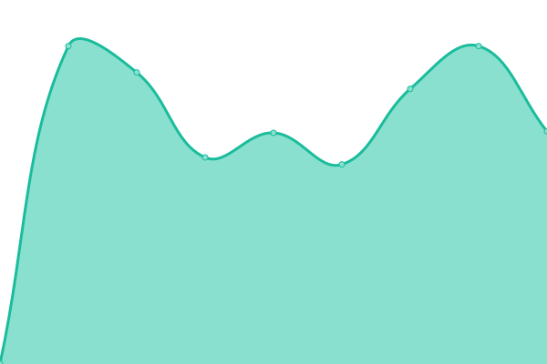
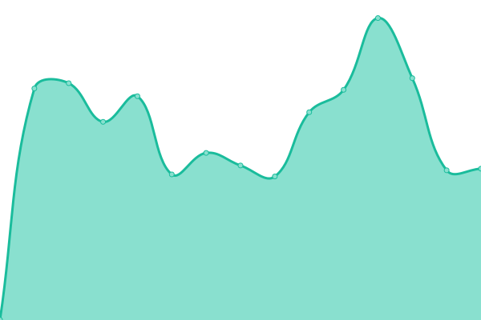
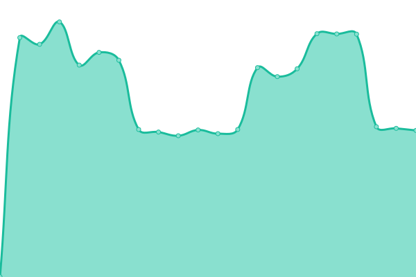
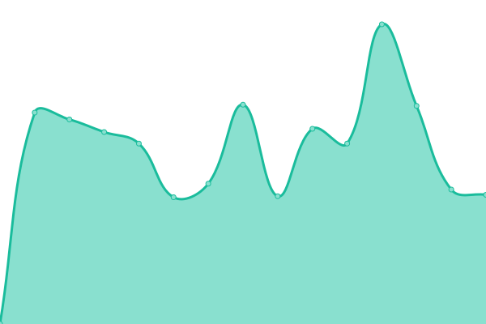
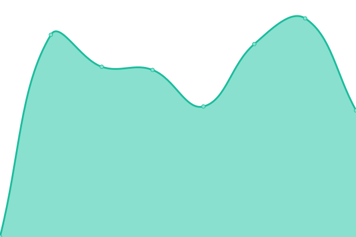
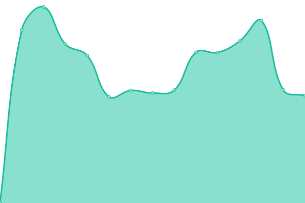
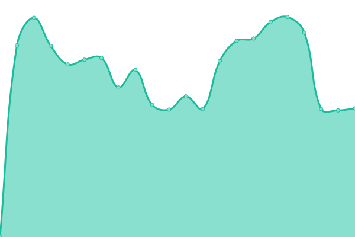
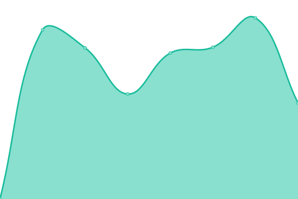

# [📈 Live Status](https://chris9091.github.io/Fleksa-Monitor): <!--live status--> **🟧 Partial outage**

This repository contains the open-source uptime monitor and status page for [chris9091](https://chris9091.github.io/Fleksa-Monitor), powered by [Upptime](https://github.com/upptime/upptime).

With [Upptime](https://upptime.js.org), you can get your own unlimited and free uptime monitor and status page, powered entirely by a GitHub repository. We use [Issues](https://github.com/chris9091/Fleksa-Monitor/issues) as incident reports, [Actions](https://github.com/chris9091/Fleksa-Monitor/actions) as uptime monitors, and [Pages](https://chris9091.github.io/Fleksa-Monitor) for the status page.

<!--start: status pages-->
<!-- This summary is generated by Upptime (https://github.com/upptime/upptime) -->
<!-- Do not edit this manually, your changes will be overwritten -->
<!-- prettier-ignore -->
| URL | Status | History | Response Time | Uptime |
| --- | ------ | ------- | ------------- | ------ |
|  [Indian Curry House Ostend](https://indiancurryhouseostend.de) | 🟩 Up | [indian-curry-house-ostend.yml](https://github.com/chris9091/Fleksa-Monitor/commits/HEAD/history/indian-curry-house-ostend.yml) | 

 891ms
     
 | 

<a href="https://chris9091.github.io/Fleksa-Monitor/history/indian-curry-house-ostend">100.00%</a>
    

|  [Taste of India Frankfurt](https://tasteofindia-ffm.de) | 🟩 Up | [taste-of-india-frankfurt.yml](https://github.com/chris9091/Fleksa-Monitor/commits/HEAD/history/taste-of-india-frankfurt.yml) | 

 843ms
     
 | 

<a href="https://chris9091.github.io/Fleksa-Monitor/history/taste-of-india-frankfurt">100.00%</a>
    

|  [Desi Adda](https://desiadda.de) | 🟩 Up | [desi-adda.yml](https://github.com/chris9091/Fleksa-Monitor/commits/HEAD/history/desi-adda.yml) | 

 930ms
     
 | 

<a href="https://chris9091.github.io/Fleksa-Monitor/history/desi-adda">100.00%</a>
    

|  [Smart Pizza Offenbach](https://smartpizzas.de) | 🟩 Up | [smart-pizza-offenbach.yml](https://github.com/chris9091/Fleksa-Monitor/commits/HEAD/history/smart-pizza-offenbach.yml) | 

 837ms
     
 | 

<a href="https://chris9091.github.io/Fleksa-Monitor/history/smart-pizza-offenbach">100.00%</a>
    

|  [Pizzeria O Sole Mio](https://bochum-osolemio.de) | 🟩 Up | [pizzeria-o-sole-mio.yml](https://github.com/chris9091/Fleksa-Monitor/commits/HEAD/history/pizzeria-o-sole-mio.yml) | 

 841ms
     
 | 

<a href="https://chris9091.github.io/Fleksa-Monitor/history/pizzeria-o-sole-mio">100.00%</a>
    

|  [Alt Bockenheim - Crazy Pizza](https://restaurantcrazypizza.de) | 🟩 Up | [alt-bockenheim-crazy-pizza.yml](https://github.com/chris9091/Fleksa-Monitor/commits/HEAD/history/alt-bockenheim-crazy-pizza.yml) | 

 857ms
     
 | 

<a href="https://chris9091.github.io/Fleksa-Monitor/history/alt-bockenheim-crazy-pizza">100.00%</a>
    

|  [Alt Bockenheim - Indian Restaurant](https://restaurantaltbockenheim.de) | 🟩 Up | [alt-bockenheim-indian-restaurant.yml](https://github.com/chris9091/Fleksa-Monitor/commits/HEAD/history/alt-bockenheim-indian-restaurant.yml) | 

 861ms
     
 | 

<a href="https://chris9091.github.io/Fleksa-Monitor/history/alt-bockenheim-indian-restaurant">100.00%</a>
    

|  [Food World](https://offenbach-foodworld.de) | 🟩 Up | [food-world.yml](https://github.com/chris9091/Fleksa-Monitor/commits/HEAD/history/food-world.yml) | 

 924ms
     
 | 

<a href="https://chris9091.github.io/Fleksa-Monitor/history/food-world">0.00%</a>
    

|  [Indian Curry House Niederrad](https://indiancurryhouseniederrad.de) | 🟩 Up | [indian-curry-house-niederrad.yml](https://github.com/chris9091/Fleksa-Monitor/commits/HEAD/history/indian-curry-house-niederrad.yml) | 

 848ms
     
 | 

<a href="https://chris9091.github.io/Fleksa-Monitor/history/indian-curry-house-niederrad">0.00%</a>
    

|  [Restaurant Mai Vien](https://maivien.fleksa.de) | 🟩 Up | [restaurant-mai-vien.yml](https://github.com/chris9091/Fleksa-Monitor/commits/HEAD/history/restaurant-mai-vien.yml) | 

 947ms
     
 | 

<a href="https://chris9091.github.io/Fleksa-Monitor/history/restaurant-mai-vien">0.00%</a>
    

|  [Restaurant Taj Mahal](https://frechentajmahal.de) | 🟩 Up | [restaurant-taj-mahal.yml](https://github.com/chris9091/Fleksa-Monitor/commits/HEAD/history/restaurant-taj-mahal.yml) | 

 848ms
     
 | 

<a href="https://chris9091.github.io/Fleksa-Monitor/history/restaurant-taj-mahal">100.00%</a>
    

|  [Indian food Company](https://indianfood-company.de) | 🟩 Up | [indian-food-company.yml](https://github.com/chris9091/Fleksa-Monitor/commits/HEAD/history/indian-food-company.yml) | 

 843ms
     
 | 

<a href="https://chris9091.github.io/Fleksa-Monitor/history/indian-food-company">0.00%</a>
    

|  [Restaurant Isha](https://isha-restaurant.de) | 🟩 Up | [restaurant-isha.yml](https://github.com/chris9091/Fleksa-Monitor/commits/HEAD/history/restaurant-isha.yml) | 

 823ms
     
 | 

<a href="https://chris9091.github.io/Fleksa-Monitor/history/restaurant-isha">0.00%</a>
    

|  [Ganesha Tandoori](https://ganeshafrankfurt.de) | 🟩 Up | [ganesha-tandoori.yml](https://github.com/chris9091/Fleksa-Monitor/commits/HEAD/history/ganesha-tandoori.yml) | 

 813ms
     
 | 

<a href="https://chris9091.github.io/Fleksa-Monitor/history/ganesha-tandoori">100.00%</a>
    

|  [Punjab Garden Tandoori](https://punjabgardenfrankfurt.de) | 🟩 Up | [punjab-garden-tandoori.yml](https://github.com/chris9091/Fleksa-Monitor/commits/HEAD/history/punjab-garden-tandoori.yml) | 

 821ms
     
 | 

<a href="https://chris9091.github.io/Fleksa-Monitor/history/punjab-garden-tandoori">0.00%</a>
    

|  [Sushi Sensei Frankfurt](https://sushisenseifrankfurt.de) | 🟩 Up | [sushi-sensei-frankfurt.yml](https://github.com/chris9091/Fleksa-Monitor/commits/HEAD/history/sushi-sensei-frankfurt.yml) | 

 887ms
     
 | 

<a href="https://chris9091.github.io/Fleksa-Monitor/history/sushi-sensei-frankfurt">0.00%</a>
    

|  [Pizzeria Bella Italia](https://pizzabellaitaliafrankfurt.de) | 🟩 Up | [pizzeria-bella-italia.yml](https://github.com/chris9091/Fleksa-Monitor/commits/HEAD/history/pizzeria-bella-italia.yml) | 

 893ms
     
 | 

<a href="https://chris9091.github.io/Fleksa-Monitor/history/pizzeria-bella-italia">0.00%</a>
    

|  [Pizza Kaiser](https://pizzakaiser-frankfurt.de) | 🟩 Up | [pizza-kaiser.yml](https://github.com/chris9091/Fleksa-Monitor/commits/HEAD/history/pizza-kaiser.yml) | 

 826ms
     
 | 

<a href="https://chris9091.github.io/Fleksa-Monitor/history/pizza-kaiser">0.00%</a>
    

|  [Delhi Tandoori](https://delhitandoori.de) | 🟩 Up | [delhi-tandoori.yml](https://github.com/chris9091/Fleksa-Monitor/commits/HEAD/history/delhi-tandoori.yml) | 

 870ms
     
 | 

<a href="https://chris9091.github.io/Fleksa-Monitor/history/delhi-tandoori">0.00%</a>
    

|  [Pizza Eck Frankfurt](https://pizza-eck-frankfurt.de) | 🟩 Up | [pizza-eck-frankfurt.yml](https://github.com/chris9091/Fleksa-Monitor/commits/HEAD/history/pizza-eck-frankfurt.yml) | 

 845ms
     
 | 

<a href="https://chris9091.github.io/Fleksa-Monitor/history/pizza-eck-frankfurt">0.00%</a>
    

|  [Pizzeria Mülheim 2](https://xn--pizzeriamlheim2-7vb.de) | 🟩 Up | [pizzeria-muelheim-2.yml](https://github.com/chris9091/Fleksa-Monitor/commits/HEAD/history/pizzeria-muelheim-2.yml) | 

 883ms
     
 | 

<a href="https://chris9091.github.io/Fleksa-Monitor/history/pizzeria-muelheim-2">0.00%</a>
    

|  [Restaurant Nidda](https://restaurant-nidda.de) | 🟩 Up | [restaurant-nidda.yml](https://github.com/chris9091/Fleksa-Monitor/commits/HEAD/history/restaurant-nidda.yml) | 

 980ms
     
 | 

<a href="https://chris9091.github.io/Fleksa-Monitor/history/restaurant-nidda">0.00%</a>
    

|  [Bali's Restaurant](https://balisrestaurant-ob.de) | 🟩 Up | [bali-s-restaurant.yml](https://github.com/chris9091/Fleksa-Monitor/commits/HEAD/history/bali-s-restaurant.yml) | 

 827ms
     
 | 

<a href="https://chris9091.github.io/Fleksa-Monitor/history/bali-s-restaurant">100.00%</a>
    

|  [Pizza Hamburger Inn](https://pizzahamburgerinn-griesheim.de) | 🟩 Up | [pizza-hamburger-inn.yml](https://github.com/chris9091/Fleksa-Monitor/commits/HEAD/history/pizza-hamburger-inn.yml) | 

 897ms
     
 | 

<a href="https://chris9091.github.io/Fleksa-Monitor/history/pizza-hamburger-inn">0.00%</a>
    

|  [Uno's Pizza](https://pizzeriaunoffm.de) | 🟩 Up | [uno-s-pizza.yml](https://github.com/chris9091/Fleksa-Monitor/commits/HEAD/history/uno-s-pizza.yml) | 

 836ms
     
 | 

<a href="https://chris9091.github.io/Fleksa-Monitor/history/uno-s-pizza">0.00%</a>
    

|  [Restaurant Ashoka Frankfurt](https://ashokafrankfurt.de) | 🟩 Up | [restaurant-ashoka-frankfurt.yml](https://github.com/chris9091/Fleksa-Monitor/commits/HEAD/history/restaurant-ashoka-frankfurt.yml) | 

 818ms
     
 | 

<a href="https://chris9091.github.io/Fleksa-Monitor/history/restaurant-ashoka-frankfurt">0.00%</a>
    

|  [Good Taste](https://goodtaste.fleksa.de) | 🟩 Up | [good-taste.yml](https://github.com/chris9091/Fleksa-Monitor/commits/HEAD/history/good-taste.yml) | 

 865ms
     
 | 

<a href="https://chris9091.github.io/Fleksa-Monitor/history/good-taste">0.00%</a>
    

|  [Restaurant Hanoi Quan](https://hanoiquanfrankfurt.de) | 🟩 Up | [restaurant-hanoi-quan.yml](https://github.com/chris9091/Fleksa-Monitor/commits/HEAD/history/restaurant-hanoi-quan.yml) | 

 807ms
     
 | 

<a href="https://chris9091.github.io/Fleksa-Monitor/history/restaurant-hanoi-quan">0.00%</a>
    

|  [Tandoori Masala Imbiss](https://tandoorimasalaimbiss.de) | 🟩 Up | [tandoori-masala-imbiss.yml](https://github.com/chris9091/Fleksa-Monitor/commits/HEAD/history/tandoori-masala-imbiss.yml) | 

 830ms
     
 | 

<a href="https://chris9091.github.io/Fleksa-Monitor/history/tandoori-masala-imbiss">0.00%</a>
    

|  [Restaurant Kashmir India](https://restaurantkashmirindia.de) | 🟩 Up | [restaurant-kashmir-india.yml](https://github.com/chris9091/Fleksa-Monitor/commits/HEAD/history/restaurant-kashmir-india.yml) | 

 835ms
     
 | 

<a href="https://chris9091.github.io/Fleksa-Monitor/history/restaurant-kashmir-india">100.00%</a>
    

|  [Bali's Restaurant](https://balisrestaurant-wesel.de) | 🟩 Up | [bali-s-restaurant.yml](https://github.com/chris9091/Fleksa-Monitor/commits/HEAD/history/bali-s-restaurant.yml) | 

 827ms
     
 | 

<a href="https://chris9091.github.io/Fleksa-Monitor/history/bali-s-restaurant">100.00%</a>
    

|  [Go eat food service](https://goeatfrankfurt.de) | 🟩 Up | [go-eat-food-service.yml](https://github.com/chris9091/Fleksa-Monitor/commits/HEAD/history/go-eat-food-service.yml) | 

 847ms
     
 | 

<a href="https://chris9091.github.io/Fleksa-Monitor/history/go-eat-food-service">0.00%</a>
    

|  [Star Pizza Deggendorf](https://star-pizza-deggendorf.de) | 🟩 Up | [star-pizza-deggendorf.yml](https://github.com/chris9091/Fleksa-Monitor/commits/HEAD/history/star-pizza-deggendorf.yml) | 

 881ms
     
 | 

<a href="https://chris9091.github.io/Fleksa-Monitor/history/star-pizza-deggendorf">0.00%</a>
    

|  [Main Curry House](https://main-curry-house.de) | 🟩 Up | [main-curry-house.yml](https://github.com/chris9091/Fleksa-Monitor/commits/HEAD/history/main-curry-house.yml) | 

 807ms
     
 | 

<a href="https://chris9091.github.io/Fleksa-Monitor/history/main-curry-house">100.00%</a>
    

|  [Pizza Haus](https://pizzahauslandau.de) | 🟩 Up | [pizza-haus.yml](https://github.com/chris9091/Fleksa-Monitor/commits/HEAD/history/pizza-haus.yml) | 

 930ms
     
 | 

<a href="https://chris9091.github.io/Fleksa-Monitor/history/pizza-haus">100.00%</a>
    

|  [Restaurant Little India](https://littleindiaalteglofsheim.de) | 🟩 Up | [restaurant-little-india.yml](https://github.com/chris9091/Fleksa-Monitor/commits/HEAD/history/restaurant-little-india.yml) | 

 858ms
     
 | 

<a href="https://chris9091.github.io/Fleksa-Monitor/history/restaurant-little-india">100.00%</a>
    

|  [Pizza Plattlinger](https://pizzaplattlinger.de) | 🟩 Up | [pizza-plattlinger.yml](https://github.com/chris9091/Fleksa-Monitor/commits/HEAD/history/pizza-plattlinger.yml) | 

 851ms
     
 | 

<a href="https://chris9091.github.io/Fleksa-Monitor/history/pizza-plattlinger">0.00%</a>
    

|  [Pizza Roma Dingolfing](https://pizzaromadingolfing.de) | 🟩 Up | [pizza-roma-dingolfing.yml](https://github.com/chris9091/Fleksa-Monitor/commits/HEAD/history/pizza-roma-dingolfing.yml) | 

 835ms
     
 | 

<a href="https://chris9091.github.io/Fleksa-Monitor/history/pizza-roma-dingolfing">0.00%</a>
    

|  [Pizza Roma Wallersdorf](https://pizzaromawallersdorf.de) | 🟩 Up | [pizza-roma-wallersdorf.yml](https://github.com/chris9091/Fleksa-Monitor/commits/HEAD/history/pizza-roma-wallersdorf.yml) | 

 873ms
     
 | 

<a href="https://chris9091.github.io/Fleksa-Monitor/history/pizza-roma-wallersdorf">0.00%</a>
    

|  [Pizza La Fontana](https://altdorflafontana.de) | 🟩 Up | [pizza-la-fontana.yml](https://github.com/chris9091/Fleksa-Monitor/commits/HEAD/history/pizza-la-fontana.yml) | 

 887ms
     
 | 

<a href="https://chris9091.github.io/Fleksa-Monitor/history/pizza-la-fontana">0.00%</a>
    

|  [Restaurant Taj Mahal](https://altdorftajmahal.de) | 🟩 Up | [restaurant-taj-mahal.yml](https://github.com/chris9091/Fleksa-Monitor/commits/HEAD/history/restaurant-taj-mahal.yml) | 

 848ms
     
 | 

<a href="https://chris9091.github.io/Fleksa-Monitor/history/restaurant-taj-mahal">100.00%</a>
    

|  [Restaurant Little India](https://littleindiafreudenstadt.de) | 🟩 Up | [restaurant-little-india.yml](https://github.com/chris9091/Fleksa-Monitor/commits/HEAD/history/restaurant-little-india.yml) | 

 858ms
     
 | 

<a href="https://chris9091.github.io/Fleksa-Monitor/history/restaurant-little-india">100.00%</a>
    

|  [Restaurant Namaste](https://namasteplattling.de) | 🟩 Up | [restaurant-namaste.yml](https://github.com/chris9091/Fleksa-Monitor/commits/HEAD/history/restaurant-namaste.yml) | 

 827ms
     
 | 

<a href="https://chris9091.github.io/Fleksa-Monitor/history/restaurant-namaste">100.00%</a>
    

|  [Star Pizzaservice](https://teisnachstarpizza.de) | 🟩 Up | [star-pizzaservice.yml](https://github.com/chris9091/Fleksa-Monitor/commits/HEAD/history/star-pizzaservice.yml) | 

 846ms
     
 | 

<a href="https://chris9091.github.io/Fleksa-Monitor/history/star-pizzaservice">0.00%</a>
    

|  [Roma Pizza Schierling](https://pizzaromaschierling.de) | 🟩 Up | [roma-pizza-schierling.yml](https://github.com/chris9091/Fleksa-Monitor/commits/HEAD/history/roma-pizza-schierling.yml) | 

 833ms
     
 | 

<a href="https://chris9091.github.io/Fleksa-Monitor/history/roma-pizza-schierling">100.00%</a>
    

|  [Restaurant Mayuri](https://mayuri-duisburg.de) | 🟩 Up | [restaurant-mayuri.yml](https://github.com/chris9091/Fleksa-Monitor/commits/HEAD/history/restaurant-mayuri.yml) | 

 865ms
     
 | 

<a href="https://chris9091.github.io/Fleksa-Monitor/history/restaurant-mayuri">100.00%</a>
    

|  [India Haus Restaurant](https://indiahaus-md.de) | 🟩 Up | [india-haus-restaurant.yml](https://github.com/chris9091/Fleksa-Monitor/commits/HEAD/history/india-haus-restaurant.yml) | 

 830ms
     
 | 

<a href="https://chris9091.github.io/Fleksa-Monitor/history/india-haus-restaurant">100.00%</a>
    

|  [Spice of India](https://spiceofindia-hattersheim.de) | 🟩 Up | [spice-of-india.yml](https://github.com/chris9091/Fleksa-Monitor/commits/HEAD/history/spice-of-india.yml) | 

 817ms
     
 | 

<a href="https://chris9091.github.io/Fleksa-Monitor/history/spice-of-india">100.00%</a>
    

|  [Restaurant Mai Pho](https://maiphokronberg.de) | 🟩 Up | [restaurant-mai-pho.yml](https://github.com/chris9091/Fleksa-Monitor/commits/HEAD/history/restaurant-mai-pho.yml) | 

 823ms
     
 | 

<a href="https://chris9091.github.io/Fleksa-Monitor/history/restaurant-mai-pho">100.00%</a>
    

|  [Pizzeria Marco Polo](https://marcopolo-aussernzell.de) | 🟩 Up | [pizzeria-marco-polo.yml](https://github.com/chris9091/Fleksa-Monitor/commits/HEAD/history/pizzeria-marco-polo.yml) | 

 851ms
     
 | 

<a href="https://chris9091.github.io/Fleksa-Monitor/history/pizzeria-marco-polo">100.00%</a>
    

|  [Restaurant Sahaj](https://restaurant-sahaj.de) | 🟩 Up | [restaurant-sahaj.yml](https://github.com/chris9091/Fleksa-Monitor/commits/HEAD/history/restaurant-sahaj.yml) | 

 992ms
     
 | 

<a href="https://chris9091.github.io/Fleksa-Monitor/history/restaurant-sahaj">100.00%</a>
    

|  [Pizza Mattu Osterhofen](https://mattupizzaosterhofen.de) | 🟩 Up | [pizza-mattu-osterhofen.yml](https://github.com/chris9091/Fleksa-Monitor/commits/HEAD/history/pizza-mattu-osterhofen.yml) | 

 851ms
     
 | 

<a href="https://chris9091.github.io/Fleksa-Monitor/history/pizza-mattu-osterhofen">100.00%</a>
    

|  [Badal's Küche](https://xn--badalskche-geb.de) | 🟩 Up | [badal-s-kueche.yml](https://github.com/chris9091/Fleksa-Monitor/commits/HEAD/history/badal-s-kueche.yml) | 

 869ms
     
 | 

<a href="https://chris9091.github.io/Fleksa-Monitor/history/badal-s-kueche">100.00%</a>
    

|  [Restaurant India Gate](https://indiagateeggenfelden.de) | 🟩 Up | [restaurant-india-gate.yml](https://github.com/chris9091/Fleksa-Monitor/commits/HEAD/history/restaurant-india-gate.yml) | 

 873ms
     
 | 

<a href="https://chris9091.github.io/Fleksa-Monitor/history/restaurant-india-gate">100.00%</a>
    

|  [Rana's Pizza und Döner Service](https://rubipizzaservice.de) | 🟩 Up | [rana-s-pizza-und-doener-service.yml](https://github.com/chris9091/Fleksa-Monitor/commits/HEAD/history/rana-s-pizza-und-doener-service.yml) | 

 779ms
     
 | 

<a href="https://chris9091.github.io/Fleksa-Monitor/history/rana-s-pizza-und-doener-service">100.00%</a>
    

|  [Taj Mahal Restaurant](https://tajmahaldeggendorf.de) | 🟩 Up | [taj-mahal-restaurant.yml](https://github.com/chris9091/Fleksa-Monitor/commits/HEAD/history/taj-mahal-restaurant.yml) | 

 875ms
     
 | 

<a href="https://chris9091.github.io/Fleksa-Monitor/history/taj-mahal-restaurant">100.00%</a>
    

|  [Pizza Heimservice Taufkirchen](https://pizzataufkirchen.de) | 🟩 Up | [pizza-heimservice-taufkirchen.yml](https://github.com/chris9091/Fleksa-Monitor/commits/HEAD/history/pizza-heimservice-taufkirchen.yml) | 

 896ms
     
 | 

<a href="https://chris9091.github.io/Fleksa-Monitor/history/pizza-heimservice-taufkirchen">100.00%</a>
    

|  [Restaurant Namaskar](https://namaskarrestaurant.de) | 🟩 Up | [restaurant-namaskar.yml](https://github.com/chris9091/Fleksa-Monitor/commits/HEAD/history/restaurant-namaskar.yml) | 

 866ms
     
 | 

<a href="https://chris9091.github.io/Fleksa-Monitor/history/restaurant-namaskar">100.00%</a>
    

|  [Restaurant Jannat](https://restaurant-jannat.de) | 🟩 Up | [restaurant-jannat.yml](https://github.com/chris9091/Fleksa-Monitor/commits/HEAD/history/restaurant-jannat.yml) | 

 833ms
     
 | 

<a href="https://chris9091.github.io/Fleksa-Monitor/history/restaurant-jannat">100.00%</a>
    

|  [Nano Pizza Heimservice](https://nanopizza.de) | 🟩 Up | [nano-pizza-heimservice.yml](https://github.com/chris9091/Fleksa-Monitor/commits/HEAD/history/nano-pizza-heimservice.yml) | 

 830ms
     
 | 

<a href="https://chris9091.github.io/Fleksa-Monitor/history/nano-pizza-heimservice">0.00%</a>
    

|  [Tar Pizzaservice](https://tarpizzaservice.de) | 🟩 Up | [tar-pizzaservice.yml](https://github.com/chris9091/Fleksa-Monitor/commits/HEAD/history/tar-pizzaservice.yml) | 

 796ms
     
 | 

<a href="https://chris9091.github.io/Fleksa-Monitor/history/tar-pizzaservice">100.00%</a>
    

|  [Pizzaservice Pizzano](https://pizzaservicepizzano.de) | 🟩 Up | [pizzaservice-pizzano.yml](https://github.com/chris9091/Fleksa-Monitor/commits/HEAD/history/pizzaservice-pizzano.yml) | 

 848ms
     
 | 

<a href="https://chris9091.github.io/Fleksa-Monitor/history/pizzaservice-pizzano">100.00%</a>
    

|  [BLITZ CITY (Pizzaservice u. Lieferservice)](https://pizzablitzcity.com) | 🟩 Up | [blitz-city-pizzaservice-u-lieferservice.yml](https://github.com/chris9091/Fleksa-Monitor/commits/HEAD/history/blitz-city-pizzaservice-u-lieferservice.yml) | 

 758ms
     
 | 

<a href="https://chris9091.github.io/Fleksa-Monitor/history/blitz-city-pizzaservice-u-lieferservice">100.00%</a>
    

|  [Indian Zaika - Indisches restaurant](https://zaikarestaurant.de) | 🟩 Up | [indian-zaika-indisches-restaurant.yml](https://github.com/chris9091/Fleksa-Monitor/commits/HEAD/history/indian-zaika-indisches-restaurant.yml) | 

 882ms
     
 | 

<a href="https://chris9091.github.io/Fleksa-Monitor/history/indian-zaika-indisches-restaurant">100.00%</a>
    

|  [Indian Tandoori Restaurant](https://indiantandoorirestaurant.de) | 🟩 Up | [indian-tandoori-restaurant.yml](https://github.com/chris9091/Fleksa-Monitor/commits/HEAD/history/indian-tandoori-restaurant.yml) | 

 853ms
     
 | 

<a href="https://chris9091.github.io/Fleksa-Monitor/history/indian-tandoori-restaurant">100.00%</a>
    

|  [Pizza Harmonie](https://pizzaharmonie.de) | 🟩 Up | [pizza-harmonie.yml](https://github.com/chris9091/Fleksa-Monitor/commits/HEAD/history/pizza-harmonie.yml) | 

 803ms
     
 | 

<a href="https://chris9091.github.io/Fleksa-Monitor/history/pizza-harmonie">100.00%</a>
    

|  [Pizza Service Schwandorf](https://pizzaschwandorf.de) | 🟩 Up | [pizza-service-schwandorf.yml](https://github.com/chris9091/Fleksa-Monitor/commits/HEAD/history/pizza-service-schwandorf.yml) | 

 871ms
     
 | 

<a href="https://chris9091.github.io/Fleksa-Monitor/history/pizza-service-schwandorf">100.00%</a>
    

|  [Harman Pizza](https://harmanpizzapliening.de) | 🟩 Up | [harman-pizza.yml](https://github.com/chris9091/Fleksa-Monitor/commits/HEAD/history/harman-pizza.yml) | 

 909ms
     
 | 

<a href="https://chris9091.github.io/Fleksa-Monitor/history/harman-pizza">100.00%</a>
    

|  [Frankfurter Schnitzelexpress](https://schnitzelheimservice.de) | 🟩 Up | [frankfurter-schnitzelexpress.yml](https://github.com/chris9091/Fleksa-Monitor/commits/HEAD/history/frankfurter-schnitzelexpress.yml) | 

 838ms
     
 | 

<a href="https://chris9091.github.io/Fleksa-Monitor/history/frankfurter-schnitzelexpress">100.00%</a>
    

|  [India Gate Sossenheim](https://indiagatefrankfurt.de) | 🟩 Up | [india-gate-sossenheim.yml](https://github.com/chris9091/Fleksa-Monitor/commits/HEAD/history/india-gate-sossenheim.yml) | 

 816ms
     
 | 

<a href="https://chris9091.github.io/Fleksa-Monitor/history/india-gate-sossenheim">100.00%</a>
    

|  [Restaurant India Gate](https://indiagatestraubing.de) | 🟩 Up | [restaurant-india-gate.yml](https://github.com/chris9091/Fleksa-Monitor/commits/HEAD/history/restaurant-india-gate.yml) | 

 873ms
     
 | 

<a href="https://chris9091.github.io/Fleksa-Monitor/history/restaurant-india-gate">100.00%</a>
    

|  [The Taj Neubiberg](https://tajamcampeon.de) | 🟩 Up | [the-taj-neubiberg.yml](https://github.com/chris9091/Fleksa-Monitor/commits/HEAD/history/the-taj-neubiberg.yml) | 

 832ms
     
 | 

<a href="https://chris9091.github.io/Fleksa-Monitor/history/the-taj-neubiberg">100.00%</a>
    

|  [Indian Tandoori Restaurant](https://restaurantindiantandoori.de) | 🟩 Up | [indian-tandoori-restaurant.yml](https://github.com/chris9091/Fleksa-Monitor/commits/HEAD/history/indian-tandoori-restaurant.yml) | 

 853ms
     
 | 

<a href="https://chris9091.github.io/Fleksa-Monitor/history/indian-tandoori-restaurant">100.00%</a>
    

|  [Cafe Restaurant Maritimes](https://maritimesroding.de) | 🟩 Up | [cafe-restaurant-maritimes.yml](https://github.com/chris9091/Fleksa-Monitor/commits/HEAD/history/cafe-restaurant-maritimes.yml) | 

 871ms
     
 | 

<a href="https://chris9091.github.io/Fleksa-Monitor/history/cafe-restaurant-maritimes">100.00%</a>
    

|  [Pizza Roma Köz](https://xn--pizzabadktzting-htb.de) | 🟩 Up | [pizza-roma-koez.yml](https://github.com/chris9091/Fleksa-Monitor/commits/HEAD/history/pizza-roma-koez.yml) | 

 923ms
     
 | 

<a href="https://chris9091.github.io/Fleksa-Monitor/history/pizza-roma-koez">100.00%</a>
    

|  [Indian Tandoori Kitchen](https://indiantandoorikitchen.de) | 🟩 Up | [indian-tandoori-kitchen.yml](https://github.com/chris9091/Fleksa-Monitor/commits/HEAD/history/indian-tandoori-kitchen.yml) | 

 886ms
     
 | 

<a href="https://chris9091.github.io/Fleksa-Monitor/history/indian-tandoori-kitchen">100.00%</a>
    

|  [Deli Tadka](https://delitadka.de) | 🟩 Up | [deli-tadka.yml](https://github.com/chris9091/Fleksa-Monitor/commits/HEAD/history/deli-tadka.yml) | 

 864ms
     
 | 

<a href="https://chris9091.github.io/Fleksa-Monitor/history/deli-tadka">100.00%</a>
    

|  [Natraj Indisches Restaurant](https://xn--natrajmnchen-jlb.de) | 🟩 Up | [natraj-indisches-restaurant.yml](https://github.com/chris9091/Fleksa-Monitor/commits/HEAD/history/natraj-indisches-restaurant.yml) | 

 923ms
     
 | 

<a href="https://chris9091.github.io/Fleksa-Monitor/history/natraj-indisches-restaurant">100.00%</a>
    

|  [Restaurant Sangam](https://xn--sangammnchen-jlb.de) | 🟩 Up | [restaurant-sangam.yml](https://github.com/chris9091/Fleksa-Monitor/commits/HEAD/history/restaurant-sangam.yml) | 

 852ms
     
 | 

<a href="https://chris9091.github.io/Fleksa-Monitor/history/restaurant-sangam">100.00%</a>
    

|  [Restaurant Suhag](https://restaurantsuhag.de) | 🟩 Up | [restaurant-suhag.yml](https://github.com/chris9091/Fleksa-Monitor/commits/HEAD/history/restaurant-suhag.yml) | 

 774ms
     
 | 

<a href="https://chris9091.github.io/Fleksa-Monitor/history/restaurant-suhag">100.00%</a>
    

|  [DHABA Schwabing West](https://xn--dhabamnchen-yhb.de) | 🟩 Up | [dhaba-schwabing-west.yml](https://github.com/chris9091/Fleksa-Monitor/commits/HEAD/history/dhaba-schwabing-west.yml) | 

 840ms
     
 | 

<a href="https://chris9091.github.io/Fleksa-Monitor/history/dhaba-schwabing-west">100.00%</a>
    

|  [Restaurant Masala](https://xn--masalamnchen-jlb.de) | 🟩 Up | [restaurant-masala.yml](https://github.com/chris9091/Fleksa-Monitor/commits/HEAD/history/restaurant-masala.yml) | 

 894ms
     
 | 

<a href="https://chris9091.github.io/Fleksa-Monitor/history/restaurant-masala">100.00%</a>
    

|  [Ristorante Pizzeria Mediterraneo](https://mediterraneokelsterbach.de) | 🟩 Up | [ristorante-pizzeria-mediterraneo.yml](https://github.com/chris9091/Fleksa-Monitor/commits/HEAD/history/ristorante-pizzeria-mediterraneo.yml) | 

 817ms
     
 | 

<a href="https://chris9091.github.io/Fleksa-Monitor/history/ristorante-pizzeria-mediterraneo">100.00%</a>
    

|  [Mini Punjab](https://minipunjab.de) | 🟩 Up | [mini-punjab.yml](https://github.com/chris9091/Fleksa-Monitor/commits/HEAD/history/mini-punjab.yml) | 

 818ms
     
 | 

<a href="https://chris9091.github.io/Fleksa-Monitor/history/mini-punjab">100.00%</a>
    

|  [Indian Restaurant Rajdarbaar Tandoori](https://xn--rajdarbaar-dsseldorf-0ec.de) | 🟩 Up | [indian-restaurant-rajdarbaar-tandoori.yml](https://github.com/chris9091/Fleksa-Monitor/commits/HEAD/history/indian-restaurant-rajdarbaar-tandoori.yml) | 

 822ms
     
 | 

<a href="https://chris9091.github.io/Fleksa-Monitor/history/indian-restaurant-rajdarbaar-tandoori">100.00%</a>
    

|  [Pizza Town Dieburg](https://pizzatown-dieburg.de) | 🟩 Up | [pizza-town-dieburg.yml](https://github.com/chris9091/Fleksa-Monitor/commits/HEAD/history/pizza-town-dieburg.yml) | 

 807ms
     
 | 

<a href="https://chris9091.github.io/Fleksa-Monitor/history/pizza-town-dieburg">100.00%</a>
    

|  [Express Pizza](https://xn--pizzaexpresshchstadt-gbc.de) | 🟩 Up | [express-pizza.yml](https://github.com/chris9091/Fleksa-Monitor/commits/HEAD/history/express-pizza.yml) | 

 901ms
     
 | 

<a href="https://chris9091.github.io/Fleksa-Monitor/history/express-pizza">100.00%</a>
    

|  [Der Pizzaservice Straubing](https://straubingpizzaservice.de) | 🟩 Up | [der-pizzaservice-straubing.yml](https://github.com/chris9091/Fleksa-Monitor/commits/HEAD/history/der-pizzaservice-straubing.yml) | 

 840ms
     
 | 

<a href="https://chris9091.github.io/Fleksa-Monitor/history/der-pizzaservice-straubing">100.00%</a>
    

|  [Restaurant Tonino](https://tonino-karlsfeld.de) | 🟩 Up | [restaurant-tonino.yml](https://github.com/chris9091/Fleksa-Monitor/commits/HEAD/history/restaurant-tonino.yml) | 

 810ms
     
 | 

<a href="https://chris9091.github.io/Fleksa-Monitor/history/restaurant-tonino">100.00%</a>
    

|  [Tadsch Mahal (Taj Mahal)](https://xn--tajmahalnrnberg-7vb.de) | 🟩 Up | [tadsch-mahal-taj-mahal.yml](https://github.com/chris9091/Fleksa-Monitor/commits/HEAD/history/tadsch-mahal-taj-mahal.yml) | 

 877ms
     
 | 

<a href="https://chris9091.github.io/Fleksa-Monitor/history/tadsch-mahal-taj-mahal">100.00%</a>
    

|  [Pizza Peperoni](https://peperonihessdorf.de) | 🟩 Up | [pizza-peperoni.yml](https://github.com/chris9091/Fleksa-Monitor/commits/HEAD/history/pizza-peperoni.yml) | 

 807ms
     
 | 

<a href="https://chris9091.github.io/Fleksa-Monitor/history/pizza-peperoni">100.00%</a>
    

|  [Döner Pizza am Ronhof](https://xn--dnerpizzaronhof-8sb.de) | 🟩 Up | [doener-pizza-am-ronhof.yml](https://github.com/chris9091/Fleksa-Monitor/commits/HEAD/history/doener-pizza-am-ronhof.yml) | 

 812ms
     
 | 

<a href="https://chris9091.github.io/Fleksa-Monitor/history/doener-pizza-am-ronhof">100.00%</a>
    

|  [Restaurant Roter Adler (Dallizza)](https://restaurantroteradler.de) | 🟩 Up | [restaurant-roter-adler-dallizza.yml](https://github.com/chris9091/Fleksa-Monitor/commits/HEAD/history/restaurant-roter-adler-dallizza.yml) | 

 809ms
     
 | 

<a href="https://chris9091.github.io/Fleksa-Monitor/history/restaurant-roter-adler-dallizza">100.00%</a>
    

|  [Deli Tadka](https://pasing.delitadka.de) | 🟩 Up | [deli-tadka.yml](https://github.com/chris9091/Fleksa-Monitor/commits/HEAD/history/deli-tadka.yml) | 

 864ms
     
 | 

<a href="https://chris9091.github.io/Fleksa-Monitor/history/deli-tadka">100.00%</a>
    

|  [Deli Tadka](https://riem.delitadka.de) | 🟩 Up | [deli-tadka.yml](https://github.com/chris9091/Fleksa-Monitor/commits/HEAD/history/deli-tadka.yml) | 

 864ms
     
 | 

<a href="https://chris9091.github.io/Fleksa-Monitor/history/deli-tadka">100.00%</a>
    

|  [Deli Tadka](https://pep.delitadka.de) | 🟩 Up | [deli-tadka.yml](https://github.com/chris9091/Fleksa-Monitor/commits/HEAD/history/deli-tadka.yml) | 

 864ms
     
 | 

<a href="https://chris9091.github.io/Fleksa-Monitor/history/deli-tadka">100.00%</a>
    

|  [Food world - Indian Kitchen](https://indiankitchenoffenbach.de) | 🟩 Up | [food-world-indian-kitchen.yml](https://github.com/chris9091/Fleksa-Monitor/commits/HEAD/history/food-world-indian-kitchen.yml) | 

 839ms
     
 | 

<a href="https://chris9091.github.io/Fleksa-Monitor/history/food-world-indian-kitchen">0.00%</a>
    

|  [Pizza Roma Passau](https://pizzaromapassau.de) | 🟩 Up | [pizza-roma-passau.yml](https://github.com/chris9091/Fleksa-Monitor/commits/HEAD/history/pizza-roma-passau.yml) | 

 825ms
     
 | 

<a href="https://chris9091.github.io/Fleksa-Monitor/history/pizza-roma-passau">0.00%</a>
    

|  [Der Pizzaservice Passau](https://pizzaservicepassau.de) | 🟩 Up | [der-pizzaservice-passau.yml](https://github.com/chris9091/Fleksa-Monitor/commits/HEAD/history/der-pizzaservice-passau.yml) | 

 798ms
     
 | 

<a href="https://chris9091.github.io/Fleksa-Monitor/history/der-pizzaservice-passau">0.00%</a>
    

|  [Restaurant Ganesha](https://xn--ganeshamnchen-3ob.de) | 🟩 Up | [restaurant-ganesha.yml](https://github.com/chris9091/Fleksa-Monitor/commits/HEAD/history/restaurant-ganesha.yml) | 

 799ms
     
 | 

<a href="https://chris9091.github.io/Fleksa-Monitor/history/restaurant-ganesha">0.00%</a>
    

|  [Pizza Bert Passau](https://pizza-bert.de) | 🟩 Up | [pizza-bert-passau.yml](https://github.com/chris9091/Fleksa-Monitor/commits/HEAD/history/pizza-bert-passau.yml) | 

 856ms
     
 | 

<a href="https://chris9091.github.io/Fleksa-Monitor/history/pizza-bert-passau">0.00%</a>
    

|  [Pizza Romana](https://romanaaidenbach.de) | 🟩 Up | [pizza-romana.yml](https://github.com/chris9091/Fleksa-Monitor/commits/HEAD/history/pizza-romana.yml) | 

 794ms
     
 | 

<a href="https://chris9091.github.io/Fleksa-Monitor/history/pizza-romana">0.00%</a>
    

|  [Nano Pizza Heimservice](https://nanopizza-ergoldsbach.de) | 🟩 Up | [nano-pizza-heimservice.yml](https://github.com/chris9091/Fleksa-Monitor/commits/HEAD/history/nano-pizza-heimservice.yml) | 

 830ms
     
 | 

<a href="https://chris9091.github.io/Fleksa-Monitor/history/nano-pizza-heimservice">0.00%</a>
    

|  [Restaurant Kohinoor](https://xn--kohinoornrnberg-7vb.de) | 🟩 Up | [restaurant-kohinoor.yml](https://github.com/chris9091/Fleksa-Monitor/commits/HEAD/history/restaurant-kohinoor.yml) | 

 815ms
     
 | 

<a href="https://chris9091.github.io/Fleksa-Monitor/history/restaurant-kohinoor">0.00%</a>
    

|  [Restaurant Shiva](https://xn--restaurantshivafrth-lbc.de) | 🟩 Up | [restaurant-shiva.yml](https://github.com/chris9091/Fleksa-Monitor/commits/HEAD/history/restaurant-shiva.yml) | 

 818ms
     
 | 

<a href="https://chris9091.github.io/Fleksa-Monitor/history/restaurant-shiva">100.00%</a>
    

|  [Maharaja Palace](https://xn--maharaja-palace-nrnberg-spc.de) | 🟩 Up | [maharaja-palace.yml](https://github.com/chris9091/Fleksa-Monitor/commits/HEAD/history/maharaja-palace.yml) | 

 806ms
     
 | 

<a href="https://chris9091.github.io/Fleksa-Monitor/history/maharaja-palace">100.00%</a>
    

|  [Restaurant Maharaja](https://maharajaroth.de) | 🟩 Up | [restaurant-maharaja.yml](https://github.com/chris9091/Fleksa-Monitor/commits/HEAD/history/restaurant-maharaja.yml) | 

 851ms
     
 | 

<a href="https://chris9091.github.io/Fleksa-Monitor/history/restaurant-maharaja">100.00%</a>
    

|  [Robertino's Nürnberger Pizzaservice](https://xn--nrnberger-pizzaservice-slc.de) | 🟩 Up | [robertino-s-nuernberger-pizzaservice.yml](https://github.com/chris9091/Fleksa-Monitor/commits/HEAD/history/robertino-s-nuernberger-pizzaservice.yml) | 

 841ms
     
 | 

<a href="https://chris9091.github.io/Fleksa-Monitor/history/robertino-s-nuernberger-pizzaservice">100.00%</a>
    

|  [Restaurant Maharaja](https://ansbach-maharaja.de) | 🟩 Up | [restaurant-maharaja.yml](https://github.com/chris9091/Fleksa-Monitor/commits/HEAD/history/restaurant-maharaja.yml) | 

 851ms
     
 | 

<a href="https://chris9091.github.io/Fleksa-Monitor/history/restaurant-maharaja">100.00%</a>
    

|  [Restaurant Gandhi](https://gandhirestaurant.de) | 🟩 Up | [restaurant-gandhi.yml](https://github.com/chris9091/Fleksa-Monitor/commits/HEAD/history/restaurant-gandhi.yml) | 

 815ms
     
 | 

<a href="https://chris9091.github.io/Fleksa-Monitor/history/restaurant-gandhi">100.00%</a>
    

|  [Taste of India](https://tasteofindiaeppertshausen.de) | 🟩 Up | [taste-of-india.yml](https://github.com/chris9091/Fleksa-Monitor/commits/HEAD/history/taste-of-india.yml) | 

 820ms
     
 | 

<a href="https://chris9091.github.io/Fleksa-Monitor/history/taste-of-india">100.00%</a>
    

|  [Restaurant Shagun](https://xn--shagunmnchen-jlb.de) | 🟩 Up | [restaurant-shagun.yml](https://github.com/chris9091/Fleksa-Monitor/commits/HEAD/history/restaurant-shagun.yml) | 

 824ms
     
 | 

<a href="https://chris9091.github.io/Fleksa-Monitor/history/restaurant-shagun">100.00%</a>
    

|  [Curry House Erlangen](https://erlangener-curryhouse.de) | 🟩 Up | [curry-house-erlangen.yml](https://github.com/chris9091/Fleksa-Monitor/commits/HEAD/history/curry-house-erlangen.yml) | 

 854ms
     
 | 

<a href="https://chris9091.github.io/Fleksa-Monitor/history/curry-house-erlangen">100.00%</a>
    

|  [Bahia Pizzaservice](https://bahiapizza-herzogenaurach.de) | 🟩 Up | [bahia-pizzaservice.yml](https://github.com/chris9091/Fleksa-Monitor/commits/HEAD/history/bahia-pizzaservice.yml) | 

 813ms
     
 | 

<a href="https://chris9091.github.io/Fleksa-Monitor/history/bahia-pizzaservice">100.00%</a>
    

|  [Pizza 2 Night Babenhausen](https://pizza2night-babenhausen.de) | 🟩 Up | [pizza-2-night-babenhausen.yml](https://github.com/chris9091/Fleksa-Monitor/commits/HEAD/history/pizza-2-night-babenhausen.yml) | 

 793ms
     
 | 

<a href="https://chris9091.github.io/Fleksa-Monitor/history/pizza-2-night-babenhausen">100.00%</a>
    

|  [Bistro serVus München](https://xn--bistroservus-mnchen-jbc.de) | 🟩 Up | [bistro-ser-vus-muenchen.yml](https://github.com/chris9091/Fleksa-Monitor/commits/HEAD/history/bistro-ser-vus-muenchen.yml) | 

 815ms
     
 | 

<a href="https://chris9091.github.io/Fleksa-Monitor/history/bistro-ser-vus-muenchen">100.00%</a>
    

|  [Optimal Pizza](https://xn--optimalpizza-mnchen-jbc.de) | 🟩 Up | [optimal-pizza.yml](https://github.com/chris9091/Fleksa-Monitor/commits/HEAD/history/optimal-pizza.yml) | 

 930ms
     
 | 

<a href="https://chris9091.github.io/Fleksa-Monitor/history/optimal-pizza">100.00%</a>
    

|  [Punjabi Pizza Putzbrunn](https://punjabipizza-putzbrunn.de) | 🟩 Up | [punjabi-pizza-putzbrunn.yml](https://github.com/chris9091/Fleksa-Monitor/commits/HEAD/history/punjabi-pizza-putzbrunn.yml) | 

 785ms
     
 | 

<a href="https://chris9091.github.io/Fleksa-Monitor/history/punjabi-pizza-putzbrunn">100.00%</a>
    

|  [Pizza Center Mering](https://pizzacenter-mering.de) | 🟩 Up | [pizza-center-mering.yml](https://github.com/chris9091/Fleksa-Monitor/commits/HEAD/history/pizza-center-mering.yml) | 

 804ms
     
 | 

<a href="https://chris9091.github.io/Fleksa-Monitor/history/pizza-center-mering">100.00%</a>
    

|  [Salaam Namaste](https://salaamnamaste-teisnach.de) | 🟩 Up | [salaam-namaste.yml](https://github.com/chris9091/Fleksa-Monitor/commits/HEAD/history/salaam-namaste.yml) | 

 816ms
     
 | 

<a href="https://chris9091.github.io/Fleksa-Monitor/history/salaam-namaste">100.00%</a>
    

|  [Pizza Center Neus칛륳(https://xn--pizzacenter-neusss-0tb.de) | 🟩 Up | [pizza-center-neusaess.yml](https://github.com/chris9091/Fleksa-Monitor/commits/HEAD/history/pizza-center-neusaess.yml) | 

 857ms
     
 | 

<a href="https://chris9091.github.io/Fleksa-Monitor/history/pizza-center-neusaess">100.00%</a>
    

|  [Indisch Curry Masala](https://currymasala-grossaitingen.de) | 🟩 Up | [indisch-curry-masala.yml](https://github.com/chris9091/Fleksa-Monitor/commits/HEAD/history/indisch-curry-masala.yml) | 

 838ms
     
 | 

<a href="https://chris9091.github.io/Fleksa-Monitor/history/indisch-curry-masala">100.00%</a>
    

|  [City Burgerhaus u. Hot Dog](https://cityburgerhaus-langerringen.de) | 🟩 Up | [city-burgerhaus-u-hot-dog.yml](https://github.com/chris9091/Fleksa-Monitor/commits/HEAD/history/city-burgerhaus-u-hot-dog.yml) | 

 838ms
     
 | 

<a href="https://chris9091.github.io/Fleksa-Monitor/history/city-burgerhaus-u-hot-dog">100.00%</a>
    

|  [Pizza Service Hiltenfingen](https://hiltenfingen-pizzaservice.de) | 🟩 Up | [pizza-service-hiltenfingen.yml](https://github.com/chris9091/Fleksa-Monitor/commits/HEAD/history/pizza-service-hiltenfingen.yml) | 

 863ms
     
 | 

<a href="https://chris9091.github.io/Fleksa-Monitor/history/pizza-service-hiltenfingen">100.00%</a>
    

|  [Pizzaservice Laguna](https://xn--pizzalaguna-neusss-0tb.de) | 🟩 Up | [pizzaservice-laguna.yml](https://github.com/chris9091/Fleksa-Monitor/commits/HEAD/history/pizzaservice-laguna.yml) | 

 800ms
     
 | 

<a href="https://chris9091.github.io/Fleksa-Monitor/history/pizzaservice-laguna">100.00%</a>
    

|  [Royal India - Indisches Restaurant](https://xn--royalindia-badwrishofen-mlc.de) | 🟩 Up | [royal-india-indisches-restaurant.yml](https://github.com/chris9091/Fleksa-Monitor/commits/HEAD/history/royal-india-indisches-restaurant.yml) | 

 846ms
     
 | 

<a href="https://chris9091.github.io/Fleksa-Monitor/history/royal-india-indisches-restaurant">100.00%</a>
    

|  [Pizza Riem - Indischer Curry](https://pizzariem-indischercurry.de) | 🟩 Up | [pizza-riem-indischer-curry.yml](https://github.com/chris9091/Fleksa-Monitor/commits/HEAD/history/pizza-riem-indischer-curry.yml) | 

 830ms
     
 | 

<a href="https://chris9091.github.io/Fleksa-Monitor/history/pizza-riem-indischer-curry">100.00%</a>
    

|  [Pizza Taxi](https://garching-pizzataxi.de) | 🟩 Up | [pizza-taxi.yml](https://github.com/chris9091/Fleksa-Monitor/commits/HEAD/history/pizza-taxi.yml) | 

 788ms
     
 | 

<a href="https://chris9091.github.io/Fleksa-Monitor/history/pizza-taxi">100.00%</a>
    

|  [Tanda Palace](https://tandaexpress.de) | 🟩 Up | [tanda-palace.yml](https://github.com/chris9091/Fleksa-Monitor/commits/HEAD/history/tanda-palace.yml) | 

 811ms
     
 | 

<a href="https://chris9091.github.io/Fleksa-Monitor/history/tanda-palace">100.00%</a>
    

|  [Amico Pizza & Burger](https://pizzaamico-oberschleissheim.de) | 🟩 Up | [amico-pizza-and-burger.yml](https://github.com/chris9091/Fleksa-Monitor/commits/HEAD/history/amico-pizza-and-burger.yml) | 

 819ms
     
 | 

<a href="https://chris9091.github.io/Fleksa-Monitor/history/amico-pizza-and-burger">100.00%</a>
    

|  [Der Pizzaservice Hohenthann](https://derpizza-hohenthann.de) | 🟩 Up | [der-pizzaservice-hohenthann.yml](https://github.com/chris9091/Fleksa-Monitor/commits/HEAD/history/der-pizzaservice-hohenthann.yml) | 

 807ms
     
 | 

<a href="https://chris9091.github.io/Fleksa-Monitor/history/der-pizzaservice-hohenthann">100.00%</a>
    

|  [Der Pizzaservice Landshut](https://derpizza-landshut.de) | 🟩 Up | [der-pizzaservice-landshut.yml](https://github.com/chris9091/Fleksa-Monitor/commits/HEAD/history/der-pizzaservice-landshut.yml) | 

 811ms
     
 | 

<a href="https://chris9091.github.io/Fleksa-Monitor/history/der-pizzaservice-landshut">100.00%</a>
    

|  [Mini Punjab Dine-in](https://minipunjab.fleksa.de) | 🟩 Up | [mini-punjab-dine-in.yml](https://github.com/chris9091/Fleksa-Monitor/commits/HEAD/history/mini-punjab-dine-in.yml) | 

 804ms
     
 | 

<a href="https://chris9091.github.io/Fleksa-Monitor/history/mini-punjab-dine-in">100.00%</a>
    

|  [Restaurant Bollywood](https://bollywood-schongau.de) | 🟩 Up | [restaurant-bollywood.yml](https://github.com/chris9091/Fleksa-Monitor/commits/HEAD/history/restaurant-bollywood.yml) | 

 805ms
     
 | 

<a href="https://chris9091.github.io/Fleksa-Monitor/history/restaurant-bollywood">100.00%</a>
    

|  [Ekam Bollywood](https://restaurant-ekam.de) | 🟩 Up | [ekam-bollywood.yml](https://github.com/chris9091/Fleksa-Monitor/commits/HEAD/history/ekam-bollywood.yml) | 

 810ms
     
 | 

<a href="https://chris9091.github.io/Fleksa-Monitor/history/ekam-bollywood">100.00%</a>
    

|  [Raj Mahal](https://rajmahal-regensburg.de) | 🟩 Up | [raj-mahal.yml](https://github.com/chris9091/Fleksa-Monitor/commits/HEAD/history/raj-mahal.yml) | 

 834ms
     
 | 

<a href="https://chris9091.github.io/Fleksa-Monitor/history/raj-mahal">100.00%</a>
    

|  [Falkenstein Namaste India](https://namaste-india-falkenstein.de) | 🟩 Up | [falkenstein-namaste-india.yml](https://github.com/chris9091/Fleksa-Monitor/commits/HEAD/history/falkenstein-namaste-india.yml) | 

 845ms
     
 | 

<a href="https://chris9091.github.io/Fleksa-Monitor/history/falkenstein-namaste-india">100.00%</a>
    

|  [City Pizza Regensburg](https://regensburg-citypizza.de) | 🟩 Up | [city-pizza-regensburg.yml](https://github.com/chris9091/Fleksa-Monitor/commits/HEAD/history/city-pizza-regensburg.yml) | 

 831ms
     
 | 

<a href="https://chris9091.github.io/Fleksa-Monitor/history/city-pizza-regensburg">100.00%</a>
    

|  [Lovely Pizza Schwarzach](https://schwarzach-lovely-pizza.de) | 🟩 Up | [lovely-pizza-schwarzach.yml](https://github.com/chris9091/Fleksa-Monitor/commits/HEAD/history/lovely-pizza-schwarzach.yml) | 

 845ms
     
 | 

<a href="https://chris9091.github.io/Fleksa-Monitor/history/lovely-pizza-schwarzach">100.00%</a>
    

|  [Singh Palace Wald](https://singh-palace-wald.de) | 🟩 Up | [singh-palace-wald.yml](https://github.com/chris9091/Fleksa-Monitor/commits/HEAD/history/singh-palace-wald.yml) | 

 829ms
     
 | 

<a href="https://chris9091.github.io/Fleksa-Monitor/history/singh-palace-wald">100.00%</a>
    

|  [Ekam Baliwood](https://restaurant-ekam-taj.de) | 🟩 Up | [ekam-baliwood.yml](https://github.com/chris9091/Fleksa-Monitor/commits/HEAD/history/ekam-baliwood.yml) | 

 853ms
     
 | 

<a href="https://chris9091.github.io/Fleksa-Monitor/history/ekam-baliwood">100.00%</a>
    

|  [Taste of India](https://xn--tasteofindia-mnchen-jbc.de) | 🟩 Up | [taste-of-india.yml](https://github.com/chris9091/Fleksa-Monitor/commits/HEAD/history/taste-of-india.yml) | 

 820ms
     
 | 

<a href="https://chris9091.github.io/Fleksa-Monitor/history/taste-of-india">100.00%</a>
    

|  [Indian Lounge](https://indianlounge-frankfurt.de) | 🟩 Up | [indian-lounge.yml](https://github.com/chris9091/Fleksa-Monitor/commits/HEAD/history/indian-lounge.yml) | 

 836ms
     
 | 

<a href="https://chris9091.github.io/Fleksa-Monitor/history/indian-lounge">100.00%</a>
    

|  [Deli Tadka](https://werksviertel-mitte.delitadka.de) | 🟩 Up | [deli-tadka.yml](https://github.com/chris9091/Fleksa-Monitor/commits/HEAD/history/deli-tadka.yml) | 

 864ms
     
 | 

<a href="https://chris9091.github.io/Fleksa-Monitor/history/deli-tadka">100.00%</a>
    

|  [Pizza Mattu](https://winzer.mattupizzaosterhofen.de) | 🟩 Up | [pizza-mattu.yml](https://github.com/chris9091/Fleksa-Monitor/commits/HEAD/history/pizza-mattu.yml) | 

 858ms
     
 | 

<a href="https://chris9091.github.io/Fleksa-Monitor/history/pizza-mattu">100.00%</a>
    

|  [Pizzeria and Grill Suraj](https://pizzeriasuraj.de) | 🟩 Up | [pizzeria-and-grill-suraj.yml](https://github.com/chris9091/Fleksa-Monitor/commits/HEAD/history/pizzeria-and-grill-suraj.yml) | 

 817ms
     
 | 

<a href="https://chris9091.github.io/Fleksa-Monitor/history/pizzeria-and-grill-suraj">100.00%</a>
    

|  [Pizza Roma Markt Schwaben](https://roma-marktschwaben.de) | 🟩 Up | [pizza-roma-markt-schwaben.yml](https://github.com/chris9091/Fleksa-Monitor/commits/HEAD/history/pizza-roma-markt-schwaben.yml) | 

 812ms
     
 | 

<a href="https://chris9091.github.io/Fleksa-Monitor/history/pizza-roma-markt-schwaben">100.00%</a>
    

|  [Texas Pizzaservice](https://texas-pizzaservice.de) | 🟩 Up | [texas-pizzaservice.yml](https://github.com/chris9091/Fleksa-Monitor/commits/HEAD/history/texas-pizzaservice.yml) | 

 818ms
     
 | 

<a href="https://chris9091.github.io/Fleksa-Monitor/history/texas-pizzaservice">100.00%</a>
    

|  [Spice of India](https://stuttgart-spiceofindia.de) | 🟩 Up | [spice-of-india.yml](https://github.com/chris9091/Fleksa-Monitor/commits/HEAD/history/spice-of-india.yml) | 

 817ms
     
 | 

<a href="https://chris9091.github.io/Fleksa-Monitor/history/spice-of-india">100.00%</a>
    

|  [Punjabi Dhaba](https://punjabidhaba-bb.de) | 🟩 Up | [punjabi-dhaba.yml](https://github.com/chris9091/Fleksa-Monitor/commits/HEAD/history/punjabi-dhaba.yml) | 

 822ms
     
 | 

<a href="https://chris9091.github.io/Fleksa-Monitor/history/punjabi-dhaba">100.00%</a>
    

|  [Punjabi Dhaba](https://dhabapunjabi.de) | 🟩 Up | [punjabi-dhaba.yml](https://github.com/chris9091/Fleksa-Monitor/commits/HEAD/history/punjabi-dhaba.yml) | 

 822ms
     
 | 

<a href="https://chris9091.github.io/Fleksa-Monitor/history/punjabi-dhaba">100.00%</a>
    

|  [Pizza Service Laupheim](https://laupheim-pizza.de) | 🟩 Up | [pizza-service-laupheim.yml](https://github.com/chris9091/Fleksa-Monitor/commits/HEAD/history/pizza-service-laupheim.yml) | 

 812ms
     
 | 

<a href="https://chris9091.github.io/Fleksa-Monitor/history/pizza-service-laupheim">100.00%</a>
    

|  [Bella Pizzaservice](https://unterensingen-bellapizza.de) | 🟩 Up | [bella-pizzaservice.yml](https://github.com/chris9091/Fleksa-Monitor/commits/HEAD/history/bella-pizzaservice.yml) | 

 824ms
     
 | 

<a href="https://chris9091.github.io/Fleksa-Monitor/history/bella-pizzaservice">100.00%</a>
    

|  [Punjab Restaurant Laupheim](https://laupheim-punjab.de) | 🟩 Up | [punjab-restaurant-laupheim.yml](https://github.com/chris9091/Fleksa-Monitor/commits/HEAD/history/punjab-restaurant-laupheim.yml) | 

 827ms
     
 | 

<a href="https://chris9091.github.io/Fleksa-Monitor/history/punjab-restaurant-laupheim">100.00%</a>
    

|  [Broadway Food Plaza](https://broadway-foodplaza.de) | 🟩 Up | [broadway-food-plaza.yml](https://github.com/chris9091/Fleksa-Monitor/commits/HEAD/history/broadway-food-plaza.yml) | 

 809ms
     
 | 

<a href="https://chris9091.github.io/Fleksa-Monitor/history/broadway-food-plaza">100.00%</a>
    

|  [Delhi Gate - The taste of India](https://akkisindisch-foodcorner.de) | 🟩 Up | [delhi-gate-the-taste-of-india.yml](https://github.com/chris9091/Fleksa-Monitor/commits/HEAD/history/delhi-gate-the-taste-of-india.yml) | 

 809ms
     
 | 

<a href="https://chris9091.github.io/Fleksa-Monitor/history/delhi-gate-the-taste-of-india">100.00%</a>
    

|  [Pizzeria Lissabon](https://pizzerialissabon.de) | 🟩 Up | [pizzeria-lissabon.yml](https://github.com/chris9091/Fleksa-Monitor/commits/HEAD/history/pizzeria-lissabon.yml) | 

 804ms
     
 | 

<a href="https://chris9091.github.io/Fleksa-Monitor/history/pizzeria-lissabon">100.00%</a>
    

|  [Sunny's Pizza Essen](https://sunnyspizza-essen.de) | 🟩 Up | [sunny-s-pizza-essen.yml](https://github.com/chris9091/Fleksa-Monitor/commits/HEAD/history/sunny-s-pizza-essen.yml) | 

 819ms
     
 | 

<a href="https://chris9091.github.io/Fleksa-Monitor/history/sunny-s-pizza-essen">100.00%</a>
    

|  [Restaurant Kashmir India](https://kashmir-india-mh.de) | 🟩 Up | [restaurant-kashmir-india.yml](https://github.com/chris9091/Fleksa-Monitor/commits/HEAD/history/restaurant-kashmir-india.yml) | 

 835ms
     
 | 

<a href="https://chris9091.github.io/Fleksa-Monitor/history/restaurant-kashmir-india">100.00%</a>
    

|  [Dhaba Münchner Freiheit](https://xn--dhaba-mnchen-jlb.de) | 🟩 Up | [dhaba-muenchner-freiheit.yml](https://github.com/chris9091/Fleksa-Monitor/commits/HEAD/history/dhaba-muenchner-freiheit.yml) | 

 794ms
     
 | 

<a href="https://chris9091.github.io/Fleksa-Monitor/history/dhaba-muenchner-freiheit">100.00%</a>
    

|  [Dhaba Restaurant](https://dhaba-landshut.de) | 🟩 Up | [dhaba-restaurant.yml](https://github.com/chris9091/Fleksa-Monitor/commits/HEAD/history/dhaba-restaurant.yml) | 

 817ms
     
 | 

<a href="https://chris9091.github.io/Fleksa-Monitor/history/dhaba-restaurant">100.00%</a>
    

|  [White Elefant Offenbach](https://offenbach-white-elefant.de) | 🟩 Up | [white-elefant-offenbach.yml](https://github.com/chris9091/Fleksa-Monitor/commits/HEAD/history/white-elefant-offenbach.yml) | 

 813ms
     
 | 

<a href="https://chris9091.github.io/Fleksa-Monitor/history/white-elefant-offenbach">100.00%</a>
    

|  [Pizzeria Pomodori](https://pizza-pomodori.de) | 🟩 Up | [pizzeria-pomodori.yml](https://github.com/chris9091/Fleksa-Monitor/commits/HEAD/history/pizzeria-pomodori.yml) | 

 788ms
     
 | 

<a href="https://chris9091.github.io/Fleksa-Monitor/history/pizzeria-pomodori">100.00%</a>
    

|  [Little Ente](https://offenbach-little-ente.de) | 🟩 Up | [little-ente.yml](https://github.com/chris9091/Fleksa-Monitor/commits/HEAD/history/little-ente.yml) | 

 873ms
     
 | 

<a href="https://chris9091.github.io/Fleksa-Monitor/history/little-ente">100.00%</a>
    

|  [Namaste India](https://namasteindia-indersdorf.de) | 🟩 Up | [namaste-india.yml](https://github.com/chris9091/Fleksa-Monitor/commits/HEAD/history/namaste-india.yml) | 

 803ms
     
 | 

<a href="https://chris9091.github.io/Fleksa-Monitor/history/namaste-india">100.00%</a>
    

|  [Restaurant Punjab Haus](https://xn--punjabhaus-neusss-4qb.de) | 🟩 Up | [restaurant-punjab-haus.yml](https://github.com/chris9091/Fleksa-Monitor/commits/HEAD/history/restaurant-punjab-haus.yml) | 

 823ms
     
 | 

<a href="https://chris9091.github.io/Fleksa-Monitor/history/restaurant-punjab-haus">100.00%</a>
    

|  [Tanda Palace](https://tandapalace-landshut.de) | 🟩 Up | [tanda-palace.yml](https://github.com/chris9091/Fleksa-Monitor/commits/HEAD/history/tanda-palace.yml) | 

 811ms
     
 | 

<a href="https://chris9091.github.io/Fleksa-Monitor/history/tanda-palace">100.00%</a>
    

|  [Restaurant Royal India](https://royalindia-biberach.de) | 🟩 Up | [restaurant-royal-india.yml](https://github.com/chris9091/Fleksa-Monitor/commits/HEAD/history/restaurant-royal-india.yml) | 

 829ms
     
 | 

<a href="https://chris9091.github.io/Fleksa-Monitor/history/restaurant-royal-india">100.00%</a>
    

|  [Restaurant Royal India](https://royalindia-badwurzach.de) | 🟩 Up | [restaurant-royal-india.yml](https://github.com/chris9091/Fleksa-Monitor/commits/HEAD/history/restaurant-royal-india.yml) | 

 829ms
     
 | 

<a href="https://chris9091.github.io/Fleksa-Monitor/history/restaurant-royal-india">100.00%</a>
    

|  [BC Restaurant und Lieferservice](https://bcrestaurant-biberach.de) | 🟩 Up | [bc-restaurant-und-lieferservice.yml](https://github.com/chris9091/Fleksa-Monitor/commits/HEAD/history/bc-restaurant-und-lieferservice.yml) | 

 821ms
     
 | 

<a href="https://chris9091.github.io/Fleksa-Monitor/history/bc-restaurant-und-lieferservice">100.00%</a>
    

|  [Restaurant Royal India](https://royalindia-ehingen.de) | 🟩 Up | [restaurant-royal-india.yml](https://github.com/chris9091/Fleksa-Monitor/commits/HEAD/history/restaurant-royal-india.yml) | 

 829ms
     
 | 

<a href="https://chris9091.github.io/Fleksa-Monitor/history/restaurant-royal-india">100.00%</a>
    

|  [Pizza Express Picnic](https://pizzaexpress-picnic.de) | 🟩 Up | [pizza-express-picnic.yml](https://github.com/chris9091/Fleksa-Monitor/commits/HEAD/history/pizza-express-picnic.yml) | 

 931ms
     
 | 

<a href="https://chris9091.github.io/Fleksa-Monitor/history/pizza-express-picnic">100.00%</a>
    

|  [Namaste Immenstaad](https://namasteimmenstaad.de) | 🟩 Up | [namaste-immenstaad.yml](https://github.com/chris9091/Fleksa-Monitor/commits/HEAD/history/namaste-immenstaad.yml) | 

 816ms
     
 | 

<a href="https://chris9091.github.io/Fleksa-Monitor/history/namaste-immenstaad">100.00%</a>
    

|  [Schwäbische Pizza](https://xn--schwbischepizza-3kb.de) | 🟩 Up | [schwaebische-pizza.yml](https://github.com/chris9091/Fleksa-Monitor/commits/HEAD/history/schwaebische-pizza.yml) | 

 851ms
     
 | 

<a href="https://chris9091.github.io/Fleksa-Monitor/history/schwaebische-pizza">100.00%</a>
    

|  [The Taj München](https://xn--thetajmnchen-jlb.de) | 🟩 Up | [the-taj-muenchen.yml](https://github.com/chris9091/Fleksa-Monitor/commits/HEAD/history/the-taj-muenchen.yml) | 

 794ms
     
 | 

<a href="https://chris9091.github.io/Fleksa-Monitor/history/the-taj-muenchen">100.00%</a>
    

|  [Restaurant Royal India](https://royalindia-memmingen.de) | 🟩 Up | [restaurant-royal-india.yml](https://github.com/chris9091/Fleksa-Monitor/commits/HEAD/history/restaurant-royal-india.yml) | 

 829ms
     
 | 

<a href="https://chris9091.github.io/Fleksa-Monitor/history/restaurant-royal-india">100.00%</a>
    

|  [Restaurant Sagar Potsdam](https://sagarpotsdam.de) | 🟩 Up | [restaurant-sagar-potsdam.yml](https://github.com/chris9091/Fleksa-Monitor/commits/HEAD/history/restaurant-sagar-potsdam.yml) | 

 826ms
     
 | 

<a href="https://chris9091.github.io/Fleksa-Monitor/history/restaurant-sagar-potsdam">100.00%</a>
    

|  [Pei른nberger Pizza service](https://peissenberger-pizzaservice.de) | 🟩 Up | [peissenberger-pizza-service.yml](https://github.com/chris9091/Fleksa-Monitor/commits/HEAD/history/peissenberger-pizza-service.yml) | 

 818ms
     
 | 

<a href="https://chris9091.github.io/Fleksa-Monitor/history/peissenberger-pizza-service">100.00%</a>
    

|  [Goa Restaurant](https://goarestaurant-weilheim.de) | 🟩 Up | [goa-restaurant.yml](https://github.com/chris9091/Fleksa-Monitor/commits/HEAD/history/goa-restaurant.yml) | 

 848ms
     
 | 

<a href="https://chris9091.github.io/Fleksa-Monitor/history/goa-restaurant">100.00%</a>
    

|  [Pizza Corner Straubing](https://pizzacorner-straubing.de) | 🟩 Up | [pizza-corner-straubing.yml](https://github.com/chris9091/Fleksa-Monitor/commits/HEAD/history/pizza-corner-straubing.yml) | 

 848ms
     
 | 

<a href="https://chris9091.github.io/Fleksa-Monitor/history/pizza-corner-straubing">100.00%</a>
    

|  [Pizza Express Schongau](https://pizzaexpress-schongau.de) | 🟩 Up | [pizza-express-schongau.yml](https://github.com/chris9091/Fleksa-Monitor/commits/HEAD/history/pizza-express-schongau.yml) | 

 826ms
     
 | 

<a href="https://chris9091.github.io/Fleksa-Monitor/history/pizza-express-schongau">100.00%</a>
    

|  [Bella Pizzaservice](https://bellapizza-westerheim.de) | 🟩 Up | [bella-pizzaservice.yml](https://github.com/chris9091/Fleksa-Monitor/commits/HEAD/history/bella-pizzaservice.yml) | 

 824ms
     
 | 

<a href="https://chris9091.github.io/Fleksa-Monitor/history/bella-pizzaservice">100.00%</a>
    

|  [Pizzeria Gondola](https://pizzeria-gondola.de) | 🟩 Up | [pizzeria-gondola.yml](https://github.com/chris9091/Fleksa-Monitor/commits/HEAD/history/pizzeria-gondola.yml) | 

 818ms
     
 | 

<a href="https://chris9091.github.io/Fleksa-Monitor/history/pizzeria-gondola">100.00%</a>
    

|  [Restaurant India House](https://stuttgart-indiahouse.de) | 🟩 Up | [restaurant-india-house.yml](https://github.com/chris9091/Fleksa-Monitor/commits/HEAD/history/restaurant-india-house.yml) | 

 804ms
     
 | 

<a href="https://chris9091.github.io/Fleksa-Monitor/history/restaurant-india-house">100.00%</a>
    

|  [Chilli Corner indisches Restaurant](https://chillicorner.de) | 🟩 Up | [chilli-corner-indisches-restaurant.yml](https://github.com/chris9091/Fleksa-Monitor/commits/HEAD/history/chilli-corner-indisches-restaurant.yml) | 

 816ms
     
 | 

<a href="https://chris9091.github.io/Fleksa-Monitor/history/chilli-corner-indisches-restaurant">100.00%</a>
    

|  [Giovanni Pizzeria - Lieferservice](https://pizzaservice-giovanni.de) | 🟩 Up | [giovanni-pizzeria-lieferservice.yml](https://github.com/chris9091/Fleksa-Monitor/commits/HEAD/history/giovanni-pizzeria-lieferservice.yml) | 

 844ms
     
 | 

<a href="https://chris9091.github.io/Fleksa-Monitor/history/giovanni-pizzeria-lieferservice">100.00%</a>
    

|  [Satchi Pizza Pascara](https://satchipizzapascara.de) | 🟩 Up | [satchi-pizza-pascara.yml](https://github.com/chris9091/Fleksa-Monitor/commits/HEAD/history/satchi-pizza-pascara.yml) | 

 806ms
     
 | 

<a href="https://chris9091.github.io/Fleksa-Monitor/history/satchi-pizza-pascara">100.00%</a>
    

|  [Pizza Pal](https://palpizzaservice.de) | 🟩 Up | [pizza-pal.yml](https://github.com/chris9091/Fleksa-Monitor/commits/HEAD/history/pizza-pal.yml) | 

 815ms
     
 | 

<a href="https://chris9091.github.io/Fleksa-Monitor/history/pizza-pal">100.00%</a>
    

|  [Satchi Versatchi](https://versatchi.satchipizzapascara.de) | 🟩 Up | [satchi-versatchi.yml](https://github.com/chris9091/Fleksa-Monitor/commits/HEAD/history/satchi-versatchi.yml) | 

 890ms
     
 | 

<a href="https://chris9091.github.io/Fleksa-Monitor/history/satchi-versatchi">100.00%</a>
    

|  [Maharaja Palace](https://maharajapalast.de) | 🟩 Up | [maharaja-palace.yml](https://github.com/chris9091/Fleksa-Monitor/commits/HEAD/history/maharaja-palace.yml) | 

 806ms
     
 | 

<a href="https://chris9091.github.io/Fleksa-Monitor/history/maharaja-palace">100.00%</a>
    

|  [Indian Kitchen Munich](https://indiankitchenmunich.de) | 🟩 Up | [indian-kitchen-munich.yml](https://github.com/chris9091/Fleksa-Monitor/commits/HEAD/history/indian-kitchen-munich.yml) | 

 809ms
     
 | 

<a href="https://chris9091.github.io/Fleksa-Monitor/history/indian-kitchen-munich">100.00%</a>
    

|  [Weinheim Pizzaservice](https://weinheim-pizza.de) | 🟩 Up | [weinheim-pizzaservice.yml](https://github.com/chris9091/Fleksa-Monitor/commits/HEAD/history/weinheim-pizzaservice.yml) | 

 807ms
     
 | 

<a href="https://chris9091.github.io/Fleksa-Monitor/history/weinheim-pizzaservice">100.00%</a>
    

|  [Pizzeria Italia](https://pizzeriaitalia-weinheim.de) | 🟩 Up | [pizzeria-italia.yml](https://github.com/chris9091/Fleksa-Monitor/commits/HEAD/history/pizzeria-italia.yml) | 

 805ms
     
 | 

<a href="https://chris9091.github.io/Fleksa-Monitor/history/pizzeria-italia">100.00%</a>
    

|  [Pizzeria Mamma Mia](https://pizzamamma-mia.de) | 🟩 Up | [pizzeria-mamma-mia.yml](https://github.com/chris9091/Fleksa-Monitor/commits/HEAD/history/pizzeria-mamma-mia.yml) | 

 809ms
     
 | 

<a href="https://chris9091.github.io/Fleksa-Monitor/history/pizzeria-mamma-mia">100.00%</a>
    

|  [Merry Pizza-Service](https://merywok-pizza.de) | 🟩 Up | [merry-pizza-service.yml](https://github.com/chris9091/Fleksa-Monitor/commits/HEAD/history/merry-pizza-service.yml) | 

 814ms
     
 | 

<a href="https://chris9091.github.io/Fleksa-Monitor/history/merry-pizza-service">100.00%</a>
    

|  [Da Laura Augsburg](https://dalaurapizza.de) | 🟩 Up | [da-laura-augsburg.yml](https://github.com/chris9091/Fleksa-Monitor/commits/HEAD/history/da-laura-augsburg.yml) | 

 842ms
     
 | 

<a href="https://chris9091.github.io/Fleksa-Monitor/history/da-laura-augsburg">100.00%</a>
    

|  [Mama Mia Pizzeria](https://mamamiahutthurm.de) | 🟩 Up | [mama-mia-pizzeria.yml](https://github.com/chris9091/Fleksa-Monitor/commits/HEAD/history/mama-mia-pizzeria.yml) | 

 802ms
     
 | 

<a href="https://chris9091.github.io/Fleksa-Monitor/history/mama-mia-pizzeria">100.00%</a>
    

|  [Lucky's Bistro](https://luckysbistro.de) | 🟩 Up | [lucky-s-bistro.yml](https://github.com/chris9091/Fleksa-Monitor/commits/HEAD/history/lucky-s-bistro.yml) | 

 841ms
     
 | 

<a href="https://chris9091.github.io/Fleksa-Monitor/history/lucky-s-bistro">100.00%</a>
    

|  [Galaxyfood Lieferservice](https://galaxyfood-lieferservice.de) | 🟩 Up | [galaxyfood-lieferservice.yml](https://github.com/chris9091/Fleksa-Monitor/commits/HEAD/history/galaxyfood-lieferservice.yml) | 

 837ms
     
 | 

<a href="https://chris9091.github.io/Fleksa-Monitor/history/galaxyfood-lieferservice">100.00%</a>
    

|  [Seth and Fathe](https://sethfathe-berlin.de) | 🟩 Up | [seth-and-fathe.yml](https://github.com/chris9091/Fleksa-Monitor/commits/HEAD/history/seth-and-fathe.yml) | 

 830ms
     
 | 

<a href="https://chris9091.github.io/Fleksa-Monitor/history/seth-and-fathe">100.00%</a>
    

|  [Pizza u. Pasta Vilshofen](https://pizzapastavilshofen.de) | 🟩 Up | [pizza-u-pasta-vilshofen.yml](https://github.com/chris9091/Fleksa-Monitor/commits/HEAD/history/pizza-u-pasta-vilshofen.yml) | 

 819ms
     
 | 

<a href="https://chris9091.github.io/Fleksa-Monitor/history/pizza-u-pasta-vilshofen">100.00%</a>
    

|  [Offenbacher Essensdienst](https://offenbachessen.de) | 🟩 Up | [offenbacher-essensdienst.yml](https://github.com/chris9091/Fleksa-Monitor/commits/HEAD/history/offenbacher-essensdienst.yml) | 

 895ms
     
 | 

<a href="https://chris9091.github.io/Fleksa-Monitor/history/offenbacher-essensdienst">100.00%</a>
    

|  [Ebinger Pizzaservice](https://ebingerpizzaservice.de) | 🟩 Up | [ebinger-pizzaservice.yml](https://github.com/chris9091/Fleksa-Monitor/commits/HEAD/history/ebinger-pizzaservice.yml) | 

 785ms
     
 | 

<a href="https://chris9091.github.io/Fleksa-Monitor/history/ebinger-pizzaservice">100.00%</a>
    

|  [Bitzer Pizzaservice](https://bitzerpizzaservice.de) | 🟩 Up | [bitzer-pizzaservice.yml](https://github.com/chris9091/Fleksa-Monitor/commits/HEAD/history/bitzer-pizzaservice.yml) | 

 805ms
     
 | 

<a href="https://chris9091.github.io/Fleksa-Monitor/history/bitzer-pizzaservice">100.00%</a>
    

|  [Ganesha Palace](https://albstadt-ganeshapalace.de) | 🟩 Up | [ganesha-palace.yml](https://github.com/chris9091/Fleksa-Monitor/commits/HEAD/history/ganesha-palace.yml) | 

 813ms
     
 | 

<a href="https://chris9091.github.io/Fleksa-Monitor/history/ganesha-palace">100.00%</a>
    

|  [Mr. Singh Balingen](https://mrsinghbalingen.de) | 🟩 Up | [mr-singh-balingen.yml](https://github.com/chris9091/Fleksa-Monitor/commits/HEAD/history/mr-singh-balingen.yml) | 

 853ms
     
 | 

<a href="https://chris9091.github.io/Fleksa-Monitor/history/mr-singh-balingen">100.00%</a>
    

|  [Krone Restaurant](https://kronebalingen.de) | 🟩 Up | [krone-restaurant.yml](https://github.com/chris9091/Fleksa-Monitor/commits/HEAD/history/krone-restaurant.yml) | 

 828ms
     
 | 

<a href="https://chris9091.github.io/Fleksa-Monitor/history/krone-restaurant">100.00%</a>
    

|  [Geislinger Pizzaservice](https://geislinger-pizzaservice.de) | 🟩 Up | [geislinger-pizzaservice.yml](https://github.com/chris9091/Fleksa-Monitor/commits/HEAD/history/geislinger-pizzaservice.yml) | 

 840ms
     
 | 

<a href="https://chris9091.github.io/Fleksa-Monitor/history/geislinger-pizzaservice">100.00%</a>
    

|  [Eutinger Pizzaservice](https://pizzaservice-eutinger.de) | 🟩 Up | [eutinger-pizzaservice.yml](https://github.com/chris9091/Fleksa-Monitor/commits/HEAD/history/eutinger-pizzaservice.yml) | 

 791ms
     
 | 

<a href="https://chris9091.github.io/Fleksa-Monitor/history/eutinger-pizzaservice">100.00%</a>
    

|  [Amigo Pizzaservice](https://villingen-amigo.de) | 🟩 Up | [amigo-pizzaservice.yml](https://github.com/chris9091/Fleksa-Monitor/commits/HEAD/history/amigo-pizzaservice.yml) | 

 823ms
     
 | 

<a href="https://chris9091.github.io/Fleksa-Monitor/history/amigo-pizzaservice">100.00%</a>
    

|  [Taste of Tandoori Hattersheim](https://tasteoftandoorihattersheim.de) | 🟩 Up | [taste-of-tandoori-hattersheim.yml](https://github.com/chris9091/Fleksa-Monitor/commits/HEAD/history/taste-of-tandoori-hattersheim.yml) | 

 818ms
     
 | 

<a href="https://chris9091.github.io/Fleksa-Monitor/history/taste-of-tandoori-hattersheim">100.00%</a>
    

|  [Pizza Express Lörrach](https://xn--pizzalrrach-wfb.de) | 🟩 Up | [pizza-express-loerrach.yml](https://github.com/chris9091/Fleksa-Monitor/commits/HEAD/history/pizza-express-loerrach.yml) | 

 801ms
     
 | 

<a href="https://chris9091.github.io/Fleksa-Monitor/history/pizza-express-loerrach">100.00%</a>
    

|  [Restaurant A Casa Mia](https://pizzeria-acasamia.de) | 🟩 Up | [restaurant-a-casa-mia.yml](https://github.com/chris9091/Fleksa-Monitor/commits/HEAD/history/restaurant-a-casa-mia.yml) | 

 832ms
     
 | 

<a href="https://chris9091.github.io/Fleksa-Monitor/history/restaurant-a-casa-mia">100.00%</a>
    

|  [Restaurant Haweli](https://rheinfelden-haweli.de) | 🟩 Up | [restaurant-haweli.yml](https://github.com/chris9091/Fleksa-Monitor/commits/HEAD/history/restaurant-haweli.yml) | 

 876ms
     
 | 

<a href="https://chris9091.github.io/Fleksa-Monitor/history/restaurant-haweli">100.00%</a>
    

|  [Pizza Lucky Express](https://pizza-luckyexpress.de) | 🟩 Up | [pizza-lucky-express.yml](https://github.com/chris9091/Fleksa-Monitor/commits/HEAD/history/pizza-lucky-express.yml) | 

 825ms
     
 | 

<a href="https://chris9091.github.io/Fleksa-Monitor/history/pizza-lucky-express">100.00%</a>
    

|  [Pizza Fly Express Schallstadt](https://pizza-flyexpress.de) | 🟩 Up | [pizza-fly-express-schallstadt.yml](https://github.com/chris9091/Fleksa-Monitor/commits/HEAD/history/pizza-fly-express-schallstadt.yml) | 

 781ms
     
 | 

<a href="https://chris9091.github.io/Fleksa-Monitor/history/pizza-fly-express-schallstadt">100.00%</a>
    

|  [Food Palace Donaueschingen](https://donaueschingen-foodpalace.de) | 🟩 Up | [food-palace-donaueschingen.yml](https://github.com/chris9091/Fleksa-Monitor/commits/HEAD/history/food-palace-donaueschingen.yml) | 

 802ms
     
 | 

<a href="https://chris9091.github.io/Fleksa-Monitor/history/food-palace-donaueschingen">100.00%</a>
    

|  [Milano Pizza Express Weil](https://xn--milanopizzalrrach-b0b.de) | 🟩 Up | [milano-pizza-express-weil.yml](https://github.com/chris9091/Fleksa-Monitor/commits/HEAD/history/milano-pizza-express-weil.yml) | 

 819ms
     
 | 

<a href="https://chris9091.github.io/Fleksa-Monitor/history/milano-pizza-express-weil">100.00%</a>
    

|  [Milano Pizza Express](https://milanopizzaloerrach.de) | 🟩 Up | [milano-pizza-express.yml](https://github.com/chris9091/Fleksa-Monitor/commits/HEAD/history/milano-pizza-express.yml) | 

 799ms
     
 | 

<a href="https://chris9091.github.io/Fleksa-Monitor/history/milano-pizza-express">100.00%</a>
    

|  [Mini Punjabi Dhaba](https://mini-punjabidhaba.de) | 🟩 Up | [mini-punjabi-dhaba.yml](https://github.com/chris9091/Fleksa-Monitor/commits/HEAD/history/mini-punjabi-dhaba.yml) | 

 820ms
     
 | 

<a href="https://chris9091.github.io/Fleksa-Monitor/history/mini-punjabi-dhaba">100.00%</a>
    

|  [Gasthaus Rose](https://rosegasthaus.de) | 🟩 Up | [gasthaus-rose.yml](https://github.com/chris9091/Fleksa-Monitor/commits/HEAD/history/gasthaus-rose.yml) | 

 828ms
     
 | 

<a href="https://chris9091.github.io/Fleksa-Monitor/history/gasthaus-rose">100.00%</a>
    

|  [Pizzaservice Taj Mahal](https://tajpizzaservice.de) | 🟩 Up | [pizzaservice-taj-mahal.yml](https://github.com/chris9091/Fleksa-Monitor/commits/HEAD/history/pizzaservice-taj-mahal.yml) | 

 805ms
     
 | 

<a href="https://chris9091.github.io/Fleksa-Monitor/history/pizzaservice-taj-mahal">100.00%</a>
    

|  [Restaurant Taj Mahal](https://allensbach-tajmahal.de) | 🟩 Up | [restaurant-taj-mahal.yml](https://github.com/chris9091/Fleksa-Monitor/commits/HEAD/history/restaurant-taj-mahal.yml) | 

 848ms
     
 | 

<a href="https://chris9091.github.io/Fleksa-Monitor/history/restaurant-taj-mahal">100.00%</a>
    

|  [Top One Burger u. Pizza](https://pizzaburgerkonstanz.de) | 🟩 Up | [top-one-burger-u-pizza.yml](https://github.com/chris9091/Fleksa-Monitor/commits/HEAD/history/top-one-burger-u-pizza.yml) | 

 801ms
     
 | 

<a href="https://chris9091.github.io/Fleksa-Monitor/history/top-one-burger-u-pizza">100.00%</a>
    

|  [Curry Junction](https://curryjunction.de) | 🟥 Down | [curry-junction.yml](https://github.com/chris9091/Fleksa-Monitor/commits/HEAD/history/curry-junction.yml) | 

 0ms
     
 | 

<a href="https://chris9091.github.io/Fleksa-Monitor/history/curry-junction">0.00%</a>
    

|  [Pizza Capri Singen](https://singen-pizzacapri.de) | 🟩 Up | [pizza-capri-singen.yml](https://github.com/chris9091/Fleksa-Monitor/commits/HEAD/history/pizza-capri-singen.yml) | 

 813ms
     
 | 

<a href="https://chris9091.github.io/Fleksa-Monitor/history/pizza-capri-singen">100.00%</a>
    

|  [Pizza Miami Express](https://pizza-miamiexpress.de) | 🟩 Up | [pizza-miami-express.yml](https://github.com/chris9091/Fleksa-Monitor/commits/HEAD/history/pizza-miami-express.yml) | 

 826ms
     
 | 

<a href="https://chris9091.github.io/Fleksa-Monitor/history/pizza-miami-express">100.00%</a>
    

|  [Pizza Markdorf](https://pizzamarkdorf.de) | 🟩 Up | [pizza-markdorf.yml](https://github.com/chris9091/Fleksa-Monitor/commits/HEAD/history/pizza-markdorf.yml) | 

 819ms
     
 | 

<a href="https://chris9091.github.io/Fleksa-Monitor/history/pizza-markdorf">100.00%</a>
    

|  [Ulmer Feuerstein](https://feuersteinpizzaulm.de) | 🟩 Up | [ulmer-feuerstein.yml](https://github.com/chris9091/Fleksa-Monitor/commits/HEAD/history/ulmer-feuerstein.yml) | 

 813ms
     
 | 

<a href="https://chris9091.github.io/Fleksa-Monitor/history/ulmer-feuerstein">100.00%</a>
    

|  [Uno Pronto Pizza & Pasta](https://uno-pizza-ismaning.de) | 🟩 Up | [uno-pronto-pizza-and-pasta.yml](https://github.com/chris9091/Fleksa-Monitor/commits/HEAD/history/uno-pronto-pizza-and-pasta.yml) | 

 814ms
     
 | 

<a href="https://chris9091.github.io/Fleksa-Monitor/history/uno-pronto-pizza-and-pasta">100.00%</a>
    

|  [Imperial Indian Palace](https://imperialindianpalace.de) | 🟩 Up | [imperial-indian-palace.yml](https://github.com/chris9091/Fleksa-Monitor/commits/HEAD/history/imperial-indian-palace.yml) | 

 801ms
     
 | 

<a href="https://chris9091.github.io/Fleksa-Monitor/history/imperial-indian-palace">100.00%</a>
    

|  [Taste of India](https://balingen-tasteofindia.de) | 🟩 Up | [taste-of-india.yml](https://github.com/chris9091/Fleksa-Monitor/commits/HEAD/history/taste-of-india.yml) | 

 820ms
     
 | 

<a href="https://chris9091.github.io/Fleksa-Monitor/history/taste-of-india">100.00%</a>
    

|  [Bella Pizza Mössingen](https://bellapizza-moessingen.de) | 🟩 Up | [bella-pizza-moessingen.yml](https://github.com/chris9091/Fleksa-Monitor/commits/HEAD/history/bella-pizza-moessingen.yml) | 

 804ms
     
 | 

<a href="https://chris9091.github.io/Fleksa-Monitor/history/bella-pizza-moessingen">100.00%</a>
    

|  [Gasthof Engel Haigerloch](https://haigerloch-gasthofengel.de) | 🟩 Up | [gasthof-engel-haigerloch.yml](https://github.com/chris9091/Fleksa-Monitor/commits/HEAD/history/gasthof-engel-haigerloch.yml) | 

 794ms
     
 | 

<a href="https://chris9091.github.io/Fleksa-Monitor/history/gasthof-engel-haigerloch">100.00%</a>
    

|  [Pizza Schad Express](https://schadpizzaexpress.de) | 🟩 Up | [pizza-schad-express.yml](https://github.com/chris9091/Fleksa-Monitor/commits/HEAD/history/pizza-schad-express.yml) | 

 810ms
     
 | 

<a href="https://chris9091.github.io/Fleksa-Monitor/history/pizza-schad-express">100.00%</a>
    

|  [Pizza Milan Schwenningen](https://milanpizza-schwenningen.de) | 🟩 Up | [pizza-milan-schwenningen.yml](https://github.com/chris9091/Fleksa-Monitor/commits/HEAD/history/pizza-milan-schwenningen.yml) | 

 827ms
     
 | 

<a href="https://chris9091.github.io/Fleksa-Monitor/history/pizza-milan-schwenningen">100.00%</a>
    

|  [Baraka Fried Chicken](https://barakalandau.de) | 🟩 Up | [baraka-fried-chicken.yml](https://github.com/chris9091/Fleksa-Monitor/commits/HEAD/history/baraka-fried-chicken.yml) | 

 880ms
     
 | 

<a href="https://chris9091.github.io/Fleksa-Monitor/history/baraka-fried-chicken">100.00%</a>
    

|  [Pizza Markdorf](https://markdorf-pizzabodensee.de) | 🟩 Up | [pizza-markdorf.yml](https://github.com/chris9091/Fleksa-Monitor/commits/HEAD/history/pizza-markdorf.yml) | 

 819ms
     
 | 

<a href="https://chris9091.github.io/Fleksa-Monitor/history/pizza-markdorf">100.00%</a>
    

|  [Löwen Pizza Radolfzell](https://xn--pizzalwen-57a.de) | 🟩 Up | [loewen-pizza-radolfzell.yml](https://github.com/chris9091/Fleksa-Monitor/commits/HEAD/history/loewen-pizza-radolfzell.yml) | 

 793ms
     
 | 

<a href="https://chris9091.github.io/Fleksa-Monitor/history/loewen-pizza-radolfzell">100.00%</a>
    

|  [Euro Pizza Burghausen](https://europizza-burghausen.de) | 🟩 Up | [euro-pizza-burghausen.yml](https://github.com/chris9091/Fleksa-Monitor/commits/HEAD/history/euro-pizza-burghausen.yml) | 

 830ms
     
 | 

<a href="https://chris9091.github.io/Fleksa-Monitor/history/euro-pizza-burghausen">100.00%</a>
    

|  [Gaststätte Eller](https://xn--gaststtte-eller-5kb.de) | 🟩 Up | [gaststaette-eller.yml](https://github.com/chris9091/Fleksa-Monitor/commits/HEAD/history/gaststaette-eller.yml) | 

 857ms
     
 | 

<a href="https://chris9091.github.io/Fleksa-Monitor/history/gaststaette-eller">100.00%</a>
    

|  [Pizza Haus Crown Food Service](https://crown-pizzahaus.de) | 🟩 Up | [pizza-haus-crown-food-service.yml](https://github.com/chris9091/Fleksa-Monitor/commits/HEAD/history/pizza-haus-crown-food-service.yml) | 

 806ms
     
 | 

<a href="https://chris9091.github.io/Fleksa-Monitor/history/pizza-haus-crown-food-service">100.00%</a>
    

|  [Pizza u. Kebaphaus Kuhberg](https://kuhbergkebaphaus.de) | 🟩 Up | [pizza-u-kebaphaus-kuhberg.yml](https://github.com/chris9091/Fleksa-Monitor/commits/HEAD/history/pizza-u-kebaphaus-kuhberg.yml) | 

 801ms
     
 | 

<a href="https://chris9091.github.io/Fleksa-Monitor/history/pizza-u-kebaphaus-kuhberg">100.00%</a>
    

|  [Restaurant Rani](https://ranirestaurant.de) | 🟩 Up | [restaurant-rani.yml](https://github.com/chris9091/Fleksa-Monitor/commits/HEAD/history/restaurant-rani.yml) | 

 849ms
     
 | 

<a href="https://chris9091.github.io/Fleksa-Monitor/history/restaurant-rani">100.00%</a>
    

|  [Daily Pizza u. Kebab Ulm](https://dailypizzakebab.de) | 🟩 Up | [daily-pizza-u-kebab-ulm.yml](https://github.com/chris9091/Fleksa-Monitor/commits/HEAD/history/daily-pizza-u-kebab-ulm.yml) | 

 792ms
     
 | 

<a href="https://chris9091.github.io/Fleksa-Monitor/history/daily-pizza-u-kebab-ulm">100.00%</a>
    

|  [Restaurant Sagar werder](https://sagarwerder.de) | 🟩 Up | [restaurant-sagar-werder.yml](https://github.com/chris9091/Fleksa-Monitor/commits/HEAD/history/restaurant-sagar-werder.yml) | 

 843ms
     
 | 

<a href="https://chris9091.github.io/Fleksa-Monitor/history/restaurant-sagar-werder">100.00%</a>
    

|  [Bella Venezia](https://bellaveneziafalkensee.de) | 🟩 Up | [bella-venezia.yml](https://github.com/chris9091/Fleksa-Monitor/commits/HEAD/history/bella-venezia.yml) | 

 807ms
     
 | 

<a href="https://chris9091.github.io/Fleksa-Monitor/history/bella-venezia">100.00%</a>
    

|  [Restaurant Roti](https://rotirestaurant.de) | 🟩 Up | [restaurant-roti.yml](https://github.com/chris9091/Fleksa-Monitor/commits/HEAD/history/restaurant-roti.yml) | 

 781ms
     
 | 

<a href="https://chris9091.github.io/Fleksa-Monitor/history/restaurant-roti">100.00%</a>
    

|  [Restaurant Apne Mahlow](https://restaurantapne.de) | 🟩 Up | [restaurant-apne-mahlow.yml](https://github.com/chris9091/Fleksa-Monitor/commits/HEAD/history/restaurant-apne-mahlow.yml) | 

 794ms
     
 | 

<a href="https://chris9091.github.io/Fleksa-Monitor/history/restaurant-apne-mahlow">100.00%</a>
    

|  [Restaurant Apne Berlin](https://apnerestaurant.de) | 🟩 Up | [restaurant-apne-berlin.yml](https://github.com/chris9091/Fleksa-Monitor/commits/HEAD/history/restaurant-apne-berlin.yml) | 

 788ms
     
 | 

<a href="https://chris9091.github.io/Fleksa-Monitor/history/restaurant-apne-berlin">100.00%</a>
    

|  [Restaurant Kashana](https://restaurantkashana.de) | 🟩 Up | [restaurant-kashana.yml](https://github.com/chris9091/Fleksa-Monitor/commits/HEAD/history/restaurant-kashana.yml) | 

 812ms
     
 | 

<a href="https://chris9091.github.io/Fleksa-Monitor/history/restaurant-kashana">100.00%</a>
    

|  [Zuckerperle Konditorei](https://zuckerperleberlin.de) | 🟩 Up | [zuckerperle-konditorei.yml](https://github.com/chris9091/Fleksa-Monitor/commits/HEAD/history/zuckerperle-konditorei.yml) | 

 811ms
     
 | 

<a href="https://chris9091.github.io/Fleksa-Monitor/history/zuckerperle-konditorei">100.00%</a>
    

|  [Restaurant Badshah](https://restaurantbadshah.de) | 🟩 Up | [restaurant-badshah.yml](https://github.com/chris9091/Fleksa-Monitor/commits/HEAD/history/restaurant-badshah.yml) | 

 857ms
     
 | 

<a href="https://chris9091.github.io/Fleksa-Monitor/history/restaurant-badshah">100.00%</a>
    

|  [Restaurant EL Buen Gusto](https://el-buengusto.de) | 🟩 Up | [restaurant-el-buen-gusto.yml](https://github.com/chris9091/Fleksa-Monitor/commits/HEAD/history/restaurant-el-buen-gusto.yml) | 

 808ms
     
 | 

<a href="https://chris9091.github.io/Fleksa-Monitor/history/restaurant-el-buen-gusto">100.00%</a>
    

|  [Taj Mahal Haus](https://tajmahal-haus.de) | 🟩 Up | [taj-mahal-haus.yml](https://github.com/chris9091/Fleksa-Monitor/commits/HEAD/history/taj-mahal-haus.yml) | 

 798ms
     
 | 

<a href="https://chris9091.github.io/Fleksa-Monitor/history/taj-mahal-haus">100.00%</a>
    

|  [Restaurant Darbar](https://restaurantdarbar.de) | 🟩 Up | [restaurant-darbar.yml](https://github.com/chris9091/Fleksa-Monitor/commits/HEAD/history/restaurant-darbar.yml) | 

 825ms
     
 | 

<a href="https://chris9091.github.io/Fleksa-Monitor/history/restaurant-darbar">100.00%</a>
    

|  [Restaurant Dildaar](https://restaurantdildaar.de) | 🟩 Up | [restaurant-dildaar.yml](https://github.com/chris9091/Fleksa-Monitor/commits/HEAD/history/restaurant-dildaar.yml) | 

 832ms
     
 | 

<a href="https://chris9091.github.io/Fleksa-Monitor/history/restaurant-dildaar">100.00%</a>
    

|  [Restaurant Dawat](https://restaurantdawat.de) | 🟩 Up | [restaurant-dawat.yml](https://github.com/chris9091/Fleksa-Monitor/commits/HEAD/history/restaurant-dawat.yml) | 

 826ms
     
 | 

<a href="https://chris9091.github.io/Fleksa-Monitor/history/restaurant-dawat">100.00%</a>
    

|  [Restaurant Damaru](https://restaurantdamaru.de) | 🟩 Up | [restaurant-damaru.yml](https://github.com/chris9091/Fleksa-Monitor/commits/HEAD/history/restaurant-damaru.yml) | 

 818ms
     
 | 

<a href="https://chris9091.github.io/Fleksa-Monitor/history/restaurant-damaru">100.00%</a>
    

|  [Pizza Burger Haus](https://pizzaburgerhaus.de) | 🟩 Up | [pizza-burger-haus.yml](https://github.com/chris9091/Fleksa-Monitor/commits/HEAD/history/pizza-burger-haus.yml) | 

 803ms
     
 | 

<a href="https://chris9091.github.io/Fleksa-Monitor/history/pizza-burger-haus">100.00%</a>
    

|  [Restaurant Himalaya](https://berlinhimalaya.de) | 🟩 Up | [restaurant-himalaya.yml](https://github.com/chris9091/Fleksa-Monitor/commits/HEAD/history/restaurant-himalaya.yml) | 

 799ms
     
 | 

<a href="https://chris9091.github.io/Fleksa-Monitor/history/restaurant-himalaya">100.00%</a>
    

|  [Restaurant Dana Pani](https://restaurantdanapani.de) | 🟩 Up | [restaurant-dana-pani.yml](https://github.com/chris9091/Fleksa-Monitor/commits/HEAD/history/restaurant-dana-pani.yml) | 

 829ms
     
 | 

<a href="https://chris9091.github.io/Fleksa-Monitor/history/restaurant-dana-pani">100.00%</a>
    

|  [Restaurant Anappurna](https://anappurnarestaurant.de) | 🟩 Up | [restaurant-anappurna.yml](https://github.com/chris9091/Fleksa-Monitor/commits/HEAD/history/restaurant-anappurna.yml) | 

 844ms
     
 | 

<a href="https://chris9091.github.io/Fleksa-Monitor/history/restaurant-anappurna">100.00%</a>
    

|  [Die Indische Küche](https://indiankitchenberlin.de) | 🟩 Up | [die-indische-kueche.yml](https://github.com/chris9091/Fleksa-Monitor/commits/HEAD/history/die-indische-kueche.yml) | 

 868ms
     
 | 

<a href="https://chris9091.github.io/Fleksa-Monitor/history/die-indische-kueche">100.00%</a>
    

|  [Restaurant Yogi Haus](https://berlinyogihaus.de) | 🟩 Up | [restaurant-yogi-haus.yml](https://github.com/chris9091/Fleksa-Monitor/commits/HEAD/history/restaurant-yogi-haus.yml) | 

 805ms
     
 | 

<a href="https://chris9091.github.io/Fleksa-Monitor/history/restaurant-yogi-haus">100.00%</a>
    

|  [Taj Mahal Haus II](https://taj-mahalhaus.de) | 🟩 Up | [taj-mahal-haus-ii.yml](https://github.com/chris9091/Fleksa-Monitor/commits/HEAD/history/taj-mahal-haus-ii.yml) | 

 796ms
     
 | 

<a href="https://chris9091.github.io/Fleksa-Monitor/history/taj-mahal-haus-ii">100.00%</a>
    

|  [Pizzeria Roma Frankfurt](https://pizzeriaromaffm.de) | 🟩 Up | [pizzeria-roma-frankfurt.yml](https://github.com/chris9091/Fleksa-Monitor/commits/HEAD/history/pizzeria-roma-frankfurt.yml) | 

 834ms
     
 | 

<a href="https://chris9091.github.io/Fleksa-Monitor/history/pizzeria-roma-frankfurt">100.00%</a>
    

|  [Restaurant Rasam](https://restaurantrasam.de) | 🟩 Up | [restaurant-rasam.yml](https://github.com/chris9091/Fleksa-Monitor/commits/HEAD/history/restaurant-rasam.yml) | 

 791ms
     
 | 

<a href="https://chris9091.github.io/Fleksa-Monitor/history/restaurant-rasam">100.00%</a>
    

|  [Restaurant Radha](https://radharestaurant.de) | 🟩 Up | [restaurant-radha.yml](https://github.com/chris9091/Fleksa-Monitor/commits/HEAD/history/restaurant-radha.yml) | 

 822ms
     
 | 

<a href="https://chris9091.github.io/Fleksa-Monitor/history/restaurant-radha">100.00%</a>
    

|  [Indisches Restaurant Maharadscha](https://berlinmaharadscha.de) | 🟩 Up | [indisches-restaurant-maharadscha.yml](https://github.com/chris9091/Fleksa-Monitor/commits/HEAD/history/indisches-restaurant-maharadscha.yml) | 

 806ms
     
 | 

<a href="https://chris9091.github.io/Fleksa-Monitor/history/indisches-restaurant-maharadscha">100.00%</a>
    

|  [Restaurant Everest](https://restauranteverest.de) | 🟩 Up | [restaurant-everest.yml](https://github.com/chris9091/Fleksa-Monitor/commits/HEAD/history/restaurant-everest.yml) | 

 825ms
     
 | 

<a href="https://chris9091.github.io/Fleksa-Monitor/history/restaurant-everest">100.00%</a>
    

|  [Restaurant Arjun](https://arjunberlin.de) | 🟩 Up | [restaurant-arjun.yml](https://github.com/chris9091/Fleksa-Monitor/commits/HEAD/history/restaurant-arjun.yml) | 

 833ms
     
 | 

<a href="https://chris9091.github.io/Fleksa-Monitor/history/restaurant-arjun">100.00%</a>
    

|  [Restaurant Asman](https://restaurantasman.de) | 🟩 Up | [restaurant-asman.yml](https://github.com/chris9091/Fleksa-Monitor/commits/HEAD/history/restaurant-asman.yml) | 

 882ms
     
 | 

<a href="https://chris9091.github.io/Fleksa-Monitor/history/restaurant-asman">100.00%</a>
    

|  [Restaurant Asman Tandoor](https://berlinasman.de) | 🟩 Up | [restaurant-asman-tandoor.yml](https://github.com/chris9091/Fleksa-Monitor/commits/HEAD/history/restaurant-asman-tandoor.yml) | 

 787ms
     
 | 

<a href="https://chris9091.github.io/Fleksa-Monitor/history/restaurant-asman-tandoor">100.00%</a>
    

|  [Restaurant Bombay](https://berlinbombay.de) | 🟩 Up | [restaurant-bombay.yml](https://github.com/chris9091/Fleksa-Monitor/commits/HEAD/history/restaurant-bombay.yml) | 

 819ms
     
 | 

<a href="https://chris9091.github.io/Fleksa-Monitor/history/restaurant-bombay">100.00%</a>
    

|  [Restaurant Namaste](https://berlinnamaste.de) | 🟩 Up | [restaurant-namaste.yml](https://github.com/chris9091/Fleksa-Monitor/commits/HEAD/history/restaurant-namaste.yml) | 

 827ms
     
 | 

<a href="https://chris9091.github.io/Fleksa-Monitor/history/restaurant-namaste">100.00%</a>
    

|  [Restaurant Buddha](https://buddhaberlin.de) | 🟩 Up | [restaurant-buddha.yml](https://github.com/chris9091/Fleksa-Monitor/commits/HEAD/history/restaurant-buddha.yml) | 

 834ms
     
 | 

<a href="https://chris9091.github.io/Fleksa-Monitor/history/restaurant-buddha">100.00%</a>
    

|  [Restaurant Maharani](https://xn--maharaninrnberg-7vb.de) | 🟩 Up | [restaurant-maharani.yml](https://github.com/chris9091/Fleksa-Monitor/commits/HEAD/history/restaurant-maharani.yml) | 

 818ms
     
 | 

<a href="https://chris9091.github.io/Fleksa-Monitor/history/restaurant-maharani">100.00%</a>
    

|  [Ristorante Pizzeria Verona](https://emmerichverona.de) | 🟩 Up | [ristorante-pizzeria-verona.yml](https://github.com/chris9091/Fleksa-Monitor/commits/HEAD/history/ristorante-pizzeria-verona.yml) | 

 800ms
     
 | 

<a href="https://chris9091.github.io/Fleksa-Monitor/history/ristorante-pizzeria-verona">100.00%</a>
    

|  [Restaurant Suriya Kanthi](https://suriyakanthi.de) | 🟩 Up | [restaurant-suriya-kanthi.yml](https://github.com/chris9091/Fleksa-Monitor/commits/HEAD/history/restaurant-suriya-kanthi.yml) | 

 823ms
     
 | 

<a href="https://chris9091.github.io/Fleksa-Monitor/history/restaurant-suriya-kanthi">100.00%</a>
    

|  [Delhi Gate - The taste of India](https://dhaba49.de) | 🟩 Up | [delhi-gate-the-taste-of-india.yml](https://github.com/chris9091/Fleksa-Monitor/commits/HEAD/history/delhi-gate-the-taste-of-india.yml) | 

 809ms
     
 | 

<a href="https://chris9091.github.io/Fleksa-Monitor/history/delhi-gate-the-taste-of-india">100.00%</a>
    

|  [Restaurant Babu](https://restaurantbabu.de) | 🟩 Up | [restaurant-babu.yml](https://github.com/chris9091/Fleksa-Monitor/commits/HEAD/history/restaurant-babu.yml) | 

 824ms
     
 | 

<a href="https://chris9091.github.io/Fleksa-Monitor/history/restaurant-babu">100.00%</a>
    

|  [Tandoori Palace](https://berlin-tandooripalace.de) | 🟩 Up | [tandoori-palace.yml](https://github.com/chris9091/Fleksa-Monitor/commits/HEAD/history/tandoori-palace.yml) | 

 787ms
     
 | 

<a href="https://chris9091.github.io/Fleksa-Monitor/history/tandoori-palace">100.00%</a>
    

|  [Yogi Ashram](https://yogiashram-berlin.de) | 🟩 Up | [yogi-ashram.yml](https://github.com/chris9091/Fleksa-Monitor/commits/HEAD/history/yogi-ashram.yml) | 

 824ms
     
 | 

<a href="https://chris9091.github.io/Fleksa-Monitor/history/yogi-ashram">100.00%</a>
    

|  [Haweli Indisches Restaurant](https://restaurant-haweli.de) | 🟩 Up | [haweli-indisches-restaurant.yml](https://github.com/chris9091/Fleksa-Monitor/commits/HEAD/history/haweli-indisches-restaurant.yml) | 

 806ms
     
 | 

<a href="https://chris9091.github.io/Fleksa-Monitor/history/haweli-indisches-restaurant">100.00%</a>
    

|  [Indisch Curry](https://indischcurry-hamburg.de) | 🟩 Up | [indisch-curry.yml](https://github.com/chris9091/Fleksa-Monitor/commits/HEAD/history/indisch-curry.yml) | 

 806ms
     
 | 

<a href="https://chris9091.github.io/Fleksa-Monitor/history/indisch-curry">100.00%</a>
    

|  [Indian Dream](https://berlin-indiandream.de) | 🟩 Up | [indian-dream.yml](https://github.com/chris9091/Fleksa-Monitor/commits/HEAD/history/indian-dream.yml) | 

 803ms
     
 | 

<a href="https://chris9091.github.io/Fleksa-Monitor/history/indian-dream">100.00%</a>
    

|  [Restaurant Lal Haweli](https://lalhaweli.de) | 🟩 Up | [restaurant-lal-haweli.yml](https://github.com/chris9091/Fleksa-Monitor/commits/HEAD/history/restaurant-lal-haweli.yml) | 

 796ms
     
 | 

<a href="https://chris9091.github.io/Fleksa-Monitor/history/restaurant-lal-haweli">100.00%</a>
    

|  [Restaurant Kashmir](https://restaurantkashmir-berlin.de) | 🟩 Up | [restaurant-kashmir.yml](https://github.com/chris9091/Fleksa-Monitor/commits/HEAD/history/restaurant-kashmir.yml) | 

 793ms
     
 | 

<a href="https://chris9091.github.io/Fleksa-Monitor/history/restaurant-kashmir">100.00%</a>
    

|  [Krishna Haus Neuburg](https://krishnahaus.de) | 🟩 Up | [krishna-haus-neuburg.yml](https://github.com/chris9091/Fleksa-Monitor/commits/HEAD/history/krishna-haus-neuburg.yml) | 

 794ms
     
 | 

<a href="https://chris9091.github.io/Fleksa-Monitor/history/krishna-haus-neuburg">100.00%</a>
    

|  [Restaurant Bombay](https://bombaylandau.de) | 🟩 Up | [restaurant-bombay.yml](https://github.com/chris9091/Fleksa-Monitor/commits/HEAD/history/restaurant-bombay.yml) | 

 819ms
     
 | 

<a href="https://chris9091.github.io/Fleksa-Monitor/history/restaurant-bombay">100.00%</a>
    

|  [Restaurant Muglia](https://berlinmuglia.de) | 🟩 Up | [restaurant-muglia.yml](https://github.com/chris9091/Fleksa-Monitor/commits/HEAD/history/restaurant-muglia.yml) | 

 789ms
     
 | 

<a href="https://chris9091.github.io/Fleksa-Monitor/history/restaurant-muglia">100.00%</a>
    

|  [Pizzeria Bei Mario Duisburg](https://pizzeriabei-mario.de) | 🟩 Up | [pizzeria-bei-mario-duisburg.yml](https://github.com/chris9091/Fleksa-Monitor/commits/HEAD/history/pizzeria-bei-mario-duisburg.yml) | 

 859ms
     
 | 

<a href="https://chris9091.github.io/Fleksa-Monitor/history/pizzeria-bei-mario-duisburg">100.00%</a>
    

|  [Spiros Grill Pizzeria](https://spirosgrill-pizzeria.de) | 🟩 Up | [spiros-grill-pizzeria.yml](https://github.com/chris9091/Fleksa-Monitor/commits/HEAD/history/spiros-grill-pizzeria.yml) | 

 829ms
     
 | 

<a href="https://chris9091.github.io/Fleksa-Monitor/history/spiros-grill-pizzeria">100.00%</a>
    

|  [Pizzeria L' Amore](https://pizzerialamore.de) | 🟩 Up | [pizzeria-l-amore.yml](https://github.com/chris9091/Fleksa-Monitor/commits/HEAD/history/pizzeria-l-amore.yml) | 

 823ms
     
 | 

<a href="https://chris9091.github.io/Fleksa-Monitor/history/pizzeria-l-amore">100.00%</a>
    

|  [Pizzeria San Marino](https://duisburg-sanmarino.de) | 🟩 Up | [pizzeria-san-marino.yml](https://github.com/chris9091/Fleksa-Monitor/commits/HEAD/history/pizzeria-san-marino.yml) | 

 810ms
     
 | 

<a href="https://chris9091.github.io/Fleksa-Monitor/history/pizzeria-san-marino">100.00%</a>
    

|  [Bella Italia 2000](https://essen-bellaitalia2000.de) | 🟩 Up | [bella-italia-2000.yml](https://github.com/chris9091/Fleksa-Monitor/commits/HEAD/history/bella-italia-2000.yml) | 

 840ms
     
 | 

<a href="https://chris9091.github.io/Fleksa-Monitor/history/bella-italia-2000">100.00%</a>
    

|  [Pizzeria Da Beata](https://essen-dabeata.de) | 🟩 Up | [pizzeria-da-beata.yml](https://github.com/chris9091/Fleksa-Monitor/commits/HEAD/history/pizzeria-da-beata.yml) | 

 790ms
     
 | 

<a href="https://chris9091.github.io/Fleksa-Monitor/history/pizzeria-da-beata">100.00%</a>
    

|  [Pizzeria Italia 2010](https://essen-italia2010.de) | 🟩 Up | [pizzeria-italia-2010.yml](https://github.com/chris9091/Fleksa-Monitor/commits/HEAD/history/pizzeria-italia-2010.yml) | 

 810ms
     
 | 

<a href="https://chris9091.github.io/Fleksa-Monitor/history/pizzeria-italia-2010">100.00%</a>
    

|  [Restaurant Shalimar](https://witten-shalimar.de) | 🟩 Up | [restaurant-shalimar.yml](https://github.com/chris9091/Fleksa-Monitor/commits/HEAD/history/restaurant-shalimar.yml) | 

 848ms
     
 | 

<a href="https://chris9091.github.io/Fleksa-Monitor/history/restaurant-shalimar">100.00%</a>
    

|  [Pizza Sky](https://pizzasky-dus.de) | 🟩 Up | [pizza-sky.yml](https://github.com/chris9091/Fleksa-Monitor/commits/HEAD/history/pizza-sky.yml) | 

 806ms
     
 | 

<a href="https://chris9091.github.io/Fleksa-Monitor/history/pizza-sky">100.00%</a>
    

|  [Pak Royal - Tandoori Art](https://pakroyal-dus.de) | 🟩 Up | [pak-royal-tandoori-art.yml](https://github.com/chris9091/Fleksa-Monitor/commits/HEAD/history/pak-royal-tandoori-art.yml) | 

 789ms
     
 | 

<a href="https://chris9091.github.io/Fleksa-Monitor/history/pak-royal-tandoori-art">0.00%</a>
    

|  [Pak Tandoori Grill und Pizza](https://paktandoori.de) | 🟩 Up | [pak-tandoori-grill-und-pizza.yml](https://github.com/chris9091/Fleksa-Monitor/commits/HEAD/history/pak-tandoori-grill-und-pizza.yml) | 

 824ms
     
 | 

<a href="https://chris9091.github.io/Fleksa-Monitor/history/pak-tandoori-grill-und-pizza">0.00%</a>
    

|  [Tandoori Palace Düsseldorf](https://tandooripalace-dus.de) | 🟩 Up | [tandoori-palace-duesseldorf.yml](https://github.com/chris9091/Fleksa-Monitor/commits/HEAD/history/tandoori-palace-duesseldorf.yml) | 

 814ms
     
 | 

<a href="https://chris9091.github.io/Fleksa-Monitor/history/tandoori-palace-duesseldorf">0.00%</a>
    

|  [Djordji und Boziani](https://djordji-boziani.de) | 🟩 Up | [djordji-und-boziani.yml](https://github.com/chris9091/Fleksa-Monitor/commits/HEAD/history/djordji-und-boziani.yml) | 

 833ms
     
 | 

<a href="https://chris9091.github.io/Fleksa-Monitor/history/djordji-und-boziani">0.00%</a>
    

|  [Sangha's Indien Cuisine](https://sanghas-restaurant.de) | 🟩 Up | [sangha-s-indien-cuisine.yml](https://github.com/chris9091/Fleksa-Monitor/commits/HEAD/history/sangha-s-indien-cuisine.yml) | 

 991ms
     
 | 

<a href="https://chris9091.github.io/Fleksa-Monitor/history/sangha-s-indien-cuisine">0.00%</a>
    

|  [Uno Pizzeria Duisburg](https://uno-duisburg.de) | 🟩 Up | [uno-pizzeria-duisburg.yml](https://github.com/chris9091/Fleksa-Monitor/commits/HEAD/history/uno-pizzeria-duisburg.yml) | 

 834ms
     
 | 

<a href="https://chris9091.github.io/Fleksa-Monitor/history/uno-pizzeria-duisburg">0.00%</a>
    

|  [Pizzeria Amigo](https://toenisvorst-amigo.de) | 🟩 Up | [pizzeria-amigo.yml](https://github.com/chris9091/Fleksa-Monitor/commits/HEAD/history/pizzeria-amigo.yml) | 

 793ms
     
 | 

<a href="https://chris9091.github.io/Fleksa-Monitor/history/pizzeria-amigo">0.00%</a>
    

|  [Indische Küche](https://xn--indischekche-llb.de) | 🟩 Up | [indische-kueche.yml](https://github.com/chris9091/Fleksa-Monitor/commits/HEAD/history/indische-kueche.yml) | 

 813ms
     
 | 

<a href="https://chris9091.github.io/Fleksa-Monitor/history/indische-kueche">0.00%</a>
    

|  [Pizzeria Singh](https://singh-pizzeria.de) | 🟩 Up | [pizzeria-singh.yml](https://github.com/chris9091/Fleksa-Monitor/commits/HEAD/history/pizzeria-singh.yml) | 

 822ms
     
 | 

<a href="https://chris9091.github.io/Fleksa-Monitor/history/pizzeria-singh">0.00%</a>
    

|  [Restaurant Nawaab](https://nawaabrestaurant.de) | 🟩 Up | [restaurant-nawaab.yml](https://github.com/chris9091/Fleksa-Monitor/commits/HEAD/history/restaurant-nawaab.yml) | 

 818ms
     
 | 

<a href="https://chris9091.github.io/Fleksa-Monitor/history/restaurant-nawaab">0.00%</a>
    

|  [Pizzeria Don Mario](https://pizzeriadonmario.de) | 🟩 Up | [pizzeria-don-mario.yml](https://github.com/chris9091/Fleksa-Monitor/commits/HEAD/history/pizzeria-don-mario.yml) | 

 800ms
     
 | 

<a href="https://chris9091.github.io/Fleksa-Monitor/history/pizzeria-don-mario">0.00%</a>
    

|  [Satchi pizza international](https://satchiinternationale.de) | 🟩 Up | [satchi-pizza-international.yml](https://github.com/chris9091/Fleksa-Monitor/commits/HEAD/history/satchi-pizza-international.yml) | 

 824ms
     
 | 

<a href="https://chris9091.github.io/Fleksa-Monitor/history/satchi-pizza-international">0.00%</a>
    

|  [Pizzeria La Romantica](https://pizzeria-laromantica.de) | 🟩 Up | [pizzeria-la-romantica.yml](https://github.com/chris9091/Fleksa-Monitor/commits/HEAD/history/pizzeria-la-romantica.yml) | 

 805ms
     
 | 

<a href="https://chris9091.github.io/Fleksa-Monitor/history/pizzeria-la-romantica">0.00%</a>
    

|  [Resturant Mira Mare](https://resturant-miramare.de) | 🟥 Down | [resturant-mira-mare.yml](https://github.com/chris9091/Fleksa-Monitor/commits/HEAD/history/resturant-mira-mare.yml) | 

 751ms
     
 | 

<a href="https://chris9091.github.io/Fleksa-Monitor/history/resturant-mira-mare">0.31%</a>
    

|  [Restaurant Namaste](https://xn--namaste-kln-zfb.de) | 🟩 Up | [restaurant-namaste.yml](https://github.com/chris9091/Fleksa-Monitor/commits/HEAD/history/restaurant-namaste.yml) | 

 827ms
     
 | 

<a href="https://chris9091.github.io/Fleksa-Monitor/history/restaurant-namaste">100.00%</a>
    

|  [Punjab Corner](https://essen-punjabcorner.de) | 🟩 Up | [punjab-corner.yml](https://github.com/chris9091/Fleksa-Monitor/commits/HEAD/history/punjab-corner.yml) | 

 817ms
     
 | 

<a href="https://chris9091.github.io/Fleksa-Monitor/history/punjab-corner">100.00%</a>
    

|  [Classic India](https://essen-classicindia.de) | 🟩 Up | [classic-india.yml](https://github.com/chris9091/Fleksa-Monitor/commits/HEAD/history/classic-india.yml) | 

 803ms
     
 | 

<a href="https://chris9091.github.io/Fleksa-Monitor/history/classic-india">100.00%</a>
    

|  [Jass Noor Restaurant](https://jassnoor.de) | 🟩 Up | [jass-noor-restaurant.yml](https://github.com/chris9091/Fleksa-Monitor/commits/HEAD/history/jass-noor-restaurant.yml) | 

 897ms
     
 | 

<a href="https://chris9091.github.io/Fleksa-Monitor/history/jass-noor-restaurant">100.00%</a>
    

|  [Pizzeria Da Corner](https://da-pizza-corner.de) | 🟩 Up | [pizzeria-da-corner.yml](https://github.com/chris9091/Fleksa-Monitor/commits/HEAD/history/pizzeria-da-corner.yml) | 

 828ms
     
 | 

<a href="https://chris9091.github.io/Fleksa-Monitor/history/pizzeria-da-corner">100.00%</a>
    

|  [Robertino's Bezahlbar Pizza](https://bezahlbar.xn--nrnberger-pizzaservice-slc.de) | 🟩 Up | [robertino-s-bezahlbar-pizza.yml](https://github.com/chris9091/Fleksa-Monitor/commits/HEAD/history/robertino-s-bezahlbar-pizza.yml) | 

 914ms
     
 | 

<a href="https://chris9091.github.io/Fleksa-Monitor/history/robertino-s-bezahlbar-pizza">100.00%</a>
    

|  [Pizzeria Calimero](https://calimeroduisburg.de) | 🟩 Up | [pizzeria-calimero.yml](https://github.com/chris9091/Fleksa-Monitor/commits/HEAD/history/pizzeria-calimero.yml) | 

 851ms
     
 | 

<a href="https://chris9091.github.io/Fleksa-Monitor/history/pizzeria-calimero">100.00%</a>
    

<!--end: status pages-->

[**Visit our status website →**](https://chris9091.github.io/Fleksa-Monitor)

## 📄 License

- Powered by: [Upptime](https://github.com/upptime/upptime)
- Code: [MIT](./LICENSE) © [chris9091](https://chris9091.github.io/Fleksa-Monitor)
- Data in the `./history` directory: [Open Database License](https://opendatacommons.org/licenses/odbl/1-0/)
