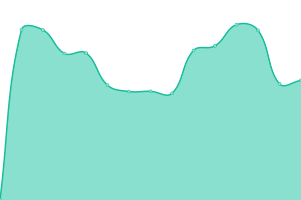

# [📈 Live Status](https://chris9091.github.io/Fleksa-Monitor): <!--live status--> **🟧 Partial outage**

This repository contains the open-source uptime monitor and status page for [chris9091](https://chris9091.github.io/Fleksa-Monitor), powered by [Upptime](https://github.com/upptime/upptime).

With [Upptime](https://upptime.js.org), you can get your own unlimited and free uptime monitor and status page, powered entirely by a GitHub repository. We use [Issues](https://github.com/chris9091/Fleksa-Monitor/issues) as incident reports, [Actions](https://github.com/chris9091/Fleksa-Monitor/actions) as uptime monitors, and [Pages](https://chris9091.github.io/Fleksa-Monitor) for the status page.

<!--start: status pages-->
<!-- This summary is generated by Upptime (https://github.com/upptime/upptime) -->
<!-- Do not edit this manually, your changes will be overwritten -->
<!-- prettier-ignore -->
| URL | Status | History | Response Time | Uptime |
| --- | ------ | ------- | ------------- | ------ |
|  [Google](https://www.google.com) | 🟩 Up | [google.yml](https://github.com/chris9091/Fleksa-Monitor/commits/HEAD/history/google.yml) | 

 69ms
     
 | 

<a href="https://chris9091.github.io/Fleksa-Monitor/history/google">100.00%</a>
    

|  [Indian Curry House Ostend](http://indiancurryhouseostend.de) | 🟩 Up | [indian-curry-house-ostend.yml](https://github.com/chris9091/Fleksa-Monitor/commits/HEAD/history/indian-curry-house-ostend.yml) | 

 1119ms
     
 | 

<a href="https://chris9091.github.io/Fleksa-Monitor/history/indian-curry-house-ostend">100.00%</a>
    

|  [Taste of India Frankfurt](http://tasteofindia-ffm.de) | 🟩 Up | [taste-of-india-frankfurt.yml](https://github.com/chris9091/Fleksa-Monitor/commits/HEAD/history/taste-of-india-frankfurt.yml) | 

 1083ms
     
 | 

<a href="https://chris9091.github.io/Fleksa-Monitor/history/taste-of-india-frankfurt">100.00%</a>
    

|  [Desi Adda](http://desiadda.de) | 🟩 Up | [desi-adda.yml](https://github.com/chris9091/Fleksa-Monitor/commits/HEAD/history/desi-adda.yml) | 

 1020ms
     
 | 

<a href="https://chris9091.github.io/Fleksa-Monitor/history/desi-adda">100.00%</a>
    

|  [Smart Pizza Offenbach](http://smartpizzas.de) | 🟩 Up | [smart-pizza-offenbach.yml](https://github.com/chris9091/Fleksa-Monitor/commits/HEAD/history/smart-pizza-offenbach.yml) | 

 1070ms
     
 | 

<a href="https://chris9091.github.io/Fleksa-Monitor/history/smart-pizza-offenbach">100.00%</a>
    

|  [Pizzeria O Sole Mio](http://bochum-osolemio.de) | 🟩 Up | [pizzeria-o-sole-mio.yml](https://github.com/chris9091/Fleksa-Monitor/commits/HEAD/history/pizzeria-o-sole-mio.yml) | 

 1094ms
     
 | 

<a href="https://chris9091.github.io/Fleksa-Monitor/history/pizzeria-o-sole-mio">100.00%</a>
    

|  [Alt Bockenheim - Crazy Pizza](http://restaurantcrazypizza.de) | 🟩 Up | [alt-bockenheim-crazy-pizza.yml](https://github.com/chris9091/Fleksa-Monitor/commits/HEAD/history/alt-bockenheim-crazy-pizza.yml) | 

 1108ms
     
 | 

<a href="https://chris9091.github.io/Fleksa-Monitor/history/alt-bockenheim-crazy-pizza">100.00%</a>
    

|  [Alt Bockenheim - Indian Restaurant](http://restaurantaltbockenheim.de) | 🟩 Up | [alt-bockenheim-indian-restaurant.yml](https://github.com/chris9091/Fleksa-Monitor/commits/HEAD/history/alt-bockenheim-indian-restaurant.yml) | 

 1123ms
     
 | 

<a href="https://chris9091.github.io/Fleksa-Monitor/history/alt-bockenheim-indian-restaurant">100.00%</a>
    

|  [Food World](http://offenbach-foodworld.de) | 🟩 Up | [food-world.yml](https://github.com/chris9091/Fleksa-Monitor/commits/HEAD/history/food-world.yml) | 

 1237ms
     
 | 

<a href="https://chris9091.github.io/Fleksa-Monitor/history/food-world">100.00%</a>
    

|  [Indian Curry House Niederrad](http://indiancurryhouseniederrad.de) | 🟩 Up | [indian-curry-house-niederrad.yml](https://github.com/chris9091/Fleksa-Monitor/commits/HEAD/history/indian-curry-house-niederrad.yml) | 

 1159ms
     
 | 

<a href="https://chris9091.github.io/Fleksa-Monitor/history/indian-curry-house-niederrad">100.00%</a>
    

|  [Restaurant Mai Vien](http://maivien.fleksa.de) | 🟩 Up | [restaurant-mai-vien.yml](https://github.com/chris9091/Fleksa-Monitor/commits/HEAD/history/restaurant-mai-vien.yml) | 

 1282ms
     
 | 

<a href="https://chris9091.github.io/Fleksa-Monitor/history/restaurant-mai-vien">100.00%</a>
    

|  [Restaurant Taj Mahal](http://frechentajmahal.de) | 🟩 Up | [restaurant-taj-mahal.yml](https://github.com/chris9091/Fleksa-Monitor/commits/HEAD/history/restaurant-taj-mahal.yml) | 

 1120ms
     
 | 

<a href="https://chris9091.github.io/Fleksa-Monitor/history/restaurant-taj-mahal">100.00%</a>
    

|  [Indian food Company](http://indianfood-company.de) | 🟩 Up | [indian-food-company.yml](https://github.com/chris9091/Fleksa-Monitor/commits/HEAD/history/indian-food-company.yml) | 

 1141ms
     
 | 

<a href="https://chris9091.github.io/Fleksa-Monitor/history/indian-food-company">100.00%</a>
    

|  [Restaurant Isha](http://isha-restaurant.de) | 🟩 Up | [restaurant-isha.yml](https://github.com/chris9091/Fleksa-Monitor/commits/HEAD/history/restaurant-isha.yml) | 

 1207ms
     
 | 

<a href="https://chris9091.github.io/Fleksa-Monitor/history/restaurant-isha">100.00%</a>
    

|  [Ganesha Tandoori](http://ganeshafrankfurt.de) | 🟩 Up | [ganesha-tandoori.yml](https://github.com/chris9091/Fleksa-Monitor/commits/HEAD/history/ganesha-tandoori.yml) | 

 1147ms
     
 | 

<a href="https://chris9091.github.io/Fleksa-Monitor/history/ganesha-tandoori">100.00%</a>
    

|  [Punjab Garden Tandoori](http://punjabgardenfrankfurt.de) | 🟩 Up | [punjab-garden-tandoori.yml](https://github.com/chris9091/Fleksa-Monitor/commits/HEAD/history/punjab-garden-tandoori.yml) | 

 1065ms
     
 | 

<a href="https://chris9091.github.io/Fleksa-Monitor/history/punjab-garden-tandoori">100.00%</a>
    

|  [Sushi Sensei Frankfurt](http://sushisenseifrankfurt.de) | 🟩 Up | [sushi-sensei-frankfurt.yml](https://github.com/chris9091/Fleksa-Monitor/commits/HEAD/history/sushi-sensei-frankfurt.yml) | 

 1171ms
     
 | 

<a href="https://chris9091.github.io/Fleksa-Monitor/history/sushi-sensei-frankfurt">100.00%</a>
    

|  [Pizzeria Bella Italia](http://pizzabellaitaliafrankfurt.de) | 🟩 Up | [pizzeria-bella-italia.yml](https://github.com/chris9091/Fleksa-Monitor/commits/HEAD/history/pizzeria-bella-italia.yml) | 

 1208ms
     
 | 

<a href="https://chris9091.github.io/Fleksa-Monitor/history/pizzeria-bella-italia">100.00%</a>
    

|  [Pizza Kaiser](http://pizzakaiser-frankfurt.de) | 🟩 Up | [pizza-kaiser.yml](https://github.com/chris9091/Fleksa-Monitor/commits/HEAD/history/pizza-kaiser.yml) | 

 1128ms
     
 | 

<a href="https://chris9091.github.io/Fleksa-Monitor/history/pizza-kaiser">100.00%</a>
    

|  [Delhi Tandoori](http://delhitandoori.de) | 🟩 Up | [delhi-tandoori.yml](https://github.com/chris9091/Fleksa-Monitor/commits/HEAD/history/delhi-tandoori.yml) | 

 1224ms
     
 | 

<a href="https://chris9091.github.io/Fleksa-Monitor/history/delhi-tandoori">100.00%</a>
    

|  [Pizza Eck Frankfurt](http://pizza-eck-frankfurt.de) | 🟩 Up | [pizza-eck-frankfurt.yml](https://github.com/chris9091/Fleksa-Monitor/commits/HEAD/history/pizza-eck-frankfurt.yml) | 

 1194ms
     
 | 

<a href="https://chris9091.github.io/Fleksa-Monitor/history/pizza-eck-frankfurt">100.00%</a>
    

|  [Pizzeria Mülheim 2](http://xn--pizzeriamlheim2-7vb.de) | 🟩 Up | [pizzeria-muelheim-2.yml](https://github.com/chris9091/Fleksa-Monitor/commits/HEAD/history/pizzeria-muelheim-2.yml) | 

 1063ms
     
 | 

<a href="https://chris9091.github.io/Fleksa-Monitor/history/pizzeria-muelheim-2">100.00%</a>
    

|  [Restaurant Nidda](http://restaurant-nidda.de) | 🟩 Up | [restaurant-nidda.yml](https://github.com/chris9091/Fleksa-Monitor/commits/HEAD/history/restaurant-nidda.yml) | 

 659ms
     
 | 

<a href="https://chris9091.github.io/Fleksa-Monitor/history/restaurant-nidda">100.00%</a>
    

|  [Bali's Restaurant](http://balisrestaurant-ob.de) | 🟩 Up | [bali-s-restaurant.yml](https://github.com/chris9091/Fleksa-Monitor/commits/HEAD/history/bali-s-restaurant.yml) | 

 1100ms
     
 | 

<a href="https://chris9091.github.io/Fleksa-Monitor/history/bali-s-restaurant">100.00%</a>
    

|  [Pizza Hamburger Inn](http://pizzahamburgerinn-griesheim.de) | 🟩 Up | [pizza-hamburger-inn.yml](https://github.com/chris9091/Fleksa-Monitor/commits/HEAD/history/pizza-hamburger-inn.yml) | 

 1120ms
     
 | 

<a href="https://chris9091.github.io/Fleksa-Monitor/history/pizza-hamburger-inn">100.00%</a>
    

|  [Uno's Pizza](http://pizzeriaunoffm.de) | 🟩 Up | [uno-s-pizza.yml](https://github.com/chris9091/Fleksa-Monitor/commits/HEAD/history/uno-s-pizza.yml) | 

 1184ms
     
 | 

<a href="https://chris9091.github.io/Fleksa-Monitor/history/uno-s-pizza">100.00%</a>
    

|  [Restaurant Ashoka Frankfurt](http://ashokafrankfurt.de) | 🟩 Up | [restaurant-ashoka-frankfurt.yml](https://github.com/chris9091/Fleksa-Monitor/commits/HEAD/history/restaurant-ashoka-frankfurt.yml) | 

 1150ms
     
 | 

<a href="https://chris9091.github.io/Fleksa-Monitor/history/restaurant-ashoka-frankfurt">100.00%</a>
    

|  [Good Taste](http://goodtaste.fleksa.de) | 🟩 Up | [good-taste.yml](https://github.com/chris9091/Fleksa-Monitor/commits/HEAD/history/good-taste.yml) | 

 1147ms
     
 | 

<a href="https://chris9091.github.io/Fleksa-Monitor/history/good-taste">100.00%</a>
    

|  [Restaurant Hanoi Quan](http://hanoiquanfrankfurt.de) | 🟩 Up | [restaurant-hanoi-quan.yml](https://github.com/chris9091/Fleksa-Monitor/commits/HEAD/history/restaurant-hanoi-quan.yml) | 

 1033ms
     
 | 

<a href="https://chris9091.github.io/Fleksa-Monitor/history/restaurant-hanoi-quan">100.00%</a>
    

|  [Tandoori Masala Imbiss](http://tandoorimasalaimbiss.de) | 🟩 Up | [tandoori-masala-imbiss.yml](https://github.com/chris9091/Fleksa-Monitor/commits/HEAD/history/tandoori-masala-imbiss.yml) | 

 1154ms
     
 | 

<a href="https://chris9091.github.io/Fleksa-Monitor/history/tandoori-masala-imbiss">100.00%</a>
    

|  [Restaurant Kashmir India](http://restaurantkashmirindia.de) | 🟩 Up | [restaurant-kashmir-india.yml](https://github.com/chris9091/Fleksa-Monitor/commits/HEAD/history/restaurant-kashmir-india.yml) | 

 1142ms
     
 | 

<a href="https://chris9091.github.io/Fleksa-Monitor/history/restaurant-kashmir-india">100.00%</a>
    

|  [Bali's Restaurant](http://balisrestaurant-wesel.de) | 🟩 Up | [bali-s-restaurant.yml](https://github.com/chris9091/Fleksa-Monitor/commits/HEAD/history/bali-s-restaurant.yml) | 

 1100ms
     
 | 

<a href="https://chris9091.github.io/Fleksa-Monitor/history/bali-s-restaurant">100.00%</a>
    

|  [Go eat food service](http://goeatfrankfurt.de) | 🟩 Up | [go-eat-food-service.yml](https://github.com/chris9091/Fleksa-Monitor/commits/HEAD/history/go-eat-food-service.yml) | 

 1303ms
     
 | 

<a href="https://chris9091.github.io/Fleksa-Monitor/history/go-eat-food-service">100.00%</a>
    

|  [Star Pizza Deggendorf](http://star-pizza-deggendorf.de) | 🟩 Up | [star-pizza-deggendorf.yml](https://github.com/chris9091/Fleksa-Monitor/commits/HEAD/history/star-pizza-deggendorf.yml) | 

 1270ms
     
 | 

<a href="https://chris9091.github.io/Fleksa-Monitor/history/star-pizza-deggendorf">100.00%</a>
    

|  [Main Curry House](http://main-curry-house.de) | 🟩 Up | [main-curry-house.yml](https://github.com/chris9091/Fleksa-Monitor/commits/HEAD/history/main-curry-house.yml) | 

 1152ms
     
 | 

<a href="https://chris9091.github.io/Fleksa-Monitor/history/main-curry-house">100.00%</a>
    

|  [Pizza Haus](http://pizzahauslandau.de) | 🟩 Up | [pizza-haus.yml](https://github.com/chris9091/Fleksa-Monitor/commits/HEAD/history/pizza-haus.yml) | 

 1222ms
     
 | 

<a href="https://chris9091.github.io/Fleksa-Monitor/history/pizza-haus">100.00%</a>
    

|  [Restaurant Little India](http://littleindiaalteglofsheim.de) | 🟩 Up | [restaurant-little-india.yml](https://github.com/chris9091/Fleksa-Monitor/commits/HEAD/history/restaurant-little-india.yml) | 

 1258ms
     
 | 

<a href="https://chris9091.github.io/Fleksa-Monitor/history/restaurant-little-india">100.00%</a>
    

|  [Pizza Plattlinger](http://pizzaplattlinger.de) | 🟩 Up | [pizza-plattlinger.yml](https://github.com/chris9091/Fleksa-Monitor/commits/HEAD/history/pizza-plattlinger.yml) | 

 1181ms
     
 | 

<a href="https://chris9091.github.io/Fleksa-Monitor/history/pizza-plattlinger">100.00%</a>
    

|  [Pizza Roma Dingolfing](http://pizzaromadingolfing.de) | 🟩 Up | [pizza-roma-dingolfing.yml](https://github.com/chris9091/Fleksa-Monitor/commits/HEAD/history/pizza-roma-dingolfing.yml) | 

 1144ms
     
 | 

<a href="https://chris9091.github.io/Fleksa-Monitor/history/pizza-roma-dingolfing">100.00%</a>
    

|  [Pizza Roma Wallersdorf](http://pizzaromawallersdorf.de) | 🟩 Up | [pizza-roma-wallersdorf.yml](https://github.com/chris9091/Fleksa-Monitor/commits/HEAD/history/pizza-roma-wallersdorf.yml) | 

 1119ms
     
 | 

<a href="https://chris9091.github.io/Fleksa-Monitor/history/pizza-roma-wallersdorf">100.00%</a>
    

|  [Pizza La Fontana](http://altdorflafontana.de) | 🟩 Up | [pizza-la-fontana.yml](https://github.com/chris9091/Fleksa-Monitor/commits/HEAD/history/pizza-la-fontana.yml) | 

 1024ms
     
 | 

<a href="https://chris9091.github.io/Fleksa-Monitor/history/pizza-la-fontana">100.00%</a>
    

|  [Restaurant Taj Mahal](http://altdorftajmahal.de) | 🟩 Up | [restaurant-taj-mahal.yml](https://github.com/chris9091/Fleksa-Monitor/commits/HEAD/history/restaurant-taj-mahal.yml) | 

 1120ms
     
 | 

<a href="https://chris9091.github.io/Fleksa-Monitor/history/restaurant-taj-mahal">100.00%</a>
    

|  [Restaurant Little India](http://littleindiafreudenstadt.de) | 🟩 Up | [restaurant-little-india.yml](https://github.com/chris9091/Fleksa-Monitor/commits/HEAD/history/restaurant-little-india.yml) | 

 1258ms
     
 | 

<a href="https://chris9091.github.io/Fleksa-Monitor/history/restaurant-little-india">100.00%</a>
    

|  [Restaurant Namaste](http://namasteplattling.de) | 🟩 Up | [restaurant-namaste.yml](https://github.com/chris9091/Fleksa-Monitor/commits/HEAD/history/restaurant-namaste.yml) | 

 1132ms
     
 | 

<a href="https://chris9091.github.io/Fleksa-Monitor/history/restaurant-namaste">100.00%</a>
    

|  [Star Pizzaservice](http://teisnachstarpizza.de) | 🟩 Up | [star-pizzaservice.yml](https://github.com/chris9091/Fleksa-Monitor/commits/HEAD/history/star-pizzaservice.yml) | 

 1178ms
     
 | 

<a href="https://chris9091.github.io/Fleksa-Monitor/history/star-pizzaservice">100.00%</a>
    

|  [Roma Pizza Schierling](http://pizzaromaschierling.de) | 🟩 Up | [roma-pizza-schierling.yml](https://github.com/chris9091/Fleksa-Monitor/commits/HEAD/history/roma-pizza-schierling.yml) | 

 1062ms
     
 | 

<a href="https://chris9091.github.io/Fleksa-Monitor/history/roma-pizza-schierling">100.00%</a>
    

|  [Kabab House Offenbach](http://kababhouse.de) | 🟥 Down | [kabab-house-offenbach.yml](https://github.com/chris9091/Fleksa-Monitor/commits/HEAD/history/kabab-house-offenbach.yml) | 

 0ms
     
 | 

<a href="https://chris9091.github.io/Fleksa-Monitor/history/kabab-house-offenbach">0.09%</a>
    

|  [Restaurant Mayuri](http://mayuri-duisburg.de) | 🟩 Up | [restaurant-mayuri.yml](https://github.com/chris9091/Fleksa-Monitor/commits/HEAD/history/restaurant-mayuri.yml) | 

 1103ms
     
 | 

<a href="https://chris9091.github.io/Fleksa-Monitor/history/restaurant-mayuri">100.00%</a>
    

|  [India Haus Restaurant](http://indiahaus-md.de) | 🟩 Up | [india-haus-restaurant.yml](https://github.com/chris9091/Fleksa-Monitor/commits/HEAD/history/india-haus-restaurant.yml) | 

 1145ms
     
 | 

<a href="https://chris9091.github.io/Fleksa-Monitor/history/india-haus-restaurant">100.00%</a>
    

|  [Spice of India](http://spiceofindia-hattersheim.de) | 🟩 Up | [spice-of-india.yml](https://github.com/chris9091/Fleksa-Monitor/commits/HEAD/history/spice-of-india.yml) | 

 1143ms
     
 | 

<a href="https://chris9091.github.io/Fleksa-Monitor/history/spice-of-india">100.00%</a>
    

|  [Restaurant Mai Pho](http://maiphokronberg.de) | 🟩 Up | [restaurant-mai-pho.yml](https://github.com/chris9091/Fleksa-Monitor/commits/HEAD/history/restaurant-mai-pho.yml) | 

 1162ms
     
 | 

<a href="https://chris9091.github.io/Fleksa-Monitor/history/restaurant-mai-pho">100.00%</a>
    

<!--end: status pages-->

[**Visit our status website →**](https://chris9091.github.io/Fleksa-Monitor)

## 📄 License

- Powered by: [Upptime](https://github.com/upptime/upptime)
- Code: [MIT](./LICENSE) © [chris9091](https://chris9091.github.io/Fleksa-Monitor)
- Data in the `./history` directory: [Open Database License](https://opendatacommons.org/licenses/odbl/1-0/)
